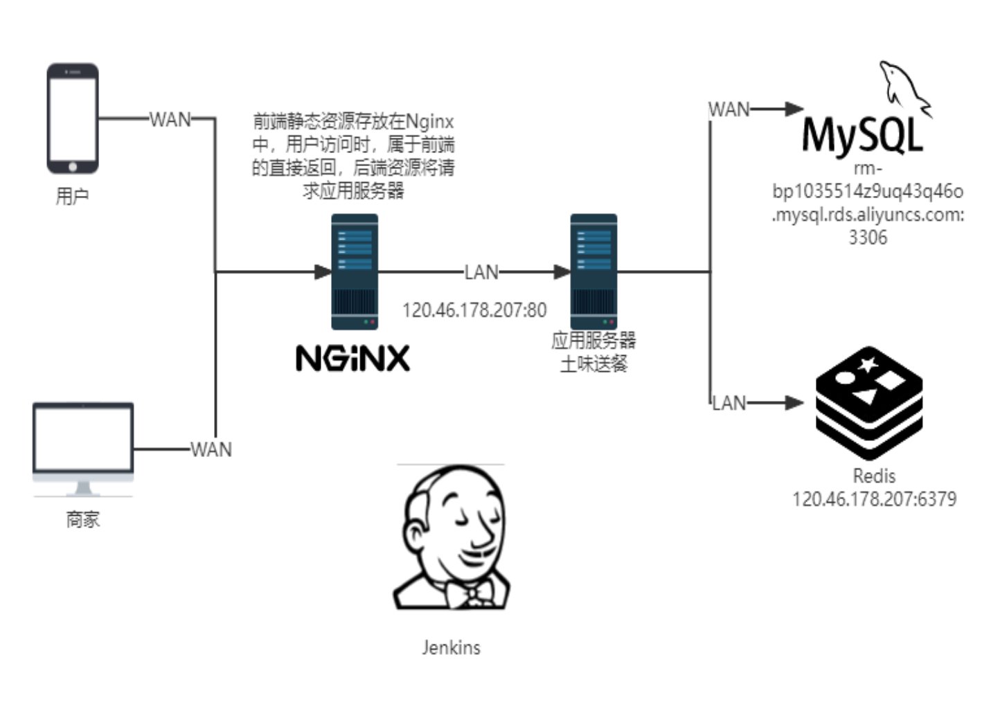
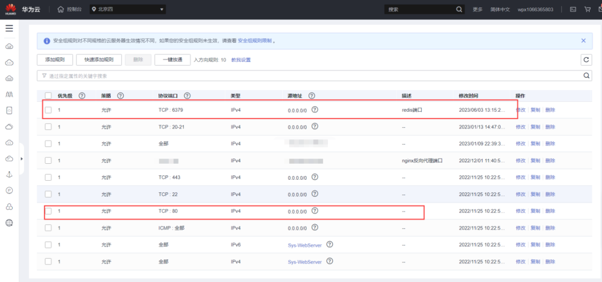

# 系统部署

部署是软件交付用户使用的最后一步，也是最关键一步，需要在前面设计、实现、测试等环节都实施好才能够进行。本项目采用云服务器部署到线上环境，线上环境中，采用docker进行容器化部署，方便管理。同时构建Jenkins流水线，采用当前流行的DevOps进行持续集成和持续部署，数据库采用阿里云提供的数据库服务。因此当前项目可以完全线上访问。

## 部署前提

**Git代码托管：** 在快速迭代的项目中，多人共同协作代码开发是常见的场景。将代码托管至云端，除了能让项目有一个远端备份外，对开发团队协作本身而言更是如虎添翼。因此本项目通过Gitee进行管理，对应的项目地址为[https://gitee.com/earthy-zinc/earthy-delivery](https://gitee.com/earthy-zinc/earthy-delivery)。

**DevOps开发与运维：** 采用腾讯云提供的项目管理平台针对DevOps一站式管理，[https://tuwei-group.coding.net/user](https://tuwei-group.coding.net/user)。采用Jenkins进行持续集成和持续部署，当提交了一部分修改完成的代码后，我们总是希望可以快速得到直观且有效的反馈，及早暴露问题。在开发过程中总有一部分工作是相对机械化，易出错的（例如打包、部署）。持续部署指在软件开发过程中，以自动化方式，频繁而且持续性的将软件部署到生产环境，使软件产品能够快速的交付使用。因此机器自动化部署是减少重复劳动的重要技术。

**云服务器线上部署：**弹性云服务器（Elastic Cloud Server，ECS）是由CPU、内存、操作系统、云硬盘组成的基础的计算组件。弹性云服务器创建成功后，就可以像使用自己的本地PC或物理服务器一样，在云上使用弹性云服务器。因此本系统部署采用华为云弹性云服务器作为系统部署的硬件环境。采用阿里云MySQL实例作为本系统的数据库。

**Nginx作为前端静态资源服务器：** 通过nginx用户可以不必访问后端既能够获得静态资源。

## 部署环境



图 部署架构图

## 部署流程

### 准备工作

1. 开放云服务器80端口，以及一些外部访问必要端口
2. 云服务器安装Jdk1.8、Maven、git等常用工具
3. 数据库初始化，执行SQL脚本创建数据库，并构建初始数据库数据
4. 安装持续集成的服务组件Jenkins，并配置相关插件
5. 代码需要提前上传到代码托管平台gitee上



图 云服务器端口开放图

### 搭建docker环境

#### 获取并运行安装脚本
```shell
curl -fsSL get.docker.com -o get-docker.sh

sudo sh get-docker.sh
```

#### 启动docker服务
```shell
systemctl start docker
```
#### 配置docker开机自启
```shell
systemctl enable docker
```
## 搭建Redis
```shell
docker run --restart=always \
--log-opt max-size=100m \
--log-opt max-file=2 \
-p 6379:6379 \
--name redis \
-v /opt/docker_volume/redis/redis.conf:/etc/redis/redis.conf \
-v /opt/docker_volume/redis/data:/data \
-d redis redis-server /etc/redis/redis.conf \
--appendonly yes 
```

## 搭建并配置nginx
```shell
docker run --restart=always \
--name nginx \
-p 9531:9531 \
-p 9532:9532 \
-v /opt/docker_volume/nginx/conf/nginx.conf:/etc/nginx/nginx.conf \
-v /opt/docker_volume/nginx/conf/conf.d:/etc/nginx/conf.d \
-v /opt/docker_volume/nginx/log:/var/log/nginx \
-v /opt/docker_volume/nginx/html:/usr/share/nginx/html \
-d nginx
```

## 构建Dockerfile
```shell
FROM java:8
MAINTAINER pei
VOLUME /temp
ADD earthy-delivery.jar earthy-delivery.jar
RUN bash -c 'touch /earthy-delivery.jar'
ENTRYPOINT ["java","-jar","/earthy-delivery.jar"]
EXPOSE 80
```

## 搭建Jenkins
```shell
docker run \
--restart=always \
-di \
--name=jenkins \
-p 8000:8080 \
-p 50000:5000 \
-v /opt/docker\_volume/jenkins:/var/jenkins\_home \
-v //usr/local/src/jdk/jdk1.8.0\_351:/usr/local/jdk \
-v /usr/local/maven/apache-maven-3.8.5:/usr/local/maven \
-v /usr/local/git/git-2.33.1/bin/git:/usr/local/git \
-v /etc/localtime:/etc/localtime \
--privileged=true \
jenkins/jenkins:2.404
```

## 构建Jenkinsfile
```
pipeline {
stages {
    stage('检出') {
        steps {
            git url: "[https://gitee.com/earthy-zinc/earthy-delivery](https://gitee.com/earthy-zinc/earthy-delivery)",
branch: "master"
        }
    }
    stage('构建') {
        steps {
            sh 'mvn clean package -Dmaven.test.skip=true'
        }
    stage('部署') {
        steps {
            sh 'cp -f ' + ' bin/deploy.sh ' + "\${env.APP\_DEPLOY\_BASE\_DIR}" + "\${env.APP\_NAME}"
            sh 'cp -f ' + "\${env.APP\_NAME}" + '/target/\*.jar ' + "\${env.APP\_DEPLOY\_BASE\_DIR}" + "\${env.APP\_NAME}" +'/build/'
            archiveArtifacts "\${env.APP\_NAME}" + '/target/\*.jar'
            sh 'chmod +x ' + "\${env.APP\_DEPLOY\_BASE\_DIR}" + "\${env.APP\_NAME}" + '/deploy.sh'
            sh 'bash ' + "\${env.APP\_DEPLOY\_BASE\_DIR}" + "\${env.APP\_NAME}" + '/deploy.sh'
        }
    }
}
}
```
