# 系统部署

程序代码行数：14000+

## 操作系统环境搭建

### docker搭建

#### 安装docker

使用官方给出的脚本，https://get.docker.com/

```shell
# 获取并运行安装脚本
curl -fsSL get.docker.com -o get-docker.sh
sudo sh get-docker.sh
# 启动docker服务
systemctl start docker
# 配置docker开机自启
systemctl enable docker
```

#### 配置国内镜像

修改配置文件

```shell
sudo vim /etc/docker/daemon.json
```

添加内容

```json
{
  "registry-mirrors":[
                      "https://o65lma2s.mirror.aliyuncs.com",
                      "http://hub-mirror.c.163.com"
                     ],
  "insecure-registries" :  ["192.168.210.100:5000"]
}
```

重启docker

```shell
systemctl daemon-reload && systemctl restart docker
```

#### 注意事项

如果以非 root 用户可以运行 docker 时，
需要执行 `sudo usermod -aG docker cmsblogs` 命令然后重新登陆，
否则会有如下报错

```md
docker: Cannot connect to the Docker daemon. 
Is the docker daemon running on this host ?
```

### mysql搭建

```bash
docker run --restart=always \
-d \
-p 3307:3306 \
--privileged=true \
-v /opt/docker_volume/mysql/log:/var/log/mysql \
-v /opt/docker_volume/mysql/data:/var/lib/mysql \
-v /opt/docker_volume/mysql/conf:/etc/mysql/conf.d \
-e MYSQL_ROOT_PASSWORD=123456 \
--name mysql \
mysql
```

### redis搭建

官网获取 `redis.conf` : http://www.redis.cn/download.html

```shell
mkdir -p /opt/docker_volume/redis
```


解压后可在根目录查看到 `redis.conf` 配置文件，将其内容复制到 `/opt/docker_volume/redis/redis.conf`，然后修改以下内容：

- bind 127.0.0.1 ： 注释掉，redis可以外部访问
- --requirepass "123456" ： 设置Redis密码为123456，默认无密码
- --appendonly yes ： AOF持久化
- tcp-keepalive 60 ： 默认300，调小防止远程主机强迫关闭一个现有连接错误

```bash
docker run --restart=always \
--log-opt max-size=100m \
--log-opt max-file=2 \
-p 6379:6379 \
--name redis \
-v /opt/docker_volume/redis/redis.conf:/etc/redis/redis.conf \
-v /opt/docker_volume/redis/data:/data \
-d redis redis-server /etc/redis/redis.conf  \
--appendonly yes  \
--requirepass 142536aA
```

### nginx搭建

#### 创建临时容器

启动前需要先创建Nginx外部挂载的配置文件，之所以要先创建 , 是因为Nginx本身容器只存在/etc/nginx 目录 , 本身就不创建 nginx.conf 文件
当服务器和容器都不存在 nginx.conf 文件时, 执行启动命令的时候 docker会将nginx.conf 作为目录创建 , 这并不是我们想要的结果 。

（ /home/nginx/conf/nginx.conf）

```bash
# 创建挂载目录
mkdir -p /opt/docker_volume/nginx/conf && mkdir -p /opt/docker_volume/log && mkdir -p /opt/docker_volume/nginx/html
  # 或
sudo mkdir -p /home/earthyzinc/nginx/conf && sudo mkdir -p /home/earthyzinc/nginx/log && sudo mkdir -p /home/earthyzinc/nginx/html
# 创建文件
touch /opt/docker_volume/nginx/conf/nginx.conf
# 生成容器
docker run --name nginx -p 9527:80 -d nginx
# 将容器nginx.conf文件, conf.d文件夹下内容, html文件夹复制到宿主机
docker cp nginx:/etc/nginx/nginx.conf /opt/docker_volume/nginx/conf/nginx.conf

docker cp nginx:/etc/nginx/conf.d /opt/docker_volume/nginx/conf/conf.d

docker cp nginx:/usr/share/nginx/html /opt/docker_volume/nginx
# 删除临时容器
docker rm -f nginx
```

#### 创建和启动容器
创建容器互联网络
```shell
docker network create -d bridge earthy-net
```

```bash
docker run --restart=always \
--name nginx \
-p 9531:9531 \
-p 9532:9532 \
-v /opt/docker_volume/nginx/conf/nginx.conf:/etc/nginx/nginx.conf \
-v /opt/docker_volume/nginx/conf/conf.d:/etc/nginx/conf.d \
-v /opt/docker_volume/nginx/log:/var/log/nginx \
-v /opt/docker_volume/nginx/html:/usr/share/nginx/html \
-d nginx

docker run --restart=always \
--name nginx \
--network host \
-v /home/earthyzinc/nginx/conf/nginx.conf:/etc/nginx/nginx.conf \
-v /home/earthyzinc/nginx/conf/conf.d:/etc/nginx/conf.d \
-v /home/earthyzinc/nginx/log:/var/log/nginx \
-v /home/earthyzinc/nginx/html:/usr/share/nginx/html \
-v /home/earthyzinc/nginx/ssl:/usr/share/nginx/ssl \
-d nginx
```

* -v /opt/docker_volume/nginx/conf/nginx.conf:/etc/nginx/nginx.conf	挂载nginx.conf配置文件
* -v /opt/docker_volume/nginx/conf/conf.d:/etc/nginx/conf.d	挂载nginx配置文件
* -v /opt/docker_volume/nginx/log:/var/log/nginx	挂载nginx日志文件
* -v /opt/docker_volume/nginx/html:/usr/share/nginx/html	挂载nginx内容

## 持续集成部署流程
部署是软件交付用户使用的最后一步，也是最关键一步，需要在前面设计、实现、测试等环节都实施好才能够进行。本项目采用云服务器部署到线上环境，线上环境中，采用docker进行容器化部署，方便管理。同时构建Jenkins流水线，采用当前流行的DevOps进行持续集成和持续部署，数据库采用阿里云提供的数据库服务。因此当前项目可以完全线上访问。

**Git代码托管：** 在快速迭代的项目中，多人共同协作代码开发是常见的场景。将代码托管至云端，除了能让项目有一个远端备份外，对开发团队协作本身而言更是如虎添翼。因此本项目通过Gitee进行管理。

**DevOps开发与运维：** 采用腾讯云提供的项目管理平台针对DevOps一站式管理。采用Jenkins进行持续集成和持续部署，当提交了一部分修改完成的代码后，我们总是希望可以快速得到直观且有效的反馈，及早暴露问题。在开发过程中总有一部分工作是相对机械化，易出错的（例如打包、部署）。持续部署指在软件开发过程中，以自动化方式，频繁而且持续性的将软件部署到生产环境，使软件产品能够快速的交付使用。因此机器自动化部署是减少重复劳动的重要技术。

**云服务器线上部署：** 弹性云服务器（Elastic Cloud Server，ECS）是由CPU、内存、操作系统、云硬盘组成的基础的计算组件。弹性云服务器创建成功后，就可以像使用自己的本地PC或物理服务器一样，在云上使用弹性云服务器。因此本系统部署采用华为云弹性云服务器作为系统部署的硬件环境。采用阿里云MySQL实例作为本系统的数据库。

**Nginx作为前端静态资源服务器：** 通过nginx用户可以不必访问后端既能够获得静态资源。

### 准备工作

1. 开放云服务器80端口，以及一些外部访问必要端口
2. 云服务器安装Jdk1.8、Maven、git等常用工具
3. 数据库初始化，执行SQL脚本创建数据库，并构建初始数据库数据
4. 安装持续集成的服务组件Jenkins，并配置相关插件
5. 代码需要提前上传到代码托管平台gitee上
6. 建立DevOps服务扩展点
7. 建立主机集群用于部署
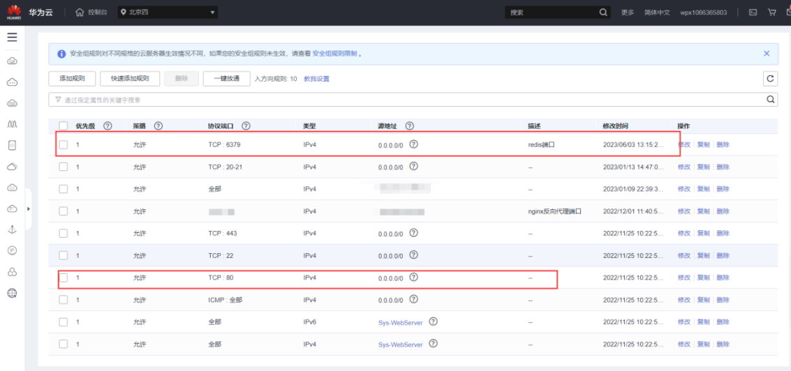


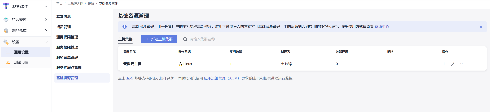

### 运行环境
| 环境               | 名称版本                                                                                            | 备注                                                                                        |
|------------------|:------------------------------------------------------------------------------------------------|-------------------------------------------------------------------------------------------|
| **开发工具**         | VSCode                                                                                          | [下载地址](https://code.visualstudio.com/Download)                                            |
|                  | IDEA                                                                                            | [下载地址](https://code.visualstudio.com/Download)                                            |
|                  | PyCharm                                                                                         | [下载地址](https://code.visualstudio.com/Download)                                            |
| **运行环境**         | Node 16+                                                                                        | [下载地址](http://nodejs.cn/download)                                                         |
|                  | Java 17                                                                                         | [下载地址](http://nodejs.cn/download)                                                         |
|                  | Python 3.8                                                                                      | [下载地址](http://nodejs.cn/download)                                                         |
| **VSCode插件(必装)** | 1. `Vue Language Features (Volar) ` <br/> 2. `TypeScript Vue Plugin (Volar) `  <br/>3. 禁用 Vetur |  |

### 代码构建
#### 前端构建
前端构建起始页面
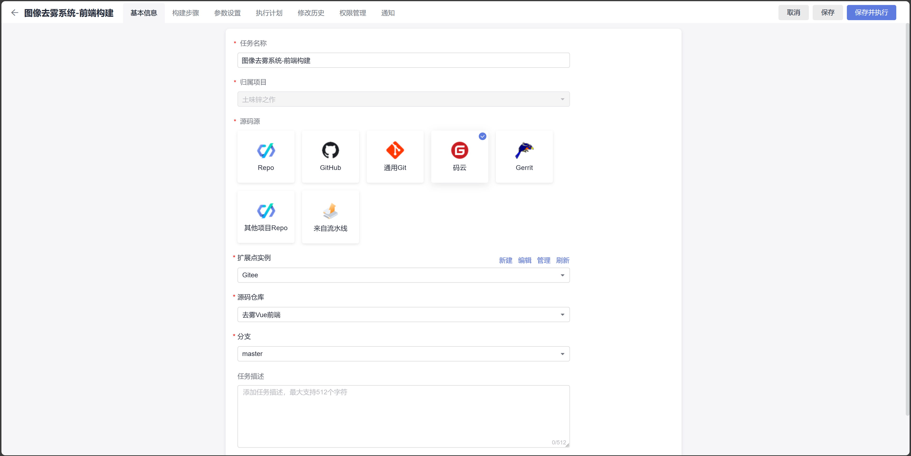
前端构建环境配置
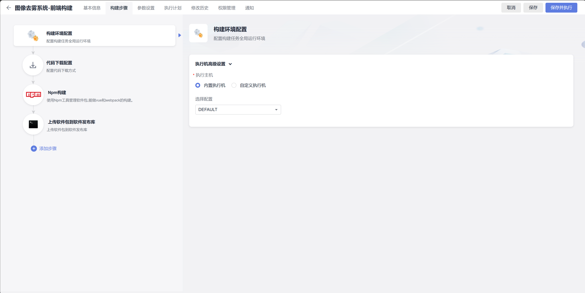
前端代码下载方式
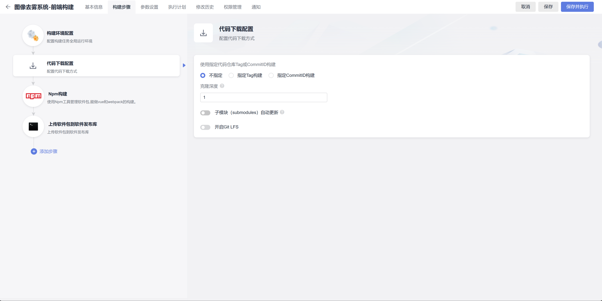
使用npm构建
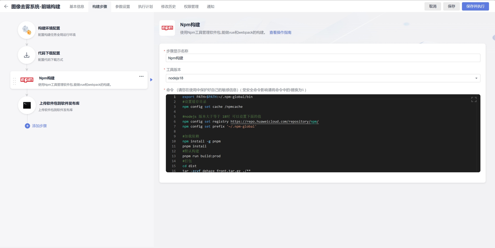
上传软件包到仓库
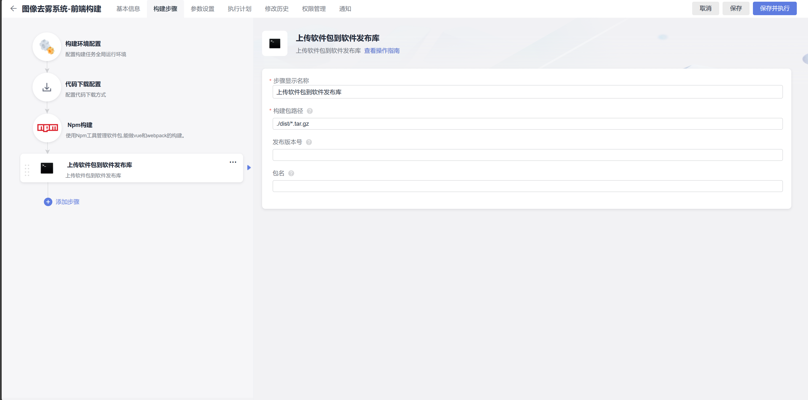

相关代码
```shell
export PATH=$PATH:~/.npm-global/bin
#设置缓存目录
npm config set cache /npmcache

#nodejs 版本大于等于 18时 可以设置下面的值 
npm config set registry https://repo.huaweicloud.com/repository/npm/
npm config set prefix '~/.npm-global'

#加载依赖
npm install -g pnpm
pnpm install
#默认构建
pnpm run build:prod
#打包
cd dist
tar -zcvf dehaze_front.tar.gz ./**
```


#### 后端构建

后端构建起始页面
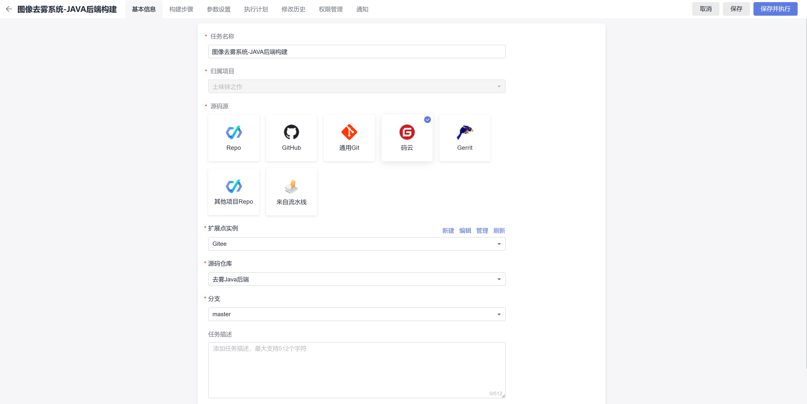
配置maven构建
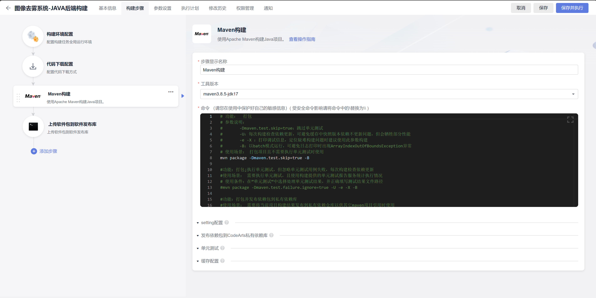
上传软件包到仓库
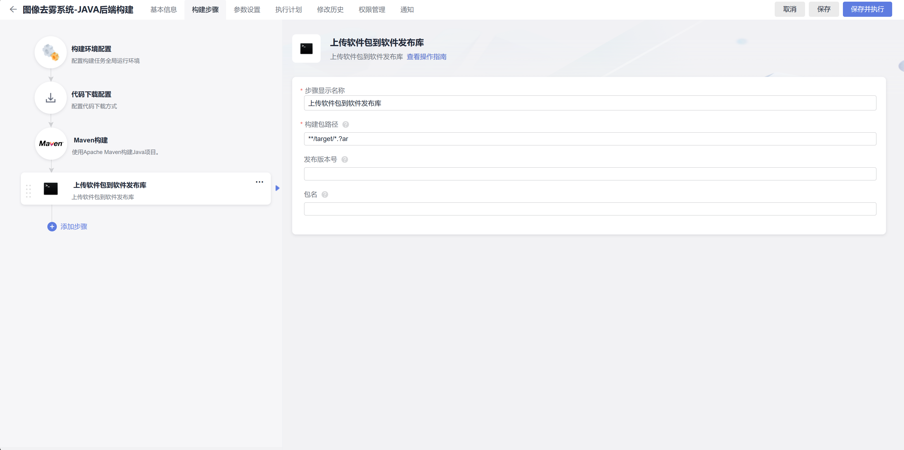

相关代码
```shell
# 功能：  打包
# 参数说明：
#		-Dmaven.test.skip=true：跳过单元测试
#		-U：每次构建检查依赖更新，可避免缓存中快照版本依赖不更新问题，但会牺牲部分性能
#		-e -X ：打印调试信息，定位疑难构建问题时建议使用此参数构建
#		-B：以batch模式运行，可避免日志打印时出现ArrayIndexOutOfBoundsException异常
# 使用场景： 打包项目且不需要执行单元测试时使用
mvn package -Dmaven.test.skip=true -B

#功能：打包;执行单元测试，但忽略单元测试用例失败，每次构建检查依赖更新
#使用场景： 需要执行单元测试，且使用构建提供的单元测试报告服务统计执行情况
# 使用条件：在”单元测试“中选择处理单元测试结果，并正确填写测试结果文件路径
#mvn package -Dmaven.test.failure.ignore=true -U -e -X -B

#功能：打包并发布依赖包到私有依赖库
#使用场景： 需要将当前项目构建结果发布到私有依赖仓库以供其它maven项目引用时使用
#注意事项： 此处上传的目标仓库为CodeArts私有依赖仓库，注意与软件发布仓库区分
#mvn deploy -Dmaven.test.skip=true -U -e -X -B
```

### 代码部署
#### 前端部署

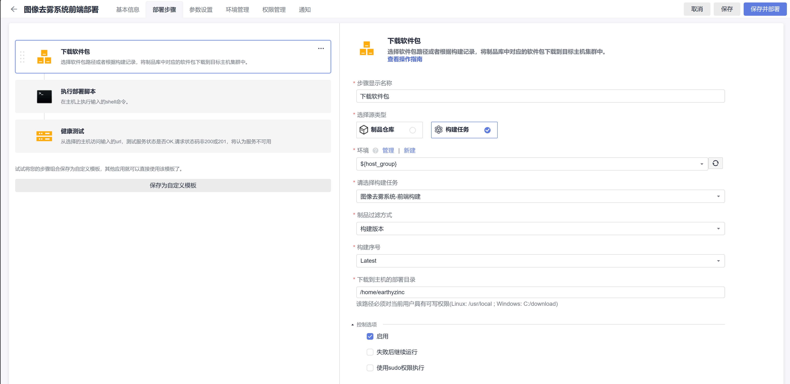

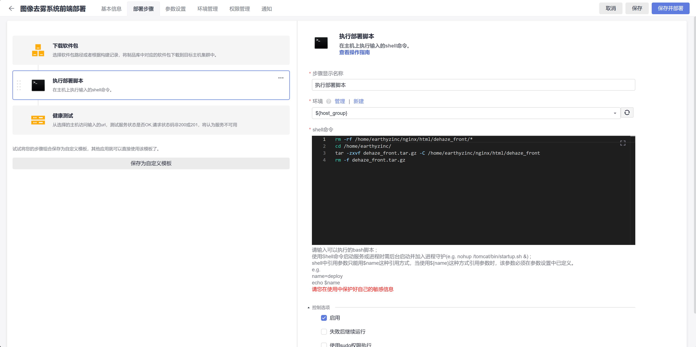

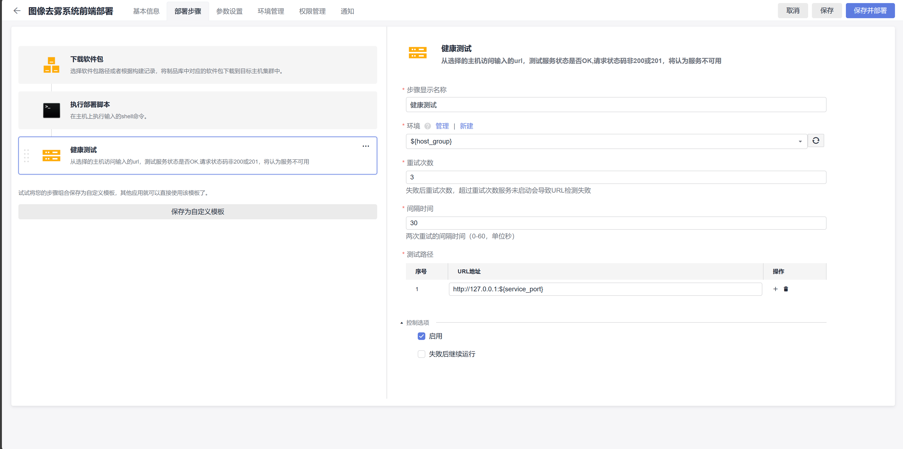

相关代码
```shell
rm -rf /home/earthyzinc/nginx/html/dehaze_front/*
cd /home/earthyzinc/
tar -zxvf dehaze_front.tar.gz -C /home/earthyzinc/nginx/html/dehaze_front
rm -f dehaze_front.tar.gz
```

#### 后端部署
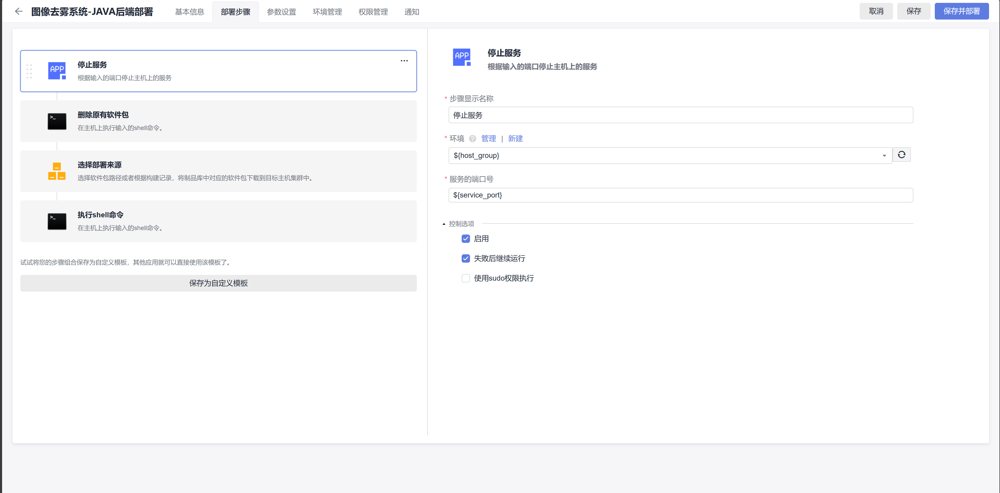


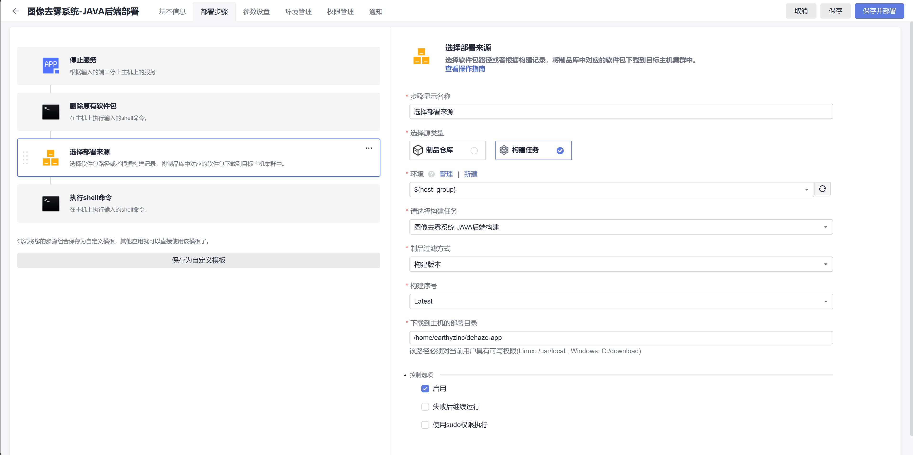

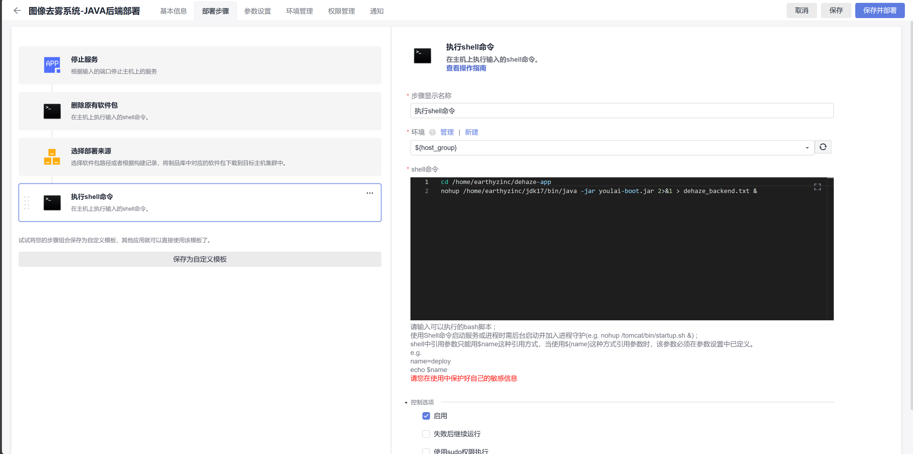

相关代码
```shell
rm -rf /home/earthyzinc/dehaze-app/*

cd /home/earthyzinc/dehaze-app
nohup /home/earthyzinc/jdk17/bin/java -jar youlai-boot.jar 2>&1 > dehaze_backend.txt &
```
### 流水线设置
建立用于持续交付的代码构建部署流水线
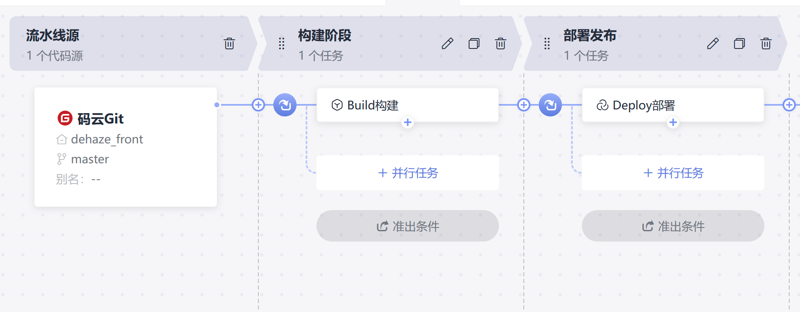

通过制品仓库获得最终软件制品
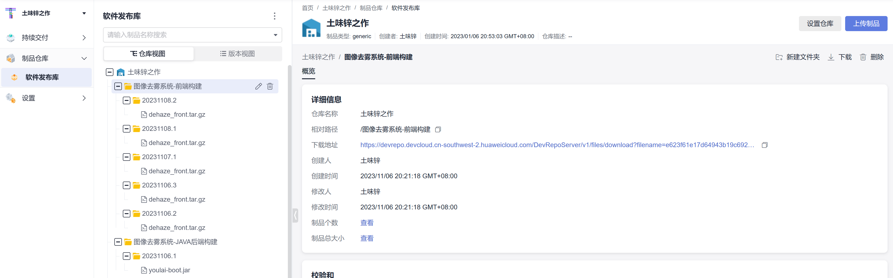

