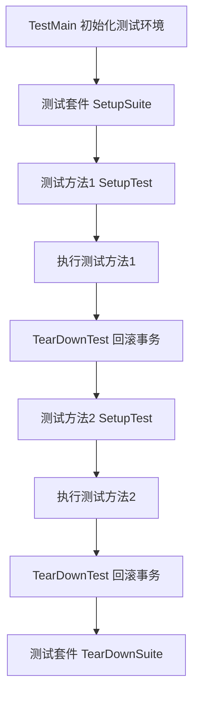

# Dehaze-Go 测试框架文档

## 1. 测试框架概述

本项目使用 Go 语言自带的测试框架结合 [testify](https://github.com/stretchr/testify) 库进行单元测试和集成测试。testify
提供了丰富的断言函数和测试套件支持，使测试代码更加简洁易读。

### 1.1 主要依赖

- `testing`: Go 语言标准库中的测试包
- `github.com/stretchr/testify`: 提供断言和测试套件功能
- `gorm.io/gorm`: 数据库操作库

## 2. 测试架构设计

### 2.1 测试套件

核心组件位于 [helper.go](helper.go) 文件中的 `TestSuite` 结构体：

### 2.2 测试执行时序



## 3. 测试规范

### 3.1 命名规范

- 测试文件命名：`[被测对象]_test.go` (例如: sys_user_test.go)
- 测试套件命名：`[被测对象]TestSuite` (例如: UserServiceTestSuite)
- 测试方法命名：`Test[被测方法]_[测试场景]` (例如: TestGetUserAuthInfo_UserNotFound)

### 3.2 测试场景覆盖

测试应覆盖以下场景，确保核心功能的测试覆盖率达到 80% 以上：

1. **正常场景（Happy Path）**
    - 测试功能在正常输入和操作下的预期行为
    - 验证返回值、状态变更等是否符合预期

2. **边界条件**
    - 测试输入参数的边界值
    - 如：空值、最大值、最小值、特殊字符等

3. **异常情况**
    - 测试系统在异常情况下的行为
    - 如：数据库连接失败、网络超时等

4. **错误处理**
    - 验证系统对错误输入的处理能力
    - 确保适当的错误消息和状态码返回

4. **并发场景**
    - 测试多 goroutine 同时访问的并发安全性
    - 验证数据一致性和锁机制

4. **安全性测试**
    - 验证权限控制和数据隔离
    - 测试未授权访问的拒绝机制

5. **数据完整性**
    - 验证 CRUD 操作的正确性
    - 确保数据一致性约束得到维护

8. **集成测试**
    - 测试多个模块之间的交互
    - 验证服务间通信的正确性

### 3.3 数据管理

- 使用 `CreateTestData` 方法创建测试数据
- 每个测试方法结束后数据会自动删除
- 不需要手动清理测试数据

## 4. 运行测试

### 4.1 运行所有测试

```bash
cd dehaze-go
go test ./test/...
```

### 4.2 运行特定测试文件

由于每个测试文件依赖于main_test.go 进行数据库和配置初始化，依赖helper.go提供测试套件。因此单个运行需要指定这两个测试文件。

```bash
go test ./test/main_test.go ./test/sys_user_test.go ./test/helper.go
```

### 4.3 运行特定测试方法

```bash
go test -run TestUserService/TestGetUserAuthInfo_UserNotFound ./test
```

### 4.4 运行特定测试套件

```bash
go test -run TestUserService ./test
```

### 4.5 详细输出测试结果

```bash
go test -v -cover ./test/...
```

## 5. 最佳实践

### 5.1 测试数据管理

1. 使用 `CreateTestData` 创建测试数据
2. 避免直接操作数据库
3. 为每个测试创建独立的数据

### 5.2 断言使用

1. 优先使用封装的断言方法如 `AssertNoError`, `AssertEqual` 等
2. 提供清晰的错误消息
3. 按重要性顺序进行断言

### 5.3 并发测试

1. 注意数据库连接限制
2. 使用 goroutine 和 channel 进行并发测试
3. 验证并发安全性
