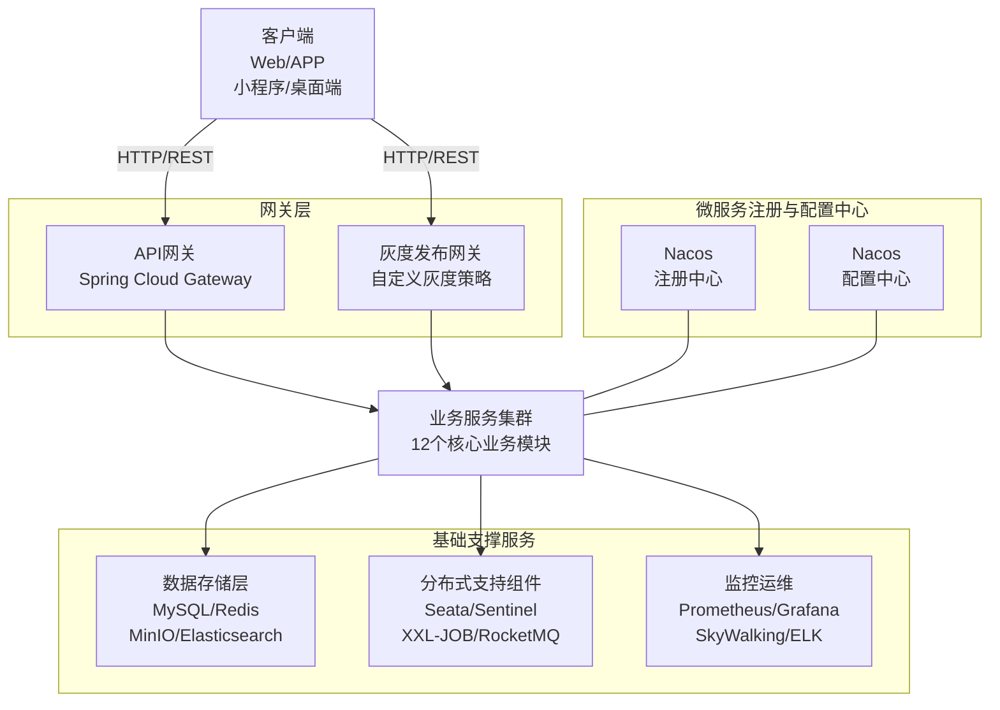
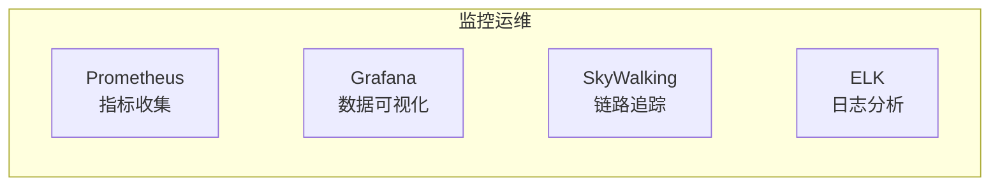
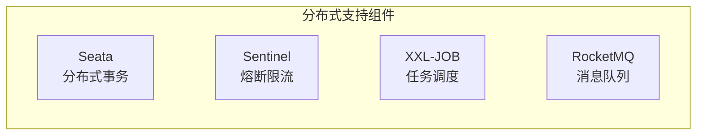
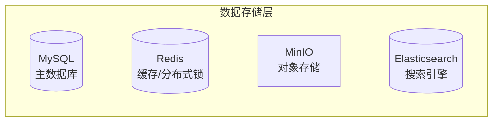
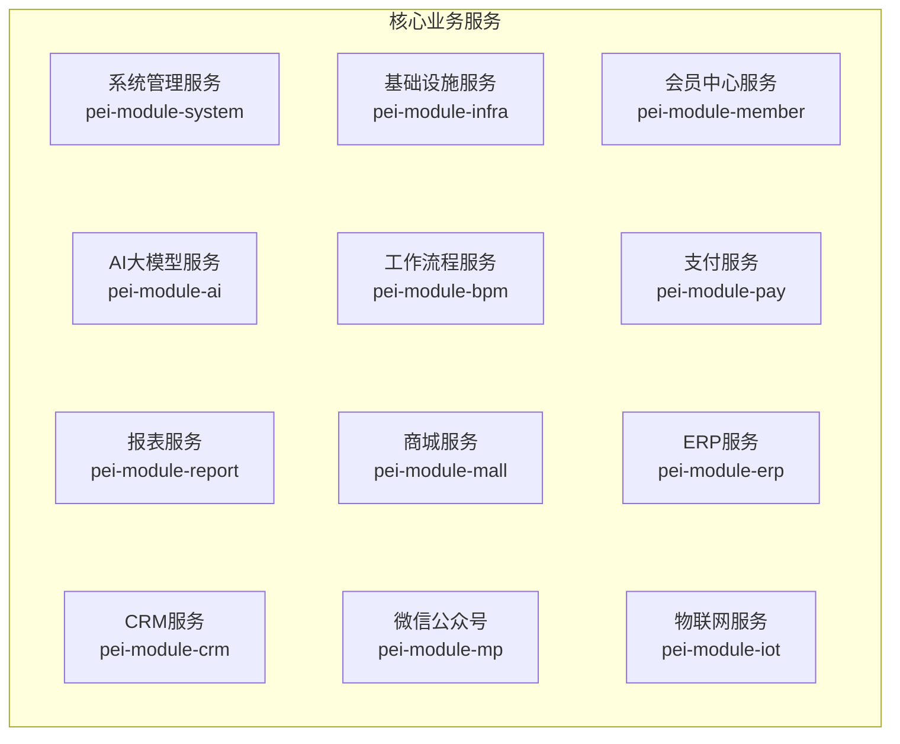

# 图像去雾系统（微服务增强版）

## 📋 项目简介

图像去雾系统（微服务增强版）是基于 Spring Cloud
的分布式图像处理系统，采用现代化微服务架构设计，提供完整的端到端图像去雾解决方案。系统集成了20+种主流去雾算法，基于深度学习实现高质量图像恢复，支持高并发、高可用的企业级部署。

### 核心特性

- **🎯 智能去雾**: 集成20+种主流去雾算法(RIDCP、WPXNet、Dehamer等)，基于深度学习实现高质量图像恢复
- **🌐 微服务架构**: 基于Spring Cloud 2024 + Spring Boot 3.4 + Java 17构建，支持服务治理、配置管理、熔断限流等企业级特性
- **⚡ 高性能处理**: 异步任务处理、Redis缓存优化、GPU加速推理，提高系统吞吐量
- **🔐 安全可靠**: JWT+RBAC权限模型、Redisson分布式锁、完善的安全防护机制
- **📱 多端支持**: Web端管理后台，配合Android App、React Native等多端应用

---

## 💻 技术架构

### 微服务整体架构图



### 监控运维详细架构图



### 分布式支持组件详细架构图



### 数据存储层详细架构图



### 业务服务详细架构图



### 技术栈详解

| 层级          | 技术栈                                           | 说明            |
|-------------|-----------------------------------------------|---------------|
| **微服务框架**   | Spring Cloud 2024 + Spring Boot 3.4 + Java 17 | 微服务架构基础       |
| **服务注册与发现** | Nacos                                         | 服务注册、发现与健康检查  |
| **配置中心**    | Nacos                                         | 动态配置管理        |
| **服务网关**    | Spring Cloud Gateway                          | API网关、权限校验、限流 |
| **负载均衡**    | Spring Cloud LoadBalancer                     | 客户端负载均衡       |
| **RPC调用**   | Apache Dubbo 3.X                              | 高性能远程服务调用     |
| **熔断限流**    | Sentinel                                      | 流量控制、熔断降级     |
| **分布式事务**   | Seata                                         | 分布式事务管理       |
| **Web容器**   | Undertow                                      | 高性能Web服务器     |
| **安全框架**    | Sa-Token + JWT                                | 认证授权、权限控制     |
| **数据库**     | MySQL 8.4 + MyBatis Plus                      | 数据持久化         |
| **缓存**      | Redis 6 + Redisson                            | 分布式缓存、分布式锁    |
| **对象存储**    | MinIO                                         | 文件存储          |
| **消息队列**    | RocketMQ                                      | 异步消息处理        |
| **定时任务**    | XXL-JOB                                       | 分布式任务调度       |
| **监控**      | Prometheus + Grafana                          | 系统监控与告警       |
| **链路追踪**    | SkyWalking                                    | 分布式链路追踪       |
| **日志系统**    | ELK                                           | 日志收集与分析       |

---

## 🏗️ 项目结构

```
dehaze-java-cloud-plus/
├── pei-dependencies/          # Maven依赖版本管理
├── pei-framework/             # Java框架拓展
│   ├── pei-common/           # 通用工具类
│   ├── pei-spring-boot-starter-* # 各种starter组件
│   └── ...                   # 其他框架拓展
├── pei-gateway/               # 网关服务
├── pei-server/                # 管理后台 + 用户 APP 的服务端
├── pei-module-system/         # 系统功能模块
├── pei-module-member/         # 会员中心模块
├── pei-module-infra/          # 基础设施模块
├── pei-module-bpm/            # 工作流程模块
├── pei-module-pay/            # 支付系统模块
├── pei-module-mall/           # 商城系统模块
├── pei-module-erp/            # ERP系统模块
├── pei-module-crm/            # CRM系统模块
├── pei-module-ai/             # AI大模型模块
├── pei-module-mp/             # 微信公众号模块
├── pei-module-report/         # 大屏报表模块
├── pei-module-iot/            # 物联网模块
└── sql/                       # 数据库脚本
```

---

## 🧩 核心模块介绍

### pei-module-ai（AI大模型模块）

AI模块是系统的核心智能处理模块，支持多种大模型平台接入，包括通义千问、文心一言、讯飞星火、智谱GLM、DeepSeek、OpenAI、Ollama、Midjourney、StableDiffusion、Suno等。

#### 主要功能

- 聊天助手（Chat）
- 图像生成（Image Generation）
- 音乐创作（Music Creation）
- 思维导图（Mind Map）
- 写作辅助（Writing Assistant）
- 工作流引擎（Workflow Engine）
- 知识库管理（Knowledge Base）

#### 技术实现

- 使用Spring AI封装各大模型平台
- 支持多模型平台配置管理（API Key、模型类型）
- 实现聊天对话记录与历史回溯
- 提供知识库导入与检索增强
- 支持图像/音乐生成任务管理
- 内置思维导图自动生成
- 提供可扩展的工作流引擎

### pei-module-system（系统功能模块）

系统功能模块提供基础的用户管理、权限控制、菜单管理、部门管理、角色管理等功能。

#### 主要功能

- 用户管理：用户注册、登录、信息维护
- 权限管理：RBAC权限模型，菜单权限、按钮权限控制
- 部门管理：组织架构管理，支持树形结构
- 角色管理：角色分配，权限配置
- 字典管理：系统字典维护
- 通知公告：系统消息发布
- 操作日志：用户操作记录
- 登录日志：用户登录记录

### pei-module-infra（基础设施模块）

基础设施模块提供文件管理、代码生成、系统监控等基础功能。

#### 主要功能

- 文件管理：支持本地、MinIO、阿里云OSS等多种存储方式
- 代码生成：基于数据库表结构自动生成前后端代码
- 系统监控：服务状态监控、缓存监控、操作日志等
- API文档：自动生成接口文档，支持在线调试
- 定时任务：分布式任务调度管理

### pei-module-member（会员中心模块）

会员中心模块提供用户注册、登录、个人信息管理等功能。

#### 主要功能

- 会员注册：支持手机号、邮箱注册
- 会员登录：支持多种登录方式
- 个人信息：头像、昵称、联系方式等信息维护
- 会员等级：会员等级体系管理
- 积分管理：积分获取、消费、兑换

### pei-gateway（网关服务）

网关服务是系统的统一入口，负责请求路由、权限校验、限流等功能。

#### 主要功能

- 请求路由：根据URL将请求转发到对应服务
- 权限校验：统一鉴权，防止未授权访问
- 限流控制：防止系统被恶意请求压垮
- 跨域处理：解决前后端跨域问题
- 日志记录：记录请求日志，便于问题排查

---

## 🚀 快速开始

### 环境要求

| 软件      | 版本要求 | 说明       |
|---------|------|----------|
| JDK     | 17+  | Java运行环境 |
| Maven   | 3.6+ | 项目构建工具   |
| MySQL   | 8.0+ | 主数据库     |
| Redis   | 6.0+ | 缓存数据库    |
| Nacos   | 2.0+ | 注册配置中心   |
| Node.js | 18+  | 前端开发环境   |

### 启动步骤

1. **克隆项目代码**

```bash
git clone https://gitee.com/earthy-zinc/dehaze-java-cloud-plus.git
```

2. **初始化数据库**

```bash
# 执行sql目录下的初始化脚本
mysql -u root -p < sql/mysql/*.sql
```

3. **启动Nacos**

```bash
# 下载并启动Nacos
sh startup.sh -m standalone
```

4. **启动Redis**

```bash
# 启动Redis服务
redis-server
```

5. **启动各服务模块**

```bash
# 启动网关服务
cd pei-gateway
mvn spring-boot:run

# 启动系统服务
cd pei-module-system
mvn spring-boot:run

# 启动基础设施服务
cd pei-module-infra
mvn spring-boot:run

# 启动其他业务模块（按需启动）
```

6. **访问系统**

```bash
# 管理后台
http://localhost:8080

# API文档
http://localhost:8080/doc.html
```

---

## 🛠️ 部署方案

### Docker部署

```bash
# 构建所有服务镜像
mvn clean install -Pdocker

# 启动所有服务
docker-compose up -d
```

### Kubernetes部署

```bash
# 部署到K8s集群
kubectl apply -f k8s/
```

---

## 📄 开源协议

本项目采用 **Apache License 2.0** 开源协议。

- ✅ 允许商业使用
- ✅ 允许修改和分发
- ✅ 提供专利授权
- ⚠️ 需保留版权声明和许可证
- ⚠️ 修改需说明变更

详见 [LICENSE](LICENSE) 文件。

---

## 👥 开发团队

**项目负责人**: 土味锌 (武沛鑫)

- Gitee: [@earthy-zinc](https://gitee.com/earthy-zinc)
- GitHub: [@earthy-zinc](https://github.com/earthy-zinc)

---

## 📞 联系方式

- **项目主页**: https://gitee.com/earthy-zinc/dehaze-java-cloud-plus
- **问题反馈**: [提交Issue](https://gitee.com/earthy-zinc/dehaze-java-cloud-plus/issues)
- **技术讨论**: 欢迎Star和Fork

---

<p align="center">
  <b>如果这个项目对你有帮助,请点个Star⭐支持一下!</b>
</p>
