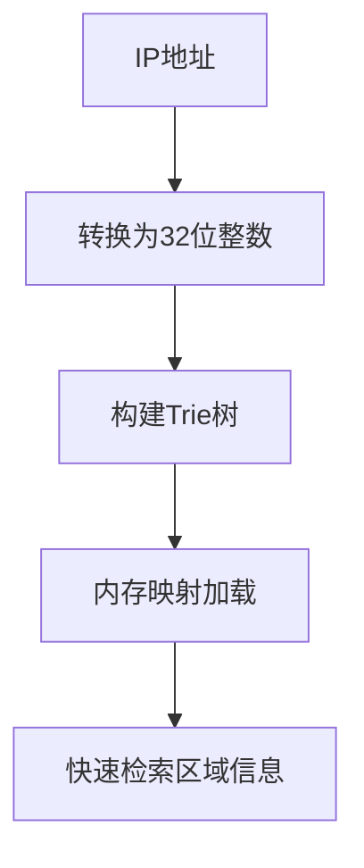
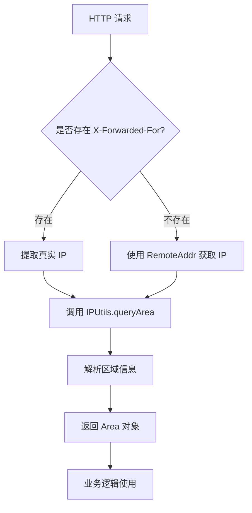
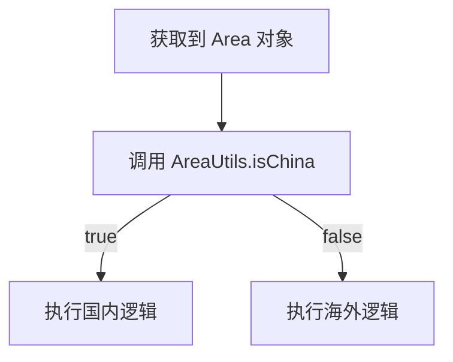

`pei-spring-boot-starter-biz-ip` 是一个 **IP 地址解析与区域识别模块（IP Address Recognition Module）**，其核心作用是为企业提供统一的
IP 地址归属地查询、IP 黑名单控制、区域分类等功能。该模块基于 `ip2region` 和 `GeoIP2` 技术实现高性能 IP 查询，并支持以下功能：

- IP 所属地区查询（国家、省份、城市）
- IP 地理位置缓存
- IP 归属地枚举定义
- IP 区域工具类封装

---

## ✅ 模块概述

### 🎯 模块定位

- **目标**：构建统一的 IP 地址识别系统，支持：
    - 根据 IP 查找所属地区（国家/省/市）
    - 支持自定义区域分类（如国内/海外、华东/华南）
    - 提供黑名单 IP 拦截能力
- **应用场景**：
    - 用户登录风控（判断是否为异常 IP）
    - 多语言自动切换（根据 IP 地区推荐语言）
    - 数据权限隔离（不同地区用户只能访问本地数据）

### 🧩 技术栈依赖

- **Spring Boot + ip2region**
- **数据结构**：
    - 使用 Trie 树优化 IP 查询性能
    - Redis 缓存高频访问的 IP 区域信息
- **安全机制**：
    - 支持 IP 黑名单拦截
    - 支持请求 IP 白名单放行
- **其他工具类**：
    - Hutool 工具库、Jackson 序列化、Lombok 注解

---

## 🔍 核心技术原理

### 1️⃣ ip2region 实现原理

ip2region 是一个开源的 IP 地址定位库，其核心原理是通过 Trie（字典树）结构对 IP 地址进行高效检索。该技术的主要特点包括：

- **Trie 树优化**：将 IPv4 地址转换为 32 位整数后构建 Trie 树变种结构，使查询复杂度降低至 O(k)
- **内存映射**：使用 mmap 内存映射技术加载 10MB 左右的 [ip2region.xdb](src/main/resources/ip2region.xdb)
  数据库文件，通过将数据库文件直接映射到进程的地址空间，避免了频繁的文件读取操作，查询性能可达 30w+/s
- **多算法支持**：内置 Binary、B-Tree 和 Memory 三种查询算法，本模块采用 Memory 算法实现纯内存查询
- **数据结构优化**：每个节点仅保留必要的区域信息（如国家、省份、城市等）。此外,通过共享相同路径的节点，进一步减少了内存消耗。

工作流程如下：



---

## 📁 目录结构说明

```
src/main/java/
└── com/pei/dehaze/framework/ip/
    ├── core/                   // 核心逻辑处理层
    │   ├── enums/              // 枚举定义
    │   └── utils/              // 工具类封装
    │       ├── AreaUtils.java  // 区域工具类
    │       └── IPUtils.java    // IP 工具类
    └── core/Area.java          // 区域实体类
```

---

## 🔍 关键包详解

### 1️⃣ `core.enums` 包 —— 区域类型枚举

#### 示例：`AreaTypeEnum.java`

```java

@Getter
@AllArgsConstructor
public enum AreaTypeEnum implements ArrayValuable<Integer> {

    UNKNOWN(0, "未知"),
    CHINA(1, "中国"),
    OVERSEAS(2, "海外");

    private final Integer type;
    private final String desc;

    public static AreaTypeEnum of(Integer type) {
        return ArrayUtil.firstMatch(o -> o.getType().equals(type), values());
    }
}
```

- **作用**：统一管理区域类型。
- **用途**：
    - 用于标识 IP 所属大区（国内/海外）
    - 可扩展为具体省市分类（如华东、华南、华北）

---

### 2️⃣ `core.utils.IPUtils` 包 —— IP 工具类

#### 示例：`IPUtils.java`

```java

@Slf4j
public class IPUtils {

    private static final String IP_DATA_PATH = "/ip/ip2region.xdb";
    private static final Searcher searcher;

    static {
        try {
            byte[] cBuff = BinarySearchTreeSearch.getFromResource(IP_DATA_PATH);
            searcher = new Searcher(cBuff);
        } catch (Exception e) {
            log.error("[静态初始化][加载 IP 数据失败]", e);
            throw new RuntimeException("加载 IP 数据失败");
        }
    }

    /**
     * 获取客户端真实 IP 地址（考虑代理）
     */
    public static String getClientIP(HttpServletRequest request) {
        String ip = request.getHeader("X-Forwarded-For");
        if (StrUtil.isBlank(ip) || "unknown".equalsIgnoreCase(ip)) {
            ip = request.getRemoteAddr();
        }
        return ip;
    }

    /**
     * 查询 IP 所属地区
     */
    public static Area queryArea(String ip) {
        try {
            String region = searcher.search(ip);
            return parseRegion(region);
        } catch (Exception e) {
            log.warn("[queryArea][查询 IP 区域失败] ip={}", ip, e);
            return Area.UNKNOWN;
        }
    }

    private static Area parseRegion(String region) {
        String[] parts = StrUtil.splitToArray(region, '|');
        if (parts.length < 3) {
            return Area.UNKNOWN;
        }

        Area area = new Area();
        area.setCountry(parts[0]);
        area.setProvince(parts[1]);
        area.setCity(parts[2]);

        // 设置区域类型（国内/海外）
        area.setType(AreaTypeEnum.CHINA.getType());

        if ("0".equals(parts[0]) || "CN".equals(parts[0])) {
            area.setType(AreaTypeEnum.CHINA.getType());
        } else {
            area.setType(AreaTypeEnum.OVERSEAS.getType());
        }

        return area;
    }
}
```

- **作用**：封装 IP 查询逻辑，使用 `ip2region` 实现高速查找。

- **初始化流程**：
    - 在类加载时执行静态初始化。
    - 从资源路径 /ip/ip2region.xdb 加载 IP 地址数据库文件到内存中。
    - 构建基于 Trie 树结构的 Searcher 实例，用于后续的 IP 查询操作。
    - 若加载失败，则记录错误日志并抛出运行时异常，阻止系统继续启动。

- **获取客户端真实 IP**：
    - 提供方法 getClientIP() 用于从 HTTP 请求中提取客户端 IP 地址。
    - 首先尝试从请求头 X-Forwarded-For 获取 IP，适用于存在代理或 CDN 的情况。
    - 如果 X-Forwarded-For 为空或值为 "unknown"，则回退使用 request.getRemoteAddr() 获取原始连接 IP。
    - 返回解析后的 IP 字符串。

- **查询 IP 所属地区信息**：
    - 提供方法 queryArea() 接收 IP 字符串作为参数，调用底层 Searcher 进行查询。
    - 使用 searcher.search(ip) 方法返回一个以 | 分隔的字符串，表示国家、省份、城市等信息。
    - 将结果传递给 parseRegion() 方法进行结构化解析。
    - 若查询过程中发生异常，记录警告日志并返回预定义的 Area.UNKNOWN 对象。

- **解析区域信息为结构化对象**：
    - 提供私有方法 parseRegion() 接收原始查询结果字符串。
    - 按照 | 符号将字符串分割为数组，依次对应国家、省份、城市等字段。
    - 创建 Area 对象并设置相应属性。
    - 判断国家字段是否为 "0" 或 "CN"，决定区域类型为国内（CHINA）或海外（OVERSEAS）。
    - 返回构造完成的 Area 对象。

---

### 3️⃣ `core.utils.AreaUtils` 包 —— 区域辅助类

#### 示例：`AreaUtils.java`

```java
public class AreaUtils {

    public static boolean isChina(Area area) {
        return AreaTypeEnum.CHINA.getType().equals(area.getType());
    }

    public static boolean isOverseas(Area area) {
        return AreaTypeEnum.OVERSEAS.getType().equals(area.getType());
    }

    public static boolean isUnknown(Area area) {
        return AreaTypeEnum.UNKNOWN.getType().equals(area.getType());
    }

    public static boolean isRestrictedRegion(Area area) {
        return List.of("新疆", "西藏").contains(area.getProvince());
    }
}
```

- **作用**：提供区域判断工具方法。
- **用途**：
    - 判断是否为国内/海外 IP
    - 判断是否为高风险地区
- **优势**：
    - 简化业务代码逻辑
    - 提供可扩展的区域规则

---

### 4️⃣ `core.Area` 类 —— 区域信息实体类

#### 示例：`Area.java`

```java

@Data
@Builder
@NoArgsConstructor
@AllArgsConstructor
public class Area {

    public static final Area UNKNOWN = new Area();

    private String country;
    private String province;
    private String city;
    private Integer type; // 参见 AreaTypeEnum

    public boolean isChina() {
        return AreaTypeEnum.CHINA.getType().equals(this.type);
    }

    public boolean isOverseas() {
        return AreaTypeEnum.OVERSEAS.getType().equals(this.type);
    }

    public boolean isUnknown() {
        return AreaTypeEnum.UNKNOWN.getType().equals(this.type);
    }
}
```

- **作用**：封装 IP 查询返回的区域信息。
- **字段说明**：
    - `country`: 国家名称（如 “中国”、“美国”）
    - `province`: 省份或州名（如 “北京”、“California”）
    - `city`: 城市名称（如 “上海”、“Los Angeles”）
    - `type`: 区域类型（枚举 `AreaTypeEnum`）
- **设计模式**：
    - 使用 Builder 模式创建对象
    - 使用静态常量简化判断逻辑

---

## 🧠 模块工作流程图解

### 1️⃣ IP 查询流程


- **步骤**：
  1. 用户发起 HTTP 请求
  2. 调用 `IPUtils.getClientIP(request)` 获取真实 IP
  3. 调用 `IPUtils.queryArea(ip)` 查询归属地
  4. 返回 `Area` 对象供后续使用

### 2️⃣ 区域判断流程


- **步骤**：
  1. 获取到 `Area` 对象
  2. 调用 `AreaUtils.isChina(area)` 判断是否是国内 IP
  3. 根据区域类型执行对应逻辑（如风控、限流等）

---

## 📌 总结

`pei-spring-boot-starter-biz-ip` 模块实现了以下核心功能：

| 功能    | 技术实现                     | 用途               |
|-------|--------------------------|------------------|
| IP 查询 | IPUtils + ip2region      | 获取 IP 所属国家、省份、城市 |
| 区域判断  | AreaUtils + AreaTypeEnum | 判断是否为国内/海外/未知区域  |
| IP 解析 | IPUtils.parseRegion(...) | 解析 IP 所属区域       |
| 高性能查询 | Trie 树 + 内存缓存            | 提升 IP 查询速度至毫秒级   |

它是一个轻量但功能完整的 IP 识别模块，适用于电商、社交、CRM、ERP、AI 等需要 IP 地理位置识别的场景。
