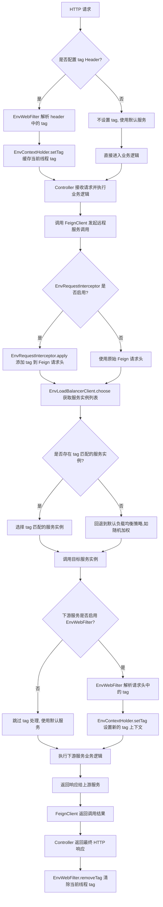
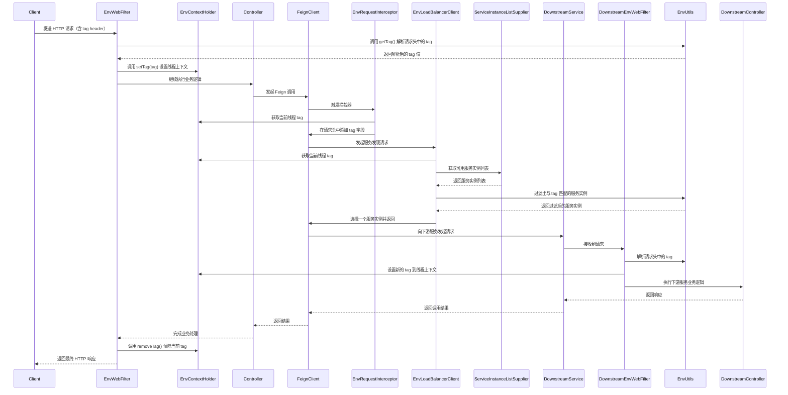

`pei-spring-boot-starter-env` 是一个 **多环境支持模块**，它的核心作用是为微服务架构提供 **环境隔离能力**
，类似于阿里云的“特性环境”或“影子环境”。通过该模块，可以在开发、测试、灰度发布等场景中实现：

- 服务注册时带上 `tag` 标签（如 dev、test、gray）。
- 调用链中透传 `tag`，确保请求只路由到对应标签的服务实例。
- 支持在 HTTP 请求头中设置 `tag`，用于切换调用目标环境。

---

## 一、模块概述

### ✅ 模块定位

- **目标**：实现在多个环境（dev/test/gray/prod）下，服务调用可以精准匹配相同 tag 的实例。
- **应用场景**：
    - 同一套代码部署多个环境，避免相互干扰。
    - 灰度发布时，仅让特定流量进入新版本服务。
    - 开发人员本地调试时，指定调用远程的 test 或 dev 环境服务。
- **技术栈依赖**：
    - Spring Boot + Spring Cloud Gateway
    - Nacos 注册中心
    - Feign/Ribbon 实现 RPC 调用
    - ThreadLocal 上下文管理

---

## 二、目录结构说明

```
src/main/java/
└── com/pei/dehaze/framework/env/
    ├── config/                                   // 自动配置类
    │   ├── EnvEnvironmentPostProcessor.java      // 设置默认 hostName 和 tag 到 Nacos 配置中
    │   ├── EnvProperties.java                    // 配置类，读取 pei.env.tag
    │   ├── PeiEnvRpcAutoConfiguration.java       // RPC 层自动配置，Feign 请求头透传 tag
    │   └── PeiEnvWebAutoConfiguration.java       // Web 层自动配置，处理 HTTP 请求头中的 tag
    ├── core/
    │   ├── context/                              // 上下文管理
    │   │   └── EnvContextHolder.java             // ThreadLocal 缓存当前线程的 tag
    │   ├── fegin/                                // Feign 客户端拦截器与负载均衡器
    │   │   ├── EnvLoadBalancerClient.java        // 自定义 LoadBalancerClient，根据 tag 匹配服务实例
    │   │   ├── EnvLoadBalancerClientFactory.java // 工厂类，创建带 tag 过滤逻辑的负载均衡器
    │   │   └── EnvRequestInterceptor.java        // Feign 请求拦截器，在 header 中写入 tag
    │   ├── web/                                  // Web 层过滤器
    │   │   └── EnvWebFilter.java                 // Servlet Filter，解析请求头中的 tag 并设置上下文
    │   └── util/                                 // 工具类
    │       └── EnvUtils.java                     // 提供获取 tag、hostName、header 处理等工具方法
```

---

## 三、关键包详解

### 1️⃣ `config` 包

#### 🔹 `EnvEnvironmentPostProcessor.java`

```java
public class EnvEnvironmentPostProcessor implements EnvironmentPostProcessor {
    private static final Set<String> TARGET_TAG_KEYS = SetUtils.asSet(
            "spring.cloud.nacos.discovery.metadata.tag"
    );

    @Override
    public void postProcessEnvironment(ConfigurableEnvironment environment, SpringApplication application) {
        String hostNameKey = StrUtil.subBetween(HOST_NAME_VALUE, "{", "}");
        if (!environment.containsProperty(hostNameKey)) {
            environment.getSystemProperties().put(hostNameKey, EnvUtils.getHostName());
        }

        String tag = EnvUtils.getTag(environment);
        if (StrUtil.isEmpty(tag)) return;

        for (String targetTagKey : TARGET_TAG_KEYS) {
            String targetTagValue = environment.getProperty(targetTagKey);
            if (StrUtil.isNotEmpty(targetTagValue)) continue;
            environment.getSystemProperties().put(targetTagKey, tag);
        }
    }
}
```

- **作用**：Spring Boot 启动阶段自动注入 tag 到 Nacos 注册元数据中。
- **原理**：
    - 如果没有显式配置 `spring.cloud.nacos.discovery.metadata.tag`，则使用 `pei.env.tag` 值填充。
    - 同时设置 `${HOSTNAME}` 占位符，便于在 IDE 中使用。

#### 🔹 `EnvProperties.java`

```java

@ConfigurationProperties(prefix = "pei.env")
@Data
public class EnvProperties {
    public static final String TAG_KEY = "pei.env.tag";
    private String tag;
}
```

- **作用**：读取 `application.yaml` 中的 `pei.env.tag` 配置项。
- **示例配置**：
  ```yaml
  pei:
    env:
      tag: dev
  ```

#### 🔹 `PeiEnvRpcAutoConfiguration.java`

```java

@Bean
public LoadBalancerClientFactory loadBalancerClientFactory() {
    return new EnvLoadBalancerClientFactory();
}

@Bean
public EnvRequestInterceptor envRequestInterceptor() {
    return new EnvRequestInterceptor();
}
```

- **作用**：RPC 调用时，将 tag 透传给下游服务。
- **实现方式**：
    - `EnvRequestInterceptor` 在 Feign 请求头中写入 `tag`。
    - `EnvLoadBalancerClientFactory` 创建自定义的 `EnvLoadBalancerClient`。

#### 🔹 `PeiEnvWebAutoConfiguration.java`

```java

@Bean
public FilterRegistrationBean<EnvWebFilter> envWebFilterFilter() {
    EnvWebFilter filter = new EnvWebFilter();
    FilterRegistrationBean<EnvWebFilter> bean = new FilterRegistrationBean<>(filter);
    bean.setOrder(WebFilterOrderEnum.ENV_TAG_FILTER);
    return bean;
}
```

- **作用**：注册 Web Filter，解析 HTTP 请求头中的 `tag` 并设置到上下文中。
- **顺序控制**：保证其在租户、安全等其他 Filter 之前执行。

---

### 2️⃣ `context` 包

#### 🔹 `EnvContextHolder.java`

```java
private static final ThreadLocal<List<String>> TAG_CONTEXT = TransmittableThreadLocal.withInitial(ArrayList::new);

public static void setTag(String tag) {
    TAG_CONTEXT.get().add(tag);
}

public static String getTag() {
    return CollUtil.getLast(TAG_CONTEXT.get());
}

public static void removeTag() {
    List<String> tags = TAG_CONTEXT.get();
    if (CollUtil.isEmpty(tags)) return;
    tags.remove(tags.size() - 1);
}
```

- **作用**：线程上下文缓存当前请求的 `tag`。
- **优势**：
    - 支持嵌套调用，出栈后恢复上层 tag。
    - 使用 `TransmittableThreadLocal` 支持异步上下文传递。

---

### 3️⃣ `fegin` 包

#### 🔹 `EnvLoadBalancerClient.java`

```java

@Override
public Mono<Response<ServiceInstance>> choose(Request request) {
    String tag = EnvContextHolder.getTag();
    if (StrUtil.isEmpty(tag)) {
        return Mono.from(reactiveLoadBalancer.choose(request));
    }

    ServiceInstanceListSupplier supplier = serviceInstanceListSupplierProvider.getIfAvailable();
    return supplier.get(request).next().map(list -> getInstanceResponse(list, tag));
}

private Response<ServiceInstance> getInstanceResponse(List<ServiceInstance> instances, String tag) {
    List<ServiceInstance> chooseInstances = CollectionUtils.filterList(instances, instance -> tag.equals(EnvUtils.getTag(instance)));
    if (CollUtil.isEmpty(chooseInstances)) {
        chooseInstances = instances; // fallback to default
    }
    return new DefaultResponse(NacosBalancer.getHostByRandomWeight3(chooseInstances));
}
```

- **作用**：自定义 Feign 客户端的负载均衡策略。
- **流程**：
    1. 获取当前线程的 `tag`。
    2. 筛选满足 `tag` 的服务实例。
    3. 若无匹配，则使用所有实例进行随机加权选择。

#### 🔹 `EnvLoadBalancerClientFactory.java`

```java

@Override
public ReactiveLoadBalancer<ServiceInstance> getInstance(String serviceId) {
    ReactiveLoadBalancer<ServiceInstance> reactiveLoadBalancer = super.getInstance(serviceId);
    return new EnvLoadBalancerClient();
}
```

- **作用**：封装原始的 `ReactiveLoadBalancer`，返回增强后的 `EnvLoadBalancerClient`。
- **用途**：在服务发现时优先匹配 tag 相同的服务实例。

#### 🔹 `EnvRequestInterceptor.java`

```java

@Override
public void apply(RequestTemplate requestTemplate) {
    String tag = EnvContextHolder.getTag();
    if (StrUtil.isNotEmpty(tag)) {
        EnvUtils.setTag(requestTemplate, tag);
    }
}
```

- **作用**：Feign 请求时，在 header 中添加 `tag` 字段。
- **透传机制**：下游服务通过 `EnvWebFilter` 解析 header 并继续传递。

---

### 4️⃣ `web` 包

#### 🔹 `EnvWebFilter.java`

```java
private void doFilterInternal(HttpServletRequest request, HttpServletResponse response, FilterChain chain)
        throws ServletException, IOException {
    String tag = EnvUtils.getTag(request);
    if (StrUtil.isEmpty(tag)) {
        chain.doFilter(request, response);
        return;
    }

    EnvContextHolder.setTag(tag);
    try {
        chain.doFilter(request, response);
    } finally {
        EnvContextHolder.removeTag();
    }
}
```

- **作用**：解析 HTTP 请求头中的 `tag`，并设置到上下文中。
- **使用方式**：
  ```http
  GET /api/user HTTP/1.1
  Host: localhost:8080
  tag: dev
  ```

---

### 5️⃣ `util` 包

#### 🔹 `EnvUtils.java`

```java
public static String getTag(HttpServletRequest request) {
    String tag = request.getHeader("tag");
    return Objects.equals(tag, HOST_NAME_VALUE) ? getHostName() : tag;
}

public static String getTag(ServiceInstance instance) {
    return instance.getMetadata().get("tag");
}

public static void setTag(RequestTemplate requestTemplate, String tag) {
    requestTemplate.header("tag", tag);
}
```

- **作用**：提供通用的 tag 获取和设置工具方法。
- **扩展性**：支持从 `HttpServletRequest`、`ServiceInstance`、`RequestTemplate` 等多种来源获取或设置 tag。

---

## 四、模块功能总结

| 包名        | 功能         | 关键类                                                         |
|-----------|------------|-------------------------------------------------------------|
| `config`  | 自动配置       | `EnvEnvironmentPostProcessor`, `PeiEnvWebAutoConfiguration` |
| `context` | 上下文管理      | `EnvContextHolder`                                          |
| `fegin`   | Feign 调用增强 | `EnvLoadBalancerClient`, `EnvRequestInterceptor`            |
| `web`     | Web 请求处理   | `EnvWebFilter`                                              |
| `util`    | 工具类        | `EnvUtils`                                                  |

---

## 五、模块工作流程图解



🧩 图解说明与逻辑细化

1. HTTP 请求入口

- 客户端发起 HTTP 请求，可选地携带 `tag` 请求头，用于指定目标环境。

2. EnvWebFilter 解析 tag

- 在 Web 层注册了一个 Servlet Filter：`EnvWebFilter`。
- 该 Filter 会解析 HTTP 请求头中的 `tag` 字段。
- 如果存在 `tag`，则通过 `EnvContextHolder.setTag()` 将其缓存至当前线程上下文中。
- 若不存在，则跳过此步骤，后续调用将使用默认服务实例。

3. Controller 执行业务逻辑

- 请求进入 Controller 层，开始执行具体业务逻辑。
- 此时线程上下文中已包含当前请求对应的 `tag`，可用于后续远程调用。

4. Feign 调用远程服务

- Controller 调用 Feign Client 发起远程服务调用。
- Spring Cloud Feign 支持拦截器机制，这里启用了自定义拦截器 `EnvRequestInterceptor`。

5. EnvRequestInterceptor 写入 tag

- `EnvRequestInterceptor.apply()` 方法会在每次 Feign 请求前执行。
- 从 `EnvContextHolder.getTag()` 获取当前线程的 `tag`。
- 使用 `EnvUtils.setTag(requestTemplate, tag)` 将 `tag` 写入 Feign 请求头中。

6. EnvLoadBalancerClient 服务发现

- 当 Feign 发起调用时，Spring Cloud LoadBalancer 会介入服务发现过程。
- `EnvLoadBalancerClient` 是一个自定义的 `ReactiveLoadBalancer` 实现类。
- 它会根据当前线程的 `tag` 筛选出匹配的服务实例。
- 如果没有匹配项，则使用默认策略（如随机加权）选择服务实例。

7. 下游服务接收请求

- 目标服务接收到 Feign 请求。
- 如果该服务也引入了 `pei-spring-boot-starter-env` 模块，则同样会经过 `EnvWebFilter`。
- `EnvWebFilter` 会再次解析请求头中的 `tag`，并设置到本地线程上下文中。
- 如果未启用该模块，则跳过 tag 处理，直接进入业务逻辑。

8. 下游服务执行业务逻辑

- 下游服务的 Controller 接收请求并执行业务逻辑。
- 如果下游服务还需要调用其他服务，上述流程会递归进行。

9. 返回响应

- 下游服务完成处理后，响应逐层返回给原始调用方。
- 最终由 `EnvWebFilter` 调用 `removeTag()` 清除当前线程中的 `tag`，防止污染后续请求。

---



📚 流程说明与逻辑解析

1. **客户端发送请求**

- 客户端向服务端发送 HTTP 请求，并在 Header 中携带 `tag` 参数

2. **EnvWebFilter 处理请求**

- 系统注册了一个名为 `EnvWebFilter` 的 Servlet Filter。
- 该 Filter 会从请求头中提取 `tag` 值，并通过 `EnvContextHolder.setTag()` 将其保存到线程上下文中。
- 如果没有提供 `tag`，则跳过此步骤，使用默认服务实例。

3. **Controller 业务逻辑执行**

- 请求进入 Controller 层进行业务处理。
- 此时线程上下文中已包含当前请求的 `tag`，用于后续 RPC 调用。

4. **Feign 调用触发**

- Controller 调用远程服务时，使用了 Feign 客户端。
- `EnvRequestInterceptor` 是一个自定义的 Feign 拦截器，在每次调用前自动运行。

5. **EnvRequestInterceptor 添加 tag**

- 从 `EnvContextHolder` 获取当前线程的 `tag`。
- 使用 `EnvUtils.setTag()` 方法将 `tag` 写入 Feign 请求头中。

6. **EnvLoadBalancerClient 服务发现**

- 当 Feign 发起远程调用时，`EnvLoadBalancerClient` 介入负载均衡过程。
- 它会从线程上下文中获取当前 `tag`，然后筛选出所有匹配该 `tag` 的服务实例。
- 如果找不到匹配项，则回退到随机加权策略选择任意实例。

7. **调用下游服务**

- Feign 客户端将请求发送至目标服务。
- 下游服务接收到请求后，再次经过 `EnvWebFilter`，从中解析出 `tag` 并设置到本地线程上下文中。

8. **下游服务继续处理**

- 下游服务的 Controller 接收请求并执行业务逻辑。
- 如果下游服务也需要调用其他服务，则重复上述流程。

9. **返回响应**

- 下游服务完成处理后，响应逐层返回给原始调用方。
- 最终由 `EnvWebFilter` 清除线程上下文中的 `tag`，避免影响后续请求。

---

## 六、使用方式

### 1️⃣ 应用配置

```yaml
pei:
  env:
    tag: dev
```

### 2️⃣ HTTP 请求携带 tag

```http
GET /api/user HTTP/1.1
Host: localhost:8080
tag: dev
```

### 3️⃣ Feign 调用自动透传 tag

```java

@FeignClient(name = "system-server")
public interface UserService {
}
```

### 4️⃣ 服务注册时自动带上 tag

```yaml
spring:
  cloud:
    nacos:
      discovery:
        metadata:
          tag: dev
```

---

## 七、总结

`pei-spring-boot-starter-env` 模块实现了 **基于 tag 的多环境隔离机制**，具有如下特点：

- **统一入口**：通过 `EnvWebFilter` 解析 HTTP 请求头中的 tag。
- **上下文管理**：使用 `EnvContextHolder` 存储当前线程的 tag。
- **RPC 透传**：`EnvRequestInterceptor` 将 tag 写入 Feign 请求头。
- **服务发现优化**：`EnvLoadBalancerClient` 优先选择相同 tag 的服务实例。
- **自动配置**：通过 `EnvEnvironmentPostProcessor` 设置默认 tag 到 Nacos 元数据中。

