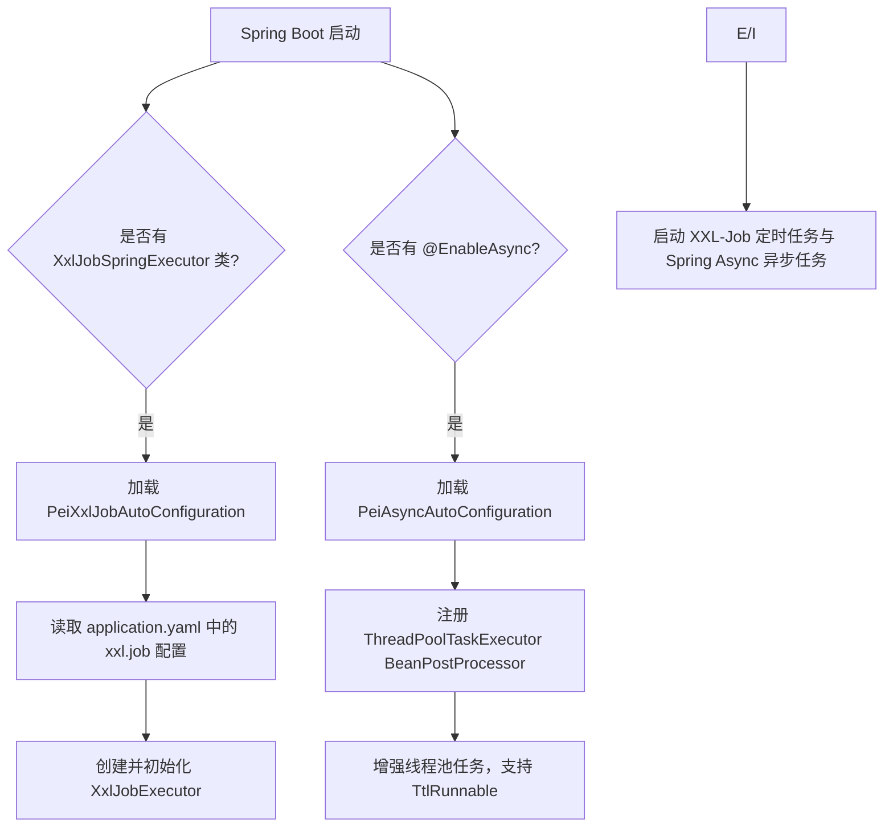

`pei-spring-boot-starter-job` 是一个 **任务调度模块**，其核心作用是为微服务架构提供统一的 **定时任务和异步任务执行能力**。该模块基于 `XXL-Job` 实现了分布式定时任务，并结合 Spring Async 提供了线程池级别的异步执行支持。

---

## 一、模块概述

### ✅ 模块定位
- **目标**：为所有微服务模块提供统一的定时任务与异步任务支持。
- **应用场景**：
    - 分布式系统中定时任务统一调度（如日终统计、数据同步）
    - 异步执行耗时操作（如发送邮件、短信通知、日志写入等）
- **技术栈依赖**：
    - XXL-Job（分布式任务调度平台）
    - Spring Boot Async（本地异步执行）
    - TransmittableThreadLocal（异步上下文传递）
    - Jakarta Validation（配置参数校验）

---

## 二、目录结构说明

```
src/main/java/
└── com/pei/dehaze/framework/quartz/
    └── config/                   // 自动配置类
        ├── PeiAsyncAutoConfiguration.java      // 异步任务自动配置
        ├── PeiXxlJobAutoConfiguration.java     // XXL-Job 自动配置
        └── XxlJobProperties.java              // 配置属性类
```


---

## 三、关键包详解

### 1️⃣ `config` 包

#### 🔹 `XxlJobProperties.java`
```java
@ConfigurationProperties("xxl.job")
@Validated
@Data
public class XxlJobProperties {
    private final Boolean enabled = true;
    private String accessToken;
    private AdminProperties admin;
    private ExecutorProperties executor;

    @Data
    @Valid
    public static class AdminProperties {
        @NotEmpty(message = "调度器地址不能为空")
        private String addresses;
    }

    @Data
    @Valid
    public static class ExecutorProperties {
        private static final Integer PORT_DEFAULT = -1;
        private static final Integer LOG_RETENTION_DAYS_DEFAULT = 30;

        @NotEmpty(message = "应用名不能为空")
        private String appName;
        private String ip;
        private final Integer port = PORT_DEFAULT;
        private String logPath;
        private final Integer logRetentionDays = LOG_RETENTION_DAYS_DEFAULT;
    }
}
```

- **作用**：封装 `application.yaml` 中的 `xxl.job` 配置项。
- **功能特点**：
    - 支持配置 XXL-Job 调度中心地址。
    - 支持配置执行器的应用名、IP、端口、日志路径、保留天数。
    - 使用 `@ConfigurationProperties` 绑定配置。
    - 使用 `jakarta.validation` 校验必填字段。

#### 🔹 `PeiXxlJobAutoConfiguration.java`
```java
@AutoConfiguration
@ConditionalOnClass(XxlJobSpringExecutor.class)
@ConditionalOnProperty(prefix = "xxl.job", name = "enabled", havingValue = "true", matchIfMissing = true)
@EnableConfigurationProperties({XxlJobProperties.class})
@EnableScheduling
@Slf4j
public class PeiXxlJobAutoConfiguration {

    @Bean
    @ConditionalOnMissingBean
    public XxlJobExecutor xxlJobExecutor(XxlJobProperties properties) {
        XxlJobExecutor xxlJobExecutor = new XxlJobSpringExecutor();
        xxlJobExecutor.setIp(properties.getExecutor().getIp());
        xxlJobExecutor.setPort(properties.getExecutor().getPort());
        xxlJobExecutor.setAppname(properties.getExecutor().getAppName());
        xxlJobExecutor.setLogPath(properties.getExecutor().getLogPath());
        xxlJobExecutor.setLogRetentionDays(properties.getExecutor().getLogRetentionDays());
        xxlJobExecutor.setAdminAddresses(properties.getAdmin().getAddresses());
        xxlJobExecutor.setAccessToken(properties.getAccessToken());
        return xxlJobExecutor;
    }
}
```

- **作用**：自动配置 XXL-Job 执行器，将配置文件中的 `xxl.job` 映射到 `XxlJobExecutor`。
- **关键技术点**：
    - `@ConditionalOnClass`：确保 `XxlJobSpringExecutor` 存在时才加载该配置。
    - `@ConditionalOnProperty`：根据 `xxl.job.enabled` 控制是否启用 XXL-Job。
    - `@EnableScheduling`：启用 Spring 的内置定时任务机制。
    - 设置执行器的基本信息（IP、端口、日志路径、调度中心地址等）。

#### 🔹 `PeiAsyncAutoConfiguration.java`
```java
@AutoConfiguration
@EnableAsync
public class PeiAsyncAutoConfiguration {

    @Bean
    public BeanPostProcessor threadPoolTaskExecutorBeanPostProcessor() {
        return new BeanPostProcessor() {
            @Override
            public Object postProcessBeforeInitialization(Object bean, String beanName) throws BeansException {
                if (!(bean instanceof ThreadPoolTaskExecutor executor)) {
                    return bean;
                }
                executor.setTaskDecorator(TtlRunnable::get);
                return executor;
            }
        };
    }
}
```

- **作用**：启用 Spring Async 并配置线程池，确保异步任务中 ThreadLocal 上下文正确传递。
- **实现原理**：
    - 注册 `BeanPostProcessor` 来拦截所有的 `ThreadPoolTaskExecutor`。
    - 使用 `TtlRunnable` 增强线程池任务，确保 TransmittableThreadLocal 正确透传。
    - 确保异步任务中可以访问当前线程的上下文变量（如 traceId、tag、token 等）。

---

## 四、模块工作流程图解




---

## 五、模块功能总结

| 包名 | 功能 | 关键类 |
|------|------|--------|
| `quartz.config` | 自动配置类 | `PeiXxlJobAutoConfiguration`, `PeiAsyncAutoConfiguration`, `XxlJobProperties` |

---

## 六、使用方式

### 1️⃣ 在 `application.yaml` 中配置 XXL-Job

```yaml
xxl:
  job:
    enabled: true
    access-token: abc123
    admin:
      addresses: http://localhost:8080/xxl-job-admin
    executor:
      app-name: system-server
      ip: 127.0.0.1
      port: 9999
      log-path: /data/applogs/xxl-job
      log-retention-days: 30
```


### 2️⃣ 创建定时任务类（继承 `IJobHandler`）

```java
@Component
@JobHandler(name = "demoJobHandler")
public class DemoJobHandler extends IJobHandler {

    @Override
    public void initHandler() {
        // 初始化逻辑
    }

    @Override
    public void destroyHandler() {
        // 销毁逻辑
    }

    @Override
    public ReturnT<String> execute(String param) throws Exception {
        // 执行业务逻辑
        return SUCCESS;
    }
}
```


### 3️⃣ 使用 Spring Async 异步执行任务

```java
@Service
public class AsyncService {

    @Async
    public void asyncMethod() {
        // 异步执行的任务逻辑
    }
}
```


---

## 七、建议改进方向

| 改进点 | 描述 |
|--------|------|
| ✅ 单元测试 | 对 `XxlJobProperties` 进行单元测试，验证配置绑定与校验是否生效。 |
| ✅ 日志增强 | 在 `execute()` 方法中记录 `trace-id` 和 `job-id`，便于追踪问题。 |
| ✅ 自定义线程池 | 当前使用默认线程池，未来可支持自定义大小、队列容量等。 |
| ✅ 失败重试机制 | 可在 `execute()` 中加入失败重试逻辑或上报异常日志。 |
| ✅ 配置中心集成 | 将 `xxl.job` 配置放入 Nacos 或 Apollo，实现动态配置更新。 |

---

## 八、总结

`pei-spring-boot-starter-job` 模块实现了：

- **XXL-Job 分布式任务调度支持**
- **Spring Async 异步任务执行支持**
- **TransmittableThreadLocal 上下文透传**

它是一个轻量级但功能完整的任务调度模块，适用于多环境下的定时任务管理和异步处理场景。如果你有具体某个类（如 `XxlJobProperties`、`PeiXxlJobAutoConfiguration`）想要深入了解，欢迎继续提问！
