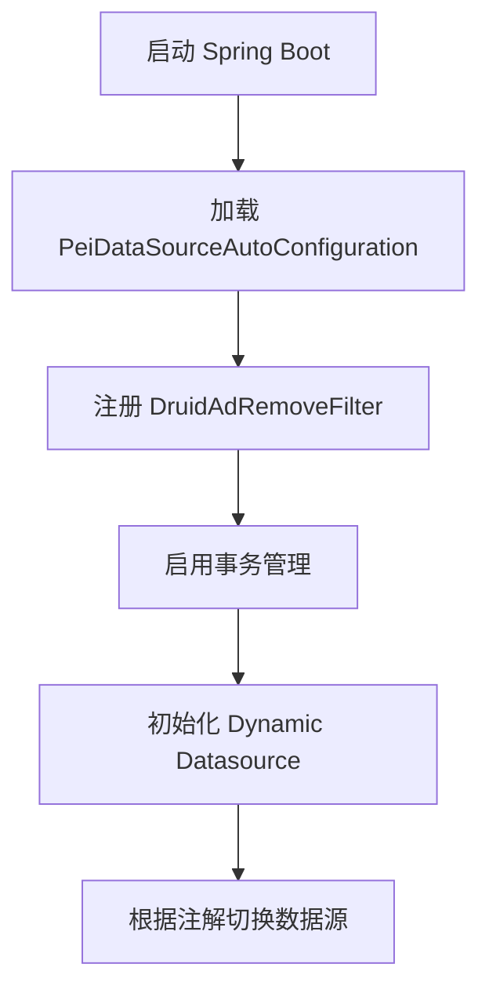
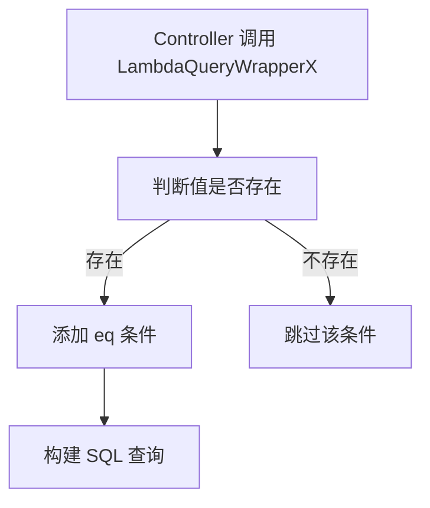
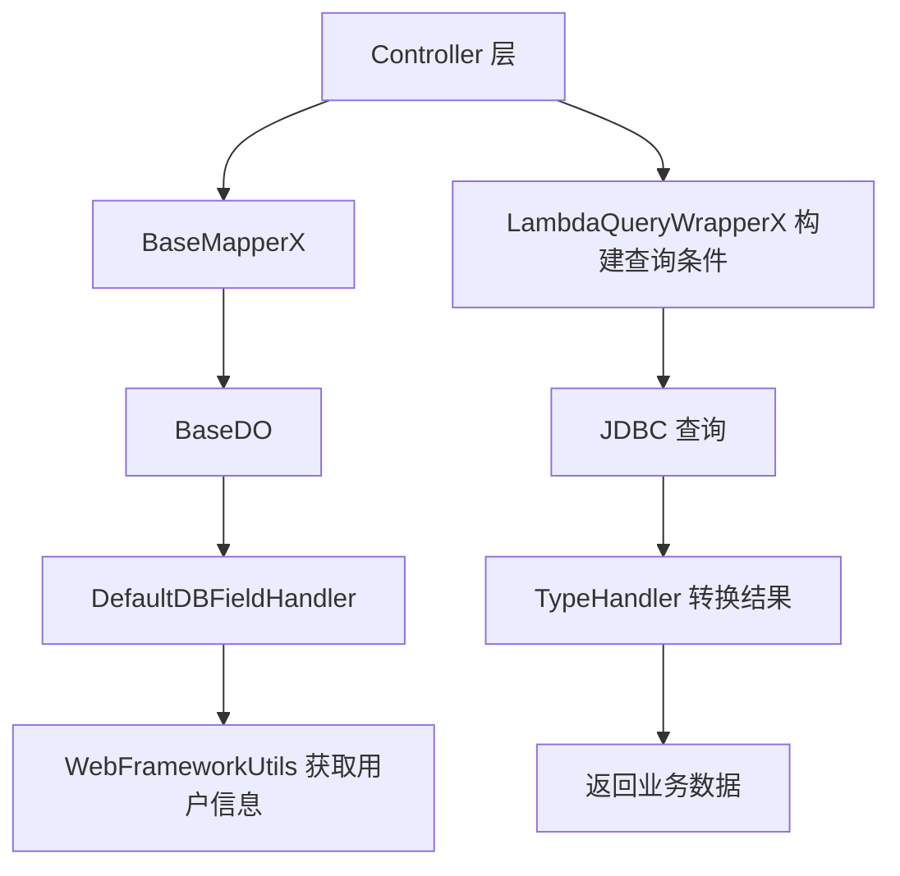

`pei-spring-boot-starter-mybatis` 是一个 **MyBatis Plus 拓展模块（MyBatis Extension Module）**，其核心作用是为企业级应用提供统一的数据库连接池管理、多数据源支持、事务控制以及 MyBatis 增强能力。该模块基于 `Spring Boot + MyBatis Plus + Druid + Dynamic Datasource` 实现灵活的数据访问层架构，并支持以下功能：

- 数据库连接池配置与优化（Druid）
- 多数据源自动切换（主从分离）
- 自动填充字段（创建时间、更新时间、创建人、更新人）
- 分页插件支持
- 字段加密解密处理（AES）
- 类型转换器（List<Integer>, List<Long>, Set<Long>, List<String>）
- SQL 跨数据库兼容性适配（FIND_IN_SET）
- VO 数据翻译集成

它适用于电商订单系统、CRM 客户管理、ERP 物料清单、AI 模型训练数据存储等需要高性能数据库访问的场景。

---

## ✅ 模块概述

### 🎯 模块定位
- **目标**：构建统一的 MyBatis 封装层，支持：
    - 主从数据库自动切换
    - 字段自动填充（create_time, update_time, creator, updater）
    - 分页查询增强（SortablePageParam 支持排序字段）
    - 联表查询扩展（MPJLambdaWrapperX 支持链式调用）
    - 类型安全转换（如加密字段、列表字段）
- **应用场景**：
    - 管理后台数据库操作
    - 用户 APP 接口数据访问
    - 微服务间数据交互
    - 大数据批量插入优化

### 🧩 技术栈依赖
- **ORM 引擎**：`MyBatis Plus`
- **联表查询**：`MyBatis Plus Join`
- **分页插件**：MyBatis Plus PaginationInnerInterceptor
- **类型处理器**：自定义 TypeHandler（List/Long/Set/AES 加密）
- **多数据源**：`Dynamic-Datasource`
- **连接池**：`Alibaba Druid`

---

## 📁 目录结构说明

```
src/main/java/
└── com/pei/dehaze/framework/
    ├── datasource/              // 数据源相关配置与过滤器
    │   ├── config/              // 数据源自动配置类
    │   └── core/
    │       ├── enums/           // 数据源枚举定义
    │       └── filter/          // 数据源过滤器（如移除 Druid 广告）
    ├── mybatis/                 // MyBatis Plus 核心封装
    │   ├── config/              // MyBatis 自动配置类
    │   └── core/
    │       ├── dataobject/      // 基础实体对象
    │       ├── enums/           // 数据库类型枚举
    │       ├── handler/         // 自动填充字段处理器
    │       ├── mapper/          // Mapper 扩展接口
    │       ├── query/           // 查询条件封装（LambdaQueryWrapperX、MPJLambdaWrapperX）
    │       ├── type/            // 类型转换器（加密、列表、集合）
    │       └── util/            // JDBC 工具类、MyBatis 工具类
    └── translate/               // VO 数据翻译工具
        ├── config/              // 数据翻译自动配置
        └── core/                // TranslateUtils 工具类
```


---

## 🔍 关键包详解

### 1️⃣ `datasource.config` 包 —— 数据源配置类

#### 示例：`PeiDataSourceAutoConfiguration.java`
```java
@AutoConfiguration
@EnableTransactionManagement(proxyTargetClass = true)
@EnableConfigurationProperties(DruidStatProperties.class)
public class PeiDataSourceAutoConfiguration {

    @Bean
    public FilterRegistrationBean<DruidAdRemoveFilter> druidAdRemoveFilterFilter(...) {
        // 创建 DruidAdRemoveFilter Bean
        ...
    }
}
```


- **作用**：配置 Druid 数据源并注册广告过滤器。
- **关键逻辑**：
    - 启用事务管理（`@EnableTransactionManagement`）
    - 注册 `DruidAdRemoveFilter` 过滤器以去除广告内容
- **设计模式**：
    - 配置类模式
    - 过滤器注册模式

---

### 2️⃣ `datasource.core.enums` 包 —— 数据源枚举定义

#### 示例：`DataSourceEnum.java`
```java
public interface DataSourceEnum {
    String MASTER = "master";
    String SLAVE = "slave";
}
```


- **作用**：定义主从数据源名称。
- **使用方式**：
  ```java
  @DS("master")
  public interface OrderMapper extends BaseMapper<OrderDO> {}
  ```


---

### 3️⃣ `datasource.core.filter` 包 —— 数据源过滤器

#### 示例：`DruidAdRemoveFilter.java`
```java
public class DruidAdRemoveFilter extends OncePerRequestFilter {
    private static final String COMMON_JS_ILE_PATH = "support/http/resources/js/common.js";

    @Override
    protected void doFilterInternal(HttpServletRequest request, HttpServletResponse response, FilterChain chain) {
        chain.doFilter(request, response);
        String text = Utils.readFromResource(COMMON_JS_ILE_PATH);
        text = text.replaceAll("<a.*?banner\"></a><br/>", "");
        response.getWriter().write(text);
    }
}
```


- **作用**：拦截 `/druid/*js/common.js` 请求并去除广告内容。
- **关键逻辑**：
    - 使用正则替换广告标签
    - 重写响应内容
- **优势**：
    - 提升 Druid 监控页面体验
    - 避免广告干扰

---

### 4️⃣ `mybatis.config` 包 —— MyBatis 自动配置类

#### 示例：`PeiMybatisAutoConfiguration.java`
```java
@AutoConfiguration(before = MybatisPlusAutoConfiguration.class)
@MapperScan(value = "${pei.info.base-package}", annotationClass = Mapper.class)
public class PeiMybatisAutoConfiguration {

    @Bean
    public MybatisPlusInterceptor mybatisPlusInterceptor() {
        MybatisPlusInterceptor interceptor = new MybatisPlusInterceptor();
        interceptor.addInnerInterceptor(new PaginationInnerInterceptor());
        return interceptor;
    }

    @Bean
    public MetaObjectHandler defaultMetaObjectHandler() {
        return new DefaultDBFieldHandler();
    }
}
```


- **作用**：配置 MyBatis Plus 的基础行为。
- **关键逻辑**：
    - 设置分页拦截器（PaginationInnerInterceptor）
    - 设置自动填充字段处理器（DefaultDBFieldHandler）
    - 配置 Mapper 扫描路径
- **优势**：
    - 统一分页机制
    - 自动填充通用字段（如 create_time, update_time）

---

### 5️⃣ `mybatis.core.dataobject` 包 —— 基础实体对象

#### 示例：`BaseDO.java`
```java
@Data
@JsonIgnoreProperties(value = "transMap")
public abstract class BaseDO implements Serializable, TransPojo {

    @TableField(fill = FieldFill.INSERT)
    private LocalDateTime createTime;

    @TableField(fill = FieldFill.INSERT_UPDATE)
    private LocalDateTime updateTime;

    @TableField(fill = FieldFill.INSERT, jdbcType = JdbcType.VARCHAR)
    private String creator;

    @TableField(fill = FieldFill.INSERT_UPDATE, jdbcType = JdbcType.VARCHAR)
    private String updater;

    @TableLogic
    private Boolean deleted;

    public void clean(){
        this.creator = null;
        this.createTime = null;
        this.updater = null;
        this.updateTime = null;
    }
}
```


- **作用**：所有实体类继承此类，实现通用字段自动填充。
- **关键逻辑**：
    - 自动填充创建时间、更新时间
    - 自动填充创建者、更新者（基于当前登录用户）
    - 逻辑删除支持（deleted 字段）
- **优势**：
    - 减少重复代码
    - 提供统一字段命名规范
    - 支持 Easy-Trans 翻译

---

### 6️⃣ `mybatis.core.handler` 包 —— 自动填充字段处理器

#### 示例：`DefaultDBFieldHandler.java`
```java
public class DefaultDBFieldHandler implements MetaObjectHandler {
    @Override
    public void insertFill(MetaObject metaObject) {
        if (metaObject.getOriginalObject() instanceof BaseDO) {
            BaseDO baseDO = (BaseDO) metaObject.getOriginalObject();
            Long userId = WebFrameworkUtils.getLoginUserId();
            if (Objects.isNull(baseDO.getCreateTime())) {
                baseDO.setCreateTime(LocalDateTime.now());
            }
            if (Objects.nonNull(userId)) {
                baseDO.setCreator(userId.toString());
            }
        }
    }
}
```


- **作用**：在插入和更新时自动填充字段。
- **关键逻辑**：
    - 插入时设置 `create_time` 和 `creator`
    - 更新时设置 `update_time` 和 `updater`
- **优势**：
    - 统一字段填充规则
    - 避免手动设置时间字段

---

### 7️⃣ `mybatis.core.mapper` 包 —— Mapper 扩展接口

#### 示例：`BaseMapperX.java`
```java
public interface BaseMapperX<T> extends MPJBaseMapper<T> {
    default PageResult<T> selectPage(SortablePageParam pageParam, Wrapper<T> queryWrapper) {
        IPage<T> mpPage = MyBatisUtils.buildPage(pageParam, sortingFields);
        selectPage(mpPage, queryWrapper);
        return new PageResult<>(mpPage.getRecords(), mpPage.getTotal());
    }

    default T selectFirstOne(SFunction<T, ?> field, Object value) {
        List<T> list = selectList(new LambdaQueryWrapper<T>().eq(field, value));
        return CollUtil.getFirst(list);
    }
}
```


- **作用**：对 `BaseMapper` 和 `MPJBaseMapper` 进行功能增强。
- **关键逻辑**：
    - 支持分页查询（带排序）
    - 支持联表查询（通过 MPJLambdaWrapperX）
    - 支持并发场景下的 selectFirstOne 查询
- **优势**：
    - 提供统一的分页封装
    - 支持批量插入优化（SQL Server 特殊处理）
    - 支持连表查询（JOIN）

---

### 8️⃣ `mybatis.core.query` 包 —— 查询条件封装

#### 示例：`LambdaQueryWrapperX.java`
```java
public class LambdaQueryWrapperX<T> extends LambdaQueryWrapper<T> {
    public LambdaQueryWrapperX<T> eqIfPresent(SFunction<T, ?> column, Object val) {
        if (ObjectUtil.isNotEmpty(val)) {
            return (LambdaQueryWrapperX<T>) super.eq(column, val);
        }
        return this;
    }

    public QueryWrapperX<T> limitN(int n) {
        DbType dbType = JdbcUtils.getDbType();
        switch (dbType) {
            case ORACLE:
                super.le("ROWNUM", n);
                break;
            case SQL_SERVER:
                super.select("TOP " + n + " *");
                break;
            default:
                super.last("LIMIT " + n);
        }
        return this;
    }
}
```


- **作用**：增强 `LambdaQueryWrapper` 功能，支持条件判断拼接和跨数据库限制结果数。
- **关键逻辑**：
    - `eqIfPresent(...)`：只有值存在才添加查询条件
    - `limitN(...)`：根据数据库类型自动适配 LIMIT、TOP、ROWNUM
- **优势**：
    - 提高查询条件拼接灵活性
    - 支持多种数据库语法兼容

---

### 9️⃣ `mybatis.core.type` 包 —— 类型转换器

#### 示例：`EncryptTypeHandler.java`
```java
public class EncryptTypeHandler extends BaseTypeHandler<String> {
    private static AES aes;

    @Override
    public void setNonNullParameter(PreparedStatement ps, int i, String parameter, JdbcType jdbcType) {
        ps.setString(i, encrypt(parameter));
    }

    @Override
    public String getNullableResult(ResultSet rs, String columnName) {
        return decrypt(rs.getString(columnName));
    }
}
```


- **作用**：对数据库字段进行 AES 加密和解密。
- **关键逻辑**：
    - 使用 Spring Property 获取加密密钥
    - 对敏感字段自动加解密
- **使用方式**：
  ```java
  @TableId(typeHandler = EncryptTypeHandler.class)
  private String password;
  ```

- **优势**：
    - 敏感字段加密存储
    - 提升数据安全性

---

#### 示例：`IntegerListTypeHandler.java`
```java
public class IntegerListTypeHandler implements TypeHandler<List<Integer>> {
    private static final String COMMA = ",";

    @Override
    public void setParameter(PreparedStatement ps, int i, List<Integer> strings, JdbcType jdbcType) {
        ps.setString(i, CollUtil.join(strings, COMMA));
    }

    @Override
    public List<Integer> getResult(ResultSet rs, String columnName) {
        return StrUtils.splitToInteger(rs.getString(columnName), COMMA);
    }
}
```


- **作用**：将数据库中的逗号分隔字符串转换为 `List<Integer>`。
- **使用方式**：
  ```java
  @TableField(typeHandler = IntegerListTypeHandler.class)
  private List<Integer> statusList;
  ```

- **优势**：
    - 支持数组字段存储
    - 提升数据可读性和易用性

---

### 🔟 `mybatis.core.util` 包 —— JDBC 工具类

#### 示例：`JdbcUtils.java`
```java
public class JdbcUtils {
    public static boolean isConnectionOK(String url, String username, String password) {
        try (Connection ignored = DriverManager.getConnection(url, username, password)) {
            return true;
        } catch (Exception ex) {
            return false;
        }
    }

    public static DbType getDbType() {
        DataSource dataSource = SpringUtils.getBean(DynamicRoutingDataSource.class).determineDataSource();
        try (Connection conn = dataSource.getConnection()) {
            return DbTypeEnum.find(conn.getMetaData().getDatabaseProductName());
        } catch (SQLException e) {
            throw new IllegalArgumentException(e.getMessage());
        }
    }
}
```


- **作用**：提供数据库连接检查和 DB 类型识别。
- **关键逻辑**：
    - 判断数据库连接是否可用
    - 自动识别数据库类型（MySQL、Oracle、PostgreSQL、SQL Server 等）
- **优势**：
    - 支持多数据库适配
    - 提升数据库检测能力

---

### 1️⃣1️⃣ `translate.core` 包 —— VO 数据翻译工具

#### 示例：`TranslateUtils.java`
```java
public class TranslateUtils {
    private static TransService transService;

    public static void init(TransService service) {
        transService = service;
    }

    public static <T extends VO> List<T> translate(List<T> data) {
        if (CollUtil.isNotEmpty(data)) {
            transService.transBatch(data);
        }
        return data;
    }
}
```


- **作用**：对 VO 数据进行翻译（如字典标签、地区名称、金额单位等）。
- **使用方式**：
  ```java
  List<UserVO> users = TranslateUtils.translate(userService.getList());
  ```

- **优势**：
    - 提供统一翻译入口
    - 支持批量翻译提升性能

---

## 🧠 模块工作流程图解

### 1️⃣ 数据源初始化流程



### 2️⃣ 字段自动填充流程
```mermaid
graph TD
    A[执行 insert 方法] --> B[进入 DefaultDBFieldHandler.insertFill()]
    B --> C[设置 create_time 和 update_time]
    C --> D[获取 loginUserId 设置 creator/updater]
    D --> E[保存到数据库]
```


### 3️⃣ 查询条件构建流程



---

## 🧱 模块间关系图




---

## 🧾 模块实现原理详解

### 1️⃣ 多数据源实现流程
- **步骤**：
    1. 在方法上添加 `@DS("master")` 或 `@DS("slave")`
    2. Dynamic Datasource 根据注解选择对应数据源
    3. 执行 SQL 查询或更新
- **适用场景**：
    - 读写分离（主库写，从库读）

### 2️⃣ 自动填充字段实现流程
- **步骤**：
    1. 实体类字段标注 `@TableField(fill = FieldFill.INSERT)`
    2. `DefaultDBFieldHandler` 拦截 insert 操作
    3. 设置 `create_time`、`creator` 等字段
- **优势**：
    - 避免手动设置字段
    - 提升开发效率

### 3️⃣ 类型转换器实现流程
- **步骤**：
    1. 实体类字段标注 `typeHandler = EncryptTypeHandler.class`
    2. 插入时调用 `setNonNullParameter(...)` 加密
    3. 查询时调用 `getNullableResult(...)` 解密
- **适用场景**：
    - 密码字段加密
    - JSON 字段序列化/反序列化

---

## ✅ 建议改进方向

| 改进点 | 描述 |
|--------|------|
| ✅ 单元测试 | 当前缺少单元测试，建议补充覆盖率至 80%+ |
| ✅ 分布式事务 | 建议集成 Seata 实现分布式事务一致性 |
| ✅ 性能监控 | 建议记录慢 SQL 日志并推送至 ELK |
| ✅ 数据库方言 | 建议增加更多数据库方言支持（如 SQLite） |
| ✅ 多租户隔离 | 结合 TenantContextHolder 实现租户级别数据隔离 |

---

## 📌 总结

`pei-spring-boot-starter-my
发生异常，可以输入更多信息再让我来回答或重试。
