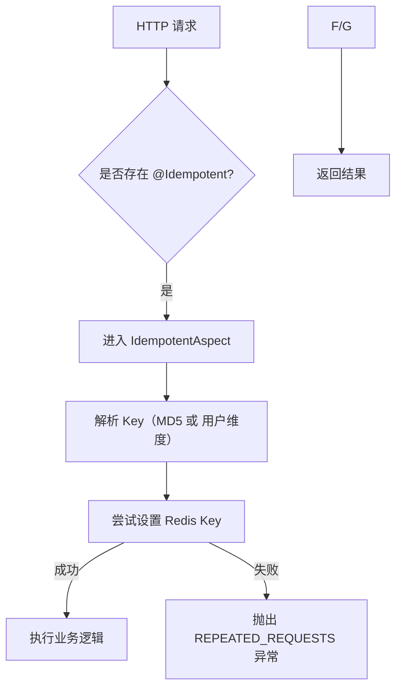
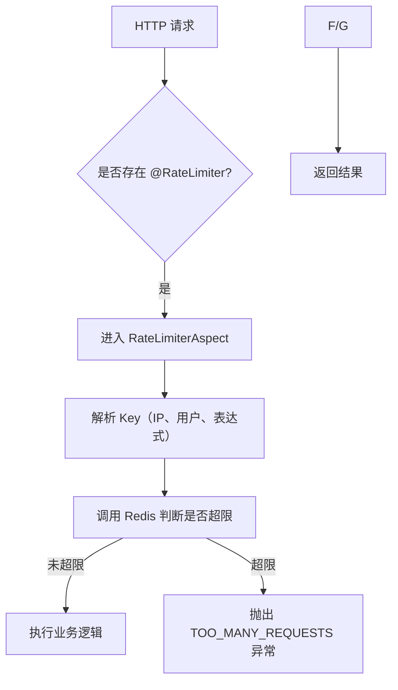
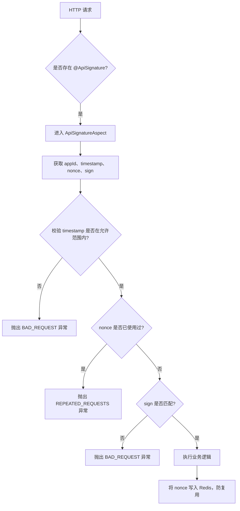

`pei-spring-boot-starter-protection` 是一个 **服务保障模块**，其核心作用是为微服务提供 **幂等、限流、分布式锁、API 签名验证** 等关键能力。该模块基于 Spring AOP + Redis 实现了对 HTTP 请求和业务方法的增强，确保系统在高并发、分布式环境下具备稳定性与安全性。

---

## 一、模块概述

### ✅ 模块定位
- **目标**：封装服务保障组件，包括：
    - 幂等（Idempotent）：防止重复请求
    - 限流（RateLimiter）：控制单位时间内的请求频率
    - 分布式锁（Lock4j）：保证同一时刻只有一个线程/节点执行某段逻辑
    - API 签名（Signature）：防止接口篡改，提升安全性
- **应用场景**：
    - 防止用户快速点击按钮导致重复下单。
    - 控制高频访问接口的请求速率（如登录、支付回调）。
    - 多节点部署时，限制某些操作只能被一个节点执行。
    - 对外开放的 API 接口进行签名验证，防止数据篡改。
- **技术栈依赖**：
    - Spring Boot AOP（切面处理）
    - Redisson（Redis 客户端）
    - Hutool（工具类）
    - Lock4j（分布式锁框架）
    - SpEL（Spring Expression Language）

---

## 二、目录结构说明

```
src/main/java/
└── com/pei/dehaze/framework/
    ├── idempotent/         // 幂等支持
    │   ├── config/         // 自动配置类
    │   ├── core/
    │   │   ├── annotation/ // @Idempotent 注解定义
    │   │   ├── aop/        // 幂等切面逻辑
    │   │   ├── keyresolver/ // Key 解析器（MD5、表达式、用户维度等）
    │   │   └── redis/      // 使用 Redis 缓存幂等 Key
    │   └── package-info.java
    ├── lock4j/             // 分布式锁支持
    │   ├── config/         // 自动配置类
    │   └── core/
    │       ├── DefaultLockFailureStrategy.java // 锁失败策略
    │       └── Lock4jRedisKeyConstants.java  // Redis Key 常量
    ├── ratelimiter/        // 限流支持
    │   ├── config/         // 自动配置类
    │   ├── core/
    │   │   ├── annotation/ // @RateLimiter 注解定义
    │   │   ├── aop/        // 限流切面逻辑
    │   │   ├── keyresolver/ // Key 解析器（全局、IP、用户、表达式）
    │   │   └── redis/      // 使用 Redis 记录请求次数
    │   └── package-info.java
    └── signature/          // API 签名验证
        ├── config/         // 自动配置类
        └── core/
            ├── annotation/ // @ApiSignature 注解定义
            ├── aop/        // 签名验证切面逻辑
            └── redis/      // 使用 Redis 存储 appId 和 appSecret 映射
```


---

## 三、关键包详解

### 1️⃣ `idempotent` 包 —— 幂等性保障

#### 🔹 `@Idempotent` 注解
```java
@Target({ElementType.METHOD})
@Retention(RetentionPolicy.RUNTIME)
public @interface Idempotent {
    int timeout() default 1;
    TimeUnit timeUnit() default TimeUnit.SECONDS;
    String message() default "重复请求，请稍后重试";
    Class<? extends IdempotentKeyResolver> keyResolver() default DefaultIdempotentKeyResolver.class;
    boolean deleteKeyWhenException() default true;
}
```

- **作用**：用于标记某个方法需要幂等保护。
- **使用方式**：
  ```java
  @PostMapping("/order/create")
  @Idempotent(message = "请勿重复提交订单")
  public CommonResult<String> createOrder(@RequestBody OrderCreateDTO dto) {
      // 创建订单逻辑
  }
  ```


#### 🔹 `IdempotentAspect` 切面逻辑
```java
@Around(value = "@annotation(idempotent)")
public Object aroundPointCut(ProceedingJoinPoint joinPoint, Idempotent idempotent) throws Throwable {
    String key = resolver.resolver(joinPoint, idempotent);
    boolean success = idempotentRedisDAO.setIfAbsent(key, idempotent.timeout(), idempotent.timeUnit());
    if (!success) {
        throw new ServiceException(GlobalErrorCodeConstants.REPEATED_REQUESTS.getCode(), idempotent.message());
    }

    try {
        return joinPoint.proceed();
    } catch (Throwable throwable) {
        if (idempotent.deleteKeyWhenException()) {
            idempotentRedisDAO.delete(key);
        }
        throw throwable;
    }
}
```

- **作用**：AOP 切面拦截带有 `@Idempotent` 的方法。
- **实现原理**：
    - 根据 `keyResolver` 解析出唯一的 Key。
    - 使用 Redis 设置临时 Key，保证相同请求不会重复执行。
    - 执行完成后自动删除 Key（可选）或异常时删除 Key。

#### 🔹 `IdempotentKeyResolver` 接口及其实现类
```java
public interface IdempotentKeyResolver {
    String resolver(JoinPoint joinPoint, Idempotent idempotent);
}
```

- **实现类**：
    - `DefaultIdempotentKeyResolver`：默认使用方法名 + 参数生成 MD5。
    - `UserIdempotentKeyResolver`：加上当前用户 ID 构造 Key。
    - `ExpressionIdempotentKeyResolver`：通过 SpEL 表达式构造 Key。

#### 🔹 `IdempotentRedisDAO` 类
```java
public Boolean setIfAbsent(String key, long timeout, TimeUnit timeUnit) {
    String redisKey = formatKey(key);
    return redisTemplate.opsForValue().setIfAbsent(redisKey, "", timeout, timeUnit);
}
```

- **作用**：基于 Redis 的幂等缓存操作。
- **流程**：
    - 设置 Key（带过期时间），如果已存在则返回 false。
    - 异常时删除 Key，避免阻塞后续请求。

---

### 2️⃣ `lock4j` 包 —— 分布式锁支持

#### 🔹 `PeiLock4jConfiguration` 自动配置类
```java
@Bean
public DefaultLockFailureStrategy lockFailureStrategy() {
    return new DefaultLockFailureStrategy();
}
```

- **作用**：自定义获取锁失败策略，抛出 `ServiceException`。
- **集成 Lock4j**：基于 Redisson 提供分布式锁支持。

#### 🔹 `DefaultLockFailureStrategy` 获取锁失败策略
```java
@Override
public void onLockFailure(String key, Method method, Object[] arguments) {
    log.debug("[onLockFailure][线程:{} 获取锁失败，key:{}]", Thread.currentThread().getName(), key);
    throw new ServiceException(GlobalErrorCodeConstants.LOCKED);
}
```

- **作用**：当多个线程同时竞争同一个锁失败时，抛出统一异常提示。
- **优势**：避免直接返回 LockTimeoutException，统一异常格式。

#### 🔹 `Lock4jRedisKeyConstants` Redis Key 常量
```java
String LOCK4J = "lock4j:%s";
```

- **作用**：定义 Redis Key 前缀，便于监控和排查。

---

### 3️⃣ `ratelimiter` 包 —— 请求限流支持

#### 🔹 `@RateLimiter` 注解
```java
@Target({ElementType.METHOD})
@Retention(RetentionPolicy.RUNTIME)
public @interface RateLimiter {
    int time() default 1;
    TimeUnit timeUnit() default TimeUnit.SECONDS;
    int count() default 100;
    Class<? extends RateLimiterKeyResolver> keyResolver() default DefaultRateLimiterKeyResolver.class;
    String keyArg() default "";
}
```

- **作用**：用于标记某个方法需要限流。
- **使用方式**：
  ```java
  @GetMapping("/user/info")
  @RateLimiter(time = 1, count = 5, keyResolver = UserRateLimiterKeyResolver.class)
  public CommonResult<UserDTO> getUserInfo() {
      // 返回用户信息
  }
  ```


#### 🔹 `RateLimiterAspect` 切面逻辑
```java
@Before("@annotation(rateLimiter)")
public void beforePointCut(JoinPoint joinPoint, RateLimiter rateLimiter) {
    String key = keyResolver.resolver(joinPoint, rateLimiter);
    boolean success = rateLimiterRedisDAO.tryAcquire(key,
            rateLimiter.count(), rateLimiter.time(), rateLimiter.timeUnit());
    if (!success) {
        throw new ServiceException(GlobalErrorCodeConstants.TOO_MANY_REQUESTS.getCode(), rateLimiter.message());
    }
}
```

- **作用**：AOP 切面拦截并判断是否超过限流阈值。
- **流程**：
    1. 解析 Key（根据注解参数或用户 IP、ID 等）
    2. 调用 Redis 判断是否允许请求
    3. 超限时抛出 `TOO_MANY_REQUESTS` 异常

#### 🔹 `RateLimiterRedisDAO` 类
```java
public Boolean tryAcquire(String key, int count, int time, TimeUnit timeUnit) {
    RRateLimiter rateLimiter = getRRateLimiter(key, count, time, timeUnit);
    return rateLimiter.tryAcquire();
}
```

- **作用**：基于 Redisson 的 `RRateLimiter` 实现滑动窗口限流。
- **优势**：支持不同粒度的限流（用户级、IP级、接口级等）

---

### 4️⃣ `signature` 包 —— API 签名验证

#### 🔹 `@ApiSignature` 注解
```java
@Inherited
@Documented
@Target({ElementType.METHOD, ElementType.TYPE})
@Retention(RetentionPolicy.RUNTIME)
public @interface ApiSignature {
    int timeout() default 60;
    TimeUnit timeUnit() default TimeUnit.SECONDS;
    String message() default "签名不正确";
    String appId() default "appId";
    String timestamp() default "timestamp";
    String nonce() default "nonce"; // 10位以上随机数
    String sign() default "sign";
}
```

- **作用**：用于对外暴露的 API 接口进行签名校验。
- **使用方式**：
  ```java
  @PostMapping("/pay")
  @ApiSignature(appId = "x-app-id", timestamp = "x-timestamp", nonce = "x-nonce", sign = "x-sign")
  public CommonResult<PayResponse> pay(@RequestBody PayRequest request) {
      // 支付逻辑
  }
  ```


#### 🔹 `ApiSignatureAspect` 切面逻辑
```java
@Before("@annotation(signature)")
public void beforePointCut(JoinPoint joinPoint, ApiSignature signature) {
    if (!verifySignature(signature, Objects.requireNonNull(ServletUtils.getRequest()))) {
        throw new ServiceException(BAD_REQUEST.getCode(), signature.message());
    }
}
```

- **作用**：拦截所有带有 `@ApiSignature` 的方法，验证请求头中的签名。
- **流程**：
    1. 获取 appId、timestamp、nonce、sign 四个 Header 字段。
    2. 校验 timestamp 是否在允许的时间范围内（默认 ±60s）
    3. 校验 nonce 是否已经使用过。
    4. 使用 SHA256Hex 重新计算签名并与客户端签名对比。
    5. 如果一致，则继续执行；否则抛出 `BAD_REQUEST`

#### 🔹 `ApiSignatureRedisDAO` 类
```java
public String getAppSecret(String appId) {
    return (String) stringRedisTemplate.opsForHash().get(SIGNATURE_APPID, appId);
}

public Boolean setNonce(String appId, String nonce, int time, TimeUnit timeUnit) {
    return stringRedisTemplate.opsForValue().setIfAbsent(formatNonceKey(appId, nonce), "", time, timeUnit);
}
```

- **作用**：存储 App Secret，并记录 nonce 防止重复使用。
- **Redis 结构**：
    - `api_signature_app`: Hash，存储 appId → secret 映射。
    - `api_signature_nonce:appId:nonce`: String，记录使用的 nonce，防止重复调用。

---

## 四、模块功能总结

| 包名 | 功能 | 关键类 |
|------|------|--------|
| `idempotent.config` | 幂等自动配置 | `PeiIdempotentConfiguration` |
| `idempotent.core.annotation` | 幂等注解定义 | `Idempotent.java` |
| `idempotent.core.aop` | 幂等切面逻辑 | `IdempotentAspect.java` |
| `idempotent.core.keyresolver.impl` | Key 解析器实现 | `DefaultIdempotentKeyResolver`, `UserIdempotentKeyResolver` |
| `idempotent.core.redis` | Redis 数据访问 | `IdempotentRedisDAO` |

| `lock4j.config` | 分布式锁自动配置 | `PeiLock4jConfiguration` |
| `lock4j.core` | 分布式锁逻辑 | `DefaultLockFailureStrategy`, `Lock4jRedisKeyConstants` |

| `ratelimiter.config` | 限流自动配置 | `PeiRateLimiterConfiguration` |
| `ratelimiter.core.annotation` | 限流注解定义 | `RateLimiter.java` |
| `ratelimiter.core.aop` | 限流切面逻辑 | `RateLimiterAspect.java` |
| `ratelimiter.core.keyresolver.impl` | Key 解析器实现 | `UserRateLimiterKeyResolver`, `ClientIpRateLimiterKeyResolver` |
| `ratelimiter.core.redis` | 限流 Redis DAO | `RateLimiterRedisDAO` |

| `signature.config` | API 签名自动配置 | `PeiApiSignatureAutoConfiguration` |
| `signature.core.annotation` | 筃 义 | `ApiSignature.java` |
| `signature.core.aop` | 签名验证切面逻辑 | `ApiSignatureAspect.java` |
| `signature.core.redis` | 签名 Redis DAO | `ApiSignatureRedisDAO.java` |

---

## 五、模块工作流程图解

### 1️⃣ 幂等机制流程



### 2️⃣ 限流机制流程



### 3️⃣ API 签名验证流程



---

## 六、模块使用示例

### 1️⃣ 幂等使用示例
```java
@PostMapping("/submit")
@Idempotent(message = "请勿重复提交", timeout = 5, timeUnit = TimeUnit.SECONDS)
public CommonResult<Void> submit(@RequestBody SubmitForm form) {
    // 提交逻辑
}
```


### 2️⃣ 限流使用示例
```java
@GetMapping("/login")
@RateLimiter(count = 5, time = 1, keyResolver = ClientIpRateLimiterKeyResolver.class)
public CommonResult<UserDTO> login() {
    // 登录逻辑
}
```


### 3️⃣ 分布式锁使用示例
```java
@Lock4j(keys = "#userId", expire = 3, renewExpire = false)
public void updateUserInfo(Long userId) {
    // 更新逻辑
}
```


### 4️⃣ API 签名使用示例
```java
@PostMapping("/transfer")
@ApiSignature(timeout = 60, appId = "x-app-id", timestamp = "x-timestamp", nonce = "x-nonce", sign = "x-sign")
public CommonResult<TransferResponse> transfer(@RequestBody TransferRequest req) {
    // 转账逻辑
}
```


---

## 七、模块实现原理详解

### 1️⃣ 幂等性实现
- **原理**：使用 Redis 的 `setIfAbsent` 实现幂等 Key 控制。
- **Key 生成策略**：
    - 默认：方法名 + 方法参数
    - 用户级别：方法名 + 方法参数 + 用户 ID
    - 表达式：通过 SpEL 表达式动态生成
- **Key 过期时间**：由注解指定，默认 1 秒，避免 Key 持久化。

### 2️⃣ 限流实现
- **原理**：基于 Redisson 的 `RRateLimiter` 实现令牌桶限流。
- **Key 生成策略**：
    - 全局级别：方法名 + 方法参数
    - 用户级别：方法名 + 方法参数 + 用户 ID
    - IP 级别：方法名 + 方法参数 + IP 地址
- **限流策略**：每秒最多 N 次请求，超出则抛出 `TOO_MANY_REQUESTS` 异常。

### 3️⃣ 分布式锁实现
- **原理**：基于 Lock4j + Redisson 实现分布式锁。
- **锁类型**：支持 ReentrantLock、FairLock、MultiLock、RedLock、ReadLock、WriteLock。
- **锁失效策略**：支持自动续租和手动释放。

### 4️⃣ API 签名验证实现
- **签名算法**：SHA256Hex(请求参数 + 请求体 + 请求头 + appSecret)
- **Header 必须字段**：`x-app-id`, `x-timestamp`, `x-nonce`, `x-sign`
- **时间戳容忍范围**：±60 秒
- **nonce 防重放攻击**：每个 nonce 只能使用一次，且有效期为 timeout × 2

---

## 八、典型配置示例

### 1️⃣ application.yaml 示例
```yaml
spring:
  redis:
    host: localhost
    port: 6379
```


### 2️⃣ 幂等配置示例
```java
@Idempotent(timeout = 3, timeUnit = TimeUnit.SECONDS, keyResolver = UserIdempotentKeyResolver.class)
```


### 3️⃣ 限流配置示例
```java
@RateLimiter(count = 5, time = 1, keyResolver = ClientIpRateLimiterKeyResolver.class)
```


### 4️⃣ 签名配置示例
```java
@ApiSignature(appId = "x-app-id", timestamp = "x-timestamp", nonce = "x-nonce", sign = "x-sign")
```


---

## 九、建议改进方向

| 改进点 | 描述 |
|--------|------|
| ✅ 单元测试覆盖率 | 当前仅签名部分有单元测试，建议补充幂等、限流、锁的测试代码 |
| ✅ 配置中心集成 | 将 `xxl.job`、`rate.limiter` 等配置放入 Nacos/Apollo，实现动态更新 |
| ✅ 自定义 Key 生成策略 | 支持用户自定义 KeyResolver，提升扩展性 |
| ✅ 限流熔断策略 | 当限流触发时，可跳转到 fallback 页面或返回统一限流响应 |
| ✅ 限流日志记录 | 在限流拦截时记录日志，便于分析高频请求来源 |

---

## 十、总结

`pei-spring-boot-starter-protection` 模块实现了以下四大核心功能：

| 功能 | 技术实现 | 用途 |
|------|-----------|------|
| 幂等 | Redis + AOP | 防止重复请求 |
| 限流 | Redisson RRateLimiter | 控制接口请求频率 |
| 分布式锁 | Lock4j + Redisson | 多节点同步访问资源 |
| API 签名 | Redis + SHA256Hex + AOP | 防止接口篡改 |

它是一个轻量但功能强大的服务保障模块，适用于电商、金融、API 网关等多种场景。如果你有具体某个类（如 `IdempotentAspect`、`ApiSignatureAspect`）想要深入了解，欢迎继续提问！
