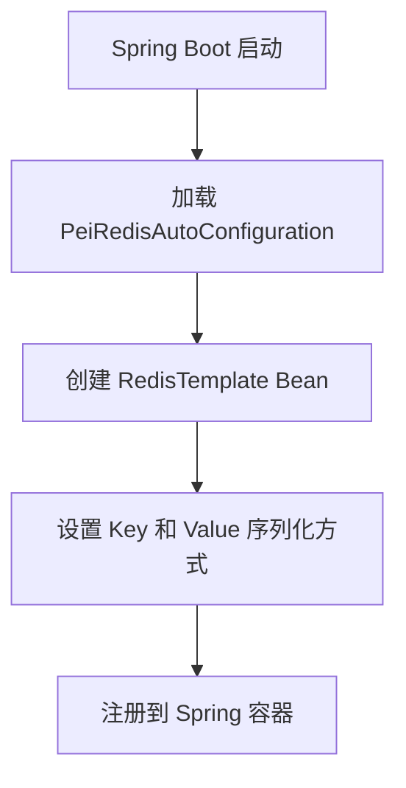
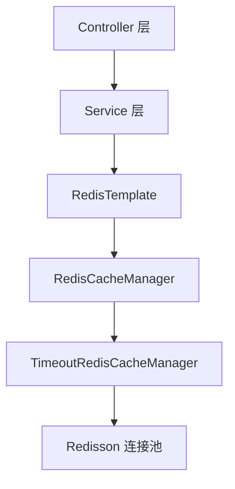

`pei-spring-boot-starter-redis` 是一个 **Redis 封装拓展模块（Redis Extension Module）**，其核心作用是为企业级应用提供统一的 Redis 集成能力。该模块基于 `Spring Data Redis + Redisson` 实现高性能缓存管理，并支持以下功能：

- Redis 缓存 Key 自定义前缀
- Redis 缓存自动序列化/反序列化（Jackson JSON）
- 支持自定义过期时间（通过 `@Cacheable("cacheName#10s")` 语法）
- 多租户隔离支持（可选）

---

## ✅ 模块概述

### 🎯 模块定位
- **目标**：构建统一的 Redis 缓存封装层，支持：
    - 统一的缓存 Key 管理
    - 自动设置缓存过期时间
    - 多租户缓存隔离（与 `pei-spring-boot-starter-biz-tenant` 配合使用）
- **应用场景**：
    - 用户登录 Token 缓存
    - 接口访问频率限制（如限流、验证码等）
    - 数据字典、地区信息、菜单权限等高频读取数据

### 🧩 技术栈依赖
- **Spring Boot + Spring Data Redis**
- **客户端**：
    - 使用 Redisson 提供连接池和分布式锁
- **序列化**：
    - 使用 Jackson JSON 序列化，支持 LocalDateTime
- **多租户**：
    - 可配合 `TenantContextHolder` 实现缓存隔离

---

## 📁 目录结构说明

```
src/main/java/
└── com/pei/dehaze/framework/redis/
    ├── config/                  // Redis 缓存配置类
    │   ├── PeiRedisAutoConfiguration.java  // RedisTemplate 配置
    │   └── PeiCacheAutoConfiguration.java  // CacheManager 配置
    │   └── PeiCacheProperties.java         // 缓存配置属性
    └── core/                    // 核心逻辑实现
        └── TimeoutRedisCacheManager.java   // 支持自定义过期时间的 CacheManager
```


---

## 🔍 关键包详解

### 1️⃣ `config` 包 —— Redis 缓存配置加载

#### 示例：`PeiCacheProperties.java`
```java
@ConfigurationProperties("pei.cache")
@Data
@Validated
public class PeiCacheProperties {

    private static final Integer REDIS_SCAN_BATCH_SIZE_DEFAULT = 30;

    private final Integer redisScanBatchSize = REDIS_SCAN_BATCH_SIZE_DEFAULT;

}
```


- **作用**：从 `application.yaml` 中读取缓存相关配置。
- **字段说明**：
    - `redisScanBatchSize`: Redis Scan 命令一次返回数量
- **用途**：
    - 控制 Redis 批量操作性能
    - 用于 `TimeoutRedisCacheManager` 的构造参数

---

### 2️⃣ `PeiRedisAutoConfiguration` 类 —— RedisTemplate 配置

#### 示例：`PeiRedisAutoConfiguration.java`
```java
@Bean
public RedisTemplate<String, Object> redisTemplate(RedisConnectionFactory factory) {
    RedisTemplate<String, Object> template = new RedisTemplate<>();
    template.setConnectionFactory(factory);
    template.setKeySerializer(RedisSerializer.string());
    template.setHashKeySerializer(RedisSerializer.string());
    template.setValueSerializer(buildRedisSerializer());
    template.setHashValueSerializer(buildRedisSerializer());
    return template;
}

public static RedisSerializer<?> buildRedisSerializer() {
    RedisSerializer<Object> json = RedisSerializer.json();
    ObjectMapper objectMapper = (ObjectMapper) ReflectUtil.getFieldValue(json, "mapper");
    objectMapper.registerModules(new JavaTimeModule());
    return json;
}
```


- **作用**：配置 `RedisTemplate`，实现对 Redis 的基础访问。
- **关键逻辑**：
    - 使用 `String` 序列化 KEY
    - 使用 `JSON` 序列化 VALUE（支持 LocalDateTime）
- **设计模式**：
    - 工厂模式（创建 RedisTemplate Bean）
    - 模板方法模式（统一序列化处理）

---

### 3️⃣ `PeiCacheAutoConfiguration` 类 —— CacheManager 配置

#### 示例：`PeiCacheAutoConfiguration.java`
```java
@Bean
@Primary
public RedisCacheConfiguration redisCacheConfiguration(CacheProperties cacheProperties) {
    RedisCacheConfiguration config = RedisCacheConfiguration.defaultCacheConfig();
    config = config.computePrefixWith(cacheName -> {
        String keyPrefix = cacheProperties.getRedis().getKeyPrefix();
        if (StringUtils.hasText(keyPrefix)) {
            keyPrefix = keyPrefix.lastIndexOf(StrUtil.COLON) == -1 ? keyPrefix + StrUtil.COLON : keyPrefix;
            return keyPrefix + cacheName + StrUtil.COLON;
        }
        return cacheName + StrUtil.COLON;
    });
    config = config.serializeValuesWith(
            RedisSerializationContext.SerializationPair.fromSerializer(buildRedisSerializer()));
    return config;
}

@Bean
public RedisCacheManager redisCacheManager(RedisTemplate<String, Object> redisTemplate,
                                          RedisCacheConfiguration redisCacheConfiguration,
                                          PeiCacheProperties peiCacheProperties) {
    RedisConnectionFactory connectionFactory = Objects.requireNonNull(redisTemplate.getConnectionFactory());
    RedisCacheWriter cacheWriter = RedisCacheWriter.nonLockingRedisCacheWriter(connectionFactory,
            BatchStrategies.scan(peiCacheProperties.getRedisScanBatchSize()));
    return new TimeoutRedisCacheManager(cacheWriter, redisCacheConfiguration);
}
```


- **作用**：配置 `RedisCacheManager`，实现缓存的统一管理。
- **关键逻辑**：
    - 设置默认 Key 前缀格式为 `prefix:name:`
    - 使用 JSON 序列化方式存储对象
    - 支持批量删除优化（通过 `scan`）
- **事务控制**：
    - 使用 `@Transactional` 保证缓存更新一致性

---

### 4️⃣ `TimeoutRedisCacheManager` 类 —— 支持自定义过期时间的 CacheManager

#### 示例：`TimeoutRedisCacheManager.java`
```java
@Override
private RedisCache createRedisCache(String name, RedisCacheConfiguration cacheConfig) {
    if (StrUtil.isEmpty(name)) {
        return super.createRedisCache(name, cacheConfig);
    }

    String[] names = StrUtil.splitToArray(name, SPLIT);
    if (names.length != 2) {
        return super.createRedisCache(name, cacheConfig);
    }

    String ttlStr = StrUtil.subBefore(names[1], StrUtil.COLON, false);
    Duration duration = parseDuration(ttlStr);
    cacheConfig = cacheConfig.entryTtl(duration);

    return super.createRedisCache(names[0] + names[1], cacheConfig);
}

private Duration parseDuration(String ttlStr) {
    String timeUnit = StrUtil.subSuf(ttlStr, -1);
    switch (timeUnit) {
        case "d": return Duration.ofDays(removeDurationSuffix(ttlStr));
        case "h": return Duration.ofHours(removeDurationSuffix(ttlStr));
        case "m": return Duration.ofMinutes(removeDurationSuffix(ttlStr));
        case "s": return Duration.ofSeconds(removeDurationSuffix(ttlStr));
        default: return Duration.ofSeconds(Long.parseLong(ttlStr));
    }
}
```


- **作用**：扩展 `RedisCacheManager`，支持 `@Cacheable("name#10s")` 语法。
- **关键逻辑**：
    - 如果缓存名称中包含 `#`，则解析为过期时间
    - 支持单位：`d`（天）、`h`（小时）、`m`（分钟）、`s`（秒）
- **示例用法**：
  ```java
  @Cacheable("user#60s")
  public User getUser(Long id) {
      return userRepository.findById(id).orElse(null);
  }
  ```


---

## 🧠 模块工作流程图解

### 1️⃣ Redis 缓存初始化流程



### 2️⃣ 自定义过期时间流程
```mermaid
graph TD
    A[@Cacheable("user#60s")] --> B[调用 TimeoutRedisCacheManager.createRedisCache(...)]
    B --> C[解析 user#60s 为 user + 60 秒]
    C --> D[创建 RedisCache 对象并设置 TTL]
    D --> E[执行缓存读写操作]
```


---

## 🧱 模块间关系图




---

## 🧩 模块功能总结

| 包名 | 功能 | 关键类 |
|------|------|--------|
| `config` | 缓存配置加载 | `PeiCacheProperties` |
| `config` | RedisTemplate 配置 | `PeiRedisAutoConfiguration` |
| `config` | CacheManager 配置 | `PeiCacheAutoConfiguration` |
| `core` | 自定义过期时间 | `TimeoutRedisCacheManager` |

---

## 🧾 模块实现原理详解

### 1️⃣ Redis 缓存初始化流程
- **步骤**：
    1. Spring Boot 启动时加载 `PeiRedisAutoConfiguration`
    2. 创建 `RedisTemplate<String, Object>` Bean
    3. 设置 Key 序列化为 `String`
    4. 设置 Value 序列化为 `Jackson JSON`
    5. 注册 `TimeoutRedisCacheManager` 作为主缓存管理器

### 2️⃣ 自定义过期时间实现流程
- **步骤**：
    1. 使用 `@Cacheable("name#10s")` 注解标记缓存方法
    2. 调用 `TimeoutRedisCacheManager.createRedisCache(...)` 方法
    3. 解析 `name#10s` → 分割为 `name` 和 `10s`
    4. 设置 `RedisCacheConfiguration.entryTtl(...)` 时间
    5. 返回带过期时间的 `RedisCache` 实例

---

## ✅ 建议改进方向

| 改进点 | 描述 |
|--------|------|
| ✅ 异常日志增强 | 在序列化失败时记录详细日志，便于排查问题 |
| ✅ 性能优化 | 使用 Redis Pipeline 提升缓存批量操作效率 |
| ✅ 单元测试 | 当前代码未提供单元测试，建议补充测试用例 |
| ✅ 多租户增强 | 结合 `TenantContextHolder` 实现缓存 Key 拼接租户 ID |
| ✅ 分布式锁支持 | 增加 `RedissonDistributedLock` 工具类封装 |

---

## 📌 总结

`pei-spring-boot-starter-redis` 模块实现了以下核心功能：

| 功能 | 技术实现 | 用途 |
|------|-----------|------|
| Redis 缓存配置 | PeiRedisAutoConfiguration | 统一 RedisTemplate 配置 |
| JSON 序列化 | Jackson + JavaTimeModule | 支持 LocalDateTime 类型 |
| 自定义过期时间 | TimeoutRedisCacheManager | 通过 `@Cacheable("key#10s")` 设置缓存时间 |
| 缓存 Key 前缀 | PeiCacheAutoConfiguration | 设置 `prefix:key:` 形式的缓存 Key |
| 批量扫描支持 | BatchStrategies.scan(...) | 提升 scan 命令性能 |
| 多租户隔离 | TenantUtils.executeIgnore(...) | 忽略某些缓存的租户隔离 |

它是一个轻量但功能完整的 Redis 模块，适用于电商、社交、CRM、ERP、AI 等需要缓存能力的场景。

如果你有具体某个类（如 `RedisTemplate`、`TimeoutRedisCacheManager`）想要深入了解，欢迎继续提问！
