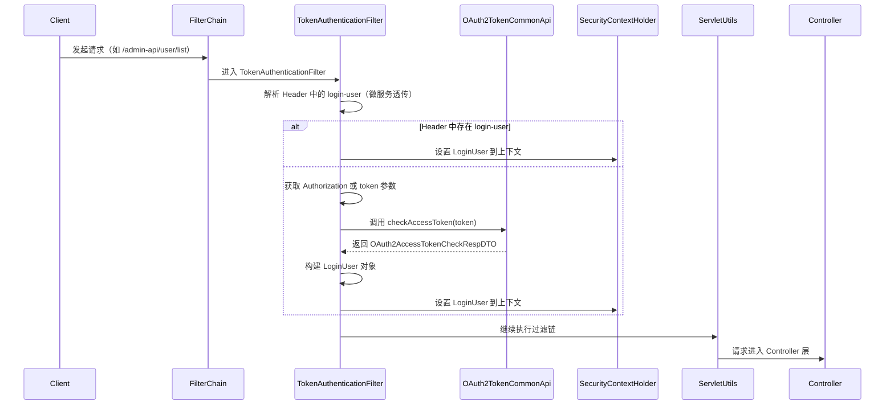
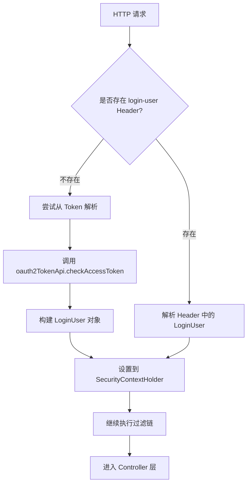
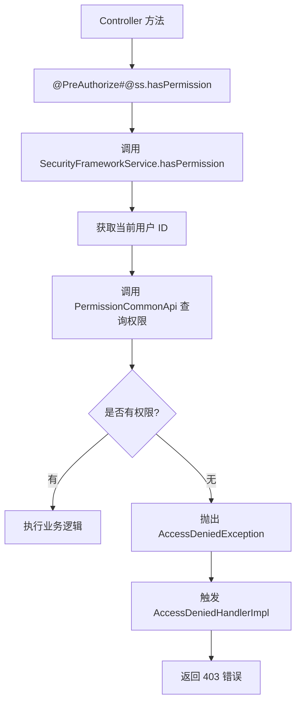
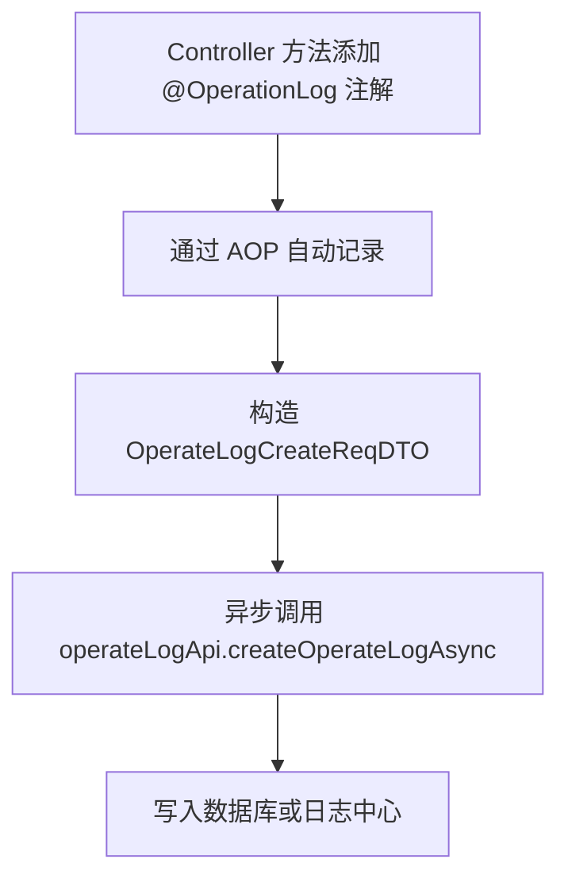
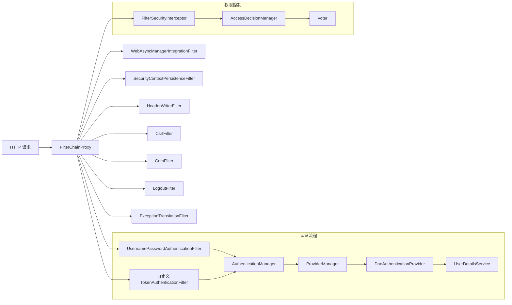

`pei-spring-boot-starter-security` 是一个 **安全认证与权限控制模块（Security & Permission Module）**
，其核心作用是为企业级应用提供统一的用户认证、权限校验和操作日志记录能力。该模块基于 `Spring Security + OAuth2 + Token`
实现灵活的身份验证机制，并支持以下功能：

- 基于 Token 的无状态认证（JWT）
- 用户类型区分（如管理员、普通用户、第三方服务等）
- 权限控制（RBAC 模型）
- 操作日志自动记录
- 多租户访问隔离（结合 TenantContextHolder）
- Feign RPC 调用透传用户信息

---

## ✅ 模块概述

### 🎯 模块定位

- **目标**：构建统一的安全认证支撑平台，支持：
    - 用户登录状态识别
    - 功能权限校验（如 `/user/create` 是否允许访问）
    - 数据权限控制（如只能查看自己部门的数据）
    - 操作日志记录（谁在什么时间对什么数据做了修改）
- **应用场景**：
    - 管理后台 API 安全控制
    - 用户 APP 接口权限管理
    - 微服务间用户身份透传（Feign）

### 🧩 技术栈依赖

- **Spring Boot 3.4 + Spring Security**
- **认证方式**：
    - OAuth2 Token 认证
    - Mock 模式用于开发调试
- **权限控制**：
    - 基于 RBAC 模型
    - 支持缓存优化性能（Guava Cache）
- **操作日志**：
    - 使用 `mzt-log` 开源框架实现注解驱动的日志记录

---

## 📁 目录结构说明

```
src/main/java/
└── com/pei/dehaze/framework/security/
    ├── config/                  // 安全配置类
    │   ├── PeiSecurityAutoConfiguration.java
    │   ├── PeiWebSecurityConfigurerAdapter.java
    │   └── SecurityProperties.java
    ├── core/                    // 核心逻辑实现
    │   ├── context/             // 安全上下文策略
    │   ├── filter/              // Token 过滤器
    │   ├── handler/             // 异常处理器（无权限、未登录）
    │   ├── rpc/                 // Feign 请求拦截器
    │   ├── service/             // 权限校验服务接口
    │   ├── util/                // 工具类封装
    │   ├── LoginUser.java       // 登录用户实体
    │   └── package-info.java    // 模块描述文档
    └── operatelog/              // 操作日志模块
        ├── config/              // 操作日志自动配置
        └── core/
            └── service/         // 日志记录服务
```

---

## 🔍 关键包详解

### 1️⃣ `config` 包 —— 安全配置加载

#### 示例：`SecurityProperties.java`

```java

@ConfigurationProperties("pei.security")
@Validated
@Data
public class SecurityProperties {

    private final String tokenHeader = "Authorization";
    private final String tokenParameter = "token";

    private final Boolean mockEnable = false;
    private final String mockSecret = "test";

    private final List<String> permitAllUrls = Collections.emptyList();

    private final Integer passwordEncoderLength = 4;

}
```

- **作用**：从 `application.yaml` 中读取安全相关配置。
- **字段说明**：
    - `tokenHeader`: HTTP Header 中携带 Token 的字段名（默认为 `Authorization`）
    - `tokenParameter`: URL 参数中携带 Token 的字段名（用于 WebSocket 场景）
    - `mockEnable`: 是否开启模拟登录模式（开发环境使用）
    - `permitAllUrls`: 免认证的 URL 列表
- **用途**：
    - 控制哪些接口可以匿名访问
    - 设置加密强度（BCryptPasswordEncoder）

---

### 2️⃣ `core.filter` 包 —— Token 认证过滤器

#### 示例：`TokenAuthenticationFilter.java`

```java

@Override
private void doFilterInternal(HttpServletRequest request, HttpServletResponse response, FilterChain chain)
        throws ServletException, IOException {
    LoginUser loginUser = buildLoginUserByHeader(request);
    if (loginUser == null) {
        String token = SecurityFrameworkUtils.obtainAuthorization(request, securityProperties.getTokenHeader(), securityProperties.getTokenParameter());
        if (StrUtil.isNotEmpty(token)) {
            Integer userType = WebFrameworkUtils.getLoginUserType(request);
            loginUser = buildLoginUserByToken(token, userType);
        }
    }

    if (loginUser != null) {
        SecurityFrameworkUtils.setLoginUser(loginUser, request);
    }
    chain.doFilter(request, response);
}
```

- **作用**：处理 Token 认证并设置当前登录用户。
- **关键逻辑**：
    - 优先从 Header 获取用户信息（用于微服务间调用）
    - 如果不存在，则从 Token 解析用户
    - 设置到 Spring Security 上下文中供后续使用
- **设计模式**：
    - 过滤器链模式
    - 模板方法模式（统一 Token 解析流程）

---

### 3️⃣ `core.handler` 包 —— 权限异常处理

#### 示例：`AccessDeniedHandlerImpl.java`

```java

@Override
public void handle(HttpServletRequest request, HttpServletResponse response, AccessDeniedException e)
        throws IOException, ServletException {
    log.warn("[commence][访问 URL({}) 时，用户({}) 权限不够]", request.getRequestURI(),
            SecurityFrameworkUtils.getLoginUserId(), e);
    ServletUtils.writeJSON(response, CommonResult.error(FORBIDDEN));
}
```

- **作用**：处理权限不足的情况。
- **关键逻辑**：
    - 返回 `CommonResult.error(403)`
    - 记录日志用于审计
- **优势**：
    - 统一权限拒绝响应格式
    - 提供日志追踪

---

#### 示例：`AuthenticationEntryPointImpl.java`

```java

@Override
public void commence(HttpServletRequest request, HttpServletResponse response, AuthenticationException e) {
    log.debug("[commence][访问 URL({}) 时，没有登录]", request.getRequestURI(), e);
    ServletUtils.writeJSON(response, CommonResult.error(UNAUTHORIZED));
}
```

- **作用**：处理未登录情况下的访问请求。
- **关键逻辑**：
    - 返回 `CommonResult.error(401)`
    - 用于引导前端跳转至登录页
- **适用场景**：
    - 用户未携带 Token 或 Token 失效

---

### 4️⃣ `core.service` 包 —— 权限校验服务

#### 示例：`SecurityFrameworkServiceImpl.java`

```java

@Override
public boolean hasPermission(String permission) {
    return hasAnyPermissions(permission);
}

@Override
public boolean hasAnyPermissions(String... permissions) {
    if (skipPermissionCheck()) {
        return true; // 跨租户时跳过权限检查
    }
    Long userId = getLoginUserId();
    if (userId == null) {
        return false;
    }
    return hasAnyPermissionsCache.get(new KeyValue<>(userId, Arrays.asList(permissions)));
}
```

- **作用**：实现权限校验逻辑。
- **关键逻辑**：
    - 支持角色、权限、授权范围三种校验方式
    - 缓存权限结果提升性能（Guava Cache）
    - 支持跨租户访问跳过权限校验
- **使用方式**：
  ```java
  @PreAuthorize("@ss.hasPermission('system:user:create')")
  public User createUser(UserCreateReqVO reqVO) { ... }
  ```

---

### 5️⃣ `core.util` 包 —— 安全工具类封装

#### 示例：`SecurityFrameworkUtils.java`

```java
public static LoginUser getLoginUser() {
    Authentication authentication = getAuthentication();
    if (authentication == null) {
        return null;
    }
    return authentication.getPrincipal() instanceof LoginUser ? (LoginUser) authentication.getPrincipal() : null;
}
```

- **作用**：封装安全相关的通用工具方法。
- **关键逻辑**：
    - 获取当前登录用户信息
    - 构建认证对象
    - 判断是否跳过权限校验
- **优势**：
    - 避免重复代码
    - 提升代码可维护性

---

### 6️⃣ `core.context` 包 —— 安全上下文策略

#### 示例：`TransmittableThreadLocalSecurityContextHolderStrategy.java`

```java
private static final ThreadLocal<SecurityContext> CONTEXT_HOLDER = new TransmittableThreadLocal<>();

@Override
public void clearContext() {
    CONTEXT_HOLDER.remove();
}

@Override
public SecurityContext getContext() {
    SecurityContext ctx = CONTEXT_HOLDER.get();
    if (ctx == null) {
        ctx = createEmptyContext();
        CONTEXT_HOLDER.set(ctx);
    }
    return ctx;
}
```

- **作用**：线程级别安全上下文管理。
- **关键特性**：
    - 使用 `TransmittableThreadLocal` 支持线程池传递
    - 替代默认的 `ThreadLocal` 上下文策略
- **设计模式**：
    - 单例模式
    - 上下文管理器模式

---

### 7️⃣ `core.rpc` 包 —— Feign 调用用户信息透传

#### 示例：`LoginUserRequestInterceptor.java`

```java

@Override
public void apply(RequestTemplate requestTemplate) {
    LoginUser user = SecurityFrameworkUtils.getLoginUser();
    if (user == null) {
        return;
    }
    try {
        String userStr = JsonUtils.toJsonString(user);
        userStr = URLEncoder.encode(userStr, StandardCharsets.UTF_8);
        requestTemplate.header(SecurityFrameworkUtils.LOGIN_USER_HEADER, userStr);
    } catch (Exception ex) {
        log.error("[apply][序列化 LoginUser({}) 发生异常]", user, ex);
        throw ex;
    }
}
```

- **作用**：在 Feign 调用时自动透传用户信息。
- **关键逻辑**：
    - 将 `LoginUser` 序列化为 JSON
    - 添加到 HTTP Header 中
    - 在被调用方通过 `buildLoginUserByHeader(...)` 解析
- **优势**：
    - 避免手动传递用户 ID
    - 支持多租户、用户类型等信息透传

---

### 8️⃣ `operatelog` 包 —— 操作日志自动记录

#### 示例：`LogRecordServiceImpl.java`

```java

@Override
public void record(LogRecord logRecord) {
    OperateLogCreateReqDTO reqDTO = new OperateLogCreateReqDTO();
    fillUserFields(reqDTO);
    fillModuleFields(reqDTO, logRecord);
    fillRequestFields(reqDTO);

    operateLogApi.createOperateLogAsync(reqDTO);
}
```

- **作用**：自动记录操作日志。
- **关键逻辑**：
    - 补充用户信息（ID、用户类型）
    - 补充操作信息（模块、操作名、业务编号）
    - 异步写入日志中心
- **使用方式**：
  ```java
  @OperationLog(type = "CRM", subType = "客户转移", bizNo = "#id")
  public void transferCustomer(Long id, Long newOwnerId) { ... }
  ```

---

## 🧠 模块工作流程图解

### 1️⃣ Token 认证流程

🔁 UML 时序图（Sequence Diagram）



📈 流程图（Graph TD）



---

🧠 详细流程说明

#### 1. HTTP 请求进入

- 用户发起请求，例如 `/admin-api/user/list`
- 请求头可能包含：
    - `Authorization: Bearer <token>`
    - 或者自定义 header：`login-user: {"id":1, "userType":0}`（用于 Feign 微服务间透传）

#### 2. Spring Security 过滤器链拦截请求

Spring Security 使用标准的 `FilterChainProxy` 执行安全过滤流程。其中关键组件如下：

| 组件                                     | 作用                     |
|----------------------------------------|------------------------|
| `WebAsyncManagerIntegrationFilter`     | 处理异步请求上下文              |
| `SecurityContextPersistenceFilter`     | 初始化/清理 SecurityContext |
| `HeaderWriterFilter`                   | 添加安全响应头                |
| `CorsFilter`                           | 处理跨域请求                 |
| `CsrfFilter`                           | 防止 CSRF 攻击（已禁用）        |
| `LogoutFilter`                         | 处理登出请求                 |
| `UsernamePasswordAuthenticationFilter` | 表单登录处理（未启用）            |
| `TokenAuthenticationFilter`            | 自定义 Token 认证过滤器        |

其中在整个 FilterChainProxy 过滤器链条中添加了自定义的 `TokenAuthenticationFilter`，该类继承 `OncePerRequestFilter`，确保每个请求只被处理一次。 主要步骤如下：

##### a. 尝试从 Header 获取 LoginUser（用于微服务间调用）

- 检查请求头是否有 `login-user` 字段。
- 如果有，则直接解析为 `LoginUser` 对象。
- 适用于服务间通过 Feign/Ribbon 等方式透传用户信息。

##### b. 如果 Header 中没有 LoginUser，则尝试从 Token 解析

- 使用 `obtainAuthorization(...)` 方法从 `Authorization` 头或 URL 参数中提取 Token。
- Token 可能格式为：`Bearer <token>` 或纯字符串 `<token>`。
- 去除前缀后得到原始 Token 字符串。

##### c. 调用远程 API 验证 Token 合法性

- 调用 `OAuth2TokenCommonApi.checkAccessToken(token)` 接口验证 Token 是否有效。
- 如果返回 `null`，表示 Token 无效，不设置用户信息。
- 如果返回非空，则构造 `LoginUser` 对象。

##### d. 用户类型匹配校验（可选）

- 如果请求路径是 `/admin-api/**` 或 `/app-api/**`，则需要校验 Token 中的 `userType` 和当前请求期望的 userType 是否一致。
- 不一致抛出 `AccessDeniedException`。

##### e. 设置用户信息到 Spring Security 上下文

- 创建 `UsernamePasswordAuthenticationToken` 并封装 `LoginUser`。
- 调用 `SecurityContextHolder.getContext().setAuthentication(authentication)` 设置上下文。
- 同时将用户 ID 和类型写入 `HttpServletRequest`，便于访问日志记录。

---

#### 3. 异常处理与统一响应

在整个认证过程中，如果出现异常（如 Token 无效、权限不足），由以下组件统一处理：

| 类名                             | 功能                                            |
|--------------------------------|-----------------------------------------------|
| `AuthenticationEntryPointImpl` | 处理未登录异常，返回 `CommonResult.error(UNAUTHORIZED)` |
| `AccessDeniedHandlerImpl`      | 处理权限不足异常，返回 `CommonResult.error(FORBIDDEN)`   |
| `GlobalExceptionHandler`       | 统一捕获所有异常，防止敏感信息暴露                             |

---


#### 附录：Spring Security 内部关键类与流程节点对应关系

| Spring Security 组件                       | 对应类                                                     | 作用                    |
|------------------------------------------|---------------------------------------------------------|-----------------------|
| `FilterChainProxy`                       | Spring Boot 默认                                          | 整个安全过滤器链入口            |
| `OncePerRequestFilter`                   | `TokenAuthenticationFilter`                             | 确保每个请求只执行一次           |
| `SecurityContextHolder`                  | `TransmittableThreadLocalSecurityContextHolderStrategy` | 线程级别用户上下文管理           |
| `AuthenticationManager`                  | Spring Boot 默认                                          | 认证流程管理器               |
| `AbstractAuthenticationProcessingFilter` | Spring Boot 默认                                          | 抽象认证处理器               |
| `UsernamePasswordAuthenticationToken`    | Spring Boot 默认                                          | 封装认证信息                |
| `AuthenticationEntryPoint`               | `AuthenticationEntryPointImpl`                          | 处理未登录异常               |
| `AccessDeniedHandler`                    | `AccessDeniedHandlerImpl`                               | 处理权限不足异常              |
| `MethodSecurityExpressionHandler`        | Spring Boot 默认                                          | 处理 `@PreAuthorize` 注解 |

---

### 2️⃣ 权限校验流程



### 3️⃣ 操作日志记录流程



---


## 🧩 模块功能总结

| 包名               | 功能        | 关键类                                                     |
|------------------|-----------|---------------------------------------------------------|
| `config`         | 安全配置加载    | `SecurityProperties`                                    |
| `core.filter`    | Token 过滤器 | `TokenAuthenticationFilter`                             |
| `core.handler`   | 权限异常处理    | `AccessDeniedHandlerImpl`                               |
| `core.service`   | 权限校验服务    | `SecurityFrameworkServiceImpl`                          |
| `core.util`      | 安全工具类     | `SecurityFrameworkUtils`                                |
| `core.context`   | 安全上下文管理   | `TransmittableThreadLocalSecurityContextHolderStrategy` |
| `core.LoginUser` | 登录用户信息    | `LoginUser.java`                                        |
| `operatelog`     | 操作日志记录    | `LogRecordServiceImpl`                                  |

---

## 🧠 Spring Security 详解

### 简要定义

> **Spring Security 是一个基于 Spring 框架的安全模块，用于保护应用程序免受未授权访问、CSRF 攻击、会话固定等问题的影响。**

它通过一系列过滤器链（Filter Chain）来拦截请求，并在请求进入业务逻辑之前进行安全验证与处理。

---

### 核心功能

| 功能类别        | 功能描述                                               |
|-------------|----------------------------------------------------|
| **身份认证**    | 支持多种登录方式：表单登录、OAuth2、JWT Token、LDAP、SAML 等         |
| **权限控制**    | 方法级权限校验（如 `@PreAuthorize`）、URL 权限配置（如 `/admin/**`） |
| **安全上下文管理** | 使用 `SecurityContextHolder` 存储当前用户信息                |
| **异常处理**    | 统一处理认证失败、权限不足等情况，返回标准响应格式                          |
| **会话管理**    | 支持 Session 管理、并发控制、超时处理等                           |
| **CSRF 防护** | 防止跨站请求伪造攻击                                         |
| **CORS 支持** | 跨域资源共享支持，适用于前后端分离架构                                |
| **安全头设置**   | 自动添加 X-Frame-Options、X-Content-Type-Options 等安全头   |
| **日志与审计**   | 可记录用户登录、登出、权限操作等事件                                 |

---

### 核心组件结构



---

### 在本项目中的使用详解

#### 1️⃣ **认证流程（Authentication）**

##### 核心类说明：

| 类名                          | 作用                                     |
|-----------------------------|----------------------------------------|
| `TokenAuthenticationFilter` | 自定义 Token 过滤器，解析请求头或参数中的 Token 并构建用户信息 |
| `LoginUser`                 | 登录用户实体，封装了用户 ID、用户类型、租户 ID、权限范围等信息     |
| `SecurityFrameworkUtils`    | 工具类，用于获取当前登录用户、设置上下文、跳过权限检查等           |
| `OAuth2TokenCommonApi`      | 调用远程服务验证 Token 是否有效                    |

##### 示例流程：

1. 用户发起请求（如 `/admin-api/user/list`）
2. 请求进入 `TokenAuthenticationFilter`
3. 从 Header 或 URL 参数提取 Token
4. 调用 `OAuth2TokenCommonApi.checkAccessToken(token)` 验证 Token
5. 构建 `LoginUser` 对象并设置到 `SecurityContextHolder`
6. 后续 Controller 层可通过 `SecurityFrameworkUtils.getLoginUser()` 获取用户信息

---

#### 2️⃣ **权限控制（Authorization）**

##### 核心类说明：

| 类名                                          | 作用               |
|---------------------------------------------|------------------|
| `@PreAuthorize("@ss.hasPermission('xxx')")` | 方法级别权限控制注解       |
| `SecurityFrameworkService`                  | 自定义权限判断接口        |
| `SecurityFrameworkServiceImpl`              | 实现 RBAC 权限校验逻辑   |
| `PermissionCommonApi`                       | 调用权限中心服务查询用户权限   |
| `hasAnyPermissionsCache`                    | Guava 缓存提升权限判断性能 |

##### 示例流程：

1. Controller 方法标注 `@PreAuthorize("@ss.hasPermission('system:user:create')")`
2. Spring Security 解析表达式并调用 `SecurityFrameworkService.hasPermission(...)` 方法
3. 查询缓存或远程服务获取该用户的权限列表
4. 判断是否包含目标权限
5. 允许访问或抛出 `AccessDeniedException`

---

#### 3️⃣ **异常处理（Exception Handling）**

##### 核心类说明：

| 类名                         | 作用          |
|----------------------------|-------------|
| `AuthenticationEntryPoint` | 处理未登录异常     |
| `AccessDeniedHandler`      | 处理权限不足异常    |
| `GlobalExceptionHandler`   | 统一捕获并返回错误信息 |

##### 示例流程：

1. 未登录访问 `/admin-api/user/list` → 触发 `AuthenticationEntryPointImpl`
2. 返回统一格式错误码 `CommonResult.error(UNAUTHORIZED)`
3. 已登录但无权限访问 → 触发 `AccessDeniedHandlerImpl`
4. 返回 `CommonResult.error(FORBIDDEN)`
5. 所有异常最终由 `GlobalExceptionHandler` 捕获并记录日志

---

#### 4️⃣ **安全上下文传播优化**

默认情况下，Spring Security 使用 `ThreadLocal` 存储用户上下文，在异步任务中容易导致上下文丢失。

为此，我们在项目中替换为 **TransmittableThreadLocal**，确保即使在线程池或异步任务中也能正确传递用户信息。

```java
public class TransmittableThreadLocalSecurityContextHolderStrategy implements SecurityContextHolderStrategy {
    private static final ThreadLocal<SecurityContext> CONTEXT_HOLDER = new TransmittableThreadLocal<>();
}
```

---

#### 5️⃣ **免登录接口支持**

##### 核心类说明：

| 类名                                | 作用                             |
|-----------------------------------|--------------------------------|
| `@PermitAll`                      | 注解标记免登录接口                      |
| `PeiWebSecurityConfigurerAdapter` | 配置类，自动识别带有 `@PermitAll` 的方法并放行 |

##### 示例流程：

1. 接口方法标注 `@PermitAll`
2. 项目扫描所有 Controller 方法，收集免登录接口路径
3. 在安全配置中使用 `permitAll()` 放行这些接口

```java

@Override
private void configure(HttpSecurity http) throws Exception {
    http.authorizeRequests()
            .requestMatchers("/login", "/register").permitAll()
            .anyRequest().authenticated();
}
```

---

#### 6️⃣ **Feign 透传用户信息**

为了在微服务间调用时保持用户上下文一致，我们实现了自定义 Feign 拦截器。

##### 核心类说明：

| 类名                                      | 作用                               |
|-----------------------------------------|----------------------------------|
| `LoginUserRequestInterceptor`           | Feign 调用时将 `LoginUser` 写入 header |
| `SecurityFrameworkUtils.getLoginUser()` | 获取当前线程用户信息                       |

##### 示例流程：

1. A 服务调用 B 服务接口
2. `LoginUserRequestInterceptor` 将当前用户序列化后写入 header
3. B 服务通过 `TokenAuthenticationFilter` 解析 header 中的 `login-user` 字段
4. 设置用户信息，继续执行后续权限校验逻辑

---

#### 7️⃣ **Mock 登录模式（开发调试专用）**

为了方便本地调试，我们提供了 Mock 登录模式，允许开发者构造特定用户进行测试。

##### 核心类说明：

| 类名                                             | 作用            |
|------------------------------------------------|---------------|
| `SecurityProperties`                           | 配置 mock 开关与密钥 |
| `TokenAuthenticationFilter.mockLoginUser(...)` | 构造模拟用户对象      |

##### 示例配置：

```yaml
pei:
  security:
    mock-enable: true
    mock-secret: test
```

调用示例：

```
GET /api/user?token=test123456
```

系统会将用户 ID 解析为 `123456`，避免频繁登录操作。

---

#### 8️⃣ **多租户隔离支持**

在 SaaS 架构中，我们需要对不同租户的数据进行隔离。

##### 核心类说明：

| 类名                      | 作用                    |
|-------------------------|-----------------------|
| `TenantContextHolder`   | 存储当前请求所属租户编号          |
| `skipPermissionCheck()` | 判断是否为跨租户访问，决定是否跳过权限校验 |

##### 示例逻辑：

```java
// 如果访问的是其他租户的数据，则跳过权限校验
if(skipPermissionCheck()){
        return true;
        }
```

---

#### 9️⃣ **权限缓存优化**

为了提升权限判断效率，我们在 `SecurityFrameworkServiceImpl` 中引入了 Guava 缓存。

##### 示例代码：

```java
private final LoadingCache<KeyValue<Long, List<String>>, Boolean> hasAnyPermissionsCache = buildCache(
        Duration.ofMinutes(1L),
        key -> permissionApi.hasAnyPermissions(key.getKey(), key.getValue().toArray(new String[0])).getCheckedData());
```

这样可以减少频繁调用远程服务，提高系统响应速度。

---

#### 🔟 **Spring Security 自动装配机制**

我们通过 `@EnableMethodSecurity(securedEnabled = true)` 启用方法级权限控制。

##### 核心类说明：

| 类名                                | 作用                            |
|-----------------------------------|-------------------------------|
| `PeiSecurityAutoConfiguration`    | 自动注册安全组件与配置                   |
| `PeiWebSecurityConfigurerAdapter` | 继承 Spring Security 抽象类，实现安全配置 |

##### 示例配置：

```java

@Configuration
@EnableMethodSecurity(securedEnabled = true)
public class PeiWebSecurityConfigurerAdapter {
    ...
}
```

---

### 在项目中使用 Spring Security

#### 1️⃣ 添加依赖

```xml
<!-- Spring Security -->
<dependency>
    <groupId>org.springframework.boot</groupId>
    <artifactId>spring-boot-starter-security</artifactId>
</dependency>
```

---

#### 2️⃣ 实现自定义 Token 过滤器

```java

@Component
public class TokenAuthenticationFilter extends OncePerRequestFilter {

    @Override
    protected void doFilterInternal(HttpServletRequest request, HttpServletResponse response, FilterChain chain)
            throws ServletException, IOException {
        // 解析 Token 或 Header 中的 login-user
        // 调用 OAuth2TokenCommonApi 校验 Token
        // 构建 LoginUser 并设置到 SecurityContextHolder
        chain.doFilter(request, response);
    }
}
```

---

#### 3️⃣ 配置安全规则（PeiWebSecurityConfigurerAdapter）

```java

@Configuration
@EnableMethodSecurity(securedEnabled = true)
public class PeiWebSecurityConfigurerAdapter {

    @Bean
    public SecurityFilterChain filterChain(HttpSecurity http) throws Exception {
        http.csrf(AbstractHttpConfigurer::disable)
                .sessionManagement(c -> c.sessionCreationPolicy(SessionCreationPolicy.STATELESS))
                .exceptionHandling(c -> c.authenticationEntryPoint(authenticationEntryPoint)
                        .accessDeniedHandler(accessDeniedHandler))
                .addFilterBefore(tokenAuthenticationFilter, UsernamePasswordAuthenticationFilter.class);

        return http.build();
    }
}
```

---

#### 4️⃣ 使用方法级权限控制

```java

@RestController
@RequestMapping("/user")
public class UserController {

    @PostMapping("/create")
    @Operation(summary = "创建用户")
    @PreAuthorize("@ss.hasPermission('system:user:create')")
    public CommonResult<Long> createUser(@Valid @RequestBody UserCreateReqVO reqVO) {
        return success(userService.createUser(reqVO));
    }
}
```

---

#### 5️⃣ 自定义权限判断服务

```java

@Service("ss")
public class SecurityFrameworkServiceImpl implements SecurityFrameworkService {

    @Resource
    private PermissionCommonApi permissionApi;

    @Override
    public boolean hasPermission(String permission) {
        return hasAnyPermissions(permission);
    }

    @Override
    public boolean hasAnyPermissions(String... permissions) {
        if (skipPermissionCheck()) {
            return true; // 跨租户访问跳过权限校验
        }
        Long userId = getLoginUserId();
        return hasAnyPermissionsCache.get(new KeyValue<>(userId, Arrays.asList(permissions)));
    }
}
```

---

### Spring Security 在项目中的关键职责

| 功能       | Spring Security 提供的能力                              | 项目中的增强点                                    |
|----------|----------------------------------------------------|--------------------------------------------|
| 用户认证     | `AuthenticationManager`, `OncePerRequestFilter`    | 自定义 Token 认证流程                             |
| 权限控制     | `@PreAuthorize`, `MethodSecurityExpressionHandler` | 自定义 `SecurityFrameworkService` 实现 RBAC 校验  |
| 异常处理     | `AuthenticationEntryPoint`, `AccessDeniedHandler`  | 返回统一格式 `CommonResult<T>`                   |
| 上下文管理    | `SecurityContextHolder`, `ThreadLocal`             | 使用 `TransmittableThreadLocal` 保证异步安全       |
| 免登录接口    | `permitAll()`                                      | 支持 `@PermitAll` 注解驱动免登录                    |
| 密码管理     | `PasswordEncoder`                                  | 默认使用 `BCryptPasswordEncoder`               |
| 自动装配     | `@EnableWebSecurity`, `@Configuration`             | 自动注册安全组件与配置                                |
| 租户隔离     | 无直接支持                                              | 扩展 `LoginUser` 支持 `tenantId`               |
| Feign 透传 | 无直接支持                                              | 自定义 `LoginUserRequestInterceptor` 实现用户信息透传 |
| 缓存优化     | 无直接支持                                              | 使用 Guava Cache 缓存权限判断结果                    |

---

## 📌 总结

`pei-spring-boot-starter-security` 模块实现了以下核心功能：

| 功能       | 技术实现                         | 用途                    |
|----------|------------------------------|-----------------------|
| Token 认证 | TokenAuthenticationFilter    | 无状态认证，适用于前后端分离架构      |
| 权限控制     | SecurityFrameworkServiceImpl | 判断用户是否有权限访问某个接口       |
| 操作日志     | LogRecordServiceImpl         | 记录谁在什么时候对什么数据做了什么操作   |
| 用户上下文    | SecurityContextHolder        | 线程内用户信息共享             |
| Feign 透传 | LoginUserRequestInterceptor  | 微服务间调用自动透传用户信息        |
| 租户隔离     | skipPermissionCheck()        | 判断是否为跨租户访问，决定是否跳过权限校验 |

它是一个轻量但功能完整的安全模块，适用于电商、社交、CRM、ERP、AI 等需要权限控制的场景。

如果你有具体某个类（如 `SecurityFrameworkUtils`、`TokenAuthenticationFilter`）想要深入了解，欢迎继续提问！
