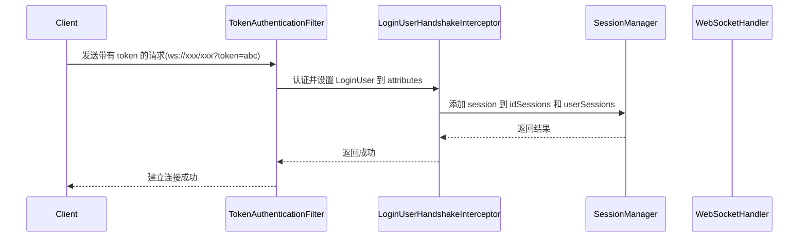
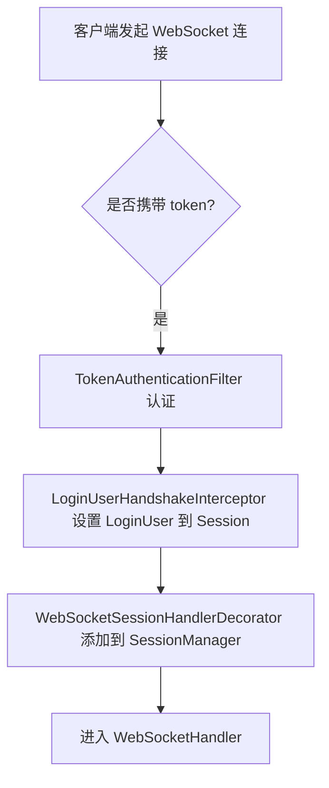
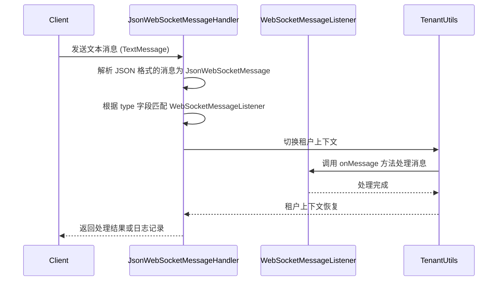
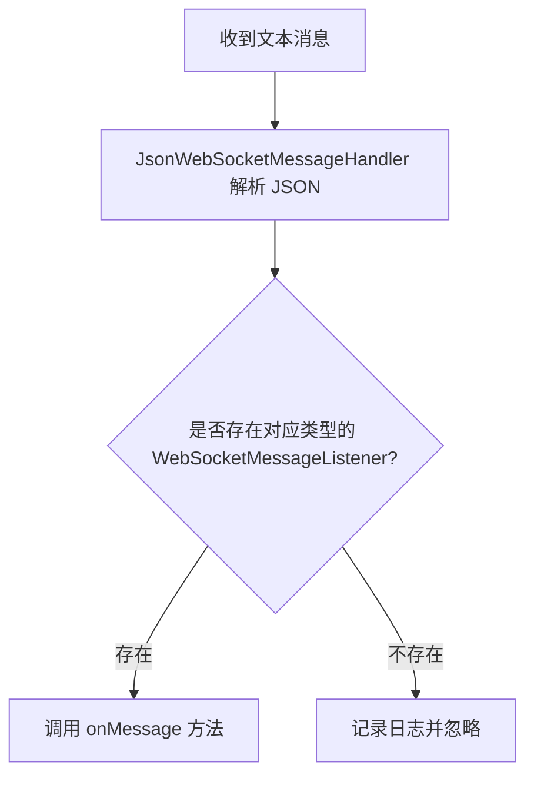
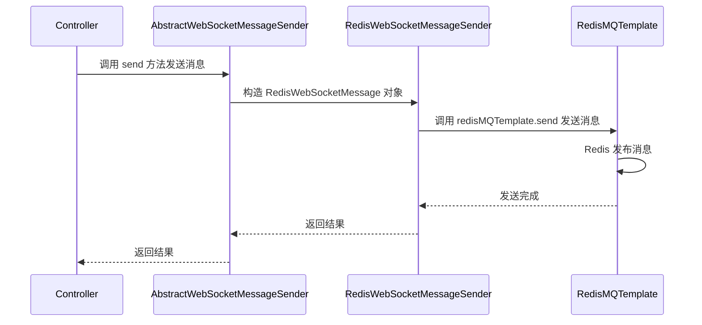
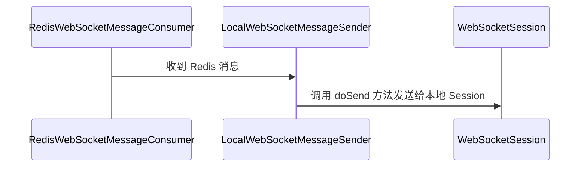
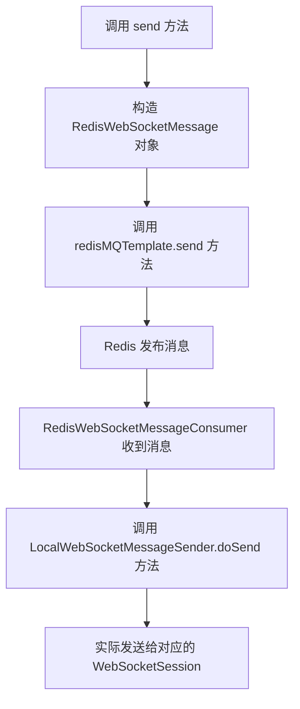
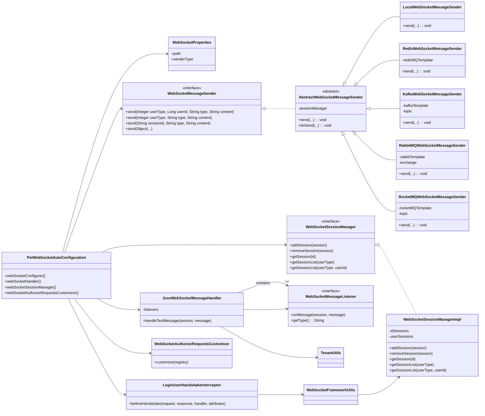

`pei-spring-boot-starter-websocket` 是一个 **WebSocket 框架增强模块（WebSocket Framework Extension Module）**
，其核心作用是为企业级应用提供统一的 WebSocket 支持。该模块基于
`Spring Boot + Spring WebSockets + 多种 MQ（Kafka、RabbitMQ、RocketMQ、Redis）` 实现多节点广播能力，并支持以下功能：

- WebSocket 会话管理
- 用户身份识别与租户隔离
- JSON 消息处理
- 消息广播机制（本地、Redis、Kafka、RabbitMQ、RocketMQ）
- 安全认证集成（JWT + Spring Security）

---

## ✅ 模块概述

### 🎯 模块定位

- **目标**：构建统一的 WebSocket 封装层，支持：
    - 单机和分布式场景下的消息广播
    - 用户登录状态识别
    - 租户数据隔离（可选）
- **应用场景**：
    - 管理后台实时通知（如订单状态变更）
    - 用户 APP 推送系统消息
    - 聊天系统、在线客服、实时仪表盘等

### 🧩 技术栈依赖

- **Spring Boot 3.4 + Spring WebSockets**
- **消息队列**：
    - Kafka、RocketMQ、RabbitMQ、Redis MQ
- **安全认证**：
    - Spring Security + JWT Token 认证
- **多租户**：
    - 可配合 `TenantContextHolder` 实现租户级别隔离

---

## 📁 目录结构说明

```
src/main/java/
└── com/pei/dehaze/framework/websocket/
    ├── config/                  // WebSocket 配置类
    │   ├── PeiWebSocketAutoConfiguration.java
    │   └── WebSocketProperties.java
    └── core/                    // 核心逻辑实现
        ├── handler/             // WebSocket 消息处理器
        ├── listener/            // 消息监听器接口
        ├── message/             // WebSocket 消息格式定义
        ├── security/            // 登录用户拦截与权限控制
        ├── sender/              // 消息发送器（本地、Redis、Kafka、RabbitMQ、RocketMQ）
        ├── session/             // Session 管理
        └── util/                // 工具类封装
```

---

## 🔍 关键包详解

### 1️⃣ `config` 包 —— WebSocket 自动配置

#### 示例：`WebSocketProperties.java`

```java

@ConfigurationProperties("pei.websocket")
@Data
@Validated
public class WebSocketProperties {

    private final String path = "/ws";
    private final String senderType = "local";

}
```

- **作用**：从 `application.yaml` 中读取 WebSocket 配置。
- **字段说明**：
    - `path`: WebSocket 连接路径
    - `senderType`: 广播方式（可选值：local、redis、kafka、rabbitmq、rocketmq）
- **用途**：
    - 控制是否启用 WebSocket
    - 设置广播类型（用于集群部署）

---

### 2️⃣ `core.handler` 包 —— WebSocket 消息处理器

#### 示例：`JsonWebSocketMessageHandler.java`

```java

@Override
private void handleTextMessage(WebSocketSession session, TextMessage message) throws Exception {
    JsonWebSocketMessage jsonMessage = JsonUtils.parseObject(message.getPayload(), JsonWebSocketMessage.class);
    WebSocketMessageListener<Object> messageListener = listeners.get(jsonMessage.getType());
    if (messageListener != null) {
        Type type = TypeUtil.getTypeArgument(messageListener.getClass(), 0);
        Object messageObj = JsonUtils.parseObject(jsonMessage.getContent(), type);
        Long tenantId = WebSocketFrameworkUtils.getTenantId(session);
        TenantUtils.execute(tenantId, () -> messageListener.onMessage(session, messageObj));
    }
}
```

- **作用**：处理 WebSocket 文本消息并分发到对应的监听器。
- **关键逻辑**：
    - 使用 Jackson 解析 JSON 格式的消息
    - 根据 `type` 字段匹配 `WebSocketMessageListener`
    - 支持租户上下文切换（通过 `TenantUtils.execute(...)`）
- **设计模式**：
    - 观察者模式（监听器机制）
    - 模板方法模式（统一消息处理流程）

---

### 3️⃣ `core.listener` 包 —— WebSocket 消息监听器接口

#### 示例：`WebSocketMessageListener.java`

```java
public interface WebSocketMessageListener<T> {
    void onMessage(WebSocketSession session, T message);

    String getType();
}
```

- **作用**：定义 WebSocket 消息监听接口。
- **使用方式**：
  ```java
  @Component
  public class OrderStatusWebSocketMessageListener implements WebSocketMessageListener<OrderStatusMessage> {
      @Override
      public String getType() { return "order.status"; }

      @Override
      public void onMessage(WebSocketSession session, OrderStatusMessage message) {
          // 处理订单状态变更
      }
  }
  ```

- **优势**：
    - 统一消息分发机制
    - 易于扩展新消息类型

---

### 4️⃣ `core.message` 包 —— WebSocket 消息格式定义

#### 示例：`JsonWebSocketMessage.java`

```java

@Data
public class JsonWebSocketMessage implements Serializable {
    private String type;
    private String content;
}
```

- **作用**：定义 WebSocket 的标准消息格式。
- **字段说明**：
    - `type`: 消息类型（如 `"user.login"`）
    - `content`: 消息内容（JSON 字符串）
- **设计模式**：
    - 数据传输对象（DTO）
    - 序列化支持（Serializable）

---

### 5️⃣ `core.security` 包 —— 登录用户拦截与权限控制

#### 示例：`LoginUserHandshakeInterceptor.java`

```java

@Override
public boolean beforeHandshake(ServerHttpRequest request, ServerHttpResponse response,
                               WebSocketHandler wsHandler, Map<String, Object> attributes) {
    LoginUser loginUser = SecurityFrameworkUtils.getLoginUser();
    if (loginUser != null) {
        WebSocketFrameworkUtils.setLoginUser(loginUser, attributes);
    }
    return true;
}
```

- **作用**：在 WebSocket 握手时设置当前登录用户。
- **关键逻辑**：
    - 获取当前登录用户（来自 Token 认证）
    - 存储到 WebSocket Session 中供后续使用
- **设计模式**：
    - 拦截器模式（HandshakeInterceptor）

---

### 6️⃣ `core.sender` 包 —— 消息广播发送器

#### 示例：`AbstractWebSocketMessageSender.java`

```java
public abstract class AbstractWebSocketMessageSender implements WebSocketMessageSender {
    protected final WebSocketSessionManager sessionManager;

    public void send(Integer userType, Long userId, String messageType, String messageContent) {
        List<WebSocketSession> sessions = sessionManager.getSessionList(userType, userId);
        doSend(sessions, messageType, messageContent);
    }

    public void doSend(Collection<WebSocketSession> sessions, String messageType, String messageContent) {
        JsonWebSocketMessage message = new JsonWebSocketMessage().setType(messageType).setContent(messageContent);
        String payload = JsonUtils.toJsonString(message);
        sessions.forEach(session -> {
            try {
                session.sendMessage(new TextMessage(payload));
            } catch (IOException ex) {
                log.error("[doSend][session({}) 发送消息失败]", session.getId(), ex);
            }
        });
    }
}
```

- **作用**：抽象消息发送逻辑，支持多种广播方式。
- **子类实现**：
    - `LocalWebSocketMessageSender`: 本地广播（适合单机）
    - `RedisWebSocketMessageSender`: Redis 广播
    - `KafkaWebSocketMessageSender`: Kafka 广播
    - `RabbitMQWebSocketMessageSender`: RabbitMQ 广播
    - `RocketMQWebSocketMessageSender`: RocketMQ 广播

---

### 7️⃣ `core.session` 包 —— WebSocket 会话管理

#### 示例：`WebSocketSessionManagerImpl.java`

```java
private final ConcurrentMap<String, WebSocketSession> idSessions = new ConcurrentHashMap<>();
private final ConcurrentMap<Integer, ConcurrentMap<Long, CopyOnWriteArrayList<WebSocketSession>>> userSessions
        = new ConcurrentHashMap<>();

@Override
public void addSession(WebSocketSession session) {
    idSessions.put(session.getId(), session);
    LoginUser user = WebSocketFrameworkUtils.getLoginUser(session);
    if (user != null) {
        userSessions.computeIfAbsent(user.getUserType(), k -> new ConcurrentHashMap<>())
                .computeIfAbsent(user.getId(), k -> new CopyOnWriteArrayList<>())
                .add(session);
    }
}

@Override
public Collection<WebSocketSession> getSessionList(Integer userType) {
    return userSessions.getOrDefault(userType, new ConcurrentHashMap<>()).values().stream()
            .flatMap(List::stream).toList();
}
```

- **作用**：管理所有连接的 WebSocket 会话。
- **关键逻辑**：
    - 按 Session ID 存储
    - 按用户类型 + 用户 ID 分组存储
    - 支持租户级别的过滤
- **线程安全**：
    - 使用 `ConcurrentHashMap` 和 `CopyOnWriteArrayList` 线程安全容器

---

### 8️⃣ `core.util` 包 —— WebSocket 工具类封装

#### 示例：`WebSocketFrameworkUtils.java`

```java
public class WebSocketFrameworkUtils {
    public static final String ATTRIBUTE_LOGIN_USER = "LOGIN_USER";

    public static void setLoginUser(LoginUser loginUser, Map<String, Object> attributes) {
        attributes.put(ATTRIBUTE_LOGIN_USER, loginUser);
    }

    public static LoginUser getLoginUser(WebSocketSession session) {
        return (LoginUser) session.getAttributes().get(ATTRIBUTE_LOGIN_USER);
    }

    public static Long getTenantId(WebSocketSession session) {
        LoginUser loginUser = getLoginUser(session);
        return loginUser != null ? loginUser.getTenantId() : null;
    }
}
```

- **作用**：封装 WebSocket 常用工具方法。
- **关键逻辑**：
    - 设置/获取登录用户信息
    - 获取用户编号、用户类型、租户编号
- **使用方式**：
  ```java
  LoginUser user = WebSocketFrameworkUtils.getLoginUser(session);
  ```

---

## 🧠 模块工作流程图解

### 1️⃣ WebSocket 握手流程





1. **客户端发起连接**：用户通过 WebSocket 连接 URL 中携带 `token` 参数，例如：`ws://xxx/xxx?token=abc`。
2. **Token 认证过滤器**：`TokenAuthenticationFilter` 首先解析 token，验证用户身份，并设置登录用户信息到请求上下文中。
3. **拦截器设置用户信息**：`LoginUserHandshakeInterceptor` 从上下文获取当前登录用户 `LoginUser`，并将其存储在 WebSocket
   Session 的属性中。
4. **添加会话**：`WebSocketSessionManagerImpl` 将新的 WebSocket Session 注册到会话管理器中，按 Session ID 和用户类型 + 用户
   ID 存储。
5. **握手完成**：返回成功响应，客户端和服务器建立 WebSocket 连接。

---

### 2️⃣ 消息接收与处理流程





1. **发送消息**：客户端通过 WebSocket 发送文本消息，调用 `webSocketMessageSender.send(...)` 方法（如订单状态变更通知）。
2. **消息解析**：`JsonWebSocketMessageHandler` 接收到消息后，使用 Jackson 解析 JSON 格式的消息为 `JsonWebSocketMessage`
   对象。
3. **匹配监听器**：根据 `type` 字段查找对应的 `WebSocketMessageListener` 实现类。如果找不到，则记录日志并忽略。
4. **租户切换**：通过 `TenantUtils.execute(tenantId, ...)` 方法切换到对应租户的上下文，确保数据隔离。
5. **执行业务逻辑**：调用监听器的 `onMessage` 方法，处理具体的业务逻辑（如更新订单状态）。
6. **日志记录**：处理完成后，恢复租户上下文，并记录日志。

---

### 3️⃣ 消息广播流程（以 Redis 为例）







1. **发送消息**：在 Controller 或 Service 层调用 `webSocketMessageSender.send(...)` 方法，准备发送消息。
2. **构造消息对象**：`AbstractWebSocketMessageSender` 根据参数构造 `JsonWebSocketMessage`，再由
   `RedisWebSocketMessageSender` 包装成 `RedisWebSocketMessage`。
3. **发布到 Redis**：`RedisWebSocketMessageSender` 使用 `redisMQTemplate.send` 方法将消息发布到 Redis Pub/Sub 系统。
4. **订阅消息**：所有实例都订阅了该 Channel，因此每个实例都会收到该消息。
5. **发送到本地 Session**：`RedisWebSocketMessageConsumer` 收到消息后，调用 `LocalWebSocketMessageSender.doSend(...)`
   方法，最终将消息发送给本地连接的 WebSocket Session。

---

## 🧱 模块间关系图



1. **核心接口与抽象类**

- `WebSocketMessageSender` 是统一的消息发送接口，定义了消息发送的基本方法。
- `AbstractWebSocketMessageSender` 是一个抽象类，实现了通用的 `doSend(...)` 方法，负责将消息发送给本地 Session 或通过 MQ
  广播。
- 所有具体的发送器（如 `RedisWebSocketMessageSender`, `KafkaWebSocketMessageSender` 等）都继承自
  `AbstractWebSocketMessageSender`。

2. **发送器实现**

- **LocalWebSocketMessageSender**：直接操作本地 Session，适合单机部署。
- **RedisWebSocketMessageSender**：通过 Redis 发布/订阅机制进行广播。
- **KafkaWebSocketMessageSender**：使用 Kafka 进行跨节点广播。
- **RabbitMQWebSocketMessageSender**：基于 RabbitMQ 的广播支持。
- **RocketMQWebSocketMessageSender**：使用 RocketMQ 实现分布式广播。

3. **会话管理**

- `WebSocketSessionManager` 是接口，定义了对 WebSocket Session 的基本操作。
- `WebSocketSessionManagerImpl` 是其实现类，使用线程安全的 `ConcurrentHashMap` 和 `CopyOnWriteArrayList` 来存储
  Session，并支持租户隔离。

4. **消息处理**

- `JsonWebSocketMessageHandler` 是 Spring 的 `WebSocketHandler` 实现，负责接收并解析 JSON 格式的消息。
- 它会根据消息类型 (`type`) 调用对应的 `WebSocketMessageListener` 实现类进行处理。
- 使用 `TenantUtils.execute(tenantId, ...)` 切换租户上下文，确保多租户环境下数据隔离。

5. **自动配置类**

- `PeiWebSocketAutoConfiguration` 是 Spring Boot 自动配置类，根据 `application.yaml` 中的 `pei.websocket.sender-type`
  配置决定启用哪种广播方式。
- 同时注册了 WebSocket 握手拦截器、权限配置、Session 管理等基础设施。

6. **握手与用户识别**

- `LoginUserHandshakeInterceptor` 在握手阶段从 Token 中提取登录用户信息，并设置到 Session 属性中。
- `WebSocketFrameworkUtils` 提供工具方法用于获取当前用户、租户 ID 等。

7. **配置属性**

- `WebSocketProperties` 从 `application.yaml` 中读取 WebSocket 相关配置，例如连接路径 `path` 和广播方式 `sender-type`。

---

## 🧩 模块功能总结

| 包名              | 功能             | 关键类                           |
|-----------------|----------------|-------------------------------|
| `config`        | WebSocket 配置加载 | `WebSocketProperties`         |
| `core.handler`  | WebSocket 消息处理 | `JsonWebSocketMessageHandler` |
| `core.listener` | 消息监听器接口        | `WebSocketMessageListener`    |
| `core.message`  | 消息格式定义         | `JsonWebSocketMessage`        |
| `core.sender`   | 消息发送器实现        | `WebSocketMessageSender`      |
| `core.session`  | 会话管理           | `WebSocketSessionManagerImpl` |
| `core.util`     | 工具类封装          | `WebSocketFrameworkUtils`     |

---

## 📌 总结

`pei-spring-boot-starter-websocket` 模块实现了以下核心功能：

| 功能             | 技术实现                                          | 用途              |
|----------------|-----------------------------------------------|-----------------|
| WebSocket 会话管理 | WebSocketSessionManager                       | 管理连接的 Session   |
| 消息广播           | WebSocketMessageSender + Redis/Kafka/RabbitMQ | 支持跨服务广播         |
| 用户识别           | LoginUserHandshakeInterceptor                 | 识别 WebSocket 用户 |
| 租户隔离           | TenantContextHolder + WebSocketSessionManager | 控制广播范围          |
| 消息监听           | WebSocketMessageListener                      | 分发不同消息类型        |
| 消息格式           | JsonWebSocketMessage                          | 统一 JSON 格式      |

它是一个轻量但功能完整的 WebSocket 模块，适用于电商、社交、CRM、ERP、AI 等需要实时通信的场景。

