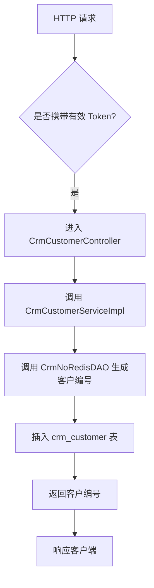
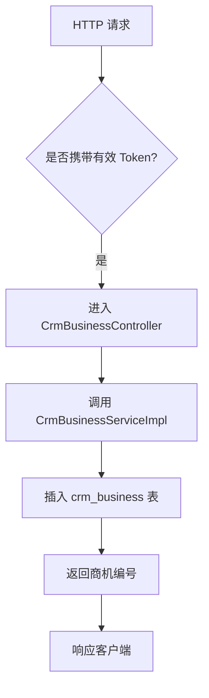
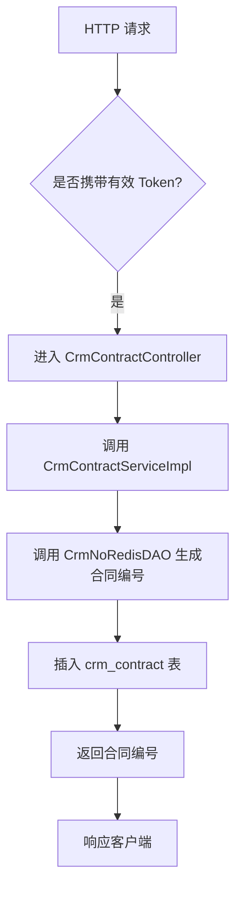
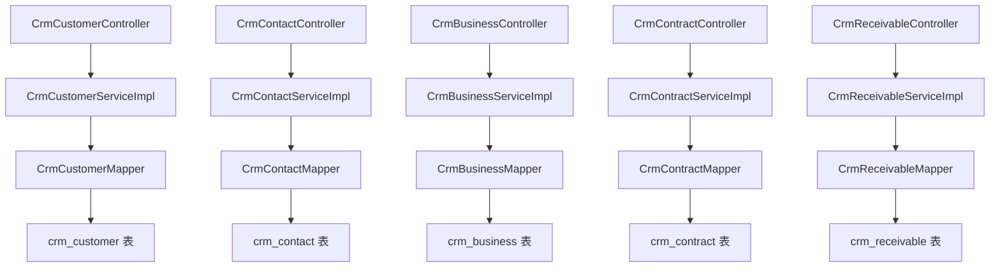

`pei-module-crm` 是一个 **客户关系管理（Customer Relationship Management）模块**，其核心作用是为企业提供统一的客户信息管理、销售流程控制、商机跟踪、合同管理、回款计划等功能。该模块基于 Spring Boot 3.4 + Java 17 实现，遵循分层架构设计，并与 `Spring Security`、`MyBatis Plus`、`Redis`、`Nacos` 等技术栈深度集成。

---

## ✅ 模块概述

### 🎯 模块定位
- **目标**：构建统一的 CRM 客户管理系统，支持：
    - 客户信息维护与权限分配
    - 商机挖掘与跟进记录
    - 合同签订与审批流程
    - 回款计划与实际回款跟踪
    - 多维度数据统计分析
- **应用场景**：
    - 销售团队客户管理
    - 市场营销线索转化
    - 商务谈判与合同签署
    - 财务回款追踪与对账
- **技术栈依赖**：
    - Spring Boot + Spring Cloud Gateway + Nacos
    - MyBatis Plus + MySQL + Redis
    - MapStruct + Lombok + Hutool 工具类
    - Excel 导入导出 + API 日志记录 + BPM 流程引擎集成

---

## 📁 目录结构说明

```
src/main/java/
└── com/pei/dehaze/module/crm/
    ├── api/                    // API 接口定义，供其它模块调用
    │   └── enums/              // 枚举常量管理
    ├── controller/             // 控制器层，处理 HTTP 请求
    │   └── admin/              // 管理后台控制器
    ├── convert/                // VO/DO 转换类
    ├── dal/                    // 数据访问层
    │   ├── dataobject/         // 数据库实体对象（DO）
    │   └── mysql/              // Mapper 层接口
    ├── framework/              // 框架扩展功能
    │   ├── permission/         // 权限控制逻辑
    │   └── security/           // 安全认证相关逻辑
    ├── service/                // 业务逻辑实现
    │   ├── business/           // 商机服务（创建、跟进、状态变更）
    │   ├── contact/            // 联系人服务（新增、转移、关联客户）
    │   ├── contract/           // 合同服务（签约、审批、归档）
    │   ├── customer/           // 客户服务（新增、跟进、锁定、成交）
    │   ├── followup/           // 跟进记录服务（电话、微信、邮件等）
    │   ├── product/            // 产品服务（产品目录、价格管理）
    │   ├── receivable/         // 回款服务（计划、实际收款、审核）
    │   └── statistics/         // 统计报表服务（客户分析、业绩统计）
    ├── job/                    // 定时任务（如自动回收公海客户）
    ├── enums/                  // 枚举定义
    └── CrmServerApplication.java // 启动类
```


---

## 🔍 关键包详解

### 1️⃣ `api.enums` 包 —— 枚举类型定义

#### 🔹 示例：`DictTypeConstants.java`
```java
public interface DictTypeConstants {
    String CRM_CUSTOMER_INDUSTRY = "crm_customer_industry"; // 客户所属行业
    String CRM_CUSTOMER_LEVEL = "crm_customer_level";       // 客户等级
    String CRM_CUSTOMER_SOURCE = "crm_customer_source";     // 客户来源
    String CRM_AUDIT_STATUS = "crm_audit_status";          // 审批状态
    String CRM_PRODUCT_UNIT = "crm_product_unit";          // 产品单位
    String CRM_PRODUCT_STATUS = "crm_product_status";      // 产品状态
    String CRM_FOLLOW_UP_TYPE = "crm_follow_up_type";      // 跟进方式
    String CRM_RECEIVABLE_RETURN_TYPE = "crm_receivable_return_type"; // 回款方式
}
```


- **作用**：统一管理字典类型，避免魔法字符串。
- **优势**：
    - 提高代码可读性
    - 集中维护枚举值，便于后期扩展和修改

---

### 2️⃣ `controller.admin.customer` 包 —— 客户管理控制器

#### 🔹 示例：`CrmCustomerController.java`
```java
@Tag(name = "管理后台 - CRM 客户")
@RestController
@RequestMapping("/crm/customer")
@Validated
public class CrmCustomerController {

    @Resource
    private CrmCustomerService customerService;

    @PostMapping("/create")
    @Operation(summary = "创建客户")
    public CommonResult<Long> createCustomer(@Valid @RequestBody CrmCustomerSaveReqVO saveReqVO) {
        return success(customerService.createCustomer(saveReqVO));
    }
}
```


- **作用**：对外暴露 `/crm/customer/**` 接口，实现管理员相关的客户操作。
- **权限控制**：
    - 使用 `@PreAuthorize` 校验用户是否有操作权限
- **返回值规范**：
    - 统一使用 `CommonResult`

---

### 3️⃣ `service.customer` 包 —— 客户服务逻辑

#### 🔹 示例：`CrmCustomerServiceImpl.java`
```java
@Service
@Validated
public class CrmCustomerServiceImpl implements CrmCustomerService {

    @Resource
    private CrmCustomerMapper customerMapper;
    @Resource
    private CrmNoRedisDAO noRedisDAO;

    @Override
    @Transactional(rollbackFor = Exception.class)
    public Long createCustomer(CrmCustomerSaveReqVO saveReqVO) {
        String no = noRedisDAO.generateNo(ErpNoRedisDAO.CUSTOMER_NO_PREFIX);
        CrmCustomerDO customer = BeanUtils.toBean(saveReqVO, CrmCustomerDO.class)
                .setNo(no).setStatus(CrmAuditStatus.WAITING.getStatus());
        customerMapper.insert(customer);
        return customer.getId();
    }
}
```


- **作用**：实现客户创建、更新、删除、查询等操作。
- **关键逻辑**：
    - 自动生成唯一编号（前缀 `KH`）
    - 插入数据库并返回 ID
- **事务控制**：
    - 使用 `@Transactional` 保证插入和后续操作的原子性

---

### 4️⃣ `dal.dataobject.customer` 包 —— 客户数据模型

#### 🔹 示例：`CrmCustomerDO.java`
```java
@TableName("crm_customer")
@KeySequence("crm_customer_seq")
@Data
@EqualsAndHashCode(callSuper = true)
@ToString(callSuper = true)
@Builder
@NoArgsConstructor
@AllArgsConstructor
public class CrmCustomerDO extends BaseDO {

    /**
     * 编号
     */
    @TableId
    private Long id;
    /**
     * 客户名称
     */
    private String name;
    /**
     * 最后跟进时间
     */
    private LocalDateTime contactLastTime;
    /**
     * 负责人编号
     */
    private Long ownerUserId;
    /**
     * 成交状态
     */
    private Boolean dealStatus;
    /**
     * 手机号
     */
    private String mobile;
    /**
     * 详细地址
     */
    private String detailAddress;
    /**
     * 所属行业
     *
     * 对应字典 {@link DictTypeConstants#CRM_CUSTOMER_INDUSTRY}
     */
    private Integer industryId;
}
```


- **作用**：映射 `crm_customer` 表。
- **字段说明**：
    - `no`: 客户编号（前缀 `KH`）
    - `status`: 客户状态（枚举 `CrmAuditStatus`）
    - `ownerUserId`: 负责人 ID
    - `industryId`: 所属行业（字典类型 `CRM_CUSTOMER_INDUSTRY`）
- **继承 BaseDO**：包含基础字段如 `creator`, `createTime`, `updater`, `updateTime`, `deleted`, `tenantId`

---

### 5️⃣ `service.contact` 包 —— 联系人服务逻辑

#### 🔹 示例：`CrmContactServiceImpl.java`
```java
@Service
@Validated
public class CrmContactServiceImpl implements CrmContactService {

    @Resource
    private CrmContactMapper contactMapper;
    @Resource
    private CrmPermissionService permissionService;

    @Override
    @Transactional(rollbackFor = Exception.class)
    public Long createContact(CrmContactSaveReqVO saveReqVO) {
        CrmContactDO contact = BeanUtils.toBean(saveReqVO, CrmContactDO.class);
        contactMapper.insert(contact);
        return contact.getId();
    }
}
```


- **作用**：实现联系人创建、更新、删除、查询等操作。
- **关键逻辑**：
    - 插入数据库并返回 ID
    - 支持关联客户
- **权限控制**：
    - 使用 `@CrmPermission` 注解进行细粒度权限控制

---

### 6️⃣ `dal.dataobject.contact` 包 —— 联系人数据模型

#### 🔹 示例：`CrmContactDO.java`
```java
@TableName("crm_contact")
@KeySequence("crm_contact_seq")
@Data
@EqualsAndHashCode(callSuper = true)
@ToString(callSuper = true)
@Builder
@NoArgsConstructor
@AllArgsConstructor
public class CrmContactDO extends BaseDO {

    @TableId
    private Long id;
    private String name;
    private Long customerId;
    private String mobile;
    private String telephone;
    private String email;
    private String wechat;
    private Integer areaId;
    private String detailAddress;
    private Integer sex;
    private Boolean master; // 是否关键决策人
    private String post;    // 职位
    private Long parentId;  // 上级联系人
    private String remark;
}
```


- **作用**：映射 `crm_contact` 表。
- **字段说明**：
    - `name`: 联系人姓名
    - `customerId`: 客户 ID
    - `mobile`: 手机号
    - `wechat`: 微信账号
    - `parentId`: 上级联系人 ID
- **继承 BaseDO**：包含基础字段如 `creator`, `createTime`, `updater`, `updateTime`, `deleted`, `tenantId`

---

### 7️⃣ `service.business` 包 —— 商机服务逻辑

#### 🔹 示例：`CrmBusinessServiceImpl.java`
```java
@Service
@Validated
public class CrmBusinessServiceImpl implements CrmBusinessService {

    @Resource
    private CrmBusinessMapper businessMapper;

    @Override
    @Transactional(rollbackFor = Exception.class)
    public Long createBusiness(CrmBusinessSaveReqVO saveReqVO) {
        CrmBusinessDO business = BeanUtils.toBean(saveReqVO, CrmBusinessDO.class);
        businessMapper.insert(business);
        return business.getId();
    }
}
```


- **作用**：实现商机创建、更新、状态变更、查询等操作。
- **关键逻辑**：
    - 插入数据库并返回 ID
    - 支持关联客户、联系人
- **状态变更**：
    - 使用 `@CrmPermission` 进行权限控制

---

### 8️⃣ `dal.dataobject.business` 包 —— 商机数据模型

#### 🔹 示例：`CrmBusinessDO.java`
```java
@TableName("crm_business")
@KeySequence("crm_business_seq")
@Data
@EqualsAndHashCode(callSuper = true)
@ToString(callSuper = true)
@Builder
@NoArgsConstructor
@AllArgsConstructor
public class CrmBusinessDO extends BaseDO {

    @TableId
    private Long id;
    private String name;
    private Long customerId;
    private BigDecimal price;
    private Integer status;
    private String description;
    private LocalDateTime nextTime;
    private String remark;
}
```


- **作用**：映射 `crm_business` 表。
- **字段说明**：
    - `name`: 商机名称
    - `customerId`: 客户 ID
    - `price`: 金额
    - `status`: 状态（枚举 `CrmBusinessEndStatusEnum`）
- **继承 BaseDO**：包含基础字段如 `creator`, `createTime`, `updater`, `updateTime`, `deleted`, `tenantId`

---

### 9️⃣ `service.contract` 包 —— 合同服务逻辑

#### 🔹 示例：`CrmContractServiceImpl.java`
```java
@Service
@Validated
public class CrmContractServiceImpl implements CrmContractService {

    @Resource
    private CrmContractMapper contractMapper;
    @Resource
    private CrmNoRedisDAO noRedisDAO;

    @Override
    @Transactional(rollbackFor = Exception.class)
    public Long createContract(CrmContractSaveReqVO saveReqVO) {
        String no = noRedisDAO.generateNo(CrmNoRedisDAO.CONTRACT_NO_PREFIX);
        CrmContractDO contract = BeanUtils.toBean(saveReqVO, CrmContractDO.class)
                .setNo(no).setStatus(CrmAuditStatus.WAITING.getStatus());
        contractMapper.insert(contract);
        return contract.getId();
    }
}
```


- **作用**：实现合同创建、审批、归档、查询等操作。
- **流程**：
    1. 创建合同时生成唯一编号（前缀 `HT`）
    2. 插入数据库并返回 ID
    3. 审批通过后更新状态为“已生效”
- **集成 BPM**：
    - 使用 `@LogRecord` 记录操作日志
    - 使用 `@CrmPermission` 控制权限

---

### 🔟 `service.receivable` 包 —— 回款服务逻辑

#### 🔹 示例：`CrmReceivableServiceImpl.java`
```java
@Service
@Validated
public class CrmReceivableServiceImpl implements CrmReceivableService {

    @Resource
    private CrmReceivableMapper receivableMapper;
    @Resource
    private CrmNoRedisDAO noRedisDAO;

    @Override
    @Transactional(rollbackFor = Exception.class)
    public Long createReceivable(CrmReceivableSaveReqVO saveReqVO) {
        String no = noRedisDAO.generateNo(CrmNoRedisDAO.RECEIVABLE_NO_PREFIX);
        CrmReceivableDO receivable = BeanUtils.toBean(saveReqVO, CrmReceivableDO.class)
                .setNo(no).setStatus(CrmAuditStatus.WAITING.getStatus());
        receivableMapper.insert(receivable);
        return receivable.getId();
    }
}
```


- **作用**：实现回款单的创建、更新、审核等操作。
- **流程**：
    1. 生成唯一编号（前缀 `SKDJ`）
    2. 插入数据库并返回 ID
    3. 审批完成后更新状态为“已到账”
- **集成 BPM**：
    - 使用 `@LogRecord` 记录操作日志
    - 使用 `@CrmPermission` 控制权限

---

### 1️⃣1️⃣ `service.statistics` 包 —— 数据统计服务

#### 🔹 示例：`CrmStatisticsCustomerServiceImpl.java`
```java
@Service
@Validated
public class CrmStatisticsCustomerServiceImpl implements CrmStatisticsCustomerService {

    @Resource
    private CrmStatisticsCustomerMapper customerMapper;

    @Override
    public List<CrmStatisticsCustomerSummaryByDateRespVO> getCustomerSummaryByDate(CrmStatisticsCustomerReqVO reqVO) {
        return customerMapper.selectCustomerCreateCountGroupByDate(reqVO);
    }
}
```


- **作用**：提供客户数量、成交率、区域分布等多维数据分析。
- **关键逻辑**：
    - 查询数据库并按天聚合
    - 返回 `List<RespVO>` 结构化数据
- **图表展示**：
    - 可用于前端展示柱状图、折线图、饼图等可视化数据

---

## 🧠 模块工作流程图解

### 1️⃣ 创建客户流程



### 2️⃣ 创建商机流程



### 3️⃣ 创建合同流程



---

## 🧱 模块间关系图




---

## 🧾 模块实现原理详解

### 1️⃣ 单据编号生成机制
- **使用 Redis 自增**：
    - Key 格式：`erp:no:{prefix}`
    - Prefix 支持多种业务类型（客户、合同、回款等）
- **格式示例**：
    - `KH2025041000001` （客户编号）
    - `HT2025041000001` （合同编号）

---

### 2️⃣ 客户状态流转机制
- **初始状态**：待跟进
- **中间状态**：跟进中、即将到期
- **最终状态**：成交、丢失、无效
- **状态变更逻辑**：
    - 由 `CrmCustomerServiceImpl.updateCustomerStatus(...)` 方法控制
    - 支持手动变更和自动规则触发

---

### 3️⃣ 权限控制机制
- **使用注解控制**：
    - `@CrmPermission(bizType = CrmBizTypeEnum.CRM_CUSTOMER, level = CrmPermissionLevelEnum.WRITE)`
- **实现方式**：
    - 在切面类 `CrmPermissionAspect` 中拦截请求
    - 从数据库 `crm_permission` 查询用户对该资源的操作权限
- **权限级别**：
    - `READ`：仅查看
    - `WRITE`：查看+编辑
    - `OWNER`：拥有者（可转移、删除）

---

### 4️⃣ 操作日志记录机制
- **使用 LogRecord 注解**：
  ```java
  @LogRecord(type = CRM_CONTRACT_TYPE, subType = CRM_CONTRACT_CREATE_SUB_TYPE, bizNo = "{{#contract.id}}", success = CRM_CONTRACT_CREATE_SUCCESS)
  ```

- **记录内容**：
    - 操作类型、子类型、操作对象编号、成功/失败消息
- **存储位置**：
    - 存储在 `infra_api_access_log` 表中

---

## ✅ 建议改进方向

| 改进点 | 描述 |
|--------|------|
| ✅ 多租户增强 | 当前仅支持单租户，未来需支持多租户数据隔离 |
| ✅ 异常日志增强 | 在 SQL 查询失败时记录详细日志，便于排查问题 |
| ✅ 性能优化 | 使用 `PreparedStatement` 替代 `queryForRowSet`，防止 SQL 注入 |
| ✅ 操作日志 | 当前未记录详细操作日志，建议增加 `@LogRecord` 注解 |
| ✅ 单元测试 | 当前代码未提供单元测试，建议补充测试用例 |

---

## 📌 总结

`pei-module-crm` 模块实现了以下核心功能：

| 功能 | 技术实现 | 用途 |
|------|-----------|------|
| 客
发生异常，可以输入更多信息再让我来回答或重试。
