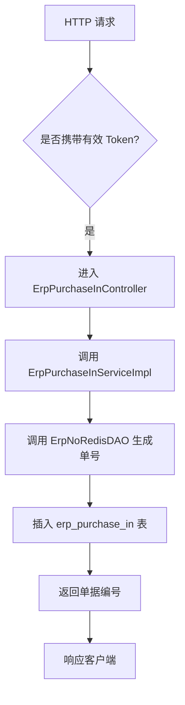
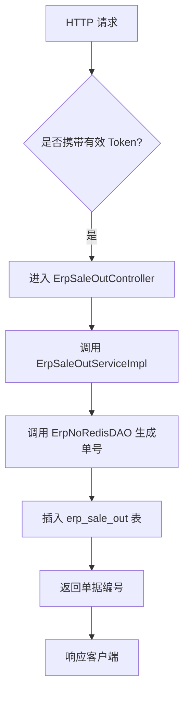
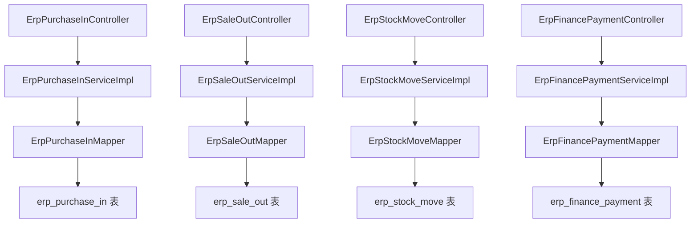

`pei-module-erp` 是一个 **企业资源计划（ERP）管理模块**，其核心作用是为企业的采购、销售、库存、财务等业务流程提供统一的管理能力。该模块基于 Spring Boot 3.4 + Java 17 实现，遵循分层架构设计，并与 `Spring Security`、`MyBatis Plus`、`Redis`、`Nacos` 等技术栈深度集成。

---

## ✅ 模块概述

### 🎯 模块定位
- **目标**：构建统一的企业资源管理系统，支持：
    - 采购订单、入库、退货
    - 销售订单、出库、退货
    - 库存调拨、盘点
    - 财务收款、付款
- **应用场景**：
    - 制造业原材料采购与管理
    - 批发零售企业的商品流通管理
    - 多仓库库存调度与控制
    - 企业财务管理与对账
- **技术栈依赖**：
    - Spring Boot + Spring Cloud Gateway + Nacos
    - MyBatis Plus + MySQL + Redis
    - MapStruct + Lombok + Hutool 工具类
    - Excel 导入导出 + API 日志记录

---

## 📁 目录结构说明

```
src/main/java/
└── com/pei/dehaze/module/erp/
    ├── controller/             // 控制器层，处理 HTTP 请求
    │   └── admin/              // 管理后台控制器
    ├── convert/                // VO/DO 转换类
    ├── dal/                    // 数据访问层
    │   ├── dataobject/         // 数据库实体对象（DO）
    │   └── mysql/              // Mapper 层接口
    ├── framework/              // 框架扩展功能
    │   ├── no/                 // 编号生成逻辑（如采购单号、销售单号）
    │   └── security/           // 安全认证相关逻辑
    ├── service/                // 业务逻辑实现
    │   ├── finance/            // 财务服务（收款、付款）
    │   ├── product/            // 产品管理服务
    │   ├── purchase/           // 采购服务（订单、入库、退货）
    │   ├── sale/               // 销售服务（订单、出库、退货）
    │   └── stock/              // 库存服务（调拨、盘点、明细）
    ├── enums/                  // 枚举定义
    └── ErpServerApplication.java // 启动类
```


---

## 🔍 关键包详解

### 1️⃣ `controller.admin.purchase` 包 —— 采购订单管理

#### 🔹 示例：`ErpPurchaseOrderController.java`
```java
@Tag(name = "管理后台 - ERP 采购订单")
@RestController
@RequestMapping("/erp/purchase-order")
@Validated
public class ErpPurchaseOrderController {

    @Resource
    private ErpPurchaseOrderService purchaseOrderService;

    @PostMapping("/create")
    @Operation(summary = "创建采购订单")
    @PreAuthorize("@ss.hasPermission('erp:purchase-order:create')")
    public CommonResult<Long> createPurchaseOrder(@Valid @RequestBody ErpPurchaseOrderSaveReqVO createReqVO) {
        return success(purchaseOrderService.createPurchaseOrder(createReqVO));
    }
}
```


- **作用**：对外暴露 `/erp/purchase-order/**` 接口，实现管理员相关的采购订单操作。
- **权限控制**：
    - 使用 `@PreAuthorize` 校验用户是否有操作权限
- **请求参数校验**：
    - 使用 `@Valid` 对输入进行验证
- **返回值规范**：
    - 统一使用 `CommonResult`

---

### 2️⃣ `service.purchase` 包 —— 采购服务逻辑

#### 🔹 示例：`ErpPurchaseInServiceImpl.java`
```java
@Service
@Validated
public class ErpPurchaseInServiceImpl implements ErpPurchaseInService {

    @Resource
    private ErpPurchaseInMapper purchaseInMapper;
    @Resource
    private ErpNoRedisDAO noRedisDAO;

    @Override
    @Transactional(rollbackFor = Exception.class)
    public Long createPurchaseIn(ErpPurchaseInSaveReqVO saveReqVO) {
        String no = noRedisDAO.generateNo(ErpNoRedisDAO.PURCHASE_IN_NO_PREFIX);
        ErpPurchaseInDO purchaseIn = BeanUtils.toBean(saveReqVO, ErpPurchaseInDO.class)
                .setNo(no).setStatus(ErpAuditStatus.WAITING.getStatus());
        purchaseInMapper.insert(purchaseIn);
        return purchaseIn.getId();
    }
}
```


- **作用**：实现采购入库单的创建、更新、删除、查询等操作。
- **关键逻辑**：
    - 自动生成唯一编号（前缀 `CGRK`）
    - 插入数据库并返回 ID
- **事务控制**：
    - 使用 `@Transactional` 保证插入和后续操作的原子性

---

### 3️⃣ `dal.dataobject.purchase` 包 —— 采购数据模型

#### 🔹 示例：`ErpPurchaseInDO.java`
```java
@TableName("erp_purchase_in")
@KeySequence("erp_purchase_in_seq")
@Data
@EqualsAndHashCode(callSuper = true)
@ToString(callSuper = true)
@Builder
@NoArgsConstructor
@AllArgsConstructor
public class ErpPurchaseInDO extends BaseDO {

    /**
     * 编号
     */
    @TableId
    private Long id;
    /**
     * 采购入库单号
     */
    private String no;
    /**
     * 入库状态
     */
    private Integer status;
    /**
     * 供应商编号
     */
    private Long supplierId;
    /**
     * 结算账户编号
     */
    private Long accountId;
    /**
     * 入库时间
     */
    private LocalDateTime inTime;
    /**
     * 采购订单编号
     */
    private Long orderId;
    /**
     * 采购订单号
     */
    private String orderNo;
    /**
     * 合计数量
     */
    private BigDecimal totalCount;
    /**
     * 最终合计价格
     */
    private BigDecimal totalPrice;
    /**
     * 已支付金额
     */
    private BigDecimal paymentPrice;
    /**
     * 合计产品价格
     */
    private BigDecimal totalProductPrice;
    /**
     * 合计税额
     */
    private BigDecimal totalTaxPrice;
    /**
     * 优惠率
     */
    private BigDecimal discountPercent;
    /**
     * 优惠金额
     */
    private BigDecimal discountPrice;
    /**
     * 其它金额
     */
    private BigDecimal otherPrice;
    /**
     * 附件地址
     */
    private String fileUrl;
    /**
     * 备注
     */
    private String remark;
}
```


- **作用**：映射 `erp_purchase_in` 表。
- **字段说明**：
    - `no`: 采购入库单号（前缀 `CGRK`）
    - `status`: 入库状态（枚举 `ErpAuditStatus`）
    - `supplierId`: 供应商 ID
    - `accountId`: 结算账户 ID
    - `inTime`: 入库时间
- **继承 BaseDO**：包含基础字段如 `creator`, `createTime`, `updater`, `updateTime`, `deleted`, `tenantId`

---

### 4️⃣ `dal.redis.no.ErpNoRedisDAO` 包 —— 单据编号生成

#### 🔹 示例：`ErpNoRedisDAO.java`
```java
@Repository
public class ErpNoRedisDAO {

    public static final String PURCHASE_IN_NO_PREFIX = "CGRK";
    public static final String PURCHASE_RETURN_NO_PREFIX = "CGTH";

    public static final String SALE_OUT_NO_PREFIX = "XSCK";
    public static final String SALE_RETURN_NO_PREFIX = "XSTH";

    public static final String STOCK_MOVE_NO_PREFIX = "QCDB";
    public static final String STOCK_CHECK_NO_PREFIX = "QCPD";

    public static final String FINANCE_PAYMENT_NO_PREFIX = "FKDJ";
    public static final String FINANCE_RECEIPT_NO_PREFIX = "SKDJ";

    private final StringRedisTemplate stringRedisTemplate;

    public ErpNoRedisDAO(StringRedisTemplate stringRedisTemplate) {
        this.stringRedisTemplate = stringRedisTemplate;
    }

    public String generateNo(String prefix) {
        String key = RedisKeyConstants.ERP_NO_KEY_PREFIX + prefix;
        Long increment = stringRedisTemplate.opsForValue().increment(key);
        Assert.notNull(increment, "生成单据编号失败");
        return prefix + DateUtil.format(LocalDateTime.now(), "yyyyMMdd") + String.format("%06d", increment);
    }
}
```


- **作用**：使用 Redis 原子操作生成唯一单据编号。
- **编号规则**：
    - `prefix` + `日期` + `6位自增`
    - 如 `CGRK2025041000001`
- **优势**：
    - 高并发下也能确保编号唯一
    - 支持多租户隔离

---

### 5️⃣ `service.finance` 包 —— 财务服务逻辑

#### 🔹 示例：`ErpFinancePaymentServiceImpl.java`
```java
@Service
@Validated
public class ErpFinancePaymentServiceImpl implements ErpFinancePaymentService {

    @Resource
    private ErpFinancePaymentMapper financePaymentMapper;
    @Resource
    private ErpNoRedisDAO noRedisDAO;

    @Override
    @Transactional(rollbackFor = Exception.class)
    public Long createPayment(ErpFinancePaymentSaveReqVO saveReqVO) {
        String no = noRedisDAO.generateNo(ErpNoRedisDAO.FINANCE_PAYMENT_NO_PREFIX);
        ErpFinancePaymentDO payment = BeanUtils.toBean(saveReqVO, ErpFinancePaymentDO.class)
                .setNo(no).setStatus(ErpAuditStatus.WAITING.getStatus());
        financePaymentMapper.insert(payment);
        return payment.getId();
    }
}
```


- **作用**：实现付款单的创建、更新、审核等操作。
- **流程**：
    1. 生成唯一编号（前缀 `FKDJ`）
    2. 插入数据库
    3. 返回单据 ID
- **事务控制**：
    - 使用 `@Transactional` 保证操作一致性

---

### 6️⃣ `enums` 包 —— 枚举常量管理

#### 🔹 示例：`ErpAuditStatus.java`
```java
public interface ErpAuditStatus {

    int WAITING = 0;  // 待审核
    int APPROVED = 1; // 已审核
    int REJECTED = 2; // 已拒绝

    static boolean isApproved(int status) {
        return status == APPROVED;
    }
}
```


- **作用**：统一管理所有状态码和业务类型。
- **优势**：
    - 减少魔法数字
    - 提供静态方法简化判断逻辑

---

### 7️⃣ `service.sale` 包 —— 销售服务逻辑

#### 🔹 示例：`ErpSaleOutServiceImpl.java`
```java
@Service
@Validated
public class ErpSaleOutServiceImpl implements ErpSaleOutService {

    @Resource
    private ErpSaleOutMapper saleOutMapper;
    @Resource
    private ErpNoRedisDAO noRedisDAO;

    @Override
    @Transactional(rollbackFor = Exception.class)
    public Long createSaleOut(ErpSaleOutSaveReqVO saveReqVO) {
        String no = noRedisDAO.generateNo(ErpNoRedisDAO.SALE_OUT_NO_PREFIX);
        ErpSaleOutDO saleOut = BeanUtils.toBean(saveReqVO, ErpSaleOutDO.class)
                .setNo(no).setStatus(ErpAuditStatus.WAITING.getStatus());
        saleOutMapper.insert(saleOut);
        return saleOut.getId();
    }
}
```


- **作用**：实现销售出库单的创建、更新、查询等操作。
- **关键逻辑**：
    - 自动生成唯一编号（前缀 `XSCK`）
    - 插入数据库并返回 ID
- **事务控制**：
    - 使用 `@Transactional` 保证操作一致性

---

### 8️⃣ `dal.dataobject.sale` 包 —— 销售数据模型

#### 🔹 示例：`ErpSaleOutDO.java`
```java
@TableName("erp_sale_out")
@KeySequence("erp_sale_out_seq")
@Data
@EqualsAndHashCode(callSuper = true)
@ToString(callSuper = true)
@Builder
@NoArgsConstructor
@AllArgsConstructor
public class ErpSaleOutDO extends BaseDO {

    /**
     * 编号
     */
    @TableId
    private Long id;
    /**
     * 销售出库单号
     */
    private String no;
    /**
     * 出库状态
     */
    private Integer status;
    /**
     * 客户编号
     */
    private Long customerId;
    /**
     * 结算账户编号
     */
    private Long accountId;
    /**
     * 出库时间
     */
    private LocalDateTime outTime;
    /**
     * 采购订单编号
     */
    private Long orderId;
    /**
     * 采购订单号
     */
    private String orderNo;
    /**
     * 合计数量
     */
    private BigDecimal totalCount;
    /**
     * 最终合计价格
     */
    private BigDecimal totalPrice;
    /**
     * 已支付金额
     */
    private BigDecimal paymentPrice;
    /**
     * 合计产品价格
     */
    private BigDecimal totalProductPrice;
    /**
     * 合计税额
     */
    private BigDecimal totalTaxPrice;
    /**
     * 优惠率
     */
    private BigDecimal discountPercent;
    /**
     * 优惠金额
     */
    private BigDecimal discountPrice;
    /**
     * 其它金额
     */
    private BigDecimal otherPrice;
    /**
     * 附件地址
     */
    private String fileUrl;
    /**
     * 备注
     */
    private String remark;
}
```


- **作用**：映射 `erp_sale_out` 表。
- **字段说明**：
    - `no`: 销售出库单号（前缀 `XSCK`）
    - `status`: 出库状态（枚举 `ErpAuditStatus`）
    - `customerId`: 客户 ID
    - `accountId`: 结算账户 ID
- **继承 BaseDO**：包含基础字段如 `creator`, `createTime`, `updater`, `updateTime`, `deleted`, `tenantId`

---

### 9️⃣ `service.stock` 包 —— 库存服务逻辑

#### 🔹 示例：`ErpStockMoveService.java`
```java
public interface ErpStockMoveService {}

@Service
@Validated
public class ErpStockMoveServiceImpl implements ErpStockMoveService {

    @Resource
    private ErpStockMoveMapper stockMoveMapper;
    @Resource
    private ErpNoRedisDAO noRedisDAO;

    @Override
    @Transactional(rollbackFor = Exception.class)
    public Long createStockMove(ErpStockMoveSaveReqVO saveReqVO) {
        String no = noRedisDAO.generateNo(ErpNoRedisDAO.STOCK_MOVE_NO_PREFIX);
        ErpStockMoveDO move = BeanUtils.toBean(saveReqVO, ErpStockMoveDO.class)
                .setNo(no).setStatus(ErpAuditStatus.WAITING.getStatus());
        stockMoveMapper.insert(move);
        return move.getId();
    }
}
```


- **作用**：实现库存调拨单的创建、更新、查询等操作。
- **流程**：
    1. 生成唯一编号（前缀 `QCDB`）
    2. 插入数据库
    3. 返回单据 ID
- **事务控制**：
    - 使用 `@Transactional` 保证操作一致性

---

### 🔟 `dal.dataobject.stock` 包 —— 库存数据模型

#### 🔹 示例：`ErpStockMoveDO.java`
```java
@TableName("erp_stock_move")
@KeySequence("erp_stock_move_seq")
@Data
@EqualsAndHashCode(callSuper = true)
@ToString(callSuper = true)
@Builder
@NoArgsConstructor
@AllArgsConstructor
public class ErpStockMoveDO extends BaseDO {

    /**
     * 编号
     */
    @TableId
    private Long id;
    /**
     * 库存调拨单号
     */
    private String no;
    /**
     * 调拨状态
     */
    private Integer status;
    /**
     * 来源仓库编号
     */
    private Long sourceWarehouseId;
    /**
     * 目标仓库编号
     */
    private Long targetWarehouseId;
    /**
     * 合计数量
     */
    private BigDecimal totalCount;
    /**
     * 合计价格
     */
    private BigDecimal totalPrice;
    /**
     * 备注
     */
    private String remark;
}
```


- **作用**：映射 `erp_stock_move` 表。
- **字段说明**：
    - `no`: 调拨单号（前缀 `QCDB`）
    - `status`: 调拨状态（枚举 `ErpAuditStatus`）
    - `sourceWarehouseId`: 源仓库 ID
    - `targetWarehouseId`: 目标仓库 ID
- **继承 BaseDO**：包含基础字段如 `creator`, `createTime`, `updater`, `updateTime`, `deleted`, `tenantId`

---

## 🧠 模块工作流程图解

### 1️⃣ 创建采购入库单流程



### 2️⃣ 创建销售出库单流程



---

## 🧱 模块间关系图




---

## 🧩 模块功能总结

| 包名 | 功能 | 关键类 |
|------|------|--------|
| `controller.admin.purchase` | 采购订单管理 | `ErpPurchaseOrderController` |
| `service.purchase` | 采购服务逻辑 | `ErpPurchaseInServiceImpl` |
| `dal.dataobject.purchase` | 采购数据模型 | `ErpPurchaseInDO` |
| `dal.redis.no` | 单据编号生成 | `ErpNoRedisDAO` |
| `service.finance` | 财务服务逻辑 | `ErpFinancePaymentServiceImpl` |
| `dal.dataobject.finance` | 财务数据模型 | `ErpFinancePaymentDO` |
| `service.sale` | 销售服务逻辑 | `ErpSaleOutServiceImpl` |
| `dal.dataobject.sale` | 销售数据模型 | `ErpSaleOutDO` |
| `service.stock` | 库存服务逻辑 | `ErpStockMoveServiceImpl` |
| `dal.dataobject.stock` | 库存数据模型 | `ErpStockMoveDO` |

---

## 🧾 模块实现原理详解

### 1️⃣ 单据编号生成机制
- **使用 Redis 自增**：
    - Key 格式：`erp:no:{prefix}`
    - Prefix 支持多种业务类型（采购、销售、调拨、付款、收款）
- **格式示例**：
    - `CGRK2025041000001` （采购入库单号）
    - `XSCK2025041000001` （销售出库单号）

### 2️⃣ 采购入库流程
- **核心表**：`erp_purchase_in`
- **流程**：
    1. 创建采购订单
    2. 创建采购入库单（关联订单）
    3. 更新订单状态为“已入库”
    4. 记录库存变化（调用 `ErpStockRecordService`）

### 3️⃣ 销售出库流程
- **核心表**：`erp_sale_out`
- **流程**：
    1. 创建销售订单
    2. 创建销售出库单（关联订单）
    3. 更新订单状态为“已出库”
    4. 记录库存减少

### 4️⃣ 库存调拨流程
- **核心表**：`erp_stock_move`
- **流程**：
    1. 创建调拨单
    2. 减少源仓库库存
    3. 增加目标仓库库存
    4. 插入调拨明细 `erp_stock_move_item`

---

## ✅ 建议改进方向

| 改进点 | 描述 |
|--------|------|
| ✅ 多租户增强 | 当前仅支持单租户，未来需支持多租户数据隔离 |
| ✅ 异常日志增强 | 在 SQL 查询失败时记录详细日志，便于排查问题 |
| ✅ 性能优化 | 使用 `PreparedStatement` 替代 `queryForRowSet`，防止 SQL 注入 |
| ✅ 操作日志 | 当前未记录详细操作日志，建议增加 `@LogRecord` 注解 |
| ✅ 单元测试 | 当前代码未提供单元测试，建议补充测试用例 |

---

## 📌 总结

`pei-module-erp` 模块实现了以下核心功能：

| 功能 | 技术实现 | 用途 |
|------|-----------|------|
| 采购订单 | PurchaseOrderDO + PurchaseOrderService | 采购流程管理 |
| 采购入库 | PurchaseInDO + PurchaseInService | 采购收货管理 |
| 采购退货 | PurchaseReturnDO + PurchaseReturnService | 采购退款管理 |
| 销售订单 | SaleOrderDO + SaleOrderService | 销售流程管理 |
| 销售出库 | SaleOutDO + SaleOutService | 商品出库管理 |
| 销售退货 | SaleReturnDO + SaleReturnService | 商品退货管理 |
| 库存调拨 | StockMoveDO + StockMoveService | 多仓库库存调度 |
| 库存盘点 | StockCheckDO + StockCheckService | 库存差异核对 |
| 付款单 | FinancePaymentDO + FinancePaymentService | 采购付款管理 |
| 收款单 | FinanceReceiptDO + FinanceReceiptService | 销售收款管理 |

它是一个轻量但功能完整的 ERP 管理模块，适用于制造业、批发零售、物流等行业。如果你有具体某个类（如 `ErpPurchaseInServiceImpl`、`ErpSaleOutServiceImpl`）想要深入了解，欢迎继续提问！
