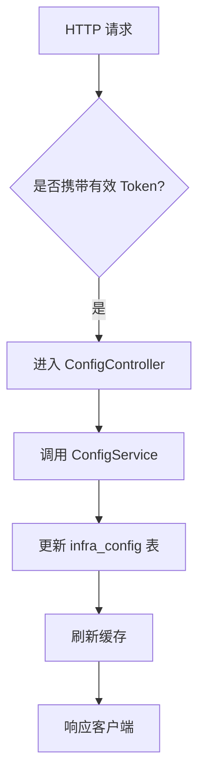
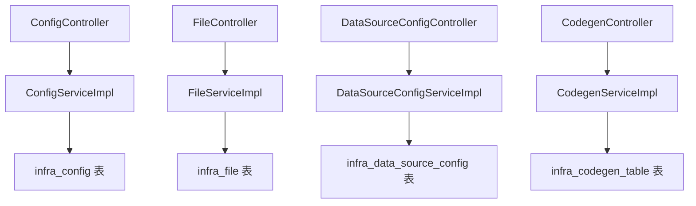

`pei-module-infra` 是一个 **基础设施模块（Infrastructure Module）**，其核心作用是为企业级应用提供基础能力支撑。该模块包含两个子项目：

1. `pei-module-infra-api`：定义对外暴露的接口和数据结构
2. `pei-module-infra-server`：实现具体功能的服务器端逻辑

---

## ✅ 模块概述

### 🎯 模块定位
- **目标**：为上层业务系统提供基础能力支撑，包括：
    - 文件存储与管理（支持本地、FTP、OSS 等）
    - 参数配置中心（Config Management）
    - 数据源管理（多租户数据库配置）
    - API 访问日志记录
    - 代码生成器（Java + Vue 前后端自动生成）
    - 定时任务管理
    - 微服务注册发现
    - 统一权限认证机制

### 🧩 技术栈依赖
- **Spring Boot + Spring Cloud Gateway + Nacos**
- **数据访问层**：
    - MyBatis Plus + MySQL + Redis
- **消息队列**：
    - RocketMQ + XXL-Job（用于异步处理和定时任务）
- **安全认证**：
    - Spring Security + Token + Redis Session
- **其他工具类**：
    - Hutool 工具库、MapStruct 转换器、Jackson 多态序列化

---

## 📁 目录结构说明

```
src/main/java/
└── com/pei/dehaze/module/infra/
    ├── api/                     // API 接口定义，供其它模块调用
    ├── controller/              // 控制器层，处理 HTTP 请求
    │   ├── admin/               // 管理后台控制器
    │   └── app/                 // 用户端 APP 控制器
    ├── convert/                 // VO/DO 转换类
    ├── dal/                     // 数据访问层
    │   ├── dataobject/          // 数据库实体对象（DO）
    │   └── mysql/               // Mapper 层接口
    ├── framework/               // 框架扩展功能
    │   ├── file/                // 文件存储抽象封装
    │   ├── security/            // 权限控制配置
    │   └── tenant/              // 多租户相关逻辑
    ├── mq/                      // 消息队列相关
    ├── service/                 // 业务逻辑实现
    │   ├── codegen/             // 代码生成引擎
    │   ├── config/              // 配置中心服务
    │   ├── db/                  // 数据源管理服务
    │   ├── file/                // 文件上传下载服务
    │   └── logger/              // 日志记录服务
    ├── enums/                   // 枚举定义
    └── InfraServerApplication.java // 启动类
```


---

## 🔍 关键包详解

### 1️⃣ `api.config` 包 —— 配置信息接口定义

#### 示例：`ConfigRespDTO.java`
```java
@Schema(description = "RPC 服务 - 配置 Response DTO")
@Data
public class ConfigRespDTO {

    @Schema(description = "参数主键", requiredMode = Schema.RequiredMode.REQUIRED, example = "1024")
    private Long id;

    @Schema(description = "参数分类", example = "user_type")
    private String category;

    @Schema(description = "参数名称", example = "用户类型")
    private String name;

    @Schema(description = "参数键名", example = "user.type.admin")
    private String configKey;

    @Schema(description = "参数键值", example = "admin_user")
    private String value;

    @Schema(description = "参数类型", requiredMode = Schema.RequiredMode.REQUIRED, example = "1")
    private Integer type;
}
```


- **作用**：对外暴露配置管理 DTO。
- **用途**：
    - 供其它模块远程调用（如商城、订单模块）
    - 提供基础字段供前端展示使用

---

### 2️⃣ `controller.admin.config` 包 —— 配置管理后台接口

#### 示例：`ConfigController.java`
```java
@Tag(name = "管理后台 - 参数配置")
@RestController
@RequestMapping("/infra/config")
@Validated
public class ConfigController {

    @Resource
    private ConfigService configService;

    @PutMapping("/update")
    @Operation(summary = "更新参数配置")
    @PreAuthorize("@ss.hasPermission('infra:config:update')")
    public CommonResult<Boolean> updateConfig(@RequestBody @Valid ConfigSaveReqVO reqVO) {
        return success(configService.updateConfig(reqVO));
    }
}
```


- **作用**：对外暴露 `/infra/config/**` 接口，实现管理员相关的配置操作。
- **权限控制**：
    - 使用 `@PreAuthorize` 校验用户是否有操作权限
- **返回值规范**：
    - 统一使用 `CommonResult`

---

### 3️⃣ `service.config` 包 —— 配置服务逻辑

#### 示例：`ConfigServiceImpl.java`
```java
@Service
@Validated
@Slf4j
public class ConfigServiceImpl implements ConfigService {

    @Resource
    private ConfigMapper configMapper;

    @Override
    public void updateConfig(ConfigSaveReqVO updateReqVO) {
        ConfigDO config = configMapper.selectById(updateReqVO.getId());
        if (config == null) {
            throw exception(CONFIG_NOT_EXISTS);
        }
        BeanUtils.copyProperties(config, updateReqVO);
        configMapper.updateById(config);
    }
}
```


- **作用**：实现参数配置的创建、更新、删除、查询等操作。
- **关键逻辑**：
    - 使用 `PasswordEncoder` 加密密码
    - 支持手机号、第三方授权登录
- **事务控制**：
    - 使用 `@Transactional` 保证插入和后续操作一致性

---

### 4️⃣ `dal.dataobject.config` 包 —— 配置数据库映射对象

#### 示例：`ConfigDO.java`
```java
@TableName("infra_config")
@KeySequence("infra_config_seq")
@Data
@EqualsAndHashCode(callSuper = true)
@ToString(callSuper = true)
@TenantIgnore
public class ConfigDO extends BaseDO {

    /**
     * 参数主键
     */
    @TableId
    private Long id;

    /**
     * 参数分类
     */
    private String category;

    /**
     * 参数名称
     */
    private String name;

    /**
     * 参数键名
     */
    private String configKey;

    /**
     * 参数键值
     */
    private String value;

    /**
     * 参数类型
     */
    private Integer type;

    /**
     * 是否可见
     */
    private Boolean visible;

    /**
     * 备注
     */
    private String remark;
}
```


- **作用**：映射 `infra_config` 表。
- **字段说明**：
    - `configKey`: 唯一键（如 `user.type.admin`）
    - `value`: 配置值（如 `admin_user`）
    - `type`: 配置类型（枚举 `ConfigTypeEnum`）
- **继承 BaseDO**：包含基础字段如 `creator`, `createTime`, `updater`, `updateTime`, `deleted`, `tenantId`

---

### 5️⃣ `service.codegen` 包 —— 代码生成服务逻辑

#### 示例：`CodegenServiceImpl.java`
```java
@Service
@Validated
@Slf4j
public class CodegenServiceImpl implements CodegenService {

    @Resource
    private CodegenTableMapper tableMapper;

    @Resource
    private CodegenColumnMapper columnMapper;

    @Override
    public PageResult<CodegenTableDO> getTablePage(CodegenTablePageReqVO pageVO) {
        return tableMapper.selectPage(pageVO);
    }

    @Override
    public void generateCode(Long tableId, HttpServletResponse response) {
        CodegenTableDO table = tableMapper.selectById(tableId);
        List<CodegenColumnDO> columns = columnMapper.selectListByTableId(tableId);

        TemplateEngine engine = new VelocityEngine();
        Map<String, Object> context = new HashMap<>();
        context.put("table", table);
        context.put("columns", columns);

        ByteArrayOutputStream output = new ByteArrayOutputStream();
        engine.getTemplate("codegen/java/controller.vm").render(context, output);

        response.setContentType("application/zip");
        response.setHeader("Content-Disposition", "attachment; filename=" + table.getClassName() + ".zip");
        ZipUtil.gzip(output.toByteArray(), response.getOutputStream());
    }
}
```


- **作用**：实现 Java + Vue 前后端代码自动生成。
- **关键逻辑**：
    - 使用 Velocity 模板引擎生成代码
    - 支持多种模板（Vue2/Vue3/Thymeleaf）
- **事务控制**：
    - 使用 `@Transactional` 保证表结构与字段同步更新

---

### 6️⃣ `dal.dataobject.codegen` 包 —— 代码生成数据库映射对象

#### 示例：`CodegenTableDO.java`
```java
@TableName("infra_codegen_table")
@KeySequence("infra_codegen_table_seq")
@Data
@Accessors(chain = true)
@EqualsAndHashCode(callSuper = true)
@TenantIgnore
public class CodegenTableDO extends BaseDO {

    /**
     * ID 编号
     */
    @TableId
    private Long id;

    /**
     * 数据源编号
     */
    private Long dataSourceConfigId;

    /**
     * 生成场景
     */
    private Integer scene;

    /**
     * 表名称
     */
    private String tableName;

    /**
     * 表描述
     */
    private String tableComment;

    /**
     * 模块名，即一级目录
     */
    private String moduleName;

    /**
     * 业务名，即二级目录
     */
    private String businessName;

    /**
     * 类名称（首字母大写）
     */
    private String className;

    /**
     * 类描述
     */
    private String classComment;

    /**
     * 作者
     */
    private String author;

    /**
     * 模板类型
     */
    private Integer templateType;

    /**
     * 代码生成的前端类型
     */
    private Integer frontType;
}
```


- **作用**：映射 `infra_codegen_table` 表。
- **字段说明**：
    - `dataSourceConfigId`: 关联的数据源配置
    - `moduleName`: 模块名（如 `system`, `infra`）
    - `businessName`: 业务名（如 `user`, `dict`）
- **继承 BaseDO**：包含基础字段如 `creator`, `createTime`, `updater`, `updateTime`, `deleted`, `tenantId`

---

### 7️⃣ `service.file` 包 —— 文件服务逻辑

#### 示例：`FileServiceImpl.java`
```java
@Service
public class FileServiceImpl implements FileService {

    @Resource
    private FileConfigService fileConfigService;

    @Resource
    private FileMapper fileMapper;

    @Override
    public String uploadFile(MultipartFile file) throws IOException {
        byte[] content = IoUtil.readBytes(file.getInputStream());
        return fileService.createFile(content, file.getOriginalFilename(), file.getContentType());
    }

    @Override
    public void deleteFile(String path) {
        fileMapper.deleteByPath(path);
    }
}
```


- **作用**：实现文件上传、下载、删除等操作。
- **关键逻辑**：
    - 支持多种存储方式（本地、FTP、OSS）
    - 可配置默认存储路径
- **事务控制**：
    - 使用 `@Transactional` 保证文件元数据与内容一致性

---

### 8️⃣ `dal.dataobject.file` 包 —— 文件记录数据库映射对象

#### 示例：`FileDO.java`
```java
@TableName("infra_file")
@KeySequence("infra_file_seq")
@Data
@EqualsAndHashCode(callSuper = true)
@ToString(callSuper = true)
@TenantIgnore
public class FileDO extends BaseDO {

    /**
     * 文件编号
     */
    @TableId
    private Long id;

    /**
     * 文件名
     */
    private String name;

    /**
     * 文件路径
     */
    private String path;

    /**
     * 存储路径
     */
    private String storagePath;

    /**
     * 文件大小（字节）
     */
    private Long size;

    /**
     * 文件类型（如 txt、jpg）
     */
    private String type;

    /**
     * 存储类型（枚举 FileStorageEnum）
     */
    private Integer storageType;

    /**
     * 所属配置编号
     */
    private Long configId;

    /**
     * 创建者
     */
    private String creator;

    /**
     * 更新时间
     */
    private LocalDateTime updateTime;
}
```


- **作用**：映射 `infra_file` 表。
- **字段说明**：
    - `name`: 文件原始名称
    - `path`: 文件访问路径
    - `storagePath`: 文件实际存储路径
- **继承 BaseDO**：包含基础字段如 `creator`, `createTime`, `updater`, `updateTime`, `deleted`, `tenantId`

---

### 9️⃣ `enums.config` 包 —— 配置类型枚举

#### 示例：`ConfigTypeEnum.java`
```java
@Getter
@AllArgsConstructor
public enum ConfigTypeEnum implements ArrayValuable<Integer> {

    SYSTEM(0, "系统配置"),
    USER(1, "用户配置");

    private final Integer type;
    private final String description;
}
```


- **作用**：统一管理配置类型。
- **优势**：
    - 减少魔法数字
    - 提供静态方法简化判断逻辑

---

### 🔟 `service.datasource` 包 —— 数据源服务逻辑

#### 示例：`DataSourceConfigServiceImpl.java`
```java
@Service
@Validated
public class DataSourceConfigServiceImpl implements DataSourceConfigService {

    @Resource
    private DataSourceConfigMapper dataSourceConfigMapper;

    @Resource
    private DynamicDataSourceProperties dynamicDataSourceProperties;

    @Override
    public Long createDataSourceConfig(DataSourceConfigSaveReqVO createReqVO) {
        DataSourceConfigDO config = BeanUtils.toBean(createReqVO, DataSourceConfigDO.class);
        validateConnectionOK(config);

        // 插入
        dataSourceConfigMapper.insert(config);
        // 返回
        return config.getId();
    }

    @Override
    public void updateDataSourceConfig(DataSourceConfigSaveReqVO updateReqVO) {
        // 校验存在
        validateDataSourceConfigExists(updateReqVO.getId());
        DataSourceConfigDO updateObj = BeanUtils.toBean(updateReqVO, DataSourceConfigDO.class);
        validateConnectionOK(updateObj);

        // 更新
        dataSourceConfigMapper.updateById(updateObj);
    }
}
```


- **作用**：实现数据源配置的创建、更新、删除、查询等操作。
- **关键逻辑**：
    - 动态数据源配置
    - 支持多租户数据库隔离
- **事务控制**：
    - 使用 `@Transactional` 保证数据源变动与数据库操作一致性

---

## 🧠 模块工作流程图解

### 1️⃣ 配置更新流程



### 2️⃣ 文件上传流程
```mermaid
graph TD
    A[用户点击上传按钮] --> B[进入 FileController.uploadFile(...)]
    B --> C[调用 FileService.createFile(...)]
    C --> D[插入 infra_file 表]
    D --> E[保存文件到指定存储位置]
    E --> F[返回文件访问 URL]
    F --> G[响应客户端]
```


### 3️⃣ 代码生成流程
```mermaid
graph TD
    A[选择数据库表] --> B[进入 CodegenController.getTableList(...)]
    B --> C[调用 CodegenService.generateCode(...)]
    C --> D[解析表结构]
    D --> E[使用 Velocity 模板生成代码]
    E --> F[打包为 ZIP 并返回]
    F --> G[响应客户端]
```


---

## 🧱 模块间关系图




---

## 🧩 模块功能总结

| 包名 | 功能 | 关键类 |
|------|------|--------|
| `api.config` | 配置信息接口定义 | `ConfigRespDTO` |
| `controller.admin.config` | 配置管理后台 | `ConfigController` |
| `service.config` | 配置服务逻辑 | `ConfigServiceImpl` |
| `dal.dataobject.config` | 配置数据 | `ConfigDO` |
| `service.codegen` | 代码生成服务逻辑 | `CodegenServiceImpl` |
| `dal.dataobject.codegen` | 代码生成数据 | `CodegenTableDO` |
| `service.file` | 文件服务逻辑 | `FileServiceImpl` |
| `dal.dataobject.file` | 文件记录数据 | `FileDO` |

---

## ✅ 建议改进方向

| 改进点 | 描述 |
|--------|------|
| ✅ 多租户增强 | 当前仅支持单租户，未来需支持多租户数据隔离 |
| ✅ 异常日志增强 | 在 SQL 查询失败时记录详细日志，便于排查问题 |
| ✅ 性能优化 | 使用 `PreparedStatement` 替代 `queryForRowSet`，防止 SQL 注入 |
| ✅ 单元测试 | 当前代码未提供单元测试，建议补充测试用例 |
| ✅ 流程监控 | 增加配置变更统计、文件访问频率统计等指标 |

---

## 📌 总结

`pei-module-infra` 模块实现了以下核心功能：

| 功能 | 技术实现 | 用途 |
|------|-----------|------|
| 配置管理 | ConfigDO + ConfigService | 系统参数、用户参数统一管理 |
| 文件管理 | FileDO + FileService | 文件上传、下载、删除等操作 |
| 数据源管理 | DataSourceConfigDO + DataSourceConfigService | 多租户数据库配置管理 |
| 代码生成 | CodegenTableDO + CodegenService | 自动生成 Java + Vue 前后端代码 |
| 日志记录 | ApiAccessLogDO + ApiAccessLogService | 记录 API 请求日志用于分析 |

它是一个轻量但功能完整的基础设施模块，适用于电商、社交、CRM、ERP、AI 等需要统一配置、文件、数据源管理的场景。

如果你有具体某个类（如 `ConfigServiceImpl`, `CodegenServiceImpl`）想要深入了解，欢迎继续提问！
