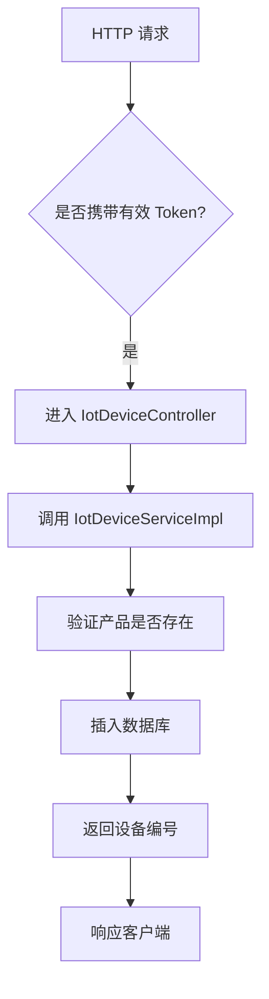
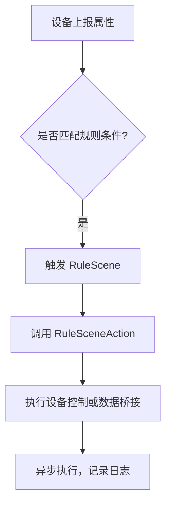
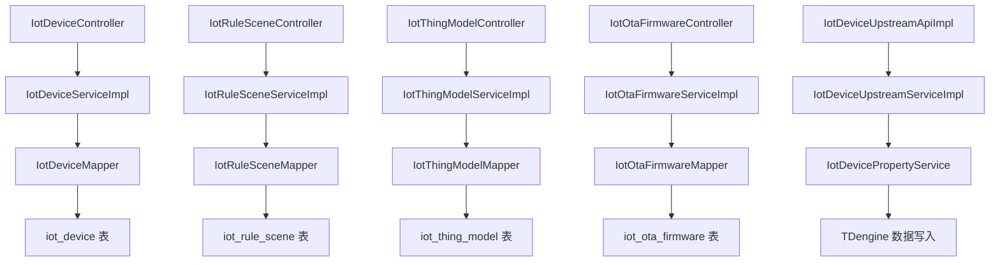

`pei-module-iot` 是一个 **物联网（IoT）管理模块**，其核心作用是为设备管理、产品管理、物模型定义、规则引擎、固件升级等功能提供统一的管理能力。该模块基于 Spring Boot 3.4 + Java 17 实现，遵循分层架构设计，并与 `Spring Security`、`MyBatis Plus`、`Redis`、`MQTT`、`HTTP`、`TDengine` 等技术栈深度集成。

---

## ✅ 模块概述

### 🎯 模块定位
- **目标**：构建统一的 IoT 设备管理后台，支持：
    - 设备注册、状态管理、属性上报
    - 物模型定义（属性、事件、服务）
    - 规则场景联动（触发器 + 执行器）
    - OTA 固件升级
    - 插件化扩展机制（HTTP、MQTT、EMQX）
    - 数据桥接与消息转发（如 Kafka、WebSocket、TCP 等）

- **应用场景**：
    - 工业 IoT 设备监控
    - 智能家居控制
    - 车联网数据采集
    - 医疗设备远程维护
    - 农业环境监测系统

- **技术栈依赖**：
    - Spring Boot + Spring Cloud Gateway + Nacos
    - MyBatis Plus + TDengine + Redis
    - MQTT + HTTP + WebSocket
    - MapStruct + Lombok + Hutool 工具类
    - Quartz 定时任务 + PF4J 插件框架

---

## 📁 目录结构说明

```
src/main/java/
└── com/pei/dehaze/module/iot/
    ├── api/                    // API 接口定义，供其它模块调用
    │   └── device/             // 设备上行接口
    ├── controller/             // 控制器层，处理 HTTP 请求
    │   └── admin/              // 管理后台控制器
    ├── convert/                // VO/DO 转换类
    ├── dal/                    // 数据访问层
    │   ├── dataobject/         // 数据库实体对象（DO）
    │   └── mysql/              // Mapper 层接口
    ├── framework/              // 框架扩展功能
    │   ├── job/                // 定时任务逻辑
    │   └── mq/                 // 消息队列逻辑
    ├── service/                // 业务逻辑实现
    │   ├── device/             // 设备管理服务
    │   ├── product/            // 产品管理服务
    │   ├── thingmodel/         // 物模型服务
    │   ├── rule/               // 规则引擎服务
    │   ├── ota/                // OTA 升级服务
    │   └── plugin/             // 插件管理服务
    ├── util/                   // 工具类
    └── IoTServerApplication.java // 启动类
```


---

## 🔍 关键包详解

### 1️⃣ `api.device` 包 —— 设备上行接口

#### 🔹 示例：`IotDeviceUpstreamApiImpl.java`
```java
@RestController
@Validated
public class IoTDeviceUpstreamApiImpl implements IotDeviceUpstreamApi {

    @Resource
    private IotDeviceUpstreamService deviceUpstreamService;
    @Resource
    private IotPluginInstanceService pluginInstanceService;

    @Override
    public CommonResult<Boolean> updateDeviceState(IotDeviceStateUpdateReqDTO updateReqDTO) {
        deviceUpstreamService.updateDeviceState(updateReqDTO);
        return success(true);
    }

    @Override
    public CommonResult<Boolean> reportDeviceProperty(IotDevicePropertyReportReqDTO reportReqDTO) {
        deviceUpstreamService.reportDeviceProperty(reportReqDTO);
        return success(true);
    }
}
```


- **作用**：对外暴露设备上行操作 RESTful 接口。
- **功能点**：
    - 设备状态更新
    - 属性上报
    - 事件上报
    - 子设备注册
    - EMQX 连接认证
- **优势**：
    - 使用 `BeanUtils` 实现 DO 到 DTO 的自动转换
    - 统一返回格式为 `CommonResult`

---

### 2️⃣ `controller.admin` 包 —— 管理后台控制器

#### 🔹 示例：`IotDeviceController.java`
```java
@Tag(name = "管理后台 - IoT 设备")
@RestController
@RequestMapping("/iot/device")
@Validated
public class IotDeviceController {

    @Resource
    private IotDeviceService iotDeviceService;

    @PostMapping("/create")
    @Operation(summary = "创建设备")
    @PreAuthorize("@ss.hasPermission('iot:device:create')")
    public CommonResult<Long> createDevice(@Valid @RequestBody IotDeviceSaveReqVO createReqVO) {
        return success(iotDeviceService.createDevice(createReqVO));
    }
}
```


- **作用**：对外暴露 `/iot/**` 接口，实现管理员相关的 CRUD 操作。
- **权限控制**：
    - 使用 `@PreAuthorize` 校验用户是否有操作权限
- **分页逻辑**：
    - 使用 `PageParam` 和 `PageResult` 实现统一分页规范

---

### 3️⃣ `convert` 包 —— VO/DO 转换

#### 🔹 示例：`GoViewProjectConvert.java`
```java
@Mapper
public interface GoViewProjectConvert {
    GoViewProjectConvert INSTANCE = Mappers.getMapper(GoViewProjectConvert.class);

    GoViewProjectDO convert(GoViewProjectCreateReqVO bean);
    GoViewProjectDO convert(GoViewProjectUpdateReqVO bean);
    GoViewProjectRespVO convert(GoViewProjectDO bean);
    PageResult<GoViewProjectRespVO> convertPage(PageResult<GoViewProjectDO> page);
}
```


- **作用**：使用 MapStruct 实现数据对象之间的自动转换。
- **优势**：
    - 避免手动 set/get，提升开发效率
    - 统一数据格式转换，避免类型错误

---

### 4️⃣ `dal.dataobject` 包 —— 数据库映射对象

#### 🔹 示例：`IotProductDO.java`
```java
@TableName("iot_product")
@KeySequence("iot_product_seq")
@Data
@Builder
@NoArgsConstructor
@AllArgsConstructor
public class IotProductDO extends TenantBaseDO {
    @TableId
    private Long id;
    private String name;
    private String productKey;
    private Integer categoryId;
    private String icon;
    private String picUrl;
    private String description;
    private Integer status;
    private Integer deviceType;
    private Integer netType;
    private Integer protocolType;
    private Long protocolId;
    private Integer dataFormat;
    private Integer validateType;
}
```


- **作用**：映射数据库表 `iot_product`。
- **字段说明**：
    - `productKey`: 产品唯一标识符
    - `deviceType`: 设备类型（直连、网关等）
    - `protocolType`: 协议类型（MQTT、HTTP、CoAP）
- **继承 TenantBaseDO**：包含多租户字段（如 `tenant_id`）

---

### 5️⃣ `service.device` 包 —— 设备管理服务

#### 🔹 示例：`IotDeviceServiceImpl.java`
```java
@Service
@Validated
@Slf4j
public class IotDeviceServiceImpl implements IotDeviceService {

    @Resource
    private IotDeviceMapper deviceMapper;

    @Resource
    @Lazy
    private IotDeviceGroupService deviceGroupService;

    @Override
    public Long createDevice(IotDeviceSaveReqVO createReqVO) {
        IotProductDO product = productService.getProduct(createReqVO.getProductId());
        if (product == null) {
            throw exception(PRODUCT_NOT_EXISTS);
        }

        IotDeviceDO device = BeanUtils.toBean(createReqVO, IotDeviceDO.class)
                .setStatus(IotProductStatusEnum.UNPUBLISHED.getStatus());
        deviceMapper.insert(device);
        return device.getId();
    }
}
```


- **作用**：实现设备生命周期管理的核心业务逻辑。
- **职责**：
    - 创建设备
    - 更新设备信息
    - 删除设备
    - 查询设备详情
- **日志记录**：
    - 使用 `@LogRecord` 注解记录操作日志

---

### 6️⃣ `service.product` 包 —— 产品管理服务

#### 🔹 示例：`IotProductServiceImpl.java`
```java
@Service
@Validated
public class IotProductServiceImpl implements IotProductService {

    @Resource
    private IotProductMapper productMapper;

    @Resource
    @Lazy
    private IotDevicePropertyService devicePropertyDataService;

    @Override
    public Long createProduct(IotProductSaveReqVO createReqVO) {
        TenantUtils.executeIgnore(() -> {
            if (productMapper.selectByProductKey(createReqVO.getProductKey()) != null) {
                throw exception(PRODUCT_KEY_EXISTS);
            }
        });

        IotProductDO product = BeanUtils.toBean(createReqVO, IotProductDO.class)
                .setStatus(IotProductStatusEnum.UNPUBLISHED.getStatus());
        productMapper.insert(product);
        return product.getId();
    }
}
```


- **作用**：实现产品创建、更新、查询等操作。
- **流程**：
    1. 校验 ProductKey 是否重复
    2. 插入数据库
    3. 返回产品 ID
- **异常处理**：
    - 抛出 `PRODUCT_KEY_EXISTS` 异常
    - 记录详细日志，便于后续排查问题

---

### 7️⃣ `service.thingmodel` 包 —— 物模型服务

#### 🔹 示例：`IotThingModelServiceImpl.java`
```java
@Service
@Validated
@Slf4j
public class IotThingModelServiceImpl implements IotThingModelService {

    @Resource
    private IotThingModelMapper thingModelMapper;

    @Resource
    private IotProductService productService;

    @Override
    @Transactional(rollbackFor = Exception.class)
    public Long createThingModel(IotThingModelSaveReqVO createReqVO) {
        validateIdentifierUnique(null, createReqVO.getProductId(), createReqVO.getIdentifier());
        validateNameUnique(createReqVO.getProductId(), createReqVO.getName());

        IotThingModelDO model = BeanUtils.toBean(createReqVO, IotThingModelDO.class);
        thingModelMapper.insert(model);
        return model.getId();
    }
}
```


- **作用**：实现对设备“物模型”的管理，包括属性、事件、服务定义。
- **关键校验**：
    - 功能标识符在同一产品下必须唯一
    - 功能名称在同一产品下必须唯一
- **事务控制**：
    - 使用 `@Transactional` 保证插入原子性

---

### 8️⃣ `service.rule` 包 —— 规则引擎服务

#### 🔹 示例：`IotRuleSceneServiceImpl.java`
```java
@Service
@Validated
@Slf4j
public class IotRuleSceneServiceImpl implements IotRuleSceneService {

    @Resource
    private IotRuleSceneMapper ruleSceneMapper;

    @Resource
    private List<IotRuleSceneAction> ruleSceneActions;

    @Resource(name = "iotSchedulerManager")
    private IotSchedulerManager schedulerManager;

    @Override
    @TenantIgnore
    public void executeRuleScene(IotDeviceMessage message) {
        List<IotRuleSceneDO> scenes = getActiveRuleScenes(message);
        for (IotRuleSceneDO scene : scenes) {
            for (IotRuleSceneAction action : ruleSceneActions) {
                if (action.getType() == scene.getActionType()) {
                    action.execute(message, scene.getConfig());
                }
            }
        }
    }
}
```


- **作用**：实现规则引擎的动态执行机制。
- **功能点**：
    - 支持多种执行器（设备控制、数据桥接）
    - 支持定时任务触发
    - 支持插件式扩展
- **调度机制**：
    - 使用 Quartz 实现定时任务管理

---

### 9️⃣ `service.ota` 包 —— OTA 固件升级服务

#### 🔹 示例：`IotOtaFirmwareService.java`
```java
public interface IotOtaFirmwareService {

    Long createOtaFirmware(@Valid IotOtaFirmwareCreateReqVO saveReqVO);
    void updateOtaFirmware(@Valid IotOtaFirmwareUpdateReqVO updateReqVO);
    IotOtaFirmwareDO getOtaFirmware(Long id);
    PageResult<IotOtaFirmwareDO> getOtaFirmwarePage(@Valid IotOtaFirmwarePageReqVO pageReqVO);
    IotOtaFirmwareDO validateFirmwareExists(Long id);
}
```


- **作用**：实现 OTA 固件版本的上传、管理、下发。
- **流程**：
    1. 上传固件文件
    2. 生成签名（MD5、SHA256）
    3. 下发到指定设备或设备组
- **安全性**：
    - 文件签名防止篡改
    - 权限控制限制非授权设备升级

---

### 🔟 `service.plugin` 包 —— 插件管理服务

#### 🔹 示例：`IotDeviceDownstreamHandler.java`
```java
public interface IotDeviceDownstreamHandler {
    CommonResult<Boolean> invokeDeviceService(IotDeviceServiceInvokeReqDTO invokeReqDTO);
    CommonResult<Boolean> getDeviceProperty(IotDevicePropertyGetReqDTO getReqDTO);
    CommonResult<Boolean> setDeviceProperty(IotDevicePropertySetReqDTO setReqDTO);
    CommonResult<Boolean> upgradeDeviceOta(IotDeviceOtaUpgradeReqDTO upgradeReqDTO);
}
```


- **作用**：定义插件标准接口，用于设备下行指令（如设置属性、调用服务、OTA 升级）。
- **插件机制**：
    - 使用 PF4J 插件框架
    - 支持 HTTP、MQTT、EMQX 多种协议插件
- **扩展性**：
    - 可通过配置中心动态加载插件
    - 插件可独立部署、热更新

---

## 🧠 模块工作流程图解

### 1️⃣ 设备注册流程



### 2️⃣ 规则引擎执行流程



---

## 🧱 模块间关系图




---

## 🧩 模块功能总结

| 包名 | 功能 | 关键类 |
|------|------|--------|
| `api.device` | 设备上行接口 | `IotDeviceUpstreamApiImpl` |
| `controller.admin` | management 控制器 | `IotDeviceController` |
| `convert` | VO/DO 转换 | `GoViewProjectConvert` |
| `dal.dataobject` | 数据库实体 | `IotProductDO` |
| `service.device` | 设备管理服务 | `IotDeviceServiceImpl` |
| `service.product` | 产品管理服务 | `IotProductServiceImpl` |
| `service.thingmodel` | 物模型服务 | `IotThingModelServiceImpl` |
| `service.rule` | 规则引擎服务 | `IotRuleSceneServiceImpl` |
| `service.ota` | OTA 固件升级服务 | `IotOtaFirmwareService` |
| `service.plugin` | 插件管理服务 | `IotDeviceDownstreamHandler` |

---

## 🧪 模块使用示例

### 1️⃣ 创建设备
```java
@PostMapping("/create")
@Operation(summary = "创建设备")
@PreAuthorize("@ss.hasPermission('iot:device:create')")
public CommonResult<Long> createDevice(@Valid @RequestBody IotDeviceSaveReqVO createReqVO) {
    return success(deviceService.createDevice(createReqVO));
}
```


- **请求参数**：
  ```json
  {
    "productId": 1024,
    "name": "测试设备",
    "deviceName": "dev001"
  }
  ```

- **响应结果**：
  ```json
  {
    "code": 0,
    "data": 1024,
    "msg": ""
  }
  ```


### 2️⃣ 规则引擎执行
```java
@Override
public void execute(IotDeviceMessage message, IotRuleSceneDO.ActionConfig config) {
    control.getDeviceNames().forEach(deviceName -> {
        IotDeviceDO device = deviceService.getDeviceByProductKeyAndDeviceNameFromCache(control.getProductKey(), deviceName);
        if (device == null) {
            log.error("设备不存在");
            return;
        }
        try {
            IotDeviceMessage downstreamMessage = deviceDownstreamService.downstreamDevice(new IotDeviceDownstreamReqVO()
                    .setId(device.getId()).setType(control.getType()));
            log.info("下发消息成功");
        } catch (Exception e) {
            log.error("下发失败", e);
        }
    });
}
```


- **用途**：当设备上报属性后，触发规则并下发指令。
- **流程**：
    1. 上报属性
    2. 匹配规则
    3. 下发指令到目标设备

---

## 🧾 模块实现原理详解

### 1️⃣ 物模型定义
- **ThingModelDO**：
    - 映射 `iot_thing_model` 表
    - 支持属性、事件、服务三类功能定义
- **Json 类型字段**：
    - 使用 `JacksonTypeHandler` 实现 JSON 字段的自动转换

### 2️⃣ 插件机制
- **PF4J**：
    - 使用 `pf4j-spring` 实现插件的动态加载
- **插件生命周期**：
    - 初始化 → 加载 → 执行 → 销毁

### 3️⃣ 规则引擎
- **Trigger + Action**：
    - Trigger：定义触发条件（如属性变化、时间到达）
    - Action：定义执行动作（如设备控制、数据桥接）

### 4️⃣ 数据存储
- **主数据库**：MySQL
- **时序数据库**：TDengine（用于存储设备属性、事件、日志等高频数据）
- **缓存机制**：Redis（用于缓存设备在线状态、属性值）

---

## ✅ 建议改进方向

| 改进点 | 描述 |
|--------|------|
| ✅ 多租户增强 | 当前仅支持单租户，未来需支持多租户数据隔离 |
| ✅ 异常日志增强 | 在 SQL 查询失败时记录详细日志，便于排查问题 |
| ✅ 性能优化 | 使用 `PreparedStatement` 替代 `queryForRowSet`，防止 SQL 注入 |
| ✅ 插件热加载 | 实现插件热加载和卸载，提升运维灵活性 |
| ✅ 自研边缘计算模块 | 当前依赖外部插件，未来应替换为自研方案，降低耦合度 |

---

## 📌 总结

`pei-module-iot` 模块实现了以下核心功能：

| 功能 | 技术实现 | 用途 |
|------|-----------|------|
| 设备管理 | DeviceDO + DeviceService | 设备注册、状态变更、属性上报 |
| 产品管理 | ProductDO + ProductService | 产品定义、分类、协议绑定 |
| 物模型 | ThingModelDO + ThingModelService | 属性、事件、服务定义 |
| 规则引擎 | RuleSceneDO + RuleSceneService | 设备联动、自动化控制 |
| OTA 固件升级 | FirmwareDO + FirmwareService | 设备固件升级 |
| 插件管理 | PluginInstanceDO + PF4J | 支持多种通信协议扩展 |
| 数据桥接 | DataBridgeDO + DataBridgeExecute | 数据转发至 Kafka、WebSocket 等 |

它是一个轻量但功能完整的 IoT 设备管理模块，适用于工业、医疗、农业、智能家居等场景。如果你有具体某个类（如 `IotDeviceServiceImpl`、`IotRuleSceneServiceImpl`）想要深入了解，欢迎继续提问！
