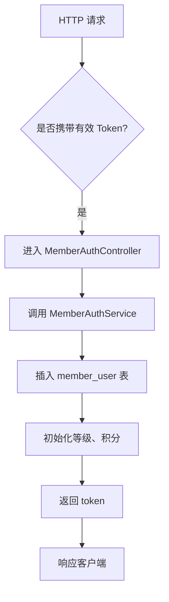
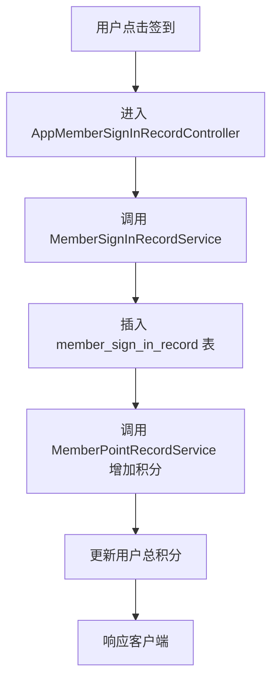
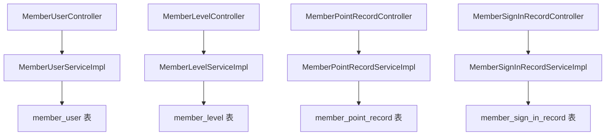

`pei-module-member` 是一个 **基于 Spring Boot 的会员中心模块（Member Center Module）**，其核心作用是为企业提供统一的用户管理、等级体系、积分系统、签到奖励等能力。该模块与商城、支付、微信公众号等多个业务系统深度集成，并支持多租户、分布式事务、异步处理等企业级功能。

---

## ✅ 模块概述

### 🎯 模块定位
- **目标**：构建统一的会员中心系统，支持：
    - 用户注册/登录/注销
    - 会员等级管理（升级规则、折扣设置）
    - 积分管理（获取、消费、记录）
    - 签到奖励机制（连续签到送积分）
    - 标签与分组管理（用于运营活动）
    - 收货地址管理（用于商城下单）

### 🧩 技术栈依赖
- **Spring Boot + Spring Cloud Gateway + Nacos**
- **数据访问层**：
    - MyBatis Plus + MySQL + Redis
- **消息队列**：
    - RocketMQ + XXL-Job（用于定时任务和异步回调）
- **安全认证**：
    - Spring Security + Token + Redis Session
- **其他工具类**：
    - Hutool 工具库、MapStruct 转换器、Jackson 多态序列化

---

## 📁 目录结构说明

```
src/main/java/
└── com/pei/dehaze/module/member/
    ├── api/                    // API 接口定义，供其它模块调用
    │   └── user                // 用户信息接口
    ├── controller/             // 控制器层，处理 HTTP 请求
    │   ├── admin/              // 管理后台控制器
    │   │   ├── address         // 地址管理
    │   │   ├── config          // 配置管理
    │   │   ├── group           // 分组管理
    │   │   ├── level           // 等级管理
    │   │   ├── point           // 积分管理
    │   │   ├── signin          // 签到管理
    │   │   ├── tag             // 标签管理
    │   │   └── user            // 用户管理
    │   └── app/                // 用户端 APP 控制器
    │       ├── address         // 地址管理
    │       ├── auth            // 登录/注册
    │       ├── level           // 等级查询
    │       ├── point           // 积分查询
    │       ├── signin          // 签到操作
    │       └── user            // 用户信息
    ├── convert/                // VO/DO 转换类
    ├── dal/                    // 数据访问层
    │   ├── dataobject/         // 数据库实体对象（DO）
    │   └── mysql/              // Mapper 层接口
    ├── framework/              // 框架扩展功能
    ├── mq/                     // 消息队列相关
    ├── service/                // 业务逻辑实现
    │   ├── address             // 地址服务
    │   ├── auth                // 认证服务
    │   ├── config              // 配置服务
    │   ├── group               // 分组服务
    │   ├── level               // :级服务
    │   ├── point               // 积分服务
    │   ├── signin              // 签到服务
    │   ├── tag                 // 标签服务
    │   └── user                // 用户服务
    ├── enums/                  // 枚举定义
    └── MemberServerApplication.java // 启动类
```


---

## 🔍 关键包详解

### 1️⃣ `api.user` 包 —— 用户信息接口定义

#### 示例：`MemberUserRespDTO.java`
```java
@Schema(description = "RPC 服务 - 用户信息 Response DTO")
@Data
public class MemberUserRespDTO {

    @Schema(description = "用户编号", requiredMode = Schema.RequiredMode.REQUIRED, example = "1024")
    private Long id;

    @Schema(description = "昵称", example = "小王同学")
    private String nickname;

    @Schema(description = "帐号状态", requiredMode = Schema.RequiredMode.REQUIRED, example = "1")
    private Integer status; // 参见 CommonStatusEnum 枚举

    @Schema(description = "用户头像", example = "https://www.iocoder.cn/xxx.jpg")
    private String avatar;

    @Schema(description = "手机号", example = "15601691300")
    private String mobile;

    @Schema(description = "创建时间", requiredMode = Schema.RequiredMode.REQUIRED)
    private LocalDateTime createTime;

    // ========== 其它信息 ==========

    @Schema(description = "会员级别编号", requiredMode = Schema.RequiredMode.REQUIRED, example = "1")
    private Long levelId;

    @Schema(description = "积分", requiredMode = Schema.RequiredMode.REQUIRED, example = "886")
    private Integer point;
}
```


- **作用**：对外暴露会员用户信息 DTO。
- **用途**：
    - 供其它模块远程调用（如商城、订单模块）
    - 提供基础字段供前端展示使用

---

### 2️⃣ `controller.admin.user` 包 —— 用户管理后台接口

#### 示例：`MemberUserController.java`
```java
@Tag(name = "管理后台 - 会员用户")
@RestController
@RequestMapping("/member/user")
@Validated
public class MemberUserController {

    @Resource
    private MemberUserService memberUserService;

    @PutMapping("/update")
    @Operation(summary = "更新会员用户")
    @PreAuthorize("@ss.hasPermission('member:user:update')")
    public CommonResult<Boolean> updateMember(@RequestBody @Valid AppMemberUserUpdateReqVO reqVO) {
        return success(memberUserService.updateUser(reqVO));
    }
}
```


- **作用**：对外暴露 `/member/user/**` 接口，实现管理员相关的用户操作。
- **权限控制**：
    - 使用 `@PreAuthorize` 校验用户是否有操作权限
- **返回值规范**：
    - 统一使用 `CommonResult`

---

### 3️⃣ `service.user` 包 —— 用户服务逻辑

#### 示例：`MemberUserServiceImpl.java`
```java
@Service
@Validated
@Slf4j
public class MemberUserServiceImpl implements MemberUserService {

    @Resource
    private MemberUserMapper userMapper;

    @Override
    public Long createUser(MemberUserCreateReqVO createReqVO) {
        MemberUserDO user = BeanUtils.toBean(createReqVO, MemberUserDO.class);
        user.setStatus(CommonStatusEnum.ENABLE.getStatus());
        userMapper.insert(user);
        return user.getId();
    }

    @Override
    public void updateUser(MemberUserUpdateReqVO updateReqVO) {
        MemberUserDO user = userMapper.selectById(updateReqVO.getId());
        if (user == null) {
            throw exception(USER_NOT_FOUND);
        }
        BeanUtils.copyProperties(user, updateReqVO);
        userMapper.updateById(user);
    }
}
```


- **作用**：实现会员用户的创建、更新、删除、查询等操作。
- **关键逻辑**：
    - 使用 `PasswordEncoder` 加密密码
    - 支持手机号、第三方授权登录
- **事务控制**：
    - 使用 `@Transactional` 保证插入和后续操作一致性

---

### 4️⃣ `dal.dataobject.user` 包 —— 用户数据库映射对象

#### 示例：`MemberUserDO.java`
```java
@TableName("member_user")
@KeySequence("member_user_seq")
@Data
@EqualsAndHashCode(callSuper = true)
@ToString(callSuper = true)
@Builder
@NoArgsConstructor
@AllArgsConstructor
public class MemberUserDO extends BaseDO {

    /**
     * 用户编号
     */
    @TableId
    private Long id;

    /**
     * 手机号
     */
    private String mobile;

    /**
     * 昵称
     */
    private String nickname;

    /**
     * 密码
     */
    private String password;

    /**
     * 帐号状态
     */
    private Integer status;

    /**
     * 头像 URL
     */
    private String avatar;

    /**
     * 会员等级编号
     */
    private Long levelId;

    /**
     * 当前经验
     */
    private Integer experience;

    /**
     * 当前积分
     */
    private Integer point;

    /**
     * 最后一次登录 IP
     */
    private String lastLoginIp;

    /**
     * 最后一次登录时间
     */
    private LocalDateTime lastLoginTime;
}
```


- **作用**：映射 `member_user` 表。
- **字段说明**：
    - `mobile`: 用户手机号（唯一）
    - `password`: 使用 BCrypt 加密存储
    - `experience`: 当前经验值（决定等级）
    - `point`: 当前积分（可用于兑换商品）
- **继承 BaseDO**：包含基础字段如 `creator`, `createTime`, `updater`, `updateTime`, `deleted`, `tenantId`

---

### 5️⃣ `service.level` 包 —— 会员等级服务逻辑

#### 示例：`MemberLevelServiceImpl.java`
```java
@Service
@Validated
@Slf4j
public class MemberLevelServiceImpl implements MemberLevelService {

    @Resource
    private MemberLevelMapper levelMapper;

    @Override
    public Long createLevel(MemberLevelCreateReqVO createReqVO) {
        MemberLevelDO level = BeanUtils.toBean(createReqVO, MemberLevelDO.class);
        levelMapper.insert(level);
        return level.getId();
    }

    @Override
    public void updateLevel(MemberLevelUpdateReqVO updateReqVO) {
        MemberLevelDO level = levelMapper.selectById(updateReqVO.getId());
        if (level == null) {
            throw exception(LEVEL_NOT_FOUND);
        }
        BeanUtils.copyProperties(level, updateReqVO);
        levelMapper.updateById(level);
    }
}
```


- **作用**：实现会员等级的创建、更新、删除、查询等操作。
- **关键逻辑**：
    - 自动匹配用户当前等级
    - 支持根据经验升级
- **事务控制**：
    - 使用 `@Transactional` 保证等级变动与用户经验同步更新

---

### 6️⃣ `dal.dataobject.level` 包 —— 会员等级数据库映射对象

#### 示例：`MemberLevelDO.java`
```java
@TableName("member_level")
@KeySequence("member_level_seq")
@Data
@EqualsAndHashCode(callSuper = true)
@ToString(callSuper = true)
@Builder
@NoArgsConstructor
@AllArgsConstructor
public class MemberLevelDO extends BaseDO {

    /**
     * 等级名称
     */
    private String name;

    /**
     * 等级数值（1、2、3...）
     */
    private Integer level;

    /**
     * 升级所需经验
     */
    private Integer experience;

    /**
     * 享受折扣百分比（如 95%）
     */
    private Integer discountPercent;

    /**
     * 状态（启用/禁用）
     */
    private Integer status;
}
```


- **作用**：映射 `member_level` 表。
- **字段说明**：
    - `level`: 等级数值（数字越大等级越高）
    - `experience`: 达到该经验值可升级
    - `discountPercent`: 享受的折扣比例
- **继承 BaseDO**：包含基础字段如 `creator`, `createTime`, `updater`, `updateTime`, `deleted`, `tenantId`

---

### 7️⃣ `service.point` 包 —— 积分服务逻辑

#### 示例：`MemberPointRecordServiceImpl.java`
```java
@Service
@Validated
@Slf4j
public class MemberPointRecordServiceImpl implements MemberPointRecordService {

    @Resource
    private MemberPointRecordMapper pointLogMapper;

    @Resource
    private MemberUserService userService;

    @Override
    public PageResult<MemberPointRecordDO> getPointRecordPage(MemberPointRecordPageReqVO pageVO) {
        return pointLogMapper.selectPage(pageVO);
    }

    @Override
    public void addPoint(Long userId, Integer point, Integer totalPoint,
                         MemberPointBizTypeEnum bizType, String bizId) {
        String description = StrUtil.format(bizType.getDescription(), point);
        MemberPointRecordDO record = new MemberPointRecordDO();
        record.setUserId(userId);
        record.setBizId(bizId);
        record.setBizType(bizType.getType());
        record.setTitle(bizType.getTitle());
        record.setDescription(description);
        record.setPoint(point);
        record.setTotalPoint(totalPoint);
        pointLogMapper.insert(record);
    }
}
```


- **作用**：实现会员积分的增减、查询、记录等操作。
- **关键逻辑**：
    - 支持多种积分来源（签到、邀请、下单）
    - 支持积分扣除（如兑换商品）
- **事务控制**：
    - 使用 `@Transactional` 保证积分变动与用户余额同步更新

---

### 8️⃣ `dal.dataobject.point` 包 —— 积分记录数据库映射对象

#### 示例：`MemberPointRecordDO.java`
```java
@TableName("member_point_record")
@KeySequence("member_point_record_seq")
@Data
@EqualsAndHashCode(callSuper = true)
@ToString(callSuper = true)
@Builder
@NoArgsConstructor
@AllArgsConstructor
public class MemberPointRecordDO extends BaseDO {

    /**
     * 用户编号
     */
    private Long userId;

    /**
     * 业务编号（如订单号、活动编号）
     */
    private String bizId;

    /**
     * 业务类型（枚举 MemberPointBizTypeEnum）
     */
    private Integer bizType;

    /**
     * 积分变化值（正数为增加，负数为减少）
     */
    private Integer point;

    /**
     * 变更后的总积分
     */
    private Integer totalPoint;

    /**
     * 描述
     */
    private String description;
}
```


- **作用**：映射 `member_point_record` 表。
- **字段说明**：
    - `userId`: 关联 `member_user.id`
    - `bizType`: 来源类型（如签到、邀请好友）
    - `point`: 正数表示获得积分，负数表示消耗积分
- **继承 BaseDO**：包含基础字段如 `creator`, `createTime`, `updater`, `updateTime`, `deleted`, `tenantId`

---

### 9️⃣ `service.signin` 包 —— 签到服务逻辑

#### 示例：`MemberSignInRecordServiceImpl.java`
```java
@Service
@Validated
@Slf4j
public class MemberSignInRecordServiceImpl implements MemberSignInRecordService {

    @Resource
    private MemberSignInRecordMapper signInRecordMapper;

    @Resource
    private MemberLevelService memberLevelService;

    @Resource
    private MemberPointRecordService pointRecordService;

    @Override
    public MemberSignInRecordDO createSignRecord(Long userId) {
        // 判断是否已签到
        if (signInRecordMapper.existsTodayRecord(userId)) {
            throw exception(SIGN_IN_RECORD_TODAY_EXISTS);
        }

        // 创建签到记录
        MemberSignInRecordDO record = new MemberSignInRecordDO();
        record.setUserId(userId);
        signInRecordMapper.insert(record);

        // 更新用户积分
        Integer point = memberLevelService.getLevel(userId).getSignInPoint();
        Integer totalPoint = pointRecordService.addPoint(userId, point, MemberPointBizTypeEnum.SIGN_IN, record.getId().toString());

        record.setPoint(point);
        record.setTotalPoint(totalPoint);
        signInRecordMapper.updateById(record);

        return record;
    }
}
```


- **作用**：实现每日签到、签到统计、签到奖励等功能。
- **流程说明**：
    - 每日只能签到一次
    - 签到成功后增加指定积分
- **事务控制**：
    - 使用 `@Transactional` 保证签到记录与积分同步更新

---

### 🔟 `enums.point` 包 —— 积分类型枚举

#### 示例：`MemberPointBizTypeEnum.java`
```java
@Getter
@AllArgsConstructor
public enum MemberPointBizTypeEnum implements ArrayValuable<Integer> {

    SIGN_IN(0, "签到奖励", "签到获得 {} 积分", true),
    INVITE_REGISTER(1, "邀请奖励", "邀请好友获得 {} 积分", true),
    ORDER_GIVE(2, "下单奖励", "下单获得 {} 积分", true),
    REDEEM(3, "积分兑换", "积分兑换 {} 商品", false);

    private final Integer type;
    private final String title;
    private final String description;
    private final boolean add;
}
```


- **作用**：统一管理积分业务类型。
- **优势**：
    - 减少魔法数字
    - 提供静态方法简化判断逻辑

---

## 🧠 模块工作流程图解

### 1️⃣ 用户注册流程



### 2️⃣ 签到奖励流程



---

## 🧱 模块间关系图




---

## 🧩 模块功能总结

| 包名 | 功能 | 关键类 |
|------|------|--------|
| `api.user` | 用户信息接口定义 | `MemberUserRespDTO` |
| `controller.admin.user` | 用户管理后台 | `MemberUserController` |
| `service.user` | 用户服务逻辑 | `MemberUserServiceImpl` |
| `dal.dataobject.user` | 用户数据 | `MemberUserDO` |
| `service.level` | 会员等级服务 | `MemberLevelServiceImpl` |
| `dal.dataobject.level` | 会员等级数据 | `MemberLevelDO` |
| `service.point` | 积分服务逻辑 | `MemberPointRecordServiceImpl` |
| `dal.dataobject.point` | 积分记录数据 | `MemberPointRecordDO` |
| `service.signin` | 签到服务逻辑 | `MemberSignInRecordServiceImpl` |
| `dal.dataobject.signin` | 签到记录数据 | `MemberSignInRecordDO` |

---

## 🧾 模块实现原理详解

### 1️⃣ 用户注册流程
- **步骤**：
    1. 用户提交注册请求
    2. 进入 `MemberAuthController`
    3. 调用 `MemberAuthService.create(...)`
    4. 插入 `member_user` 表
    5. 初始化默认等级和积分
    6. 返回 token 和用户信息

### 2️⃣ 签到奖励流程
- **步骤**：
    1. 用户点击签到按钮
    2. 进入 `AppMemberSignInRecordController.create(...)`
    3. 调用 `MemberSignInRecordService.create(...)`
    4. 插入 `member_sign_in_record` 表
    5. 调用 `MemberPointRecordService.addPoint(...)`
    6. 更新用户总积分并返回

### 3️⃣ 会员等级提升流程
- **步骤**：
    1. 用户完成某项任务（如签到、邀请）
    2. 增加经验（通过 `MemberExperienceRecordService.create(...)`）
    3. 判断是否满足升级条件
    4. 若满足，则调用 `MemberLevelService.upgrade(...)`
    5. 插入 `member_level_record` 表
    6. 更新用户等级、折扣等信息

---

## ✅ 建议改进方向

| 改进点 | 描述 |
|--------|------|
| ✅ 多租户增强 | 当前仅支持单租户，未来需支持多租户数据隔离 |
| ✅ 异常日志增强 | 在 SQL 查询失败时记录详细日志，便于排查问题 |
| ✅ 性能优化 | 使用 `PreparedStatement` 替代 `queryForRowSet`，防止 SQL 注入 |
| ✅ 单元测试 | 当前代码未提供单元测试，建议补充测试用例 |
| ✅ 流程监控 | 增加签到率、等级转化率、积分兑换率等指标统计 |

---

## 📌 总结

`pei-module-member` 模块实现了以下核心功能：

| 功能 | 技术实现 | 用途 |
|------|-----------|------|
| 用户注册 | MemberUserDO + MemberUserService | 管理用户生命周期 |
| 会员等级 | MemberLevelDO + MemberLevelService | 管理用户等级、折扣、经验 |
| 积分管理 | MemberPointRecordDO + MemberPointRecordService | 算法计算、积分发放、兑换 |
| 签到奖励 | MemberSignInRecordDO + MemberSignInRecordService | 每日签到送积分 |
| 用户标签 | MemberTagDO + MemberTagService | 用户分组、精准营销 |
| 用户分组 | MemberGroupDO + MemberGroupService | 用于会员分类运营 |
| 地址管理 | MemberAddressDO + MemberAddressService | 用于商城下单、物流配送 |

它是一个轻量但功能完整的会员中心模块，适用于电商、社交、CRM、ERP 等需要用户体系的场景。如果你有具体某个类（如 `MemberUserServiceImpl`、`MemberSignInRecordServiceImpl`）想要深入了解，欢迎继续提问！
