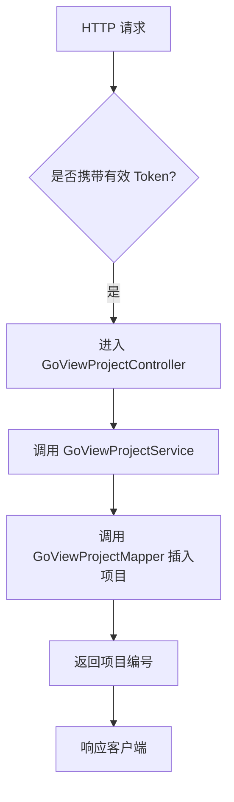
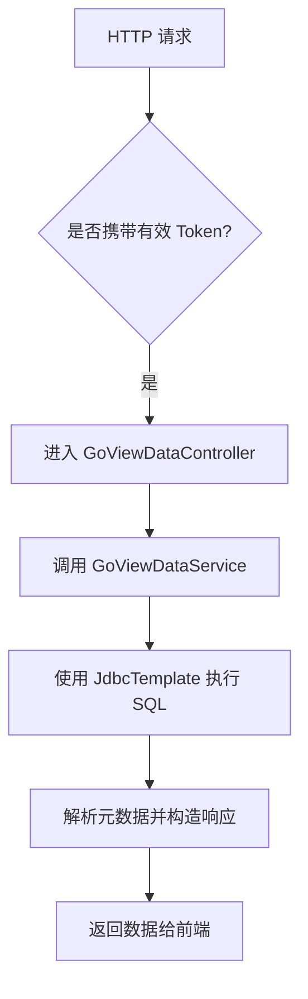

`pei-module-report` 是一个 **数据可视化报表模块**，其核心作用是为管理后台提供 **大屏设计、图表展示、报表分析** 等功能。该模块基于「积木报表」（JimuReport）实现，并结合自研的 GoView 项目，构建了一套完整的数据可视化解决方案。

---

## 一、模块概述

### ✅ 模块定位
- **目标**：提供一套灵活的数据可视化系统，支持：
    - 大屏设计器（GoView）
    - 报表拖拽式配置
    - 图形化数据展示
    - 数据源灵活接入（SQL/HTTP/API）
- **应用场景**：
    - 运营后台的大屏监控
    - 数据分析平台的可视化展示
    - BI 报表系统
- **技术栈依赖**：
    - Spring Boot + Spring MVC + MyBatis Plus
    - JimuReport（前端报表组件）
    - Redis + MySQL + Druid
    - Swagger3 + Knife4j（接口文档）

---

## 二、目录结构说明

```
src/main/java/
└── com/pei/dehaze/module/report/
    ├── controller/admin/goview/        // GoView 控制器层
    │   └── vo                        // VO 对象定义
    ├── convert/goview/               // GoView 转换类
    ├── dal/dataobject/goview/         // GoView 数据库映射对象
    ├── dal/mysql/goview/              // GoView Mapper 层
    ├── framework/
    │   ├── jmreport/                 // 积木报表集成
    │   ├── rpc/                      // RPC 接口调用相关
    │   └── security/                // 安全认证相关
    ├── service/goview/               // GoView 业务逻辑层
    └── ReportServerApplication.java // 启动类
```


---

## 三、关键包详解

### 1️⃣ `controller.admin.goview` 包 —— GoView 控制器层

#### 🔹 `GoViewDataController.java`
```java
@RestController
@RequestMapping("/report/go-view/data")
@Validated
public class GoViewDataController {

    @Resource
    private GoViewDataService goViewDataService;

    @RequestMapping("/get-by-sql")
    public CommonResult<GoViewDataRespVO> getDataBySQL(@Valid @RequestBody GoViewDataGetBySqlReqVO reqVO) {
        return success(goViewDataService.getDataBySQL(reqVO.getSql()));
    }

    @RequestMapping("/get-by-http")
    public CommonResult<GoViewDataRespVO> getDataByHttp(...) {
        // 示例返回随机数据
    }
}
```

- **作用**：对外暴露 `/report/go-view/data` 接口，用于查询报表数据。
- **功能点**：
    - 支持 SQL 查询（`getDataBySQL`）
    - 支持 HTTP 请求查询（`getDataByHttp`），可扩展为第三方 API 查询
- **权限控制**：通过 `@PreAuthorize` 实现权限校验。

#### 🔹 `GoViewProjectController.java`
```java
@RestController
@RequestMapping("/report/go-view/project")
@Validated
public class GoViewProjectController {

    @PostMapping("/create")
    public CommonResult<Long> createProject(...) {
        return success(goViewProjectService.createProject(...))
    }

    @PutMapping("/update")
    public CommonResult<Boolean> updateProject(...) {
        goViewProjectService.updateProject(...)
        return success(true);
    }

    @DeleteMapping("/delete")
    public CommonResult<Boolean> deleteProject(...) {
        goViewProjectService.deleteProject(...)
        return success(true);
    }

    @GetMapping("/get")
    public CommonResult<GoViewProjectRespVO> getProject(...) {
        return success(GoViewProjectConvert.INSTANCE.convert(project));
    }

    @GetMapping("/my-page")
    public CommonResult<PageResult<GoViewProjectRespVO>> getMyProjectPage(...) {
        return success(GoViewProjectConvert.INSTANCE.convertPage(pageResult));
    }
}
```

- **作用**：实现对 GoView 项目的 CRUD 操作。
- **接口功能**：
    - 创建、更新、删除项目
    - 获取单个项目详情
    - 分页获取当前用户创建的项目列表
- **分页逻辑**：使用 `PageParam` 和 `PageResult`，符合统一分页规范。

---

### 2️⃣ `convert.goview` 包 —— GoView 数据转换

#### 🔹 `GoViewProjectConvert.java`
```java
@Mapper
public interface GoViewProjectConvert {
    GoViewProjectConvert INSTANCE = Mappers.getMapper(GoViewProjectConvert.class);

    GoViewProjectDO convert(GoViewProjectCreateReqVO bean);
    GoViewProjectDO convert(GoViewProjectUpdateReqVO bean);
    GoViewProjectRespVO convert(GoViewProjectDO bean);
    PageResult<GoViewProjectRespVO> convertPage(PageResult<GoViewProjectDO> page);
}
```

- **作用**：使用 MapStruct 实现 DTO 与 DO 的自动转换。
- **优势**：
    - 避免手动 set/get，提升开发效率
    - 统一数据格式转换，避免类型错误
- **示例**：
  ```java
  GoViewProjectDO projectDO = GoViewProjectConvert.INSTANCE.convert(createReqVO);
  ```


---

### 3️⃣ `dal.dataobject.goview` 包 —— GoView 数据库映射对象

#### 🔹 `GoViewProjectDO.java`
```java
@TableName("report_go_view_project")
@KeySequence("report_go_view_project_seq")
@Data
@EqualsAndHashCode(callSuper = true)
@Builder
@NoArgsConstructor
@AllArgsConstructor
public class GoViewProjectDO extends BaseDO {
    @TableId
    private Long id;
    private String name;
    private String picUrl;
    private String content; // JSON 格式
    private Integer status;
    private String remark;
}
```

- **作用**：映射数据库表 `report_go_view_project`。
- **字段说明**：
    - `name`: 项目名称
    - `picUrl`: 预览图 URL
    - `content`: 报表内容（JSON 存储）
    - `status`: 发布状态（0 已发布 / 1 未发布）
- **继承 BaseDO**：包含通用字段（如 `creator`, `updater`, `createTime`, `updateTime`）

---

### 4️⃣ `dal.mysql.goview` 包 —— GoView 数据访问层

#### 🔹 `GoViewProjectMapper.java`
```java
@Mapper
public interface GoViewProjectMapper extends BaseMapperX<GoViewProjectDO> {
    default PageResult<GoViewProjectDO> selectPage(PageParam reqVO, Long userId) {
        return selectPage(reqVO, new LambdaQueryWrapperX<GoViewProjectDO>()
                .eq(GoViewProjectDO::getCreator, userId)
                .orderByDesc(GoViewProjectDO::getId));
    }
}
```

- **作用**：操作 `report_go_view_project` 表。
- **继承 BaseMapperX**：封装了分页、条件查询等常用方法。
- **查询逻辑**：
    - 只能查询当前用户的项目
    - 默认按 ID 倒序排列

---

### 5️⃣ `service.goview` 包 —— GoView 服务层

#### 🔹 `GoViewProjectService.java`
```java
public interface GoViewProjectService {
    Long createProject(GoViewProjectCreateReqVO createReqVO);
    void updateProject(GoViewProjectUpdateReqVO updateReqVO);
    void deleteProject(Long id);
    GoViewProjectDO getProject(Long id);
    PageResult<GoViewProjectDO> getMyProjectPage(PageParam pageReqVO, Long userId);
}
```

- **作用**：GoView 项目的核心业务接口。
- **职责**：
    - 创建项目
    - 更新项目
    - 删除项目
    - 获取项目信息
    - 分页查询用户项目

#### 🔹 `GoViewProjectServiceImpl.java`
```java
@Service
@Validated
public class GoViewProjectServiceImpl implements GoViewProjectService {

    @Resource
    private GoViewProjectMapper goViewProjectMapper;

    @Override
    public Long createProject(GoViewProjectCreateReqVO createReqVO) {
        GoViewProjectDO project = GoViewProjectConvert.INSTANCE.convert(createReqVO)
                .setStatus(CommonStatusEnum.DISABLE.getStatus());
        goViewProjectMapper.insert(project);
        return project.getId();
    }

    @Override
    public void updateProject(GoViewProjectUpdateReqVO updateReqVO) {
        validateProjectExists(updateReqVO.getId());
        GoViewProjectDO updateObj = GoViewProjectConvert.INSTANCE.convert(updateReqVO);
        goViewProjectMapper.updateById(updateObj);
    }

    @Override
    public void deleteProject(Long id) {
        validateProjectExists(id);
        goViewProjectMapper.deleteById(id);
    }

    private void validateProjectExists(Long id) {
        if (goViewProjectMapper.selectById(id) == null) {
            throw exception(GO_VIEW_PROJECT_NOT_EXISTS);
        }
    }

    @Override
    public GoViewProjectDO getProject(Long id) {
        return goViewProjectMapper.selectById(id);
    }

    @Override
    public PageResult<GoViewProjectDO> getMyProjectPage(PageParam pageReqVO, Long userId) {
        return goViewProjectMapper.selectPage(pageReqVO, userId);
    }
}
```

- **作用**：GoView 项目业务逻辑的具体实现。
- **异常处理**：使用 `exception()` 方法抛出业务异常，符合全局异常处理规范。
- **事务控制**：所有数据库操作都走 Mapper，符合事务分离原则。

---

### 6️⃣ `framework.jmreport` 包 —— 积木报表集成

#### 🔹 `JmReportConfiguration.java`
```java
@Configuration(proxyBeanMethods = false)
@ComponentScan(basePackages = "org.jeecg.modules.jmreport")
public class JmReportConfiguration {

    @Bean
    public JmReportTokenServiceI jmReportTokenService(OAuth2TokenCommonApi oAuth2TokenApi,
                                                      PermissionCommonApi permissionApi,
                                                      SecurityProperties securityProperties) {
        return new JmReportTokenServiceImpl(oAuth2TokenApi, permissionApi, securityProperties);
    }

    @Bean
    @Primary
    public JmOnlDragExternalServiceImpl jmOnlDragExternalService() {
        return new JmOnlDragExternalServiceImpl();
    }
}
```

- **作用**：配置积木报表所需的 Token 认证和外部数据源服务。
- **集成方式**：
    - 使用 `OAuth2TokenCommonApi` 和 `PermissionCommonApi` 实现 Token 校验
    - 使用 `JmOnlDragExternalServiceImpl` 提供字典、日志等基础服务

#### 🔹 `JmReportTokenServiceImpl.java`
```java
@Service
@RequiredArgsConstructor
public class JmReportTokenServiceImpl implements JmReportTokenServiceI {

    private final OAuth2TokenCommonApi oauth2TokenApi;
    private final PermissionCommonApi permissionApi;
    private final SecurityProperties securityProperties;

    @Override
    public HttpHeaders customApiHeader() {
        HttpServletRequest request = ServletUtils.getRequest();
        String token = request.getHeader("X-Access-Token");
        HttpHeaders headers = new HttpHeaders();
        headers.add(securityProperties.getTokenHeader(), String.format(AUTHORIZATION_FORMAT, token));
        return headers;
    }

    @Override
    public Boolean verifyToken(String token) {
        return buildLoginUserByToken(token) != null;
    }

    @Override
    public String getUsername(String token) {
        LoginUser user = buildLoginUserByToken(token);
        return user == null ? null : String.valueOf(user.getId());
    }

    @Override
    public String[] getRoles(String token) {
        LoginUser loginUser = SecurityFrameworkUtils.getLoginUser();
        if (loginUser == null) return null;
        return permissionApi.hasAnyRoles(loginUser.getId(), RoleCodeEnum.SUPER_ADMIN.getCode()).getCheckedData()
                ? new String[]{"admin"} : null;
    }

    @Override
    public String getTenantId() {
        LoginUser loginUser = SecurityFrameworkUtils.getLoginUser();
        return StrUtil.toStringOrNull(loginUser != null ? loginUser.getTenantId() : null);
    }
}
```

- **作用**：实现积木报表的 Token 校验、用户身份识别、角色权限验证。
- **认证流程**：
    1. 从请求头中提取 `X-Access-Token`
    2. 调用 `oauth2TokenApi.checkAccessToken(token)` 验证 Token 是否有效
    3. 设置登录用户上下文，完成认证

#### 🔹 `JmOnlDragExternalServiceImpl.java`
```java
@Service
@RequiredArgsConstructor
public class JmOnlDragExternalServiceImpl implements IOnlDragExternalService {
    // 字典项获取、日志记录等方法
}
```

- **作用**：为积木报表提供数据字典、日志记录等基础服务。
- **实现参考**：
    - 字典项查询（`getDictItems`）
    - 日志记录（`addLog`）
    - 用户、部门数据源查询

---

### 7️⃣ `enums` 包 —— 错误码定义

#### 🔹 `ErrorCodeConstants.java`
```java
public interface ErrorCodeConstants {
    ErrorCode GO_VIEW_PROJECT_NOT_EXISTS = new ErrorCode(1_003_000_000, "GoView 项目不存在");
}
```

- **作用**：定义 GoView 模块的错误码，便于统一异常处理。
- **使用方式**：
  ```java
  throw exception(GO_VIEW_PROJECT_NOT_EXISTS);
  ```


---

### 8️⃣ `package-info.java` 包 —— 模块注解说明

#### 🔹 `report` 包说明
```java
/**
 * report 模块，主要实现数据可视化报表等功能：
 * 1. 基于「积木报表」实现，打印设计、报表设计、图形设计、大屏设计等。
 */
package com.pei.dehaze.module.report;
```

- **作用**：描述整个模块的功能和架构设计。
- **补充说明**：
    - 当前基于积木报表，未来将自研大屏设计器
    - 项目 URL 前缀为 `/jmreport`，表名前缀为 `jimu_`

---

## 四、模块功能总结

| 包名 | 功能 | 关键类 |
|------|------|--------|
| `controller.admin.goview` | GoView 控制器 | `GoViewDataController`, `GoViewProjectController` |
| `convert.goview` | VO/DO 转换 | `GoViewProjectConvert` |
| `dal.dataobject.goview` | 数据库实体 | `GoViewProjectDO` |
| `dal.mysql.goview` | 数据库访问 | `GoViewProjectMapper` |
| `service.goview` | 业务逻辑 | `GoViewProjectService`, `GoViewProjectServiceImpl` |
| `framework.jmreport.config` | 积木报表配置 | `JmReportConfiguration` |
| `framework.jmreport.core.service` | 积木报表服务 | `JmReportTokenServiceImpl`, `JmOnlDragExternalServiceImpl` |
| `enums` | 错误码定义 | `ErrorCodeConstants.java` |

---

## 五、模块工作流程图解

### 1️⃣ GoView 项目创建流程



### 2️⃣ GoView 数据查询流程



---

## 六、模块使用示例

### 1️⃣ 创建 GoView 项目
```java
@PostMapping("/create")
@Operation(summary = "创建项目")
@PreAuthorize("@ss.hasPermission('report:go-view-project:create')")
public CommonResult<Long> createProject(@Valid @RequestBody GoViewProjectCreateReqVO createReqVO) {
    return success(goViewProjectService.createProject(createReqVO));
}
```

- **请求参数**：
  ```json
  {
    "name": "销售统计"
  }
  ```

- **响应结果**：
  ```json
  {
    "code": 0,
    "data": 1024,
    "msg": ""
  }
  ```


### 2️⃣ 查询 GoView 数据
```java
@RequestMapping("/get-by-sql")
public CommonResult<GoViewDataRespVO> getDataBySQL(@Valid @RequestBody GoViewDataGetBySqlReqVO reqVO) {
    return success(goViewDataService.getDataBySQL(reqVO.getSql()));
}
```

- **请求参数**：
  ```json
  {
    "sql": "SELECT * FROM sales_data WHERE date > '2024-01-01'"
  }
  ```

- **响应结果**：
  ```json
  {
    "dimensions": ["日期", "销售额", "销量"],
    "source": [
      {"日期": "2024-01-01", "销售额": 10000, "销量": 100},
      {"日期": "2024-01-02", "销售额": 12000, "销量": 120}
    ]
  }
  ```


---

## 七、模块实现原理详解

### 1️⃣ GoView 项目管理
- **创建流程**：
    - 使用 `GoViewProjectConvert.INSTANCE.convert()` 将 VO 转换为 DO
    - 调用 `insert()` 插入数据库
- **更新流程**：
    - 先调用 `selectById()` 校验项目是否存在
    - 使用 `updateById()` 更新数据库
- **删除流程**：
    - 先校验存在性
    - 调用 `deleteById()` 删除项目

### 2️⃣ GoView 数据查询
- **SQL 查询**：
    - 使用 `JdbcTemplate.queryForRowSet(sql)` 执行 SQL
    - 解析 `SqlRowSetMetaData` 获取字段名
    - 构造 `GoViewDataRespVO` 返回给前端
- **性能优化**：
    - 使用 `LinkedList` 存储明细数据，避免频繁扩容
    - 使用 `Maps.newHashMapWithExpectedSize()` 构造数据 map，提高性能

### 3️⃣ 积木报表集成
- **Token 校验**：
    - 使用 `buildLoginUserByToken()` 从 Nacos 获取 Token 信息
    - 设置 `SecurityFrameworkUtils.setLoginUser()` 登录上下文
- **角色权限**：
    - 如果用户是超级管理员，返回 `["admin"]`
- **租户隔离**：
    - 使用 `TenantContextHolder.setTenantId()` 设置租户上下文

---

## 八、典型配置示例

### application-local.yaml
```yaml
spring:
  datasource:
    dynamic:
      primary: master
      datasource:
        master:
          url: jdbc:mysql://127.0.0.1:3306/pei_report
          username: root
          password: 123456
  data:
    redis:
      host: 127.0.0.1
      port: 6379
      database: 0
      password: 123456
```


---

## 九、建议改进方向

| 改进点 | 描述 |
|--------|------|
| ✅ 自研大屏设计器 | 当前依赖积木报表，未来应替换为自研方案，降低依赖风险 |
| ✅ 数据源多租户支持 | 当前仅支持单租户，未来需支持多租户数据隔离 |
| ✅ 多数据库适配 | 当前默认使用 MySQL，未来需支持 PostgreSQL、Oracle、ClickHouse 等 |
| ✅ 性能优化 | 使用 `PreparedStatement` 替代 `queryForRowSet`，防止 SQL 注入 |
| ✅ 异常日志增强 | 在 SQL 查询失败时记录详细日志，便于排查问题 |

---

## 十、总结

`pei-module-report` 模块实现了以下核心功能：

| 功能          | 技术实现                                                         | 用途               |
|-------------|--------------------------------------------------------------|------------------|
| GoView 项目管理 | GoViewProjectDO + GoViewProjectMapper + GoViewProjectService | 项目增删改查           |
| GoView 数据查询 | JdbcTemplate + GoViewDataRespVO                              | 支持 SQL/HTTP 查询数据 |
| 积木报表集成      | JmReportTokenServiceI + JmOnlDragExternalServiceImpl         | 支持积木仪表盘认证和数据源    |
| 错误码管理       | ErrorCodeConstants + ServiceException                        | 统一异常提示           |

它是一个轻量但功能完整的数据可视化模块，适用于电商、金融、BI 等场景。如果你有具体某个类（如 `GoViewProjectServiceImpl`、`JmReportTokenServiceImpl`）想要深入了解，欢迎继续提问！
