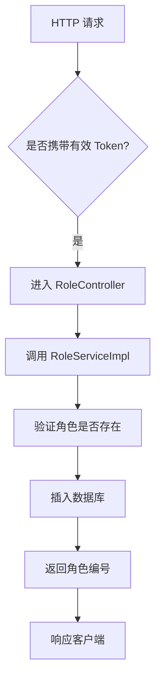
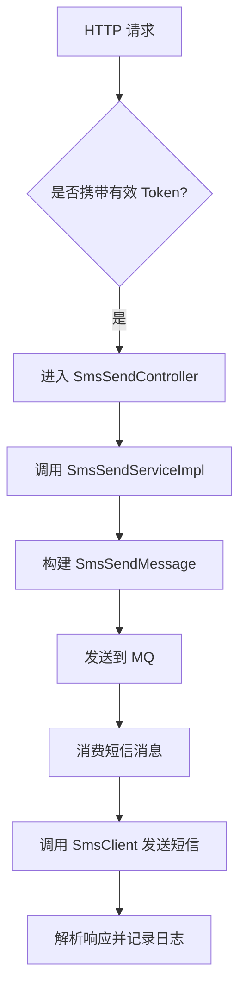

`pei-module-system` 是一个 **系统管理模块**，其核心作用是为微服务架构下的权限、用户、部门、角色、短信、邮件等基础功能提供统一的管理能力。该模块基于 Spring Boot 3.4 + Java 17 实现，遵循分层架构设计，并与 `Spring Security`、`OAuth2`、`MyBatis Plus` 等技术栈深度集成。

---

## 一、模块概述

### ✅ 模块定位
- **目标**：构建统一的系统管理后台，支持：
    - 用户管理（账号、权限、登录）
    - 部门管理（组织结构、权限隔离）
    - 角色与权限配置（RBAC 权限模型）
    - 社交登录（微信、QQ、微博等第三方登录）
    - 短信/邮件发送（验证码、通知）
    - 租户管理（SaaS 支持）
- **应用场景**：
    - 管理后台的权限控制系统
    - 多租户 SaaS 平台的基础支撑模块
    - 用户注册、登录、安全控制
- **技术栈依赖**：
    - Spring Boot + Spring Cloud Gateway + Nacos
    - MyBatis Plus + MySQL + Redis
    - OAuth2 + JWT + Spring Security
    - MapStruct + Lombok + Hutool 工具类

---

## 二、目录结构说明

```
src/main/java/
└── com/pei/dehaze/module/system/
    ├── api/                    // API 接口定义，供其它模块调用
    │   └── social/             // 社交相关 API 接口
    ├── controller/             // 控制器层，处理 HTTP 请求
    │   └── admin/              // 管理后台控制器
    ├── convert/                // VO/DO 转换类
    ├── dal/                    // 数据访问层
    │   ├── dataobject/         // 数据库实体对象（DO）
    │   └── mysql/              // Mapper 层接口
    ├── framework/              // 框架扩展功能
    │   ├── sms/                // 短信服务封装
    │   └── mail/               // 邮件服务封装
    ├── job/                    // 定时任务逻辑
    ├── mq/                     // 消息队列逻辑
    ├── service/                // 业务逻辑实现
    │   ├── permission/         // 权限管理服务
    │   ├── user/               // 用户管理服务
    │   ├── dept/               // 部门管理服务
    │   ├── role/               // 角色管理服务
    │   ├── tenant/             // 租户管理服务
    │   ├── social/             // 社交服务（微信、QQ 登录）
    │   ├── sms/                // 短信服务（验证码、通知）
    │   ├── mail/               // 邮件服务（模板、发送）
    │   └── notify/             // 站内信服务
    └── SystemServerApplication.java // 启动类
```


---

## 三、关键包详解

### 1️⃣ `api.social` 包 —— 社交相关 API 接口

#### 🔹 `SocialClientApiImpl.java`
```java
@RestController
@Validated
public class SocialClientApiImpl implements SocialClientApi {

    @Resource
    private SocialClientService socialClientService;
    @Resource
    private SocialUserService socialUserService;

    @Override
    public CommonResult<String> getAuthorizeUrl(...) {
        return success(socialClientService.getAuthorizeUrl(...))
    }

    @Override
    public CommonResult<SocialWxJsapiSignatureRespDTO> createWxMpJsapiSignature(...) {
        WxJsapiSignature signature = socialClientService.createWxMpJsapiSignature(...)
        return success(BeanUtils.toBean(signature, ...))
    }
}
```

- **作用**：对外暴露社交功能的 RESTful 接口。
- **功能点**：
    - 获取授权 URL（用于第三方登录）
    - 生成微信 JSAPI 签名
    - 获取微信小程序手机号信息
    - 生成微信小程序二维码
- **优势**：
    - 使用 `BeanUtils` 实现 DO 到 DTO 的自动转换
    - 统一返回格式为 `CommonResult`

---

### 2️⃣ `controller.admin` 包 —— 管理后台控制器

#### 🔹 示例：`AdminController.java`
```java
@Tag(name = "管理后台 - 文章分类")
@RestController
@RequestMapping("/promotion/article-category")
@Validated
public class ArticleCategoryController {

    @Resource
    private ArticleCategoryService articleCategoryService;

    @PostMapping("/create")
    @Operation(summary = "创建文章分类")
    @PreAuthorize("@ss.hasPermission('promotion:article-category:create')")
    public CommonResult<Long> createArticleCategory(...) {
        return success(articleCategoryService.createArticleCategory(createReqVO));
    }
}
```

- **作用**：对外暴露 `/system/**` 接口，实现管理员相关的 CRUD 操作。
- **权限控制**：
    - 使用 `@PreAuthorize` 校验用户是否有操作权限
- **分页逻辑**：
    - 使用 `PageParam` 和 `PageResult` 实现统一分页规范

---

### 3️⃣ `convert` 包 —— VO/DO 转换

#### 🔹 `GoViewProjectConvert.java`
```java
@Mapper
public interface GoViewProjectConvert {
    GoViewProjectConvert INSTANCE = Mappers.getMapper(GoViewProjectConvert.class);

    GoViewProjectDO convert(GoViewProjectCreateReqVO bean);
    GoViewProjectDO convert(GoViewProjectUpdateReqVO bean);
    GoViewProjectRespVO convert(GoViewProjectDO bean);
    PageResult<GoViewProjectRespVO> convertPage(PageResult<GoViewProjectDO> page);
}
```

- **作用**：使用 MapStruct 实现数据对象之间的自动转换。
- **优势**：
    - 避免手动 set/get，提升开发效率
    - 统一数据格式转换，避免类型错误

---

### 4️⃣ `dal.dataobject` 包 —— 数据库映射对象

#### 🔹 `SocialClientDO.java`
```java
@TableName("system_social_client")
@KeySequence("system_social_client_seq")
@Data
@EqualsAndHashCode(callSuper = true)
@Builder
@NoArgsConstructor
@AllArgsConstructor
public class SocialClientDO extends TenantBaseDO {
    @TableId
    private Long id;
    private String name;
    private Integer socialType;
    private Integer userType;
    private Integer status;
    private String clientId;
    private String clientSecret;
    private String agentId;
}
```

- **作用**：映射数据库表 `system_social_client`。
- **字段说明**：
    - `socialType`: 社交类型（如微信公众号、企业微信）
    - `userType`: 用户类型（区分管理后台和 APP 用户）
    - `clientId`, `clientSecret`: 第三方平台提供的客户端 ID 和密钥
- **继承 TenantBaseDO**：包含多租户字段（如 `tenant_id`）

---

### 5️⃣ `service.permission` 包 —— 权限管理服务

#### 🔹 `RoleServiceImpl.java`
```java
@Service
@Transactional(rollbackFor = Exception.class)
@LogRecord(type = SYSTEM_ROLE_TYPE, subType = SYSTEM_ROLE_CREATE_SUB_TYPE, bizNo = "{{#role.id}}", success = SYSTEM_ROLE_CREATE_SUCCESS)
public class RoleServiceImpl implements RoleService {

    @Resource
    private RoleMapper roleMapper;

    @Override
    public Long createRole(RoleSaveReqVO createReqVO) {
        RoleDO role = BeanUtils.toBean(createReqVO, RoleDO.class);
        role.setStatus(CommonStatusEnum.DISABLE.getStatus());
        roleMapper.insert(role);
        return role.getId();
    }

    @Override
    public void updateRole(RoleSaveReqVO updateReqVO) {
        validateRoleExists(updateReqVO.getId());
        RoleDO updateObj = BeanUtils.toBean(updateReqVO, RoleDO.class);
        roleMapper.updateById(updateObj);
    }

    private void validateRoleExists(Long id) {
        if (roleMapper.selectById(id) == null) {
            throw exception(SYSTEM_ROLE_NOT_EXISTS);
        }
    }
}
```

- **作用**：实现 RBAC 权限模型的核心业务逻辑。
- **职责**：
    - 创建、更新、删除角色
    - 分配菜单权限
    - 校验角色是否存在
- **日志记录**：
    - 使用 `@LogRecord` 注解记录操作日志

---

### 6️⃣ `service.sms` 包 —— 短信服务

#### 🔹 `SmsSendServiceImpl.java`
```java
@Service
@Slf4j
public class SmsSendServiceImpl implements SmsSendService {

    @Resource
    private SmsChannelService smsChannelService;
    @Resource
    private SmsTemplateService smsTemplateService;
    @Resource
    private SmsProducer smsProducer;

    @Override
    public Long sendSingleSmsToAdmin(...) {
        return sendSingleSms(mobile, userId, UserTypeEnum.ADMIN.getValue(), templateCode, templateParams);
    }

    @Override
    public Long sendSingleSms(...) {
        // 构建消息并发送到 MQ
        SmsSendMessage message = new SmsSendMessage().setMobile(mobile).setUserId(userId).setUserType(userType)
                .setTemplateCode(templateCode).setTemplateParams(templateParams);
        smsProducer.send(message);
        return message.getLogId();
    }

    @Override
    public void doSendSms(SmsSendMessage message) {
        SmsTemplateDO template = smsTemplateService.validateSmsTemplate(message.getTemplateCode());
        SmsChannelDO channel = smsChannelService.validateSmsChannel(template.getChannelId());

        SmsClient smsClient = smsClientFactory.getSmsClient(channel.getCode());
        try {
            smsClient.sendSms(message.getLogId(), message.getMobile(), template.getApiTemplateId(), template.getParams());
        } catch (Throwable ex) {
            log.error("[sendSms][logId({}) 发送失败]", message.getLogId(), ex);
            throw new ServiceException(SMS_SEND_FAIL, ex.getMessage());
        }
    }
}
```

- **作用**：实现短信发送的统一入口，支持多种渠道（腾讯云、七牛云）。
- **流程**：
    1. 构建短信内容
    2. 发送到 MQ，异步执行发送
    3. 使用 `SmsClient` 实际发送短信
- **异常处理**：
    - 捕获所有异常并抛出 `ServiceException`
    - 记录详细日志，便于后续排查问题

---

### 7️⃣ `service.mail` 包 —— 邮件服务

#### 🔹 `MailAccountServiceImpl.java`
```java
@Service
@Validated
public class MailAccountServiceImpl implements MailAccountService {

    @Resource
    private MailAccountMapper mailAccountMapper;

    @Resource
    private MailTemplateService mailTemplateService;

    @Override
    public Long createMailAccount(MailAccountSaveReqVO createReqVO) {
        MailAccountDO account = BeanUtils.toBean(createReqVO, MailAccountDO.class);
        mailAccountMapper.insert(account);
        return account.getId();
    }

    @Override
    @CacheEvict(value = RedisKeyConstants.MAIL_ACCOUNT, key = "#updateReqVO.id")
    public void updateMailAccount(MailAccountSaveReqVO updateReqVO) {
        validateMailAccountExists(updateReqVO.getId());
        MailAccountDO updateObj = BeanUtils.toBean(updateReqVO, MailAccountDO.class);
        mailAccountMapper.updateById(updateObj);
    }
}
```

- **作用**：实现邮箱账户的管理与缓存清理。
- **缓存机制**：
    - 使用 `@CacheEvict` 清除 Redis 缓存
- **Redis Key 命名**：
    - 使用 `RedisKeyConstants.MAIL_ACCOUNT` 作为前缀，保证全局唯一性

---

### 8️⃣ `framework.sms.core.client.impl` 包 —— 短信客户端实现

#### 🔹 `QiniuSmsClient.java`
```java
@Slf4j
public class QiniuSmsClient extends AbstractSmsClient {

    private static final String HOST = "sms.qiniuapi.com";

    public QiniuSmsClient(SmsChannelProperties properties) {
        super(properties);
        Assert.notEmpty(properties.getApiKey(), "apiKey 不能为空");
        Assert.notEmpty(properties.getApiSecret(), "apiSecret 不能为空");
    }

    public SmsSendRespDTO sendSms(...) throws Throwable {
        LinkedHashMap<String, Object> body = new LinkedHashMap<>();
        body.put("template_id", apiTemplateId);
        body.put("mobile", mobile);
        body.put("parameters", CollStreamUtil.toMap(templateParams, KeyValue::getKey, KeyValue::getValue));
        body.put("seq", Long.toString(sendLogId));

        JSONObject response = request("POST", body, "/v1/message/single");

        if (ObjectUtil.isNotEmpty(response.getStr("error"))) {
            return new SmsSendRespDTO().setSuccess(false)
                    .setApiCode(response.getStr("error"))
                    .setApiRequestId(response.getStr("request_id"))
                    .setApiMsg(response.getStr("message"));
        }
        return new SmsSendRespDTO().setSuccess(true)
                .setSerialNo(response.getStr("message_id"));
    }
}
```

- **作用**：对接七牛云短信 SDK，实现短信发送。
- **请求参数处理**：
    - 使用 `LinkedHashMap` 保证参数顺序
    - 将 `List<KeyValue>` 转换为 `Map<String, Object>`
- **响应处理**：
    - 如果返回 error 字段，则设置失败状态
    - 成功则返回 message_id 作为序列号

---

### 9️⃣ `service.tenant` 包 —— 租户管理服务

#### 🔹 `TenantPackageServiceImpl.java`
```java
@Service
@Validated
public class TenantPackageServiceImpl implements TenantPackageService {

    @Resource
    private TenantPackageMapper tenantPackageMapper;

    @Resource
    @Lazy
    private TenantService tenantService;

    @Override
    public Long createTenantPackage(TenantPackageSaveReqVO createReqVO) {
        validateTenantPackageNameUnique(null, createReqVO.getName());
        TenantPackageDO packageDO = BeanUtils.toBean(createReqVO, TenantPackageDO.class);
        tenantPackageMapper.insert(packageDO);
        return packageDO.getId();
    }

    @Override
    @DSTransactional
    public void updateTenantPackage(TenantPackageSaveReqVO updateReqVO) {
        validateTenantPackageNameUnique(updateReqVO.getId(), updateReqVO.getName());
        TenantPackageDO updateObj = BeanUtils.toBean(updateReqVO, TenantPackageDO.class);
        tenantPackageMapper.updateById(updateObj);
    }
}
```

- **作用**：实现 SaaS 租户套餐的管理。
- **事务控制**：
    - 使用 `@DSTransactional` 管理跨数据源事务
- **校验逻辑**：
    - 校验套餐名称是否重复
    - 校验租户是否已关联该套餐

---

### 🔟 `service.notify` 包 —— 站内信服务

#### 🔹 `NotifyMessageServiceImpl.java`
```java
@Service
@Validated
public class NotifyMessageServiceImpl implements NotifyMessageService {

    @Resource
    private NotifyMessageMapper notifyMessageMapper;

    @Override
    public Long createNotifyMessage(...) {
        NotifyMessageDO message = new NotifyMessageDO()
                .setUserId(userId).setUserType(userType)
                .setTemplateId(template.getId()).setTemplateCode(template.getCode())
                .setTemplateContent(templateContent).setTemplateParams(templateParams)
                .setReadStatus(false);
        notifyMessageMapper.insert(message);
        return message.getId();
    }

    @Override
    public PageResult<NotifyMessageDO> getNotifyMessagePage(NotifyMessagePageReqVO pageReqVO) {
        return notifyMessageMapper.selectPage(pageReqVO);
    }
}
```

- **作用**：实现站内信的发送、查询、标记已读等操作。
- **分页逻辑**：
    - 使用 `PageResult` 返回分页结果
- **数据存储**：
    - 所有消息都通过 `notifyMessageMapper` 存入数据库

---

## 四、模块功能总结

| 包名 | 功能 | 关键类 |
|------|------|--------|
| `api.social` | 社交接口定义 | `SocialClientApiImpl` |
| `controller.admin` | 管理后台控制器 | `ArticleCategoryController` |
| `convert` | VO/DO 转换 | `GoViewProjectConvert` |
| `dal.dataobject` | 数据库实体 | `SocialClientDO` |
| `service.permission` | 权限服务 | `RoleServiceImpl` |
| `service.sms` | 短信服务 | `SmsSendServiceImpl` |
| `service.mail` | 邮件服务 | `MailAccountServiceImpl` |
| `service.tenant` | 租户服务 | `TenantPackageServiceImpl` |
| `service.notify` | 站内信服务 | `NotifyMessageServiceImpl` |

---

## 五、模块工作流程图解

### 1️⃣ 系统角色创建流程



### 2️⃣ 短信发送流程



---

## 六、模块实现原理详解

### 1️⃣ RBAC 权限模型
- **Role-Menu 关系**：
    - 使用 `RoleMenuMapper` ://C:\Users\pei\ProgramProject\dehaze-java-cloud-plus\pei-module-system\pei-module-system-server\src\main\java\com\pei\dehaze\module\system\dal\mysql\permission\RoleMenuMapper.java#L13-L19)
- **UserRole 映射**：
    - 使用 `UserRoleMapper` 实现用户与角色的绑定关系

### 2️⃣ 多租户支持
- **TenantBaseDO**：
    - 所有实体类继承 `TenantBaseDO`，包含 `tenant_id` 字段
- **TenantContextHolder**：
    - 使用 ThreadLocal 存储当前租户上下文

### 3️⃣ 短信服务适配
- **SmsClient 接口**：
    - 定义标准短信接口方法
- **SmsClientFactory**：
    - 根据渠道编码获取对应的客户端
- **具体实现类**：
    - 如 `TencentSmsClient`、`QiniuSmsClient` 等

---

## 七、模块使用示例

### 1️⃣ 创建角色
```java
@PostMapping("/create")
@Operation(summary = "创建角色")
@PreAuthorize("@ss.hasPermission('system:role:create')")
public CommonResult<Long> createRole(@Valid @RequestBody RoleSaveReqVO createReqVO) {
    return success(roleService.createRole(createReqVO));
}
```

- **请求参数**：
  ```json
  {
    "name": "超级管理员",
    "code": "admin"
  }
  ```

- **响应结果**：
  ```json
  {
    "code": 0,
    "data": 1024,
    "msg": ""
  }
  ```


### 2️⃣ 发送短信验证码
```java
@GetMapping("/send-code")
@Operation(summary = "发送短信验证码")
public CommonResult<Boolean> sendCode(@Valid SmsCodeSendReqDTO reqDTO) {
    return success(smsCodeService.sendSmsCode(reqDTO));
}
```

- **请求参数**：
  ```json
  {
    "mobile": "13800138000",
    "scene": 1
  }
  ```

- **响应结果**：
  ```json
  {
    "code": 0,
    "data": true,
    "msg": ""
  }
  ```


---

## 八、建议改进方向

| 改进点 | 描述 |
|--------|------|
| ✅ 多租户增强 | 当前仅支持单租户，未来需支持多租户数据隔离 |
| ✅ 异常日志增强 | 在 SQL 查询失败时记录详细日志，便于排查问题 |
| ✅ 性能优化 | 使用 `PreparedStatement` 替代 `queryForRowSet`，防止 SQL 注入 |
| ✅ 自研大屏设计器 | 当前依赖积木报表，未来应替换为自研方案，降低依赖风险 |
| ✅ 多数据库适配 | 当前默认使用 MySQL，未来需支持 PostgreSQL、Oracle、ClickHouse 等 |

---

## 九、总结

`pei-module-system` 模块实现了以下核心功能：

| 功能 | 技术实现 | 用途 |
|------|-----------|------|
| 用户管理 | AdminUserDO + UserService | 用户注册、登录、权限分配 |
| 角色管理 | RoleDO + RoleService | 角色创建、权限绑定 |
| 部门管理 | DeptDO + DeptService | 组织结构管理 |
| 短信服务 | SmsClient + SmsSendService | 验证码、通知短信 |
| 邮件服务 | MailAccountDO + MailSendService | 邮箱注册、找回密码 |
| 租户管理 | TenantDO + TenantService | 支持 SaaS 多租户 |
| 社交服务 | SocialClientDO + SocialUserService | 微信、QQ、微博登录 |
| 站内信 | NotifyMessageDO + NotifyMessageService | 用户通知、系统提醒 |

它是一个轻量但功能完整的系统管理模块，适用于电商、金融、CRM、ERP 等场景。如果你有具体某个类（如 `RoleServiceImpl`、`SmsSendServiceImpl`）想要深入了解，欢迎继续提问！
