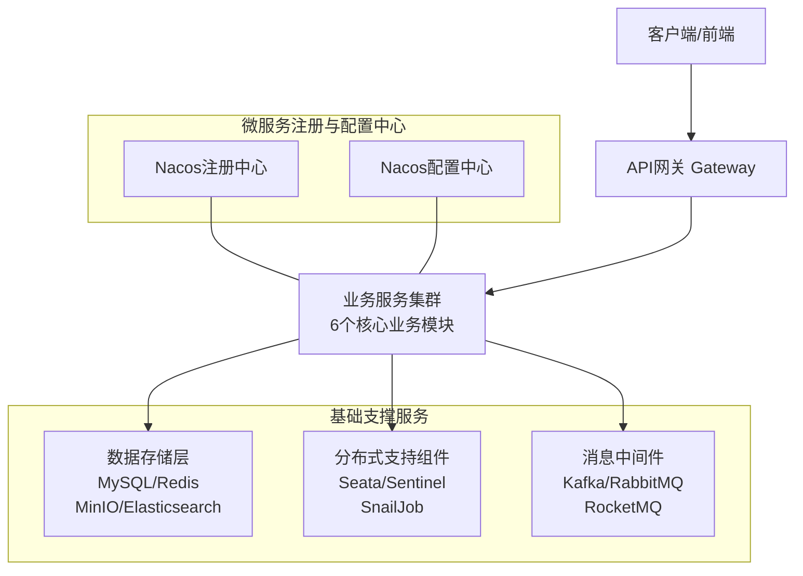
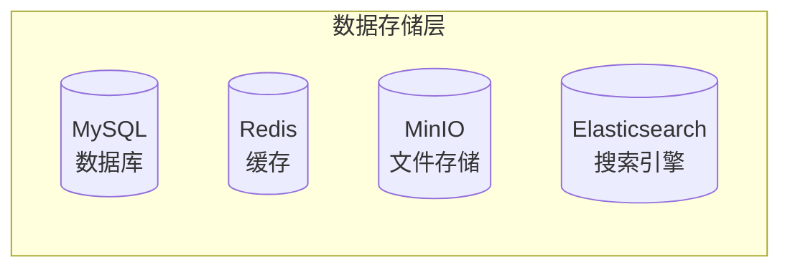
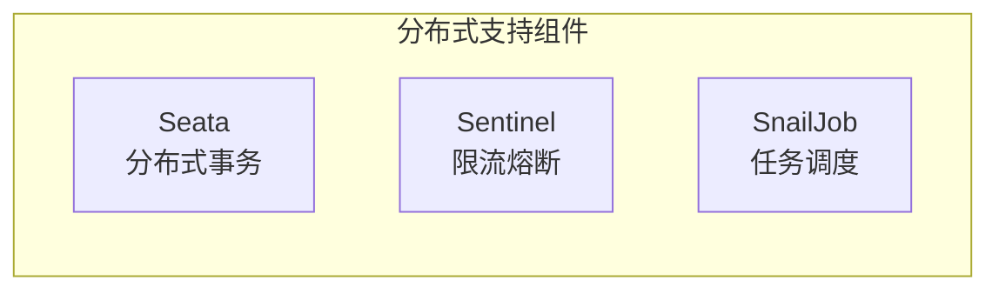
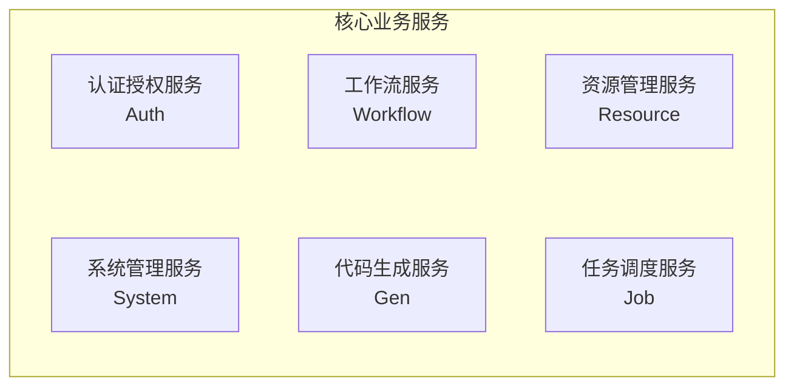

## 图像去雾系统（微服务版）

基于 RuoYi-Cloud-Plus 微服务架构构建的图像去雾系统，旨在提供一个高性能、可扩展的图像处理平台。系统采用现代化微服务技术架构，集成20+种主流去雾算法，提供完整的端到端图像去雾解决方案。

### 核心特性

- **🎯 智能去雾**: 集成20+种主流去雾算法(RIDCP、WPXNet、Dehamer等)，基于深度学习实现高质量图像恢复
- **🌐 微服务架构**: 基于Spring Cloud Alibaba的微服务架构，支持服务治理、配置管理、熔断限流等企业级特性
- **⚡ 高性能处理**: 异步任务处理、Redis缓存优化、GPU加速推理，提高系统吞吐量
- **🔐 安全可靠**: JWT+RBAC权限模型、Redisson分布式锁、完善的安全防护机制
- **📱 多端支持**: Web端管理后台，配合Android App、React Native等多端应用

## 系统技术特性

| 功能          | 技术实现                                                                                        |
|-------------|---------------------------------------------------------------------------------------------|
| 前端项目        | 支持Vue3、React、Taro多技术栈，采用TypeScript语言，Element Plus/Ant Design等UI库，Vite构建工具，支持Web、移动端、桌面端多端应用 |
| 微服务架构       | 基于Spring Cloud Alibaba微服务架构，服务拆分清晰，包含网关、认证、系统管理、资源管理等核心服务，支持服务注册发现、配置管理、负载均衡等微服务特性          |
| 代码规范        | 严格遵守Alibaba开发规范，采用统一的代码格式化标准，确保代码风格一致性和可维护性                                                 |
| 分布式注册中心     | 集成Alibaba Nacos作为服务注册与发现中心，支持服务实例的自动注册与健康检查                                                 |
| 分布式配置中心     | 基于Alibaba Nacos实现配置管理，支持配置的动态更新和多环境配置管理                                                     |
| 服务网关        | 采用Spring Cloud Gateway作为API网关，提供路由转发、权限校验、请求限流、跨域处理、日志记录等功能                                 |
| 负载均衡        | 集成Spring Cloud LoadBalancer实现客户端负载均衡，支持服务实例的负载分发和故障转移                                       |
| RPC远程调用     | 采用Apache Dubbo 3.X作为RPC框架，提供高性能的服务间通信能力                                                     |
| 分布式限流熔断     | 集成Alibaba Sentinel实现流量控制、熔断降级、系统自适应保护等稳定性保障功能                                               |
| 分布式事务       | 集成Alibaba Seata实现分布式事务管理，支持AT、TCC、Saga等事务模式                                                 |
| Web容器       | 采用Undertow作为Web服务器，基于XNIO高性能异步IO框架，提供卓越的并发处理能力                                              |
| 权限认证        | 集成Sa-Token和JWT实现认证授权机制，支持Token签发、验证、续期、黑名单管理等功能                                             |
| 权限注解        | 基于Sa-Token提供细粒度权限控制注解，支持登录校验、角色校验、权限校验、二级认证校验等多种安全控制                                        |
| 关系数据库支持     | 基于MyBatis-Plus支持MySQL、Oracle、PostgreSQL、SQLServer等主流关系型数据库，支持多数据源和动态数据源切换                   |
| 缓存数据库       | 集成Redis作为分布式缓存，支持数据缓存、分布式锁、会话存储、消息队列等高级功能                                                   |
| Redis客户端    | 采用Redisson作为Redis客户端，基于Netty的NIO框架，支持Redis大部分命令和高级特性，包括分布式锁、分布式集合等                          |
| 缓存注解        | 基于Spring Cache提供注解式缓存支持，支持缓存过期时间、最大空闲时间、缓存容量控制等高级配置                                         |
| ORM框架       | 采用MyBatis-Plus作为持久层框架，提供代码生成、分页插件、乐观锁、多租户等企业级特性                                             |
| SQL监控       | 集成p6spy实现SQL执行监控，可实时查看SQL语句和执行时间                                                            |
| 数据分页        | 基于MyBatis-Plus分页插件实现数据分页功能，支持多种参数传递方式和复杂排序需求                                                |
| 数据权限        | 采用MyBatis-Plus插件实现数据权限控制，通过SQL拦截器自动拼接数据权限过滤条件                                               |
| 数据脱敏        | 基于Jackson序列化期间实现数据脱敏处理，支持多种脱敏策略如身份证、手机号、地址等                                                 |
| 数据加解密       | 采用MyBatis拦截器实现数据加解密处理，支持BASE64、AES、RSA、SM2、SM4等多种加密算法                                       |
| 数据翻译        | 基于Jackson序列化期间实现数据动态翻译，支持映射翻译、直接翻译等多种翻译模式                                                   |
| 多数据源框架      | 集成dynamic-datasource支持多数据源管理，可通过YAML配置动态管理异构数据库，支持SpEL表达式动态切换数据源                            |
| 多数据源事务      | 基于dynamic-datasource实现多数据源事务管理，支持跨数据源事务回滚                                                   |
| 数据库连接池      | 采用HikariCP作为数据库连接池，提供高性能和稳定性                                                                |
| 数据库主键       | 采用雪花算法生成全局唯一ID，支持分布式环境下的主键唯一性                                                               |
| WebSocket协议 | 基于Spring WebSocket实现，支持Token鉴权和分布式会话同步                                                      |
| SSE推送       | 采用Spring SSE实现服务器推送功能，支持Token鉴权和分布式会话同步                                                     |
| 序列化         | 采用Jackson作为JSON序列化框架，提供高性能和可靠的序列化能力                                                         |
| 分布式幂等       | 基于Redis实现分布式幂等控制，防止重复提交和重复操作                                                                |
| 分布式任务调度     | 集成SnailJob实现分布式任务调度，支持任务分片、重试、DAG任务流等高级特性                                                   |
| 分布式日志中心     | 集成ELK实现分布式日志收集和分析，支持实时日志查询和问题定位                                                             |
| 分布式搜索引擎     | 集成ElasticSearch和Easy-Es实现全文检索功能，支持基于MyBatis-Plus风格的ES操作                                     |
| 分布式消息队列     | 支持Kafka、RocketMQ、RabbitMQ等主流消息中间件，支持延迟消息、事务消息、流式消息处理                                        |
| 分布式消息总线     | 集成Spring Cloud Bus实现事件总线功能，支持跨服务通知和配置刷新                                                     |
| 分布式分库分表     | 集成Apache Sharding-Proxy实现分库分表功能，支持透明化数据库访问                                                  |
| 文件存储        | 集成Minio实现分布式文件存储，支持多机、多硬盘、多分片、多副本存储，具备权限管理和文件加密功能                                           |
| 云存储         | 支持AWS S3协议，兼容七牛、阿里云、腾讯云等主流云存储服务                                                             |
| 短信          | 集成阿里云、腾讯云短信服务，支持通过YAML配置实现多厂商适配                                                             |
| 邮件          | 采用标准mail-api实现邮件发送功能，支持主流邮件服务商                                                              |
| 接口文档        | 集成SpringDoc和javadoc实现接口文档自动生成，基于Java注释零注解入侵式文档生成                                            |
| 校验框架        | 采用Validation实现数据校验功能，支持注解校验和国际化支持                                                           |
| Excel框架     | 集成Alibaba EasyExcel实现Excel操作，支持大数据量导入导出和复杂格式处理                                              |
| 工作流支持       | 集成工作流引擎，支持复杂审批流程、转办、委派、加减签、会签、或签、票签等功能                                                      |
| 工具类框架       | 集成Hutool和Lombok等工具库，提供丰富的工具类和代码简化功能                                                         |
| 服务监控框架      | 集成Spring Boot Admin实现服务监控，基于Actuator探针机制，支持在线日志查看和应用状态监控                                    |
| 全方位监控报警     | 集成Prometheus和Grafana实现系统监控，支持多样化指标采集、可视化展示和实时报警                                             |
| 链路追踪        | 集成Apache SkyWalking实现分布式链路追踪，支持请求路径分析和性能瓶颈定位                                                |
| 代码生成器       | 提供代码生成器功能，支持基于表结构一键生成CRUD代码和页面，支持多数据源代码生成                                                   |
| 部署方式        | 支持Docker容器化部署，提供一键环境搭建脚本，简化部署流程                                                             |
| 项目路径修改      | 提供项目路径修改方案，支持快速定制化项目结构                                                                      |
| 国际化         | 支持基于请求头的动态语言切换，提供国际化工具类和注解支持                                                                |
| 代码单例测试      | 提供单例测试支持，集成Maven多环境单测插件                                                                     |
| Demo案例      | 提供丰富的功能演示案例，帮助开发者快速上手                                                                       |

## 系统业务模块

| 业务     | 功能说明                                    |
|--------|-----------------------------------------|
| 租户管理   | 系统内租户的管理 如:租户套餐、过期时间、用户数量、企业信息等         |
| 租户套餐管理 | 系统内租户所能使用的套餐管理 如:套餐内所包含的菜单等             |
| 用户管理   | 用户的管理配置 如:新增用户、分配用户所属部门、角色、岗位等          |
| 部门管理   | 配置系统组织机构（公司、部门、小组） 树结构展现支持数据权限          |
| 岗位管理   | 配置系统用户所属担任职务                            |
| 菜单管理   | 配置系统菜单、操作权限、按钮权限标识等                     |
| 角色管理   | 角色菜单权限分配、设置角色按机构进行数据范围权限划分              |
| 字典管理   | 对系统中经常使用的一些较为固定的数据进行维护                  |
| 参数管理   | 对系统动态配置常用参数                             |
| 通知公告   | 系统通知公告信息发布维护                            |
| 操作日志   | 系统正常操作日志记录和查询 系统异常信息日志记录和查询             |
| 登录日志   | 系统登录日志记录查询包含登录异常                        |
| 文件管理   | 系统文件展示、上传、下载、删除等管理 (集成MinIO)            |
| 文件配置管理 | 系统文件上传、下载所需要的配置信息动态添加、修改、删除等管理          |
| 在线用户管理 | 已登录系统的在线用户信息监控与强制踢出操作                   |
| 定时任务   | 运行报表、任务管理(添加、修改、删除)、日志管理、执行器管理等         |
| 代码生成   | 多数据源前后端代码的生成（java、html、xml、sql）支持CRUD下载 |
| 系统接口   | 根据业务代码自动生成相关的api接口文档                    |
| 服务监控   | 监视集群系统CPU、内存、磁盘、堆栈、在线日志、Spring相关配置等     |
| 缓存监控   | 对系统的缓存信息查询，命令统计等。                       |
| 在线构建器  | 拖动表单元素生成相应的HTML代码。                      |
| 使用案例   | 系统的一些功能案例                               |
| 算法管理   | 去雾算法模型管理、参数配置、动态加载等                     |
| 数据集管理  | 去雾图像数据集的管理、上传、展示等                       |
| 图像处理   | 图像去雾处理、批量处理、实时处理进度监控等                   |

## 项目启动方式

### 环境准备

在启动项目之前，请确保已安装以下软件：

- JDK 17+
- Maven 3.6+
- MySQL 8.0+
- Redis 6.0+
- Nacos 2.0+ (服务注册与配置中心)
- Minio (可选，用于文件存储)
- Seata (可选，用于分布式事务)
- Sentinel (可选，用于限流熔断)
- Monitor (可选，用于服务监控)
- SnailJob (可选，用于定时任务)

### 启动顺序

系统服务分为基础设施和应用服务两类，需要按特定顺序启动：

#### 1. 启动基础设施

必须启动的基础服务：

- MySQL数据库
- Redis缓存
- Nacos配置与服务注册中心

可选启动的基础服务：

- Minio (影响文件上传)
- Seata (影响分布式事务，默认开启)
- Sentinel (影响熔断限流)
- Monitor (影响监控)
- SnailJob (影响定时任务)

#### 2. 启动应用服务

必须启动的应用服务：

- Gateway网关服务 (pei-gateway)
- Auth认证服务 (pei-auth)
- System系统服务 (pei-system)

可选启动的应用服务：

- Resource资源服务 (影响资源使用、WebSocket、文件上传、邮件、短信等)
- Workflow工作流服务 (工作流相关功能)
- Gen代码生成服务 (代码生成相关功能)
- Job定时任务服务 (影响定时任务)
- Demo演示服务 (影响demo使用)

### 启动方式

#### 方式一：本地启动

1. 导入SQL脚本
    - 执行 [script/sql](script/sql) 目录下的数据库脚本，初始化数据库

2. 启动Nacos
    - 下载并启动Nacos，配置地址：[http://localhost:8848](http://localhost:8848)
    - 导入 [script/config](script/config) 目录下的配置文件到Nacos配置中心

3. 修改配置
    - 根据实际环境修改Nacos中的配置信息，包括数据库连接、Redis连接等

4. 按顺序启动服务
    - 启动 [pei-gateway](pei-gateway) 网关服务
    - 启动 [pei-auth](pei-auth) 认证服务
    - 启动 [pei-modules/pei-system](pei-modules/pei-system) 系统服务
    - 根据需要启动其他业务模块

5. 启动前端项目
    - 进入前端项目目录，安装依赖并启动

#### 方式二：Docker启动

项目提供了完整的Docker部署方案：

1. 构建所有服务镜像
   ```bash
   mvn clean install -Pdocker
   ```

2. 使用Docker Compose启动所有服务
   ```bash
   cd script/docker
   docker-compose up -d
   ```

通过Docker方式，可以一键启动所有依赖服务和应用服务，包括：

- MySQL数据库
- Redis缓存
- Nacos配置中心
- Minio文件存储
- Seata分布式事务
- Sentinel限流熔断
- 各项应用服务 (Gateway、Auth、System等)
- 监控相关服务 (Prometheus、Grafana等)

### 访问系统

- 管理后台: [http://localhost:8080](http://localhost:8080)
- API文档: [http://localhost:8080/doc.html](http://localhost:8080/doc.html)
- Nacos控制台: [http://localhost:8848](http://localhost:8848)
- Sentinel控制台: [http://localhost:8718](http://localhost:8718)
- Seata控制台: [http://localhost:7091](http://localhost:7091)
- Minio控制台: [http://localhost:9001](http://localhost:9001)

## 系统架构图



### 数据存储层详细架构图



### 分布式支持组件详细架构图



### 核心业务服务详细架构图


