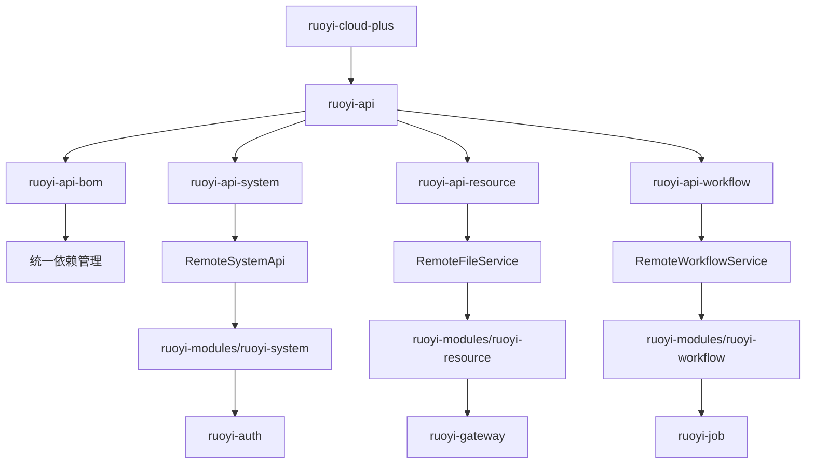

### `ruoyi-api` 包在整个项目中的位置与作用分析

#### 1. **整体架构定位**

`ruoyi-api` 是一个 Maven 多模块项目的父级模块，其主要作用是**集中管理多个 API 接口模块**，包括：

- `ruoyi-api-bom`: 提供 API 模块的基础依赖版本管理。
- `ruoyi-api-system`: 系统核心服务接口定义。
- `ruoyi-api-resource`: 资源管理接口定义（如文件上传、OSS 查询等）。
- `ruoyi-api-workflow`: 工作流引擎接口定义。

该模块作为**微服务间通信的契约层**，提供统一的远程调用接口，使得各业务模块可以基于标准接口进行集成和扩展。

---

### 2. **子模块分析**

#### 2.1 `ruoyi-api-bom`

- **作用**：BOM（Bill of Materials）用于统一管理 API 模块所依赖的第三方库版本。
- **设计目的**：
    - 避免版本冲突。
    - 提升依赖管理的一致性和可维护性。
- **最佳实践**：
    - 所有 API 模块通过 `<dependencyManagement>` 引入该 BOM。
    - 使用 `<scope>import</scope>` 方式引入依赖配置。

#### 2.2 `ruoyi-api-system`

- **作用**：系统核心服务接口定义，如客户端信息查询、用户权限控制等。
- **设计目的**：
    - 提供统一的身份验证和权限控制接口。
    - 支持网关、认证中心等模块调用。
- **与其他模块关系**：
    - 被 `ruoyi-auth`、`ruoyi-gateway` 等模块引用，用于实现安全校验。
    - 实现类位于 `ruoyi-modules/ruoyi-system` 中。

#### 2.3 `ruoyi-api-resource`

- **作用**：资源管理接口定义，如文件上传、OSS 查询等。
- **设计目的**：
    - 统一资源访问入口，屏蔽底层存储差异（本地、OSS、FTP 等）。
    - 支持多模块复用资源操作逻辑。
- **与其他模块关系**：
    - 被 `ruoyi-demo`、`ruoyi-job` 等模块引用。
    - 实现类位于 `ruoyi-modules/ruoyi-resource` 中。

#### 2.4 `ruoyi-api-workflow`

- **作用**：工作流引擎接口定义，如流程启动、任务审批等。
- **设计目的**：
    - 提供流程标准化接口，便于不同业务模块集成。
    - 支持 SaaS 架构下的多租户流程管理。
- **与其他模块关系**：
    - 被 `ruoyi-workflow` 模块引用。
    - 实现类位于 `ruoyi-modules/ruoyi-workflow` 中。

---

### 3. **与其他包的关系**

| 当前模块                 | 依赖模块            | 被哪些模块依赖                                                        | 作用说明                      |
|----------------------|-----------------|----------------------------------------------------------------|---------------------------|
| `ruoyi-api-bom`      | 无               | `ruoyi-api-system`, `ruoyi-api-resource`, `ruoyi-api-workflow` | 提供统一的依赖版本管理               |
| `ruoyi-api-system`   | `ruoyi-api-bom` | `ruoyi-auth`, `ruoyi-gateway`                                  | 提供系统核心服务接口，用于身份验证和权限控制    |
| `ruoyi-api-resource` | `ruoyi-api-bom` | `ruoyi-demo`, `ruoyi-job`                                      | 提供资源管理接口，支持文件上传、OSS 查询等操作 |
| `ruoyi-api-workflow` | `ruoyi-api-bom` | `ruoyi-workflow`                                               | 提供流程引擎接口，支持流程定义、任务审批等功能   |

---

### 4. **总结**

`ruoyi-api` 及其子模块在整个项目中扮演着**服务接口定义层**的角色。它们的设计体现了以下几点关键价值：

- **接口抽象化**：将业务逻辑与接口分离，提升系统的可维护性和可扩展性。
- **统一依赖管理**：通过 `ruoyi-api-bom` 管理依赖版本，确保整个项目使用一致的库版本。
- **模块解耦**：每个 API 模块独立存在，职责清晰，便于团队协作和独立发布。
- **面向服务架构**：符合微服务架构设计理念，便于服务注册、发现和调用。

这种设计模式不仅提升了系统的稳定性，也为后续的扩展与集成提供了良好的基础。

---

## 一、设计模式名称及分类

### 名称：
**接口抽象 + 模块化分层设计（Interface Abstraction with Modular Layered Architecture）**

### 所属类别：
- **架构设计模式**
- **模块化设计**
- **面向接口编程（Interface-Oriented Programming）**

该模式结合了以下几种经典设计思想：

| 设计思想            | 描述                                           |
|-----------------|----------------------------------------------|
| **单一职责原则（SRP）** | 每个模块只负责一个功能领域，如 `ruoyi-api-system` 只处理系统级接口。 |
| **接口隔离原则（ISP）** | 定义细粒度的接口，供不同模块按需引用。                          |
| **依赖倒置原则（DIP）** | 高层模块不依赖底层实现，而是依赖于接口。                         |
| **开闭原则（OCP）**   | 接口对扩展开放，对修改关闭，便于未来新增功能。                      |

---

## 二、在系统设计中的体现

### 1. 架构层级划分

```
+------------------------+
|       Application      | 应用层：业务逻辑调用接口
+-----------+----------+
            |
+-----------v----------+
|        Interface       | 接口层：定义 API 接口（ruoyi-api-*）
+-----------+----------+
            |
+-----------v----------+
|     Implementation     | 实现层：具体业务逻辑实现（ruoyi-modules/*）
+------------------------+
```


### 2. 模块关系说明

- **接口模块**（如 `ruoyi-api-system`）：
    - 提供远程调用标准。
    - 被多个服务模块引用。
- **实现模块**（如 `ruoyi-modules/ruoyi-system`）：
    - 实现接口定义的功能。
    - 对外提供服务注册和发现支持。

### 3. 微服务通信方式

- 使用 **Feign / Dubbo / REST API** 等远程调用技术。
- 接口模块作为客户端 SDK 被引入到调用方项目中。
- 示例：
  ```java
  @Autowired
  private RemoteClientService remoteClientService;
  
  public void someMethod() {
      RemoteClientVo client = remoteClientService.queryByClientId("client_001");
  }
  ```


---

## 三、详细代码设计流程

### 1. 接口定义阶段

#### 步骤：
1. 在 `ruoyi-api-*` 模块中创建接口类。
2. 定义方法签名，使用 Javadoc 注释说明用途和参数。
3. 使用 DTO（Data Transfer Object）封装复杂参数。
4. 抛出统一异常以保持一致性。

---

### 2. 接口实现阶段

#### 步骤：
1. 在对应的业务模块（如 `ruoyi-modules/ruoyi-resource`）中实现接口。
2. 添加 Spring 注解（如 `@Service`, `@RestController`）。
3. 处理核心业务逻辑，如文件上传、OSS 存储等。
4. 添加日志记录、异常处理、权限校验等横切关注点。

---

### 3. 接口使用阶段

#### 步骤：
1. 在调用方模块中添加对 `ruoyi-api-*` 的 Maven 依赖。
2. 使用 `@Reference` 或 `@Autowired` 引入远程接口。
3. 调用接口方法，屏蔽底层实现细节。
4. 统一处理返回值或异常。


---

## 四、日常编码最佳实践

| 类型        | 最佳实践                                      |
|-----------|-------------------------------------------|
| **接口命名**  | 使用 `RemoteXXXService` 命名规范，明确其为远程调用接口。    |
| **参数封装**  | 对多参数操作建议使用 DTO 对象，提升可读性和扩展性。              |
| **异常处理**  | 自定义统一异常类型，避免暴露底层错误信息。                     |
| **日志记录**  | 在接口调用前后打印关键参数和结果，便于调试和监控。                 |
| **缓存机制**  | 对高频读取接口增加本地缓存（如 Caffeine），减少后端压力。         |
| **幂等性控制** | 对写操作接口增加幂等性校验（如 Token 校验）。                |
| **版本管理**  | 对接口进行版本控制（如 `/api/v1/file/upload`），确保兼容性。 |

---

## 五、总结

这种接口抽象与模块化分层设计广泛应用于企业级微服务架构中，具有以下显著优势：

- **高内聚低耦合**：每个模块职责清晰，相互之间通过接口通信。
- **易于维护与扩展**：接口不变时，实现可以灵活替换或升级。
- **统一服务契约**：确保跨服务调用的一致性和稳定性。
- **支持多团队协作**：不同团队可以并行开发接口定义与实现。


---

## 🧱 一、项目整体代码模块关系图（Text-based UML）

```
+------------------------------------+
|           ruoyi-cloud-plus         |  ← Root POM
+------------------------------------+
           ▲
           |
+-----------------------+
|        ruoyi-api      |  ← 接口抽象层（API 模块）
+-----------------------+
| - ruoyi-api-bom       |
| - ruoyi-api-system    |
| - ruoyi-api-resource  |
| - ruoyi-api-workflow  |
+-----------------------+

         ▲       ▲       ▲       ▲
         |       |       |       |
+--------+--+ +--+----+ +--+----+--+ +---------+--+
|ruoyi-api-bom| |ruoyi-api-system| |ruoyi-api-resource| |ruoyi-api-workflow|
+-------------+ +----------------+ +------------------+ +------------------+
       ▲                ▲                  ▲                   ▲
       |                |                  |                   |
+------+-+       +-----+------+    +------+----+     +--------+-------+
| 实现模块 |<----| RemoteSystemApi |    | RemoteFileService |     | RemoteWorkflowService |
+--------+       +---------------+    +-----------------+     +---------------------+
       ▲                ▲                  ▲                   ▲
       |                |                  |                   |
+------+-+       +-----+------+    +------+----+     +--------+-------+
| ruoyi-modules/ruoyi-system |    | ruoyi-modules/ruoyi-resource |     | ruoyi-modules/ruoyi-workflow |
+----------------------------+    +------------------------------+     +------------------------------+

           ▲                         ▲                          ▲
           |                         |                          |
+----------+-----------+   +---------+------------+   +---------+------------+
| ruoyi-auth (认证服务)  |   | ruoyi-gateway (网关)   |   | ruoyi-job (任务调度)    |
+------------------------+   +------------------------+   +------------------------+
           ▲                         ▲                          ▲
           |                         |                          |
+----------+-----------+   +---------+------------+   +---------+------------+
| ruoyi-example/ruoyi-demo |   | ruoyi-visual/* (监控可视化) |   | script/* (脚本与部署)     |
+--------------------------+   +--------------------------+   +--------------------------+
```


---

## 📐 二、详细代码架构图（分层结构）

```
+---------------------------------------------------+
|                    应用层                           |
|  ruoyi-auth, ruoyi-gateway, ruoyi-job, ruoyi-demo  |
|  - 调用接口模块                                     |
|  - 业务逻辑调用                                     |
+---------------------------------------------------+
           ▲
           | 使用 Feign/Dubbo 调用
+---------------------------------------------------+
|                    接口层                           |
|  ruoyi-api-*                                       |
|  - 定义远程服务接口                                 |
|  - 包括系统、资源、工作流等模块                     |
+---------------------------------------------------+
           ▲
           | 实现依赖
+---------------------------------------------------+
|                    实现层                           |
|  ruoyi-modules/ruoyi-*                            |
|  - 具体业务实现                                   |
|  - 注册为 Spring Bean                             |
+---------------------------------------------------+
           ▲
           | 数据访问
+---------------------------------------------------+
|                    数据访问层                       |
|  MyBatis / JPA / ORM 映射                         |
|  - 数据库操作封装                                 |
|  - 对应 mapper / repository                        |
+---------------------------------------------------+
           ▲
           | 数据存储
+---------------------------------------------------+
|                    存储层                           |
|  MySQL / Redis / OSS / Elasticsearch               |
|  - 持久化数据存储                                 |
|  - 缓存、文件、搜索引擎等                          |
+---------------------------------------------------+
```


---

## 🧩 三、各层级模块说明

### 1. **应用层**
- **功能**：对外暴露服务入口，处理请求路由、权限校验、日志记录等。
- **典型模块**：
    - `ruoyi-auth`：认证中心，负责登录鉴权。
    - `ruoyi-gateway`：网关服务，统一接收外部请求并路由到对应微服务。
    - `ruoyi-job`：定时任务调度服务。
    - `ruoyi-demo`：示例模块，演示如何调用 API。

### 2. **接口层（API 抽象）**
- **功能**：定义服务接口，供其他模块引用，确保服务契约一致。
- **典型模块**：
    - `ruoyi-api-bom`：统一管理依赖版本。
    - `ruoyi-api-system`：系统核心接口（用户、角色、客户端等）。
    - `ruoyi-api-resource`：文件上传、OSS 查询等资源服务接口。
    - `ruoyi-api-workflow`：流程引擎接口（启动流程、任务办理等）。

### 3. **实现层**
- **功能**：具体业务逻辑实现，Spring Boot 服务类。
- **典型模块**：
    - `ruoyi-modules/ruoyi-system`：系统模块实现。
    - `ruoyi-modules/ruoyi-resource`：资源模块实现。
    - `ruoyi-modules/ruoyi-workflow`：工作流模块实现。

### 4. **数据访问层**
- **功能**：数据库交互，数据持久化。
- **技术栈**：
    - MyBatis Plus（默认 ORM）
    - Mapper 层接口 + XML 文件
    - 可选 JPA、Hibernate 等

### 5. **存储层**
- **功能**：底层数据存储。
- **常见组件**：
    - MySQL：主数据库
    - Redis：缓存服务
    - OSS / MinIO：对象存储
    - Elasticsearch：全文检索
    - RocketMQ / RabbitMQ：消息队列

---

## 🛠️ 四、推荐绘图方式

### ✅ Mermaid 示例




### ✅ PlantUML 示例（适用于 draw.io 或在线编辑器）：

```plantuml
package "ruoyi-cloud-plus" {
  package "ruoyi-api" {
    [ruoyi-api-bom]
    [ruoyi-api-system]
    [ruoyi-api-resource]
    [ruoyi-api-workflow]
  }
}

[ruoyi-api-bom] --> [统一依赖管理]
[ruoyi-api-system] --> [RemoteSystemApi]
[ruoyi-api-resource] --> [RemoteFileService]
[ruoyi-api-workflow] --> [RemoteWorkflowService]

[RemoteSystemApi] --> [ruoyi-modules/ruoyi-system]
[RemoteFileService] --> [ruoyi-modules/ruoyi-resource]
[RemoteWorkflowService] --> [ruoyi-modules/ruoyi-workflow]
```
