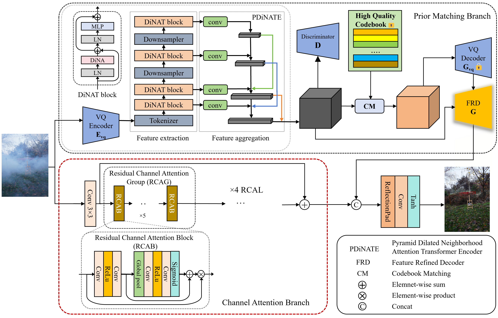
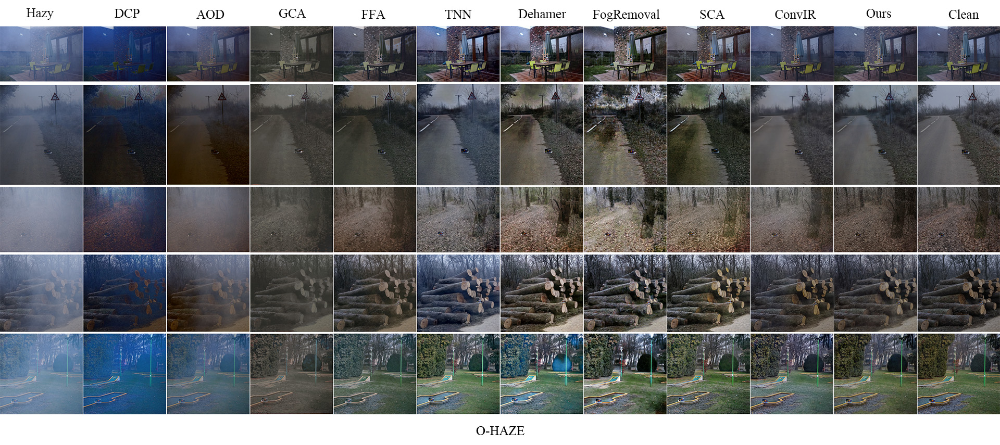
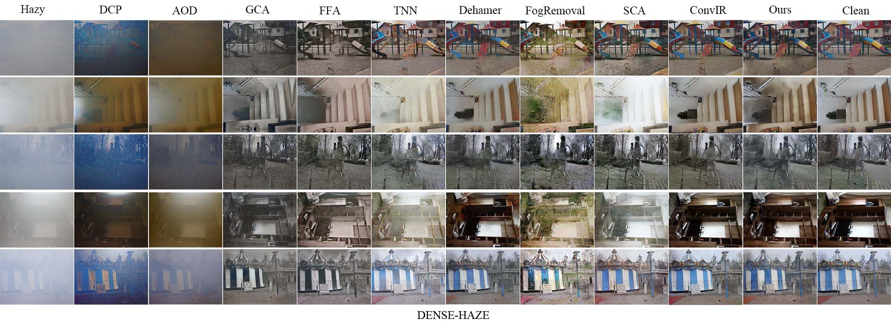
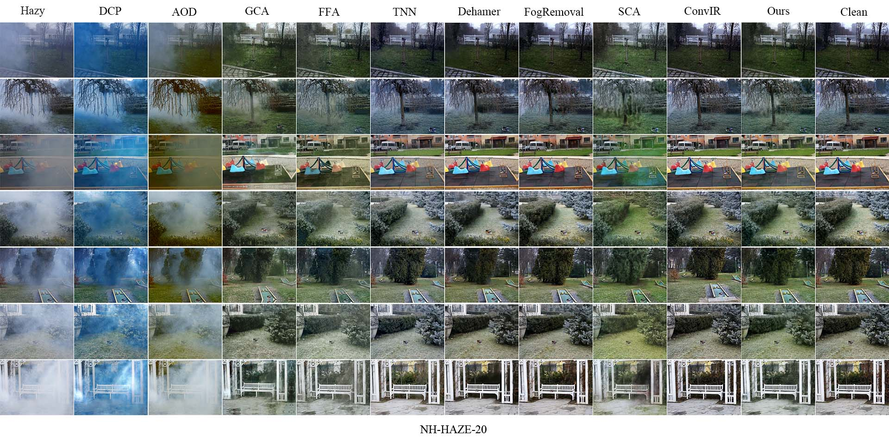
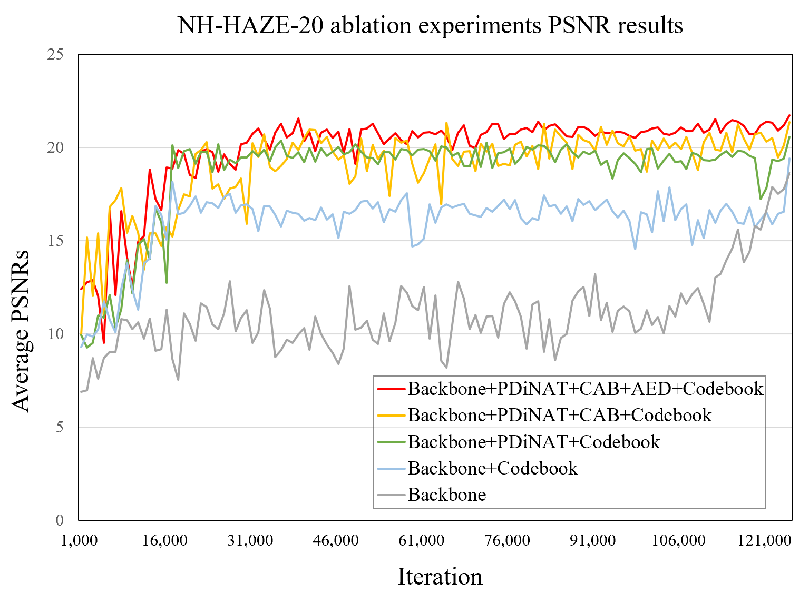

# 基于高质量码本的双分支多尺度图像去雾方法

本论文提出了一种创新的图像去雾方法，通过结合高质量码本先验知识和双分支网络结构，有效处理非均匀雾霾场景。主要创新点包括：

1. 使用VQGAN训练高质量码本作为先验知识，补充纹理细节信息
2. 设计金字塔扩张邻域注意力编码器，实现多尺度特征提取  
3. 提出增强解码器，结合像素级和通道级注意力机制
4. 采用双分支网络结构，通过特征融合处理浓雾区域
实验结果表明，该方法在O-HAZE、DENSE-HAZE等多个数据集上均取得了优异性能。

## 去雾方法详解

### 总体网络架构

CMFD-Net采用了双分支网络结构，包括先验匹配分支(Prior Matching Branch)和通道注意力分支(Channel Attention Branch)。这两个分支分别处理不同的去雾任务，最后通过特征融合模块整合两个分支的输出，生成最终的去雾图像。

### 先验匹配分支

先验匹配分支是本方法的核心创新之一，它通过引入VQGAN训练得到的高质量码本作为先验知识，帮助网络更好地恢复雾霾图像中的纹理细节。该分支包含三个关键组件：

1. **用于领域自适应的语义先验码本(SPC-DA)**：通过预训练的VQGAN模型，将清晰图像的特征压缩成短向量并存储在码本中。在去雾过程中，通过匹配雾霾图像特征与码本中的编码，实现领域自适应。

2. **金字塔扩张邻域注意力编码器(PDiNATE)**：基于扩张邻域注意力机制，通过金字塔结构提取多尺度的雾霾特征，更好地处理空间变化的雾霾分布。

3. **特征精炼解码器(FRD)**：结合通道注意力和像素注意力机制，增强解码器恢复细节特征的能力，特别是在浓雾区域。

### 通道注意力分支

通道注意力分支采用经典的残差和通道卷积结构，专注于浓雾区域的特征提取。该分支通过注意力机制灵活关注雾霾的特征，重建高质量的无雾图像。对于亮度变化显著的区域（如天空、雪地等），该分支能够提供差异化的去雾效果，避免过度增强问题。

### 损失函数

网络训练分为两个阶段：

1. **码本先验微调阶段**：主要优化码本的重建能力，损失函数包括图像重建损失和码本损失。
2. **去雾网络优化阶段**：固定码本和VQ解码器的参数，优化去雾网络的参数，损失函数包括编码器损失和其余网络部分的损失。

## 算法效果预览

### 网络架构图

下图展示了CMFD-Net的整体网络架构，包含双分支结构和特征融合模块：



### 去雾效果对比

以下是在不同数据集上的去雾效果对比图，展示了我们的方法相较于其他先进方法的优势：

#### O-HAZE数据集效果对比


#### DENSE-HAZE数据集效果对比


#### NH-HAZE-20数据集效果对比


### 消融实验结果

为了验证各个模块的有效性，我们进行了消融实验，结果如下图所示：



项目包含以下主要文件：

- `CMFR-Net.tex`: 主论文文件
- `references.bib`: 参考文献数据库
- 各种实验对比图片：`ablation_experiments.png`, `dehaze_results_1.png`, `dehaze_results_2.png`等

## 环境配置

### 1. 安装TeX Live

#### Windows系统

1. 下载官方安装程序 [install-tl-windows.exe](https://www.tug.org/texlive/acquire-netinstall.html)
2. 以管理员身份运行安装程序
3. 安装完成后，将`C:\texlive\2025\bin\win32`添加到系统PATH环境变量

#### Linux系统

1. 下载安装脚本 [install-tl-unx.tar.gz](https://www.tug.org/texlive/acquire-netinstall.html)
2. 解压并运行安装脚本：

   ```bash
   sudo perl install-tl
   ```

3. 将安装目录下的`bin`路径添加到`.bashrc`或`.zshrc`：

   ```bash
   export PATH=/usr/local/texlive/2025/bin/x86_64-linux:$PATH
   ```

#### macOS系统

1. 使用Homebrew安装：

   ```bash
   brew install --cask mactex
   ```

2. 安装完成后，TeX Live路径已自动配置

### 2. 验证安装

运行以下命令验证安装并检查环境变量配置：

```bash
tex --version
echo $PATH
```

## 编译构建

### 1. 使用命令行编译

#### 1.1 编译论文

在项目根目录下运行以下命令：

```bash
pdflatex "CMFR-Net.tex"
```

#### 1.2 处理参考文献

运行以下命令处理参考文献：

```bash
bibtex "CMFR-Net"
```

#### 1.3 再次编译

再次运行pdflatex命令两次以确保所有交叉引用正确：

```bash
pdflatex "CMFR-Net.tex"
```

#### 1.4 查看结果

编译完成后，会在当前目录下生成`CMFR-Net.pdf`文件，使用PDF阅读器打开即可查看最终结果。

### 2. 使用VSCode LaTeX Workshop编译

#### 2.1 安装LaTeX Workshop扩展

1. 打开VSCode，进入扩展市场
2. 搜索"LaTeX Workshop"并安装
3. 安装完成后重启VSCode

#### 2.2 配置LaTeX Workshop

1. 打开项目根目录
2. 点击左侧工具栏的"TeX"图标
3. 在设置中确保以下配置：
   - LaTeX: Recipe: latexmk
   - LaTeX: Build: Build LaTeX project
   - LaTeX: Clean: Clean up auxiliary files

#### 2.3 编译项目

1. 打开主TeX文件
2. 按下`Ctrl+Alt+B`（Windows/Linux）或`Cmd+Option+B`（macOS）开始编译
3. 编译完成后，可以在右侧预览PDF文件

### 3. 使用TexStudio编译

#### 3.1 安装TexStudio

1. 下载适合您操作系统的安装包：
   - Windows: [TexStudio官网下载](https://texstudio.org/)
   - macOS: 使用Homebrew安装

      ```bash
      brew install --cask texstudio
      ```

2. 安装完成后，打开TexStudio

#### 3.2 配置TexStudio

1. 打开TexStudio的设置界面
2. 确认LaTeX编译器路径正确指向TeX Live安装位置
3. 建议使用以下默认编译配置：
   - 默认编译器：PdfLaTeX
   - 快速构建：PdfLaTeX + Bib(la)tex + PdfLaTeX (x2) + View PDF

#### 3.3 编译项目

1. 打开主TeX文件
2. 点击工具栏上的"构建并查看"按钮
3. 或使用快捷键`F5`开始编译
4. 编译完成后，右侧将显示PDF预览

## 注意事项

1. 确保TeX Live安装完整，包含所有必要的包
2. 编译过程中可能会提示缺少某些包，可以使用`tlmgr`命令安装：

   ```bash
   tlmgr install <package_name>
   ```

3. 如果遇到编码问题，请确保使用UTF-8编码
