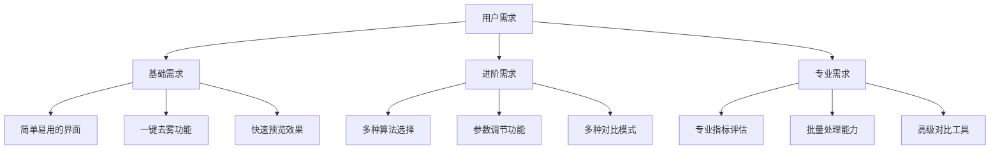
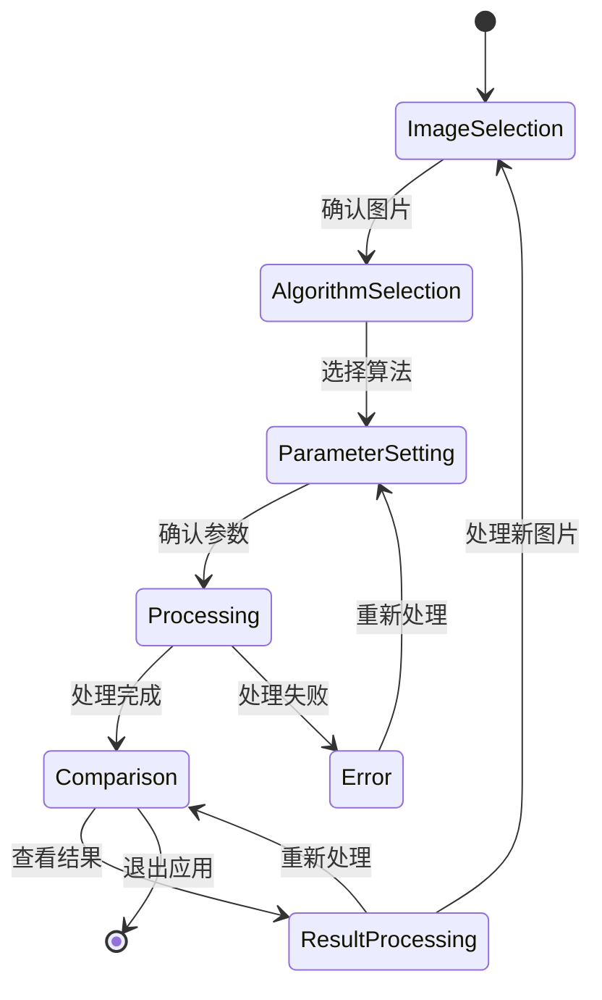

# 用户旅程与交互设计

**文档版本**: v1.0
**最后更新**: 2025-11-22
**项目名称**: dehaze_flutter
**参考文档**: [demo产品需求](../../demo/docs/01-产品概述和总体架构.md)

---

## 📋 概述

本文档详细描述了Flutter图像去雾系统的用户旅程设计和交互流程，专注于前端用户体验的优化设计。基于demo中的需求分析，重新组织为适合Flutter实现的交互设计方案。

---

## 🎯 用户画像分析

### 主要用户群体

#### 1. 摄影爱好者
- **使用场景**：户外摄影、旅行拍照后期处理
- **核心需求**：快速去除雾霾，提升照片质量
- **技术水平**：中等，熟悉基本图像处理概念
- **使用频率**：定期使用，处理拍摄作品

#### 2. 普通用户
- **使用场景**：日常生活照片优化，社交分享准备
- **核心需求**：简单易用，一键去雾功能
- **技术水平**：初级，希望操作简单直观
- **使用频率**：偶尔使用，特定需求时使用

#### 3. 图像处理研究人员
- **使用场景**：算法效果验证，研究对比
- **核心需求**：精确的对比工具，量化指标评估
- **技术水平**：专业，熟悉图像处理算法
- **使用频率**：频繁使用，研究验证需要

#### 4. 算法开发工程师
- **使用场景**：算法测试，效果对比，参数调优
- **核心需求**：多算法对比，参数控制，批量处理
- **技术水平**：专业，需要高级功能
- **使用频率**：日常工作使用

### 用户需求分层



---

## 🔄 核心用户旅程

### 完整用户旅程（5阶段闭环）

基于[demo中的用户旅程设计](../../demo/docs/01-产品概述和总体架构.md)，重新设计Flutter端交互流程：

```
用户旅程总览
    ↓
┌─────────────────────────────────────────────────────────┐
│                   阶段1：图像输入                          │
│  用户进入APP → 选择输入方式 → 预览确认 → 进入下一阶段        │
└─────────────────────────────────────────────────────────┘
    ↓
┌─────────────────────────────────────────────────────────┐
│                   阶段2：算法选择                          │
│  智能推荐查看 → 算法浏览搜索 → 算法详情了解 → 选择算法       │
└─────────────────────────────────────────────────────────┘
    ↓
┌─────────────────────────────────────────────────────────┐
│                   阶段3：去雾处理                          │
│  参数确认 → 开始处理 → 实时进度跟踪 → 处理完成             │
└─────────────────────────────────────────────────────────┘
    ↓
┌─────────────────────────────────────────────────────────┐
│                   阶段4：效果对比                          │
│  自动对比展示 → 选择对比模式 → 详细评估 → 结果确认         │
└─────────────────────────────────────────────────────────┘
    ↓
┌─────────────────────────────────────────────────────────┐
│                   阶段5：结果处理                          │
│  满意结果处理 → 保存/分享 → 不满意重新处理 → 完成          │
└─────────────────────────────────────────────────────────┘
```

### 阶段1：图像输入交互设计

#### 1.1 入口设计

**主要入口位置**：
- 底部导航栏"输入"标签
- 首页"快速体验"按钮
- 首页"上传图片"卡片
- 历史记录"重新处理"选项

**入口界面设计**：
```dart
// 图像输入页面布局
class ImageInputPage extends StatelessWidget {
  Widget build(BuildContext context) {
    return Scaffold(
      appBar: AppBar(title: Text('图像输入')),
      body: Column(
        children: [
          // 输入方式选择区域
          _buildInputMethodGrid(),
          // 最近使用区域（可选）
          _buildRecentImages(),
          // 快速体验入口
          _buildQuickExperienceSection(),
        ],
      ),
    );
  }
}
```

#### 1.2 输入方式交互流程

**上传图片流程**：
```
点击"上传图片" → 打开相册选择器 → 选择图片 → 格式验证 →
生成缩略图 → 预览确认 → 添加到处理队列 → 进入算法选择
```

**拍照流程**：
```
点击"拍照" → 检查相机权限 → 启动相机 → 拍摄 →
预览确认 → 保存临时文件 → 进入算法选择
```

**样例库流程**：
```
点击"样例库" → 浏览样例分类 → 选择样例图片 →
自动加载 → 预览 → 一键选择 → 进入算法选择
```

**历史记录流程**：
```
点击"历史记录" → 查看历史列表 → 选择记录 →
显示原图和结果 → 选择"重新处理" → 进入算法选择
```

#### 1.3 交互细节设计

**文件选择界面**：
- 多选支持：最多选择5张图片
- 格式验证：实时检查文件格式和大小
- 缩略图生成：后台异步生成，不阻塞UI
- 拖拽支持：支持拖拽文件到应用内

**相机界面**：
- 实时预览：支持前后摄像头切换
- 网格线辅助：可开关的构图辅助线
- 对焦控制：点击屏幕对焦
- 闪光灯控制：自动/开启/关闭模式

**预览确认界面**：
- 缩略图展示：显示选中的图片缩略图
- 图片信息：显示文件大小、分辨率、格式
- 操作按钮：确认选择/重新选择/删除图片
- 批量操作：支持全选、清空等批量操作

### 阶段2：算法选择交互设计

#### 2.1 页面布局设计

**算法选择页面结构**：
```dart
class AlgorithmSelectPage extends StatelessWidget {
  Widget build(BuildContext context) {
    return Scaffold(
      body: CustomScrollView(
        slivers: [
          // 智能推荐区域
          SliverToBoxAdapter(child: _buildRecommendationSection()),
          // 搜索和筛选区域
          SliverToBoxAdapter(child: _buildSearchFilterSection()),
          // 算法列表
          SliverList(delegate: _buildAlgorithmList()),
        ],
      ),
    );
  }
}
```

#### 2.2 智能推荐交互

**推荐区域设计**：
```
┌─────────────────────────────────────────┐
│            🎯 智能推荐算法               │
├─────────────────────────────────────────┤
│ ┌─────────────┐ ┌─────────────┐ ┌─────┐ │
│ │ 推荐算法1   │ │ 推荐算法2   │ │更多 │ │
│ │ ⭐⭐⭐⭐⭐    │ │ ⭐⭐⭐⭐     │ │算法 │ │
│ │ 中度雾霾推荐 │ │ 速度快效果好 │ │     │ │
│ │ [一键使用]  │ │ [查看详情]  │ │...  │ │
│ └─────────────┘ └─────────────┘ └─────┘ │
└─────────────────────────────────────────┘
```

**推荐算法选择流程**：
1. 上传图片后自动分析图像特征
2. 后端推荐接口返回1-3个推荐算法
3. 前端展示推荐卡片，包含推荐理由
4. 用户可一键选择或查看详细信息

#### 2.3 算法浏览和搜索

**搜索功能**：
```
搜索框设计：
┌─────────────────────────────────────┐
│ 🔍 搜索算法名称、类型、功能...        │
└─────────────────────────────────────┘

搜索交互流程：
输入关键词 → 实时搜索 → 显示结果列表 →
高亮匹配关键词 → 选择算法 → 查看详情
```

**筛选功能**：
```
筛选面板设计：
┌─────────────────────────────────────┐
│ 算法筛选                           │
├─────────────────────────────────────┤
│ 算法类型: ☑传统算法 ☑深度学习        │
│ 处理速度: ○快速 ●中等 ○慢速          │
│ 效果质量: ○优秀 ●良好 ○一般          │
│ 适用场景: ☑轻度 ☑中度 ☑重度          │
├─────────────────────────────────────┤
│           [重置] [应用筛选]          │
└─────────────────────────────────────┘
```

#### 2.4 算法详情交互

**详情页面设计**：
```
┌─────────────────────────────────────────┐
│ [←] 算法详情                [⭐收藏]    │
├─────────────────────────────────────────┤
│ 🧠 AOD-Net算法                         │
│ ⭐⭐⭐⭐⭐ (4.8分) | 深度学习 | 快速    │
├─────────────────────────────────────────┤
│ 📊 基本信息                           │
│ • 算法类型: CNN系列                    │
│ • 处理速度: 快速（2-3秒）              │
│ • 效果质量: 优秀                       │
│ • 适用场景: 轻度至中度雾霾             │
├─────────────────────────────────────────┤
│ 📝 算法描述                           │
│ AOD-Net是一种端到端的去雾神经网络...    │
├─────────────────────────────────────────┤
│ 🎨 效果样例                           │
│ [并排对比展示原图和处理后效果]          │
├─────────────────────────────────────────┤
│ ⚙️ 参数说明                           │
│ • 去雾强度: 50% (可调节)               │
│ • 色彩恢复: 开启 (可切换)              │
├─────────────────────────────────────────┤
│ 📈 性能指标                           │
│ • PSNR: 24.3 dB | SSIM: 0.89           │
│ • 平均处理时间: 2.5秒                  │
├─────────────────────────────────────────┤
│        [立即使用] [添加到收藏]          │
└─────────────────────────────────────────┘
```

### 阶段3：去雾处理交互设计

#### 3.1 处理页面布局

**处理页面结构**：
```dart
class ProcessingPage extends StatelessWidget {
  Widget build(BuildContext context) {
    return Column(
      children: [
        // 图片预览区域
        Expanded(flex: 2, child: _buildImagePreview()),
        // 参数调节区域
        _buildParameterControls(),
        // 处理控制区域
        _buildProcessingControls(),
        // 进度显示区域
        _buildProgressIndicator(),
      ],
    );
  }
}
```

#### 3.2 参数调节交互

**参数控制面板**：
```
┌─────────────────────────────────────────┐
│ ⚙️ 算法参数调节                        │
├─────────────────────────────────────────┤
│ 去雾强度                               │
│ ████████░░ 80%                         │
├─────────────────────────────────────────┤
│ 色彩恢复                               │
│ ●开启  ○关闭                           │
├─────────────────────────────────────────┤
│ 对比度增强                             │
│ ██████░░░░ 60%                         │
├─────────────────────────────────────────┤
│ 预设模式                               │
│ [自动] [柔和] [强烈] [自定义]            │
└─────────────────────────────────────────┘
```

**实时预览功能**：
- 参数调节时实时生成预览图
- 防抖机制：调节停止后500ms再生成预览
- 预览质量：使用中等质量，平衡速度和效果
- 缓存机制：相同参数不重复生成预览

#### 3.3 处理进度交互

**进度展示设计**：
```
┌─────────────────────────────────────────┐
│ ⚡ 正在处理中...                        │
├─────────────────────────────────────────┤
│ ████████████░░░ 75%                     │
├─────────────────────────────────────────┤
│ 当前步骤: 图像去雾处理                  │
│ 预计剩余时间: 30秒                      │
├─────────────────────────────────────────┤
│          [暂停] [取消]                  │
└─────────────────────────────────────────┘
```

**处理状态管理**：
- **等待状态**：显示"等待处理"提示
- **处理中状态**：显示进度条和剩余时间
- **暂停状态**：显示"已暂停"状态和继续按钮
- **完成状态**：显示"处理完成"和查看结果按钮
- **错误状态**：显示错误信息和重试选项

### 阶段4：效果对比交互设计

#### 4.1 对比页面进入

**自动进入机制**：
- 处理完成后自动跳转到对比页面
- 默认显示"并排对比"模式
- 显示处理成功提示和基本信息

**页面布局设计**：
```dart
class ComparisonPage extends StatefulWidget {
  Widget build(BuildContext context) {
    return Scaffold(
      body: Column(
        children: [
          // 对比模式选择器
          _buildComparisonModeSelector(),
          // 对比显示区域
          Expanded(child: _buildComparisonView()),
          // 工具栏和操作按钮
          _buildToolbarAndActions(),
        ],
      ),
    );
  }
}
```

#### 4.2 对比模式交互设计

**模式选择器**：
```
┌─────────────────────────────────────────┐
│ 对比模式: [并排 ▼]                     │
├─────────────────────────────────────────┤
│ [并排] [重叠] [滑动] [放大镜] [滤镜]    │
└─────────────────────────────────────────┘
```

**6种对比模式详细设计**：

##### 1. 并排对比模式
```
┌─────────────────────────────────────────┐
│         原图          │        处理后        │
│                     │                     │
│   [有雾霾的图片]     │   [去雾后的图片]     │
│                     │                     │
│                     │                     │
└─────────────────────────────────────────┘
        ↑拖拽分隔线可调整左右比例
```

**交互特性**：
- 分隔线可拖拽调整左右比例
- 双击图片进入全屏查看
- 支持缩放和平移操作
- 长按显示图片信息

##### 2. 重叠对比模式
```
┌─────────────────────────────────────────┐
│          重叠对比模式                   │
├─────────────────────────────────────────┤
│                                         │
│        两图重叠显示                     │
│     拖动透明度滑块调节                  │
│                                         │
├─────────────────────────────────────────┤
│ 透明度: ████████░░ 80%                  │
└─────────────────────────────────────────┘
```

**交互特性**：
- 透明度滑块实时调节（0-100%）
- 支持原图在上/结果图在上切换
- 双击切换到全屏模式
- 快捷键支持（方向键调节透明度）

##### 3. 滑动对比模式
```
┌─────────────────────────────────────────┐
│        │        滑动对比模式        │        │
│        ├─────────────────────────────────┤
│  原图  │            处理后            │  原图  │
│        │                             │        │
└─────────────────────────────────────────┘
      ↑垂直滑动分隔线
      ←→水平滑动分隔线
```

**交互特性**：
- 支持水平和垂直滑动方向切换
- 分隔线可自由拖拽
- 拖拽时显示放大镜效果
- 快速滑动时显示惯性效果

##### 4. 放大镜模式
```
┌─────────────────────────────────────────┐
│                                       │
│           基础图片显示                 │
│                                       │
│         [圆形放大镜]                   │
│     显示该位置的细节对比               │
│                                       │
└─────────────────────────────────────────┘
```

**交互特性**：
- 圆形放大镜跟随手指/鼠标移动
- 放大倍数可调节（2x-5x）
- 放大镜内显示原图和结果对比
- 双击固定/取消固定放大镜位置

##### 5. 滤镜调节模式
```
┌─────────────────────────────────────────┐
│          滤镜调节模式                   │
├─────────────────────────────────────────┤
│          [处理后的图片]                 │
│                                         │
├─────────────────────────────────────────┤
│ 亮度: ████████░░ 80%                    │
│ 对比度: ██████░░░░ 60%                  │
│ 饱和度: ██████████ 100%                 │
│ 清晰度: ████████░░ 80%                  │
├─────────────────────────────────────────┤
│    [重置] [对比原图] [保存调节]         │
└─────────────────────────────────────────┘
```

**交互特性**：
- 实时滤镜效果预览
- 支持对比原图功能
- 一键重置所有参数
- 保存调节后的效果

##### 6. 指标评估模式
```
┌─────────────────────────────────────────┐
│          指标评估模式                   │
├─────────────────────────────────────────┤
│ 对比图片区域                           │
│ ┌─────────┬─────────┐                   │
│ │ 原图    │ 处理后  │                   │
│ └─────────┴─────────┘                   │
├─────────────────────────────────────────┤
│ 📊 质量指标对比                         │
│ ┌─────────────┬─────────────┬──────────┐ │
│ │ 指标        │ 原图         │ 处理后   │ │
│ ├─────────────┼─────────────┼──────────┤ │
│ │ PSNR        │ -            │ 24.3 dB  │ │
│ │ SSIM        │ -            │ 0.89     │ │
│ │ 清晰度      │ 65%          │ 92%      │ │
│ │ 对比度      │ 0.72         │ 0.85     │ │
│ └─────────────┴─────────────┴──────────┘ │
├─────────────────────────────────────────┤
│ 📈 效果提升分析                         │
│ • 清晰度提升: +42%                     │
│ • 对比度提升: +18%                     │
│ • 整体质量评价: 优秀                   │
└─────────────────────────────────────────┘
```

#### 4.3 对比操作功能

**工具栏设计**：
```
┌─────────────────────────────────────────┐
│ [🔄切换模式] [💾保存] [📤分享] [⚙️设置]  │
└─────────────────────────────────────────┘
```

**操作功能详解**：
- **切换模式**：在6种对比模式间快速切换
- **保存功能**：保存处理后的图片到本地
- **分享功能**：分享对比结果到社交平台
- **设置功能**：调节对比显示参数

**手势操作支持**：
- **单击**：显示/隐藏工具栏
- **双击**：进入全屏模式
- **捏合**：缩放图片
- **拖拽**：平移图片（在全屏模式下）
- **长按**：显示图片信息和操作菜单

### 阶段5：结果处理交互设计

#### 5.1 结果确认界面

**确认对话框设计**：
```
┌─────────────────────────────────────────┐
│ ✅ 处理完成！                          │
├─────────────────────────────────────────┤
│ 您的去雾图片已成功生成，质量评分：优秀   │
│                                         │
│ ┌─────────┬─────────┐                   │
│ │ 原图    │ 处理后  │                   │
│ │ 缩略图  │ 缩略图  │                   │
│ └─────────┴─────────┘                   │
├─────────────────────────────────────────┤
│ 您希望如何处理这张图片？                 │
│                                         │
│ [💾保存到相册] [📤分享给朋友]           │
│ [🔄重新处理] [⭐添加到收藏]             │
│ [🚪继续处理其他图片]                    │
└─────────────────────────────────────────┘
```

#### 5.2 操作选项设计

**保存到相册**：
```
保存选项对话框：
┌─────────────────────────────────────────┐
│ 💾 保存到相册                          │
├─────────────────────────────────────────┤
│ 选择保存格式：                           │
│ ○ JPG (推荐)  ○ PNG  ○ WEBP           │
│                                         │
│ 图片质量：                               │
│ ● 高质量 (8MB)  ○ 标准 (2MB)            │
│                                         │
│ ☑ 同时保存对比图 (2.5MB)                │
│ ☑ 添加处理信息水印                       │
├─────────────────────────────────────────┤
│              [确认保存]                  │
└─────────────────────────────────────────┘
```

**分享功能**：
```
分享选项：
┌─────────────────────────────────────────┐
│ 📤 分享去雾结果                         │
├─────────────────────────────────────────┤
│ 选择分享内容：                           │
│ ☑ 处理后图片                           │
│ ☑ 对比图                               │
│ ○ 算法信息                             │
│ ○ 处理参数                             │
│                                         │
│ 选择分享平台：                           │
│ [微信] [QQ] [微博] [更多...]            │
├─────────────────────────────────────────┤
│              [立即分享]                  │
└─────────────────────────────────────────┘
```

#### 5.3 重新处理选项

**重新处理对话框**：
```
┌─────────────────────────────────────────┐
│ 🔄 重新处理选项                         │
├─────────────────────────────────────────┤
│ 选择重新处理方式：                       │
│                                         │
│ 🎯 更换算法                             │
│   当前算法：AOD-Net                     │
│   [选择其他算法...]                     │
│                                         │
│ ⚙️ 调整参数                             │
│   当前参数：强度80% 色彩恢复开启         │
│   [重新调整参数...]                     │
│                                         │
│ 📷 更换图片                             │
│   [重新上传图片...]                     │
│                                         │
│              [开始重新处理]              │
└─────────────────────────────────────────┘
```

---

## 🚀 快捷操作流程

### 快速体验流程

**目标用户**：新用户、体验用户
**完成时间**：<10秒
**操作步骤**：
```
打开APP → 点击"快速体验" → 选择样例图片 →
自动推荐算法 → 一键处理 → 查看对比结果
```

**界面设计**：
```
┌─────────────────────────────────────────┐
│ ⚡ 快速体验                             │
├─────────────────────────────────────────┤
│ 选择一张样例图片，10秒体验去雾效果！     │
│                                         │
│ ┌─────┐ ┌─────┐ ┌─────┐ ┌─────┐         │
│ │图片1│ │图片2│ │图片3│ │图片4│         │
│ │轻度 │ │中度 │ │重度 │ │夜景 │         │
│ │雾霾 │ │雾霾 │ │雾霾 │ │雾霾 │         │
│ └─────┘ └─────┘ └─────┘ └─────┘         │
│                                         │
│           [开始快速体验]                │
└─────────────────────────────────────────┘
```

### 重复处理流程

**目标用户**：有处理记录的用户
**完成时间**：<30秒
**操作步骤**：
```
进入历史记录 → 选择历史记录 → 点击"重新处理" →
更换算法（可选）→ 查看新旧对比
```

**历史记录界面**：
```
┌─────────────────────────────────────────┐
│ 📚 处理历史                             │
├─────────────────────────────────────────┤
│ 搜索: [输入关键词搜索...]               │
│                                         │
│ 今天 (3条记录)                          │
│ ┌─────────────────────────────────────┐ │
│ │ [原图缩略图] → [结果缩略图]         │ │
│ │ AOD-Net算法 | 2024-01-15 14:30      │ │
│ │ [重新处理] [更换算法] [分享] [删除] │ │
│ └─────────────────────────────────────┘ │
│                                         │
│ 昨天 (5条记录)                          │
│ [显示更多记录...]                       │
└─────────────────────────────────────────┘
```

### 批量处理流程

**目标用户**：专业用户、算法开发者
**适用场景**：多张图片需要相同处理
**操作步骤**：
```
批量选择图片 → 选择算法 → 设置统一参数 →
开始批量处理 → 查看批量结果 → 批量保存
```

**批量处理界面**：
```
┌─────────────────────────────────────────┐
│ 📦 批量处理 (已选择5张图片)            │
├─────────────────────────────────────────┤
│ 算法选择: AOD-Net [更改]                │
│ 处理参数: 强度80% [自定义]               │
│ 预计时间: 约2分钟                      │
│                                         │
│ ┌─────────────────────────────────────┐ │
│ │ 📷 图片1.jpg ●等待处理              │ │
│ │ 📷 图片2.jpg ●处理中 45%            │ │
│ │ 📷 图片3.jpg ●处理完成              │ │
│ │ 📷 图片4.jpg ●等待处理              │ │
│ │ 📷 图片5.jpg ●等待处理              │ │
│ └─────────────────────────────────────┘ │
│                                         │
│ [开始处理] [暂停] [查看详情]            │
└─────────────────────────────────────────┘
```

---

## 📊 交互状态管理

### 全局状态设计

**用户状态**：
```dart
class UserState {
  final bool isFirstTime;        // 是否首次使用
  final List<ProcessingHistory> history;  // 处理历史
  final Set<String> favoriteAlgorithms;   // 收藏算法
  final UserPreferences preferences;       // 用户偏好
}
```

**处理状态**：
```dart
class ProcessingState {
  final List<ImageFile> selectedImages;   // 选中的图片
  final Algorithm? selectedAlgorithm;     // 选择的算法
  final ProcessingParams parameters;       // 处理参数
  final ProcessingStatus status;          // 处理状态
  final double progress;                  // 处理进度
  final ProcessedImage? result;           // 处理结果
}
```

**对比状态**：
```dart
class ComparisonState {
  final ImageData originalImage;          // 原始图像
  final ImageData processedImage;         // 处理后图像
  final ComparisonMode mode;              // 对比模式
  final Map<String, dynamic> metrics;     // 质量指标
  final List<ComparisonHistory> history;  // 对比历史
}
```

### 状态转换流程



---

## 🎨 视觉反馈设计

### 加载状态反馈

**加载动画设计**：
```dart
// 自定义加载动画
class DehazeLoadingAnimation extends StatefulWidget {
  Widget build(BuildContext context) {
    return Column(
      children: [
        // 云朵旋转动画
        RotationTransition(
          turns: _animationController,
          child: Icon(Icons.cloud, size: 48),
        ),
        SizedBox(height: 16),
        // 进度文字
        Text('正在去除雾霾...', style: TextStyle(fontSize: 16)),
        SizedBox(height: 8),
        LinearProgressIndicator(value: progress),
      ],
    );
  }
}
```

**不同类型的加载状态**：
- **图片加载**：渐进式加载，模糊到清晰
- **算法加载**：旋转动画 + 进度百分比
- **处理中**：进度条 + 预估时间
- **网络请求**：脉冲动画 + 重试选项

### 交互反馈设计

**按钮交互反馈**：
```dart
class AnimatedButton extends StatefulWidget {
  Widget build(BuildContext context) {
    return GestureDetector(
      onTapDown: (_) => _scaleController.forward(),
      onTapUp: (_) => _scaleController.reverse(),
      onTapCancel: (_) => _scaleController.reverse(),
      child: AnimatedBuilder(
        animation: _scaleController,
        builder: (context, child) {
          return Transform.scale(
            scale: 1.0 - (_scaleController.value * 0.05),
            child: child,
          );
        },
        child: ElevatedButton(...),
      ),
    );
  }
}
```

**页面切换动画**：
```dart
// 自定义页面转场动画
class SlidePageRoute<T> extends PageRouteBuilder<T> {
  SlidePageRoute({required this.child})
      : super(
          pageBuilder: (context, animation, secondaryAnimation) => child,
          transitionsBuilder: (context, animation, secondaryAnimation, child) {
            const begin = Offset(1.0, 0.0);
            const end = Offset.zero;
            const curve = Curves.easeInOut;

            var tween = Tween(begin: begin, end: end).chain(
              CurveTween(curve: curve),
            );

            return SlideTransition(
              position: animation.drive(tween),
              child: child,
            );
          },
        );
  final Widget child;
}
```

### 错误反馈设计

**错误提示组件**：
```dart
class ErrorDialog extends StatelessWidget {
  Widget build(BuildContext context) {
    return AlertDialog(
      title: Row(
        children: [
          Icon(Icons.error_outline, color: Colors.red),
          SizedBox(width: 8),
          Text('操作失败'),
        ],
      ),
      content: Column(
        mainAxisSize: MainAxisSize.min,
        crossAxisAlignment: CrossAxisAlignment.start,
        children: [
          Text(errorMessage),
          SizedBox(height: 16),
          Text('解决方案:', style: TextStyle(fontWeight: FontWeight.bold)),
          Text('• 检查网络连接'),
          Text('• 重新选择图片'),
          Text('• 更换处理算法'),
        ],
      ),
      actions: [
        TextButton(
          onPressed: () => Navigator.pop(context),
          child: Text('取消'),
        ),
        ElevatedButton(
          onPressed: () {
            Navigator.pop(context);
            onRetry?.call();
          },
          child: Text('重试'),
        ),
      ],
    );
  }
}
```

---

## 📱 平台特定交互优化

### 移动端优化

**触摸优化**：
- 最小触摸区域：44x44px
- 手势支持：滑动、捏合、长按
- 触觉反馈：重要操作的震动反馈
- 防误触：关键操作需要确认

**性能优化**：
- 图片懒加载：仅在可见时加载
- 内存管理：及时释放不用的图片
- 缓存策略：智能缓存处理结果

### 桌面端优化

**鼠标交互**：
- 悬停效果：按钮和卡片的悬停状态
- 右键菜单：上下文相关的操作菜单
- 键盘导航：Tab键导航和快捷键支持
- 拖拽操作：文件拖拽上传支持

**界面优化**：
- 更大的信息密度
- 多窗口支持
- 状态栏集成
- 系统通知支持

---

## 📈 用户体验优化策略

### 学习成本降低

**新手引导**：
```
首次使用引导流程：
1. 欢迎页面介绍核心功能
2. 功能导览：依次介绍5个主要功能
3. 快速体验：引导用户完成第一次去雾操作
4. 功能提示：重要功能的气泡提示
```

**智能提示**：
```dart
class FeatureDiscovery extends StatefulWidget {
  Widget build(BuildContext context) {
    return Overlay(
      child: FeatureDiscoveryController(
        targets: [
          TargetedOverlay(
            key: 'upload_button',
            color: Colors.blue,
            child: Text('点击上传图片开始体验'),
          ),
          TargetedOverlay(
            key: 'algorithm_select',
            color: Colors.green,
            child: Text('智能推荐最适合的算法'),
          ),
        ],
      ),
    );
  }
}
```

### 操作效率提升

**快捷操作**：
- 长按图片进入快速操作菜单
- 滑动手势快速切换对比模式
- 双击放大/缩小图片
- 键盘快捷键支持（桌面端）

**批量操作**：
- 多选模式：支持批量选择图片
- 批量处理：统一算法和参数
- 批量导出：一次性导出多个结果
- 历史重用：快速应用历史设置

### 个性化体验

**用户偏好记忆**：
```dart
class UserPreferences {
  final String defaultAlgorithm;      // 默认算法
  final ProcessingParams defaultParams; // 默认参数
  final ComparisonMode preferredMode;  // 偏好对比模式
  final Set<String> favoriteTools;    // 收藏的工具
  final bool enableHapticFeedback;    // 触觉反馈开关
}
```

**智能推荐**：
- 基于历史记录推荐算法
- 根据使用习惯调整界面布局
- 个性化参数预设
- 使用频率统计和优化

---

**文档版本**: v1.0
**最后更新**: 2025-11-22
**参考文档**: [demo产品需求](../../demo/docs/01-产品概述和总体架构.md)