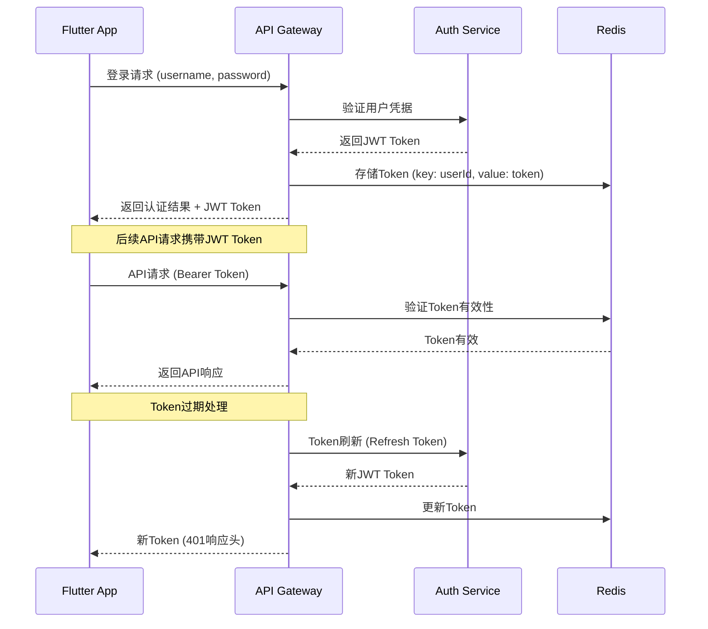

# API集成设计文档

**文档版本**: v1.0
**最后更新**: 2025-11-22
**项目名称**: dehaze_flutter
**参考文档**: [后端服务](../../CLAUDE.md#java-backend-dehaze-java)、[总体架构](00-overview.md)

---

## 📋 概述

本文档详细描述了Flutter图像去雾系统与后端服务的API集成设计方案，基于项目中的多后端架构（dehaze-java、dehaze-go、dehaze-python），专注于前端API客户端的实现细节和最佳实践。

---

## 🏗️ 后端服务架构概览

### 服务架构图

```
Flutter Frontend (dehaze_flutter)
    ↓ HTTP/WebSocket API
┌─────────────────────────────────────────┐
│              API Gateway                 │
│    - 统一入口                             │
│    - 路由分发                             │
│    - 负载均衡                             │
│    - 限流熔断                             │
└─────────────────────────────────────────┘
    ↓
┌─────────────────────────────────────────┐
│ dehaze-java (Spring Boot)               │
│ • 用户认证和权限管理                      │
│ • 算法管理和推荐                          │
│ • 文件上传下载                            │
│ • 业务数据管理                            │
│ • WebSocket服务                          │
└─────────────────────────────────────────┘
    ↓
┌─────────────────────────────────────────┐
│ dehaze-python (Flask + PyTorch)         │
│ • 图像去雾算法执行                        │
│ • 深度学习模型服务                        │
│ • 实时处理进度推送                        │
│ • 算法参数优化                            │
└─────────────────────────────────────────┘
    ↓
┌─────────────────────────────────────────┐
│ dehaze-go (Gin)                         │
│ • 数据统计分析                          │
│ • 高并发接口服务                          │
│ • 缓存和性能优化                          │
│ • 备用服务接口                            │
└─────────────────────────────────────────┘
    ↓
┌─────────────────────────────────────────┐
│        数据存储层                         │
│ MySQL | MongoDB | Redis | MinIO        │
└─────────────────────────────────────────┘
```

### 服务职责分工

| 服务名称 | 主要职责 | 核心API | 通信协议 |
|---------|----------|----------|----------|
| **dehaze-java** | 核心业务服务 | 认证、算法、文件管理 | HTTP REST + WebSocket |
| **dehaze-python** | 算法处理服务 | 图像处理、进度推送 | HTTP REST + WebSocket |
| **dehaze-go** | 数据统计服务 | 统计分析、性能监控 | HTTP REST |

---

## 🔧 API客户端架构设计

### 技术选型

基于[架构设计中的技术选型决策](../design/02-architecture.md#4-1-技术选型决策)，采用以下技术栈：

- **HTTP客户端**: `dio` + `retrofit`
- **WebSocket客户端**: `web_socket_channel`
- **状态管理**: 集成到Bloc中
- **错误处理**: 统一错误处理机制
- **缓存策略**: 内存缓存 + 持久化存储

### 服务分层架构

```
API Client Layer (Flutter)
    ↓
┌─────────────────────────────────────────┐
│         Repository Layer                 │
│ • 统一的数据访问接口                      │
│ • 缓存策略实现                           │
│ • 错误处理和重试                          │
│ • 数据转换和验证                          │
└─────────────────────────────────────────┘
    ↓
┌─────────────────────────────────────────┐
│         Service Layer                    │
│ • API Service实现                        │
│ • WebSocket管理                          │
│ • 网络配置和拦截器                        │
│ • 认证和授权                             │
└─────────────────────────────────────────┘
    ↓
┌─────────────────────────────────────────┐
│         Transport Layer                  │
│ • HTTP客户端(Dio)                        │
│ • WebSocket客户端                         │
│ • 网络请求封装                           │
│ • 协议适配                              │
└─────────────────────────────────────────┘
```

---

## 🔐 认证与授权

### JWT认证机制

#### 认证流程图


#### 认证服务实现
```dart
// lib/core/services/auth_service.dart
class AuthService {
  final Dio _dio;
  final StorageService _storage;

  static const String _tokenKey = 'auth_token';
  static const String _refreshTokenKey = 'refresh_token';
  static const String _userKey = 'user_info';

  AuthService(this._dio, this._storage);

  // 登录
  Future<AuthResult> login(String username, String password) async {
    try {
      final response = await _dio.post('/auth/login', data: {
        'username': username,
        'password': password,
      });

      final authData = AuthResponse.fromJson(response.data);

      // 保存认证信息
      await _saveAuthData(authData);

      // 配置dio的认证拦截器
      _updateDioAuthInterceptor(authData.token);

      return AuthResult.success(authData.user);
    } on DioException catch (e) {
      return AuthResult.failure(e.message ?? '登录失败');
    }
  }

  // 注册
  Future<AuthResult> register(String username, String password, String email) async {
    try {
      final response = await _dio.post('/auth/register', data: {
        'username': username,
        'password': password,
        'email': email,
      });

      final authData = AuthResponse.fromJson(response.data);

      await _saveAuthData(authData);
      _updateDioAuthInterceptor(authData.token);

      return AuthResult.success(authData.user);
    } on DioException catch (e) {
      return AuthResult.failure(e.message ?? '注册失败');
    }
  }

  // 注销
  Future<void> logout() async {
    try {
      await _dio.post('/auth/logout');
    } catch (e) {
      // 即使API调用失败，也要清除本地数据
    } finally {
      await _clearAuthData();
      _removeDioAuthInterceptor();
    }
  }

  // 检查登录状态
  bool get isLoggedIn {
    final token = _storage.getString(_tokenKey);
    return token != null && _isTokenValid(token);
  }

  // 获取当前用户
  User? get currentUser {
    final userData = _storage.getString(_userKey);
    if (userData != null) {
      return User.fromJson(jsonDecode(userData));
    }
    return null;
  }

  // 刷新Token
  Future<bool> refreshToken() async {
    try {
      final refreshToken = _storage.getString(_refreshTokenKey);
      if (refreshToken == null) return false;

      final response = await _dio.post('/auth/refresh', data: {
        'refresh_token': refreshToken,
      });

      final authData = AuthResponse.fromJson(response.data);

      await _saveAuthData(authData);
      _updateDioAuthInterceptor(authData.token);

      return true;
    } catch (e) {
      await _clearAuthData();
      return false;
    }
  }

  // 私有方法
  Future<void> _saveAuthData(AuthResponse authData) async {
    await _storage.setString(_tokenKey, authData.token);
    await _storage.setString(_refreshTokenKey, authData.refreshToken);
    await _storage.setString(_userKey, jsonEncode(authData.user.toJson()));
  }

  Future<void> _clearAuthData() async {
    await _storage.remove(_tokenKey);
    await _storage.remove(_refreshTokenKey);
    await _storage.remove(_userKey);
  }

  void _updateDioAuthInterceptor(String token) {
    _dio.interceptors.removeWhere((interceptor) => interceptor is AuthInterceptor);
    _dio.interceptors.add(AuthInterceptor(token));
  }

  void _removeDioAuthInterceptor() {
    _dio.interceptors.removeWhere((interceptor) => interceptor is AuthInterceptor);
  }

  bool _isTokenValid(String token) {
    try {
      final parts = token.split('.');
      if (parts.length != 3) return false;

      final payload = jsonDecode(
        utf8.decode(base64Url.decode(base64Url.normalize(parts[1])))
      );

      final exp = payload['exp'] as int?;
      if (exp == null) return false;

      final now = DateTime.now().millisecondsSinceEpoch ~/ 1000;
      return exp > now;
    } catch (e) {
      return false;
    }
  }
}

// 认证拦截器
class AuthInterceptor extends Interceptor {
  final String _token;

  AuthInterceptor(this._token);

  @override
  void onRequest(RequestOptions options, RequestInterceptorHandler handler) {
    options.headers['Authorization'] = 'Bearer $_token';
    super.onRequest(options, handler);
  }

  @override
  void onError(DioException error, ErrorInterceptorHandler handler) {
    if (error.response?.statusCode == 401) {
      // Token过期，尝试刷新
      final authService = serviceLocator<AuthService>();
      authService.refreshToken().then((success) {
        if (success) {
          // 重新发起请求
          handler.resolve(_retryRequest(error.requestOptions!));
        } else {
          // 刷新失败，需要重新登录
          handler.next(error);
        }
      });
      return;
    }
    super.onError(error, handler);
  }

  Future<Response<dynamic>> _retryRequest(RequestOptions options) async {
    final token = await _getRefreshedToken();
    options.headers['Authorization'] = 'Bearer $token';

    final dio = Dio();
    return dio.fetch(options);
  }

  Future<String> _getRefreshedToken() async {
    final authService = serviceLocator<AuthService>();
    final storage = serviceLocator<StorageService>();
    return await storage.getString('auth_token') ?? '';
  }
}
```

---

## 📡 API服务实现

### 基础API客户端

#### 配置和初始化
```dart
// lib/core/network/api_client.dart
class ApiClient {
  late final Dio _dio;
  late final String _baseUrl;
  late final Duration _timeout;
  late final int _maxRetries;

  ApiClient({
    String baseUrl = 'https://api.dehaze.com',
    Duration timeout = const Duration(seconds: 30),
    int maxRetries = 3,
  }) {
    _baseUrl = baseUrl;
    _timeout = timeout;
    _maxRetries = maxRetries;
    _initializeDio();
  }

  void _initializeDio() {
    _dio = Dio(BaseOptions(
      baseUrl: _baseUrl,
      timeout: _timeout,
      connectTimeout: _timeout,
      receiveTimeout: _timeout,
      headers: {
        'Content-Type': 'application/json',
        'Accept': 'application/json',
        'User-Agent': 'DehazeFlutter/${AppConfig.version}',
      },
    ));

    _setupInterceptors();
  }

  void _setupInterceptors() {
    // 日志拦截器（仅在调试模式）
    if (kDebugMode) {
      _dio.interceptors.add(LogInterceptor(
        requestBody: true,
        responseBody: true,
        logPrint: (object) => log(object.toString()),
      ));
    }

    // 重试拦截器
    _dio.interceptors.add(RetryInterceptor(
      dio: _dio,
      retries: _maxRetries,
      retryDelays: const [
        Duration(seconds: 1),
        Duration(seconds: 2),
        Duration(seconds: 3),
      ],
    ));

    // 缓存拦截器
    _dio.interceptors.add(CacheInterceptor());

    // 错误处理拦截器
    _dio.interceptors.add(ErrorInterceptor());

    // 性能监控拦截器
    _dio.interceptors.add(PerformanceInterceptor());
  }

  // GET请求
  Future<Response<T>> get<T>(
    String path, {
    Map<String, dynamic>? queryParameters,
    Options? options,
    CancelToken? cancelToken,
  }) async {
    try {
      return await _dio.get<T>(
        path,
        queryParameters: queryParameters,
        options: options,
        cancelToken: cancelToken,
      );
    } on DioException catch (e) {
      throw _handleError(e);
    }
  }

  // POST请求
  Future<Response<T>> post<T>(
    String path, {
    dynamic data,
    Map<String, dynamic>? queryParameters,
    Options? options,
    CancelToken? cancelToken,
  }) async {
    try {
      return await _dio.post<T>(
        path,
        data: data,
        queryParameters: queryParameters,
        options: options,
        cancelToken: cancelToken,
      );
    } on DioException catch (e) {
      throw _handleError(e);
    }
  }

  // PUT请求
  Future<Response<T>> put<T>(
    String path, {
    dynamic data,
    Map<String, dynamic>? queryParameters,
    Options? options,
    CancelToken? cancelToken,
  }) async {
    try {
      return await _dio.put<T>(
        path,
        data: data,
        queryParameters: queryParameters,
        options: options,
        cancelToken: cancelToken,
      );
    } on DioException catch (e) {
      throw _handleError(e);
    }
  }

  // DELETE请求
  Future<Response<T>> delete<T>(
    String path, {
    dynamic data,
    Map<String, dynamic>? queryParameters,
    Options? options,
    CancelToken? cancelToken,
  }) async {
    try {
      return await _dio.delete<T>(
        path,
        data: data,
        queryParameters: queryParameters,
        options: options,
        cancelToken: cancelToken,
      );
    } on DioException catch (e) {
      throw _handleError(e);
    }
  }

  // 文件上传
  Future<Response<T>> uploadFile<T>(
    String path,
    File file, {
    Map<String, String>? fields,
    ProgressCallback? onSendProgress,
    CancelToken? cancelToken,
  }) async {
    try {
      final formData = FormData.fromMap({
        'file': await MultipartFile.fromFile(file.path),
        ...?fields,
      });

      final options = Options(
        contentType: 'multipart/form-data',
      );

      return await _dio.post<T>(
        path,
        data: formData,
        options: options,
        onSendProgress: onSendProgress,
        cancelToken: cancelToken,
      );
    } on DioException catch (e) {
      throw _handleError(e);
    }
  }

  // 错误处理
  ApiException _handleError(DioException error) {
    switch (error.type) {
      case DioExceptionType.connectionTimeout:
      case DioExceptionType.sendTimeout:
      case DioExceptionType.receiveTimeout:
        return ApiException.timeout('请求超时，请检查网络连接');

      case DioExceptionType.connectionError:
        return ApiException.networkError('网络连接失败，请检查网络设置');

      case DioExceptionType.badResponse:
        return _handleHttpError(error);

      case DioExceptionType.cancel:
        return ApiException.cancelled('请求已取消');

      case DioExceptionType.unknown:
      default:
        return ApiException.unknown(error.message ?? '未知错误');
    }
  }

  ApiException _handleHttpError(DioException error) {
    final statusCode = error.response?.statusCode;
    final message = error.response?.data?['message'] ?? '服务器错误';

    switch (statusCode) {
      case 400:
        return ApiException.badRequest(message);
      case 401:
        return ApiException.unauthorized('未授权访问');
      case 403:
        return ApiException.forbidden('权限不足');
      case 404:
        return ApiException.notFound('请求的资源不存在');
      case 429:
        return ApiException.tooManyRequests('请求过于频繁，请稍后再试');
      case 500:
        return ApiException.serverError('服务器内部错误');
      case 503:
        return ApiException.serviceUnavailable('服务暂时不可用');
      default:
        return ApiException.httpError(statusCode, message);
    }
  }
}
```

### 算法服务API

#### API接口定义
```dart
// lib/features/algorithm/data/repositories/algorithm_repository_impl.dart
class AlgorithmRepositoryImpl implements AlgorithmRepository {
  final ApiClient _apiClient;

  AlgorithmRepositoryImpl(this._apiClient);

  @override
  Future<List<Algorithm>> getAlgorithms() async {
    try {
      final response = await _apiClient.get<List<dynamic>>('/algorithms');

      final algorithms = (response.data as List)
          .map((json) => Algorithm.fromJson(json as Map<String, dynamic>))
          .toList();

      return algorithms;
    } on ApiException catch (e) {
      throw RepositoryException('获取算法列表失败: ${e.message}');
    }
  }

  @override
  Future<Algorithm?> getAlgorithmById(String algorithmId) async {
    try {
      final response = await _apiClient.get<Map<String, dynamic>>(
        '/algorithms/$algorithmId',
      );

      return Algorithm.fromJson(response.data!);
    } on ApiException catch (e) {
      if (e is NotFoundException) {
        return null;
      }
      throw RepositoryException('获取算法详情失败: ${e.message}');
    }
  }

  @override
  Future<List<Algorithm>> getRecommendedAlgorithms(ImageFile imageFile) async {
    try {
      final formData = FormData.fromMap({
        'image': await MultipartFile.fromFile(imageFile.path),
        'features': await _extractImageFeatures(imageFile),
      });

      final response = await _apiClient.post<List<dynamic>>(
        '/algorithms/recommend',
        data: formData,
      );

      final recommendations = (response.data as List)
          .map((json) => Algorithm.fromJson(json as Map<String, dynamic>))
          .toList();

      return recommendations;
    } on ApiException catch (e) {
      throw RepositoryException('获取推荐算法失败: ${e.message}');
    }
  }

  @override
  Future<Set<String>> getFavoriteAlgorithms() async {
    try {
      final response = await _apiClient.get<List<dynamic>>('/algorithms/favorites');

      final favorites = (response.data as List)
          .map((json) => json.toString())
          .toSet();

      return favorites;
    } on ApiException catch (e) {
      throw RepositoryException('获取收藏算法失败: ${e.message}');
    }
  }

  @override
  Future<void> addFavoriteAlgorithm(String algorithmId) async {
    try {
      await _apiClient.post('/algorithms/$algorithmId/favorite');
    } on ApiException catch (e) {
      throw RepositoryException('添加收藏失败: ${e.message}');
    }
  }

  @override
  Future<void> removeFavoriteAlgorithm(String algorithmId) async {
    try {
      await _apiClient.delete('/algorithms/$algorithmId/favorite');
    } on ApiException catch (e) {
      throw RepositoryException('取消收藏失败: ${e.message}');
    }
  }

  @override
  Future<AlgorithmPerformance> getAlgorithmPerformance(
    String algorithmId,
    ImageFile imageFile,
  ) async {
    try {
      final formData = FormData.fromMap({
        'image': await MultipartFile.fromFile(imageFile.path),
      });

      final response = await _apiClient.post<Map<String, dynamic>>(
        '/algorithms/$algorithmId/performance',
        data: formData,
      );

      return AlgorithmPerformance.fromJson(response.data!);
    } on ApiException catch (e) {
      throw RepositoryException('获取算法性能失败: ${e.message}');
    }
  }

  // 私有辅助方法
  Future<Map<String, dynamic>> _extractImageFeatures(ImageFile imageFile) async {
    // 使用图像处理库提取特征
    final image = img.decodeImage(await imageFile.readAsBytes());

    return {
      'width': image?.width ?? 0,
      'height': image?.height ?? 0,
      'size': imageFile.sizeBytes,
      'format': imageFile.format,
      'has_transparency': _hasTransparency(image),
    };
  }

  bool _hasTransparency(img.Image? image) {
    if (image == null) return false;

    // 检查是否有alpha通道
    return image.numChannels == 4 ||
           image.format == img.Format.png ||
           image.format == img.Format.webp;
  }
}
```

### 图像处理API

#### WebSocket集成
```dart
// lib/features/processing/data/repositories/processing_repository_impl.dart
class ProcessingRepositoryImpl implements ProcessingRepository {
  final ApiClient _apiClient;
  final WebSocketManager _webSocketManager;

  ProcessingRepositoryImpl(this._apiClient)
      : _webSocketManager = WebSocketManager();

  @override
  Future<ProcessingTask> startProcessing(
    ImageFile imageFile,
    Algorithm algorithm,
    ProcessingParameters parameters,
  ) async {
    try {
      final formData = FormData.fromMap({
        'image': await MultipartFile.fromFile(imageFile.path),
        'algorithm_id': algorithm.id,
        'parameters': jsonEncode(parameters.toJson()),
      });

      final response = await _apiClient.post<Map<String, dynamic>>(
        '/processing/start',
        data: formData,
      );

      return ProcessingTask.fromJson(response.data!);
    } on ApiException catch (e) {
      throw RepositoryException('启动处理失败: ${e.message}');
    }
  }

  @override
  Stream<ProcessingProgress> getProcessingStream(String taskId) {
    return _webSocketManager.connectToTask(taskId);
  }

  @override
  Future<void> pauseProcessing(String taskId) async {
    try {
      await _apiClient.post('/processing/$taskId/pause');
    } on ApiException catch (e) {
      throw RepositoryException('暂停处理失败: ${e.message}');
    }
  }

  @override
  Future<void> resumeProcessing(String taskId) async {
    try {
      await _apiClient.post('/processing/$taskId/resume');
    } on ApiException catch (e) {
      throw RepositoryException('恢复处理失败: ${e.message}');
    }
  }

  @override
  Future<void> cancelProcessing(String taskId) async {
    try {
      await _apiClient.delete('/processing/$taskId');
      _webSocketManager.disconnectFromTask(taskId);
    } on ApiException catch (e) {
      throw RepositoryException('取消处理失败: ${e.message}');
    }
  }

  @override
  Future<ProcessedImage> getProcessingResult(String taskId) async {
    try {
      final response = await _apiClient.get<Map<String, dynamic>>(
        '/processing/$taskId/result',
      );

      return ProcessedImage.fromJson(response.data!);
    } on ApiException catch (e) {
      throw RepositoryException('获取处理结果失败: ${e.message}');
    }
  }

  @override
  Future<List<ProcessingTask>> getProcessingHistory() async {
    try {
      final response = await _apiClient.get<List<dynamic>>('/processing/history');

      final history = (response.data as List)
          .map((json) => ProcessingTask.fromJson(json as Map<String, dynamic>))
          .toList();

      return history;
    } on ApiException catch (e) {
      throw RepositoryException('获取处理历史失败: ${e.message}');
    }
  }
}

// WebSocket管理器
class WebSocketManager {
  final Map<String, StreamController<ProcessingProgress>> _controllers = {};
  final Map<String, WebSocketChannel> _channels = {};

  Stream<ProcessingProgress> connectToTask(String taskId) {
    if (_controllers.containsKey(taskId)) {
      return _controllers[taskId]!.stream;
    }

    final controller = StreamController<ProcessingProgress>.broadcast();
    _controllers[taskId] = controller;

    _connectWebSocket(taskId, controller);

    return controller.stream;
  }

  void disconnectFromTask(String taskId) {
    _controllers[taskId]?.close();
    _controllers.remove(taskId);

    _channels[taskId]?.sink.close();
    _channels.remove(taskId);
  }

  void _connectWebSocket(String taskId, StreamController<ProcessingProgress> controller) {
    final uri = Uri.parse('${AppConfig.websocketUrl}/processing/$taskId');
    final channel = WebSocketChannel.connect(uri);

    _channels[taskId] = channel;

    channel.stream.listen(
      (data) {
        try {
          final json = jsonDecode(data as String);
          final progress = ProcessingProgress.fromJson(json);
          controller.add(progress);
        } catch (e) {
          log('WebSocket data parsing error: $e');
        }
      },
      onError: (error) {
        log('WebSocket error: $error');
        controller.addError(error);
      },
      onDone: () {
        log('WebSocket connection closed for task: $taskId');
        controller.close();
      },
    );
  }

  void dispose() {
    for (final controller in _controllers.values) {
      controller.close();
    }
    _controllers.clear();

    for (final channel in _channels.values) {
      channel.sink.close();
    }
    _channels.clear();
  }
}
```

### 文件管理API

#### 文件上传下载服务
```dart
// lib/core/services/file_service.dart
class FileService {
  final ApiClient _apiClient;
  final StorageService _storage;

  FileService(this._apiClient, this._storage);

  // 图片上传
  Future<UploadResult> uploadImage(
    File imageFile, {
    ProgressCallback? onProgress,
    Map<String, String>? metadata,
  }) async {
    try {
      // 生成唯一文件ID
      final fileId = _generateFileId();

      // 添加元数据
      final fields = <String, String>{
        'file_id': fileId,
        'file_name': path.basename(imageFile.path),
        'file_size': await imageFile.length().toString(),
        'upload_time': DateTime.now().toIso8601String(),
        ...?metadata,
      };

      final response = await _apiClient.uploadFile<Map<String, dynamic>>(
        '/files/upload/image',
        imageFile,
        fields: fields,
        onSendProgress: onProgress,
      );

      return UploadResult.fromJson(response.data!);
    } on ApiException catch (e) {
      throw FileServiceException('图片上传失败: ${e.message}');
    }
  }

  // 批量图片上传
  Future<List<UploadResult>> uploadImages(
    List<File> imageFiles, {
    ProgressCallback? onProgress,
    Map<String, String>? metadata,
  }) async {
    final results = <UploadResult>[];

    for (int i = 0; i < imageFiles.length; i++) {
      final file = imageFiles[i];

      try {
        final result = await uploadImage(
          file,
          onProgress: (sent, total) {
            // 计算总体进度
            final totalFiles = imageFiles.length;
            final totalSize = await imageFiles
                .map((f) => f.length())
                .reduce((a, b) => a + b);

            final currentTotalSent = results.fold<int>(
              0, (sum, result) => sum + result.fileSize,
            ) + sent;

            final overallProgress = (currentTotalSent / totalSize) * 100;
            onProgress?.call(overallProgress.round(), 100);
          },
          metadata: {
            ...?metadata,
            'batch_index': i.toString(),
            'batch_total': imageFiles.length.toString(),
          },
        );

        results.add(result);
      } catch (e) {
        // 单个文件上传失败，记录错误但继续其他文件
        log('Failed to upload image ${file.path}: $e');
      }
    }

    return results;
  }

  // 文件下载
  Future<File> downloadFile(String fileId, String fileName) async {
    try {
      final response = await _apiClient.get<List<int>>(
        '/files/download/$fileId',
        options: Options(
          responseType: ResponseType.bytes,
        ),
      );

      final directory = await getApplicationDocumentsDirectory();
      final filePath = path.join(directory.path, fileName);
      final file = File(filePath);

      await file.writeAsBytes(response.data!);

      return file;
    } on ApiException catch (e) {
      throw FileServiceException('文件下载失败: ${e.message}');
    }
  }

  // 获取文件信息
  Future<FileInfo> getFileInfo(String fileId) async {
    try {
      final response = await _apiClient.get<Map<String, dynamic>>(
        '/files/info/$fileId',
      );

      return FileInfo.fromJson(response.data!);
    } on ApiException catch (e) {
      throw FileServiceException('获取文件信息失败: ${e.message}');
    }
  }

  // 删除文件
  Future<void> deleteFile(String fileId) async {
    try {
      await _apiClient.delete('/files/$fileId');
    } on ApiException catch (e) {
      throw FileServiceException('删除文件失败: ${e.message}');
    }
  }

  // 获取文件预览URL
  String getPreviewUrl(String fileId, {int? width, int? height}) {
    final baseUrl = AppConfig.apiBaseUrl;
    final queryParams = <String, String>{
      'file_id': fileId,
      if (width != null) 'width': width.toString(),
      if (height != null) 'height': height.toString(),
    };

    final uri = Uri.parse('$baseUrl/files/preview')
        .replace(queryParameters: queryParams);

    return uri.toString();
  }

  // 本地缓存管理
  Future<void> cacheFile(String fileId, File file) async {
    final cacheDir = await getTemporaryDirectory();
    final cachePath = path.join(cacheDir.path, 'cache', fileId);
    final cacheFile = File(cachePath);

    await cacheFile.parent.create(recursive: true);
    await file.copy(cachePath);
  }

  Future<File?> getCachedFile(String fileId) async {
    final cacheDir = await getTemporaryDirectory();
    final cachePath = path.join(cacheDir.path, 'cache', fileId);
    final cacheFile = File(cachePath);

    if (await cacheFile.exists()) {
      return cacheFile;
    }

    return null;
  }

  Future<void> clearCache() async {
    final cacheDir = await getTemporaryDirectory();
    final cachePath = path.join(cacheDir.path, 'cache');
    final cacheDirToDelete = Directory(cachePath);

    if (await cacheDirToDelete.exists()) {
      await cacheDirToDelete.delete(recursive: true);
    }
  }

  // 私有辅助方法
  String _generateFileId() {
    final timestamp = DateTime.now().millisecondsSinceEpoch;
    final random = Random().nextInt(10000);
    return '${timestamp}_$random';
  }
}
```

---

## 🔄 缓存策略

### 多级缓存架构

```dart
// lib/core/cache/cache_manager.dart
class CacheManager {
  static const String _memoryCachePrefix = 'memory_';
  static const String _diskCachePrefix = 'disk_';

  final Map<String, CacheItem> _memoryCache = {};
  final StorageService _storage;

  CacheManager(this._storage);

  // 获取缓存
  Future<T?> get<T>(String key) async {
    // 1. 检查内存缓存
    final memoryKey = _memoryCachePrefix + key;
    final memoryItem = _memoryCache[memoryKey];

    if (memoryItem != null && !memoryItem.isExpired) {
      return memoryItem.value as T?;
    }

    // 2. 检查磁盘缓存
    final diskKey = _diskCachePrefix + key;
    final diskData = _storage.getString(diskKey);

    if (diskData != null) {
      try {
        final cacheItem = CacheItem.fromJson(jsonDecode(diskData));

        if (!cacheItem.isExpired) {
          // 恢复到内存缓存
          _memoryCache[memoryKey] = cacheItem;
          return cacheItem.value as T?;
        } else {
          // 清理过期缓存
          await _storage.remove(diskKey);
        }
      } catch (e) {
        log('Cache deserialization error: $e');
        await _storage.remove(diskKey);
      }
    }

    return null;
  }

  // 设置缓存
  Future<void> set<T>(
    String key,
    T value, {
    Duration? expiry,
    bool persistToDisk = false,
  }) async {
    final cacheItem = CacheItem<T>(
      value: value,
      expiry: expiry ?? Duration(hours: 1),
      createdAt: DateTime.now(),
    );

    // 保存到内存缓存
    final memoryKey = _memoryCachePrefix + key;
    _memoryCache[memoryKey] = cacheItem;

    // 可选：保存到磁盘缓存
    if (persistToDisk) {
      final diskKey = _diskCachePrefix + key;
      await _storage.setString(diskKey, jsonEncode(cacheItem.toJson()));
    }
  }

  // 移除缓存
  Future<void> remove(String key) async {
    final memoryKey = _memoryCachePrefix + key;
    final diskKey = _diskCachePrefix + key;

    _memoryCache.remove(memoryKey);
    await _storage.remove(diskKey);
  }

  // 清空所有缓存
  Future<void> clear() async {
    _memoryCache.clear();

    // 清空磁盘缓存
    final keys = await _storage.getAllKeys();
    for (final key in keys) {
      if (key.startsWith(_diskCachePrefix)) {
        await _storage.remove(key);
      }
    }
  }

  // 清理过期缓存
  Future<void> cleanupExpired() async {
    // 清理内存缓存
    final expiredMemoryKeys = <String>[];
    for (final entry in _memoryCache.entries) {
      if (entry.value.isExpired) {
        expiredMemoryKeys.add(entry.key);
      }
    }

    for (final key in expiredMemoryKeys) {
      _memoryCache.remove(key);
    }

    // 清理磁盘缓存
    final keys = await _storage.getAllKeys();
    for (final key in keys) {
      if (key.startsWith(_diskCachePrefix)) {
        try {
          final data = _storage.getString(key);
          if (data != null) {
            final cacheItem = CacheItem.fromJson(jsonDecode(data));
            if (cacheItem.isExpired) {
              await _storage.remove(key);
            }
          }
        } catch (e) {
          await _storage.remove(key);
        }
      }
    }
  }

  // 获取缓存统计信息
  CacheStats getStats() {
    int memoryItems = 0;
    int memoryExpired = 0;

    for (final item in _memoryCache.values) {
      memoryItems++;
      if (item.isExpired) {
        memoryExpired++;
      }
    }

    return CacheStats(
      memoryItems: memoryItems,
      memoryExpired: memoryExpired,
      memorySize: _calculateMemorySize(),
    );
  }

  int _calculateMemorySize() {
    // 简单估算内存缓存大小
    int totalSize = 0;
    for (final entry in _memoryCache.entries) {
      totalSize += entry.key.length * 2; // 字符串大小估算
      totalSize += 100; // CacheItem 对象大小估算
    }
    return totalSize;
  }
}

class CacheItem<T> {
  final T value;
  final Duration expiry;
  final DateTime createdAt;

  CacheItem({
    required this.value,
    required this.expiry,
    required this.createdAt,
  });

  bool get isExpired {
    return DateTime.now().difference(createdAt) > expiry;
  }

  Map<String, dynamic> toJson() {
    return {
      'value': value,
      'expiry': expiry.inMilliseconds,
      'createdAt': createdAt.toIso8601String(),
    };
  }

  factory CacheItem.fromJson(Map<String, dynamic> json) {
    return CacheItem(
      value: json['value'],
      expiry: Duration(milliseconds: json['expiry']),
      createdAt: DateTime.parse(json['createdAt']),
    );
  }
}

class CacheStats {
  final int memoryItems;
  final int memoryExpired;
  final int memorySize;

  CacheStats({
    required this.memoryItems,
    required this.memoryExpired,
    required this.memorySize,
  });
}
```

### API缓存拦截器
```dart
// lib/core/network/cache_interceptor.dart
class CacheInterceptor extends Interceptor {
  final CacheManager _cacheManager;
  final Duration _defaultCacheDuration;

  CacheInterceptor(
    this._cacheManager, {
    Duration defaultCacheDuration = const Duration(minutes: 5),
  }) : _defaultCacheDuration = defaultCacheDuration;

  @override
  void onRequest(RequestOptions options, RequestInterceptorHandler handler) async {
    // 只缓存GET请求
    if (options.method != 'GET') {
      handler.next(options);
      return;
    }

    // 检查是否需要缓存
    final cacheKey = _generateCacheKey(options);
    final cachedResponse = await _cacheManager.get<Response<dynamic>>(cacheKey);

    if (cachedResponse != null) {
      // 返回缓存的响应
      handler.resolve(cachedResponse);
      return;
    }

    handler.next(options);
  }

  @override
  void onResponse(Response response, ResponseInterceptorHandler handler) async {
    // 只缓存GET请求的成功响应
    if (response.requestOptions.method != 'GET' ||
        response.statusCode != 200) {
      handler.next(response);
      return;
    }

    // 检查响应头中的缓存控制
    final cacheControl = response.headers['cache-control']?.first;
    if (cacheControl != null && cacheControl.contains('no-cache')) {
      handler.next(response);
      return;
    }

    // 缓存响应
    final cacheKey = _generateCacheKey(response.requestOptions);
    final cacheDuration = _parseCacheControl(cacheControl) ?? _defaultCacheDuration;

    await _cacheManager.set(cacheKey, response, expiry: cacheDuration);

    handler.next(response);
  }

  String _generateCacheKey(RequestOptions options) {
    final uri = options.uri;
    final query = uri.query.isEmpty ? '' : '?${uri.query}';

    return '${uri.scheme}://${uri.host}${uri.path}${query}';
  }

  Duration? _parseCacheControl(String? cacheControl) {
    if (cacheControl == null) return null;

    final maxAgeMatch = RegExp(r'max-age=(\d+)').firstMatch(cacheControl);
    if (maxAgeMatch != null) {
      final seconds = int.parse(maxAgeMatch.group(1)!);
      return Duration(seconds: seconds);
    }

    return null;
  }
}
```

---

## 📊 错误处理策略

### 统一错误处理

#### 自定义异常类型
```dart
// lib/core/exceptions/api_exceptions.dart
abstract class ApiException implements Exception {
  final String message;
  final int? statusCode;
  final dynamic details;

  const ApiException(this.message, {this.statusCode, this.details});

  @override
  String toString() => message;
}

class NetworkException extends ApiException {
  const NetworkException(String message) : super(message);
}

class TimeoutException extends ApiException {
  const TimeoutException(String message) : super(message);
}

class ServerException extends ApiException {
  const ServerException(String message, {int? statusCode})
      : super(message, statusCode: statusCode);
}

class ValidationException extends ApiException {
  const ValidationException(String message, {dynamic details})
      : super(message, details: details);
}

class AuthenticationException extends ApiException {
  const AuthenticationException(String message) : super(message);
}

class AuthorizationException extends ApiException {
  const AuthorizationException(String message) : super(message);
}

class NotFoundException extends ApiException {
  const NotFoundException(String message) : super(message, statusCode: 404);
}

class TooManyRequestsException extends ApiException {
  const TooManyRequestsException(String message) : super(message, statusCode: 429);
}
```

#### 错误处理拦截器
```dart
// lib/core/network/error_interceptor.dart
class ErrorInterceptor extends Interceptor {
  @override
  void onError(DioException error, ErrorInterceptorHandler handler) async {
    final apiException = _convertToApiException(error);

    // 记录错误日志
    log('API Error: ${apiException.message}',
        error: apiException,
        stackTrace: StackTrace.current);

    // 发送错误统计
    _reportError(apiException);

    // 返回转换后的异常
    handler.reject(apiException, error.stackTrace);
  }

  ApiException _convertToApiException(DioException error) {
    switch (error.type) {
      case DioExceptionType.connectionTimeout:
      case DioExceptionType.sendTimeout:
      case DioExceptionType.receiveTimeout:
        return TimeoutException('请求超时，请检查网络连接');

      case DioExceptionType.connectionError:
        return NetworkException('网络连接失败，请检查网络设置');

      case DioExceptionType.badResponse:
        return _handleHttpError(error);

      case DioExceptionType.cancel:
        return const ApiException('请求已取消');

      case DioExceptionType.unknown:
      default:
        return ApiException(error.message ?? '未知错误');
    }
  }

  ApiException _handleHttpError(DioException error) {
    final statusCode = error.response?.statusCode;
    final responseData = error.response?.data;

    String message = '服务器错误';
    dynamic details;

    if (responseData is Map<String, dynamic>) {
      message = responseData['message'] ?? responseData['error'] ?? message;
      details = responseData['details'];
    }

    switch (statusCode) {
      case 400:
        return ValidationException(message, details: details);
      case 401:
        return AuthenticationException('未授权访问，请重新登录');
      case 403:
        return AuthorizationException('权限不足');
      case 404:
        return NotFoundException(message);
      case 422:
        return ValidationException('数据验证失败: $message', details: details);
      case 429:
        return TooManyRequestsException('请求过于频繁，请稍后再试');
      case 500:
        return ServerException('服务器内部错误', statusCode: statusCode);
      case 502:
        return ServerException('网关错误', statusCode: statusCode);
      case 503:
        return ServerException('服务暂时不可用', statusCode: statusCode);
      default:
        return ServerException(message, statusCode: statusCode);
    }
  }

  void _reportError(ApiException exception) {
    // 发送错误统计到监控系统
    // 这里可以集成Crashlytics、Sentry等错误监控服务

    if (kReleaseMode) {
      // 生产环境才发送错误报告
      _sendToMonitoringService(exception);
    }
  }

  void _sendToMonitoringService(ApiException exception) {
    // 实现错误监控服务的集成
    // 例如：Crashlytics.instance.recordError(exception, StackTrace.current);
  }
}
```

---

## 📈 性能优化

### 请求优化策略

#### 请求合并和批处理
```dart
// lib/core/network/request_batcher.dart
class RequestBatcher {
  final Map<String, List<BatchedRequest>> _batchedRequests = {};
  final Map<String, Timer> _batchTimers = {};
  final ApiClient _apiClient;
  final Duration _batchDelay;

  RequestBatcher(
    this._apiClient, {
    Duration batchDelay = const Duration(milliseconds: 100),
  }) : _batchDelay = batchDelay;

  // 添加批处理请求
  Future<T> batchRequest<T>(
    String batchKey,
    String path, {
    Map<String, dynamic>? data,
    Map<String, dynamic>? queryParameters,
  }) async {
    final completer = Completer<T>();
    final request = BatchedRequest<T>(
      path: path,
      data: data,
      queryParameters: queryParameters,
      completer: completer,
    );

    _addToBatch(batchKey, request);
    return completer.future;
  }

  void _addToBatch(String batchKey, BatchedRequest request) {
    final batch = _batchedRequests.putIfAbsent(batchKey, () => []);
    batch.add(request);

    // 重置批处理定时器
    _batchTimers[batchKey]?.cancel();
    _batchTimers[batchKey] = Timer(_batchDelay, () {
      _processBatch(batchKey);
    });
  }

  Future<void> _processBatch(String batchKey) async {
    final requests = _batchedRequests.remove(batchKey)?.toList() ?? [];
    _batchTimers.remove(batchKey);

    if (requests.isEmpty) return;

    try {
      // 合并请求参数
      final mergedData = <String, dynamic>{};
      final mergedQueryParams = <String, dynamic>{};

      for (final request in requests) {
        if (request.data != null) {
          mergedData.addAll(request.data!);
        }
        if (request.queryParameters != null) {
          mergedQueryParams.addAll(request.queryParameters!);
        }
      }

      // 发送合并后的请求
      final response = await _apiClient.post<Map<String, dynamic>>(
        '/batch/$batchKey',
        data: mergedData,
        queryParameters: mergedQueryParams,
      );

      final batchResults = response.data!['results'] as List;

      // 分发结果到各个请求
      for (int i = 0; i < requests.length && i < batchResults.length; i++) {
        final request = requests[i] as BatchedRequest;
        final result = batchResults[i];

        if (result is Map<String, dynamic>) {
          request.completer.complete(result as T);
        } else {
          request.completer.completeError(
            ApiException('批处理请求结果格式错误'),
          );
        }
      }
    } catch (e) {
      // 所有请求都失败
      for (final request in requests) {
        request.completer.completeError(e);
      }
    }
  }

  void dispose() {
    for (final timer in _batchTimers.values) {
      timer.cancel();
    }
    _batchTimers.clear();
    _batchedRequests.clear();
  }
}

class BatchedRequest<T> {
  final String path;
  final Map<String, dynamic>? data;
  final Map<String, dynamic>? queryParameters;
  final Completer<T> completer;

  BatchedRequest({
    required this.path,
    this.data,
    this.queryParameters,
    required this.completer,
  });
}
```

### 连接池管理

#### HTTP连接池
```dart
// lib/core/network/connection_pool.dart
class ConnectionPool {
  final Map<String, Dio> _connections = {};
  final int _maxConnectionsPerHost;
  final Duration _connectionTimeout;

  ConnectionPool({
    int maxConnectionsPerHost = 5,
    Duration connectionTimeout = const Duration(seconds: 30),
  }) : _maxConnectionsPerHost = maxConnectionsPerHost,
       _connectionTimeout = connectionTimeout;

  Dio getConnection(String baseUrl) {
    final connection = _connections[baseUrl];

    if (connection != null) {
      return connection;
    }

    final newConnection = _createConnection(baseUrl);
    _connections[baseUrl] = newConnection;

    return newConnection;
  }

  Dio _createConnection(String baseUrl) {
    return Dio(BaseOptions(
      baseUrl: baseUrl,
      connectTimeout: _connectionTimeout,
      receiveTimeout: _connectionTimeout,
      sendTimeout: _connectionTimeout,
      // 连接池配置
      persistentConnection: true,
      maxRedirects: 5,
      followRedirects: true,
      // 启用HTTP/2
      httpClientAdapter: HttpClientAdapter(),
    ));
  }

  void closeConnection(String baseUrl) {
    final connection = _connections.remove(baseUrl);
    connection?.close();
  }

  void closeAllConnections() {
    for (final connection in _connections.values) {
      connection.close();
    }
    _connections.clear();
  }
}
```

---

## 🧪 API测试策略

### Mock服务实现

#### 测试用的Mock API客户端
```dart
// test/mocks/mock_api_client.dart
class MockApiClient extends Mock implements ApiClient {
  final Map<String, dynamic> _responses = {};
  final Map<String, dynamic> _delays = {};

  void setResponse(String key, dynamic response) {
    _responses[key] = response;
  }

  void setDelay(String key, Duration delay) {
    _delays[key] = delay;
  }

  @override
  Future<Response<T>> get<T>(
    String path, {
    Map<String, dynamic>? queryParameters,
    Options? options,
    CancelToken? cancelToken,
  }) async {
    final key = _generateKey('GET', path, queryParameters);
    final delay = _delays[key];

    if (delay != null) {
      await Future.delayed(delay);
    }

    final response = _responses[key];
    if (response == null) {
      throw ApiException('Mock response not found for key: $key');
    }

    return Response<T>(
      data: response,
      statusCode: 200,
      requestOptions: RequestOptions(path: path),
    );
  }

  @override
  Future<Response<T>> post<T>(
    String path, {
    dynamic data,
    Map<String, dynamic>? queryParameters,
    Options? options,
    CancelToken? cancelToken,
  }) async {
    final key = _generateKey('POST', path, queryParameters, data);
    final delay = _delays[key];

    if (delay != null) {
      await Future.delayed(delay);
    }

    final response = _responses[key];
    if (response == null) {
      throw ApiException('Mock response not found for key: $key');
    }

    return Response<T>(
      data: response,
      statusCode: 200,
      requestOptions: RequestOptions(path: path),
    );
  }

  String _generateKey(
    String method,
    String path, [
    Map<String, dynamic>? queryParameters,
    dynamic data,
  ]) {
    final buffer = StringBuffer();
    buffer.write(method);
    buffer.write(path);

    if (queryParameters != null) {
      buffer.write(jsonEncode(queryParameters));
    }

    if (data != null) {
      buffer.write(jsonEncode(data));
    }

    return buffer.toString();
  }
}

// 集成测试示例
void main() {
  group('AlgorithmRepository Integration Tests', () {
    late MockApiClient mockApiClient;
    late AlgorithmRepository repository;

    setUp(() {
      mockApiClient = MockApiClient();
      repository = AlgorithmRepositoryImpl(mockApiClient);
    });

    test('should get algorithms successfully', () async {
      // Arrange
      final mockAlgorithms = [
        {
          'id': '1',
          'name': 'DCP',
          'description': 'Dark Channel Prior',
          'type': 'traditional',
          'rating': 4.5,
        },
        {
          'id': '2',
          'name': 'AOD-Net',
          'description': 'All-in-One Dehazing Network',
          'type': 'deep_learning',
          'rating': 4.8,
        },
      ];

      mockApiClient.setResponse(
        'GET/algorithms',
        mockAlgorithms,
      );

      // Act
      final algorithms = await repository.getAlgorithms();

      // Assert
      expect(algorithms, hasLength(2));
      expect(algorithms.first.name, 'DCP');
      expect(algorithms.last.name, 'AOD-Net');
    });

    test('should handle network error gracefully', () async {
      // Arrange
      mockApiClient.setDelay('GET/algorithms', Duration(seconds: 5));
      mockApiClient.setResponse('GET/algorithms', null);

      // Act & Assert
      expect(
        () => repository.getAlgorithms(),
        throwsA(isA<RepositoryException>()),
      );
    });
  });
}
```

---

**文档版本**: v1.0
**最后更新**: 2025-11-22
**参考文档**: [后端服务](../../CLAUDE.md#java-backend-dehaze-java)、[总体架构](00-overview.md)