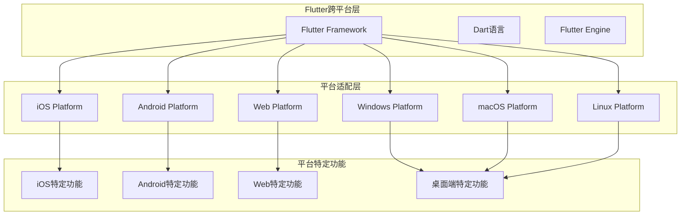

# 跨平台适配策略

**文档版本**: v1.0
**最后更新**: 2025-11-22
**项目名称**: dehaze_flutter
**参考文档**: [响应式设计规范](../design/06-responsive-design.md)、[UI组件设计](02-ui-components.md)

---

## 📋 概述

本文档详细描述了Flutter图像去雾系统的跨平台适配策略，基于[响应式设计文档](../design/06-responsive-design.md)和Flutter的跨平台特性，确保应用在iOS、Android、Web、Windows、macOS、Linux等6个主要平台上都能提供优秀的用户体验。

---

## 🏗️ 平台架构概览

### 目标平台

| 平台类别 | 具体平台 | 支持状态 | 主要特性 |
|---------|----------|----------|----------|
| **移动端** | iOS 14+ | ✅ 完全支持 | 原生体验、触控优化 |
| | Android 8.0+ | ✅ 完全支持 | 材质设计、广泛兼容 |
| **桌面端** | Windows 10+ | ✅ 完全支持 | 键盘鼠标操作、窗口管理 |
| | macOS 10.14+ | ✅ 完全支持 | 原生菜单、触控板支持 |
| | Linux (Ubuntu 18+) | ✅ 完全支持 | 包管理、开源生态 |
| **Web端** | Chrome 90+ | ✅ 完全支持 | 浏览器兼容、PWA支持 |
| | Safari 14+ | ✅ 完全支持 | WebKit优化、苹果生态 |
| | Firefox 88+ | ✅ 完全支持 | 开源浏览器支持 |

### 技术实现架构



---

## 📱 移动端适配策略

### iOS平台优化

#### iOS专用特性集成
```dart
// lib/core/platform/ios_platform_service.dart
class IOSPlatformService extends PlatformService {
  @override
  bool get isPlatformSupported => Platform.isIOS;

  @override
  String get platformName => 'iOS';

  @override
  Future<bool> checkPermissions() async {
    try {
      // 相机权限检查
      final cameraStatus = await Permission.camera.status;
      if (!cameraStatus.isGranted) {
        final result = await Permission.camera.request();
        if (!result.isGranted) return false;
      }

      // 相册权限检查
      final photosStatus = await Permission.photos.status;
      if (!photosStatus.isGranted) {
        final result = await Permission.photos.request();
        if (!result.isGranted) return false;
      }

      return true;
    } catch (e) {
      log('iOS permission check failed: $e');
      return false;
    }
  }

  @override
  Future<void> openAppSettings() async {
    await AppSettings.openAppSettings(type: AppSettingsType.settings);
  }

  // iOS特定功能
  Future<void> integrateWithPhotosApp() async {
    try {
      // 集成iOS相册应用
      final status = await Permission.photos.status;
      if (status.isLimited) {
        // 处理受限访问权限
        await _handleLimitedPhotoAccess();
      }
    } catch (e) {
      log('Photos app integration failed: $e');
    }
  }

  Future<void> _handleLimitedPhotoAccess() async {
    // 引导用户在相册中选择更多照片
    final result = await PhotoManager.presentLimited();
    log('Limited photo access result: $result');
  }

  Future<void> enableiCloudSync() async {
    // 启用iCloud照片同步
    // 这需要特定的iOS权限和配置
  }

  @override
  Future<DeviceInfo> getDeviceInfo() async {
    final deviceInfoPlugin = DeviceInfoPlugin();
    final iosInfo = await deviceInfoPlugin.iosInfo();

    return DeviceInfo(
      platform: 'iOS',
      model: iosInfo.model,
      systemVersion: iosInfo.systemVersion,
      name: iosInfo.name,
      isPhysicalDevice: iosInfo.isPhysicalDevice,
      localizedModel: iosInfo.localizedModel,
    );
  }
}
```

#### iOS UI适配
```dart
// lib/features/shared/widgets/ios_adaptive_widget.dart
class IOSAdaptiveWidget extends StatelessWidget {
  final Widget child;
  final bool? useCupertinoStyle;

  const IOSAdaptiveWidget({
    Key? key,
    required this.child,
    this.useCupertinoStyle,
  }) : super(key: key);

  @override
  Widget build(BuildContext context) {
    if (!Platform.isIOS) return child;

    return Theme(
      data: _getIOSTheme(context),
      child: child,
    );
  }

  ThemeData _getIOSTheme(BuildContext context) {
    final baseTheme = Theme.of(context);

    return baseTheme.copyWith(
      // iOS特有的主题调整
      appBarTheme: baseTheme.appBarTheme.copyWith(
        elevation: 0,
        centerTitle: true,
        titleTextStyle: TextStyle(
          fontFamily: 'San Francisco',
          fontSize: 17,
          fontWeight: FontWeight.w600,
          color: baseTheme.appBarTheme.titleTextStyle?.color,
        ),
      ),
      buttonTheme: baseTheme.buttonTheme.copyWith(
        shape: RoundedRectangleBorder(
          borderRadius: BorderRadius.circular(8),
        ),
      ),
      cardTheme: baseTheme.cardTheme.copyWith(
        elevation: 1,
        shape: RoundedRectangleBorder(
          borderRadius: BorderRadius.circular(12),
        ),
      ),
    );
  }
}
```

### Android平台优化

#### Android专用特性集成
```dart
// lib/core/platform/android_platform_service.dart
class AndroidPlatformService extends PlatformService {
  @override
  bool get isPlatformSupported => Platform.isAndroid;

  @override
  String get platformName => 'Android';

  @override
  Future<bool> checkPermissions() async {
    try {
      // 相机权限
      final cameraStatus = await Permission.camera.status;
      if (!cameraStatus.isGranted) {
        final result = await Permission.camera.request();
        if (!result.isGranted) return false;
      }

      // 存储权限（Android 10+作用域存储）
      final storageStatus = await Permission.storage.status;
      if (!storageStatus.isGranted) {
        final result = await Permission.storage.request();
        if (!result.isGranted) return false;
      }

      return true;
    } catch (e) {
      log('Android permission check failed: $e');
      return false;
    }
  }

  // Android特定功能
  Future<void> enableDirectShare() async {
    try {
      // Android分享功能
      final intent = AndroidIntent(
        action: 'android.intent.action.SEND',
        type: 'image/*',
        flags: <int>[Flag.FLAG_GRANT_READ_URI_PERMISSION],
      );
      await intent.launch();
    } catch (e) {
      log('Direct share failed: $e');
    }
  }

  Future<void> integrateWithGooglePhotos() async {
    // 集成Google Photos
    // 需要Google Photos API集成
  }

  Future<void> enableFileProvider() async {
    // Android文件提供者配置
    // 确保应用可以正确访问和分享文件
  }

  @override
  Future<DeviceInfo> getDeviceInfo() async {
    final deviceInfoPlugin = DeviceInfoPlugin();
    final androidInfo = await deviceInfoPlugin.androidInfo();

    return DeviceInfo(
      platform: 'Android',
      model: androidInfo.model,
      systemVersion: androidInfo.version.release,
      name: androidInfo.brand,
      isPhysicalDevice: androidInfo.isPhysicalDevice,
    );
  }
}
```

---

## 🖥️ 桌面端适配策略

### 桌面端通用适配

#### 响应式窗口管理
```dart
// lib/core/platform/desktop_window_service.dart
class DesktopWindowService {
  static late DesktopWindow _window;

  static Future<void> initialize() async {
    _window = await DesktopWindow.create();
  }

  // 窗口尺寸管理
  static Future<void> setWindowSize(double width, double height) async {
    await _window.setSize(Size(width, height));
  }

  static Future<void> setMinimumSize(double width, double height) async {
    await _window.setMinimumSize(Size(width, height));
  }

  static Future<void> setMaximumSize(double width, double height) async {
    await _window.setMaximumSize(Size(width, height));
  }

  // 窗口状态管理
  static Future<void> maximize() async {
    await _window.maximize();
  }

  static Future<void> minimize() async {
    await _window.minimize();
  }

  static Future<void> restore() async {
    await _window.restore();
  }

  // 窗口定位
  static Future<void> centerWindow() async {
    final screen = await _window.getScreen();
    final windowSize = await _window.getSize();

    final left = (screen.width - windowSize.width) / 2;
    final top = (screen.height - windowSize.height) / 2;

    await _window.setPosition(Offset(left, top));
  }

  // 窗口标题栏
  static Future<void> setTitle(String title) async {
    await _window.setTitle(title);
  }

  static Future<void> hideTitleBar() async {
    await _window.setTitleBarHidden(true);
  }

  static Future<void> showTitleBar() async {
    await _window.setTitleBarHidden(false);
  }

  // 全屏模式
  static Future<void> toggleFullscreen() async {
    final isFullscreen = await _window.getFullscreen();
    await _window.setFullscreen(!isFullscreen);
  }

  static Future<void> setAlwaysOnTop(bool alwaysOnTop) async {
    await _window.setAlwaysOnTop(alwaysOnTop);
  }
}
```

#### 桌面端导航适配
```dart
// lib/features/shared/widgets/desktop_navigation_widget.dart
class DesktopNavigationWidget extends StatelessWidget {
  final int currentIndex;
  final ValueChanged<int> onTap;

  const DesktopNavigationWidget({
    Key? key,
    required this.currentIndex,
    required this.onTap,
  }) : super(key: key);

  @override
  Widget build(BuildContext context) {
    return Container(
      decoration: BoxDecoration(
        color: Colors.grey[50],
        boxShadow: [
          BoxShadow(
            color: Colors.black.withOpacity(0.1),
            blurRadius: 4,
            offset: Offset(0, 2),
          ),
        ],
      ),
      child: Column(
        children: [
          // 应用标题区域
          _buildAppHeader(context),
          // 导航菜单
          Expanded(child: _buildNavigationMenu(context)),
          // 底部用户信息
          _buildUserSection(context),
        ],
      ),
    );
  }

  Widget _buildAppHeader(BuildContext context) {
    return Container(
      padding: EdgeInsets.all(16),
      child: Row(
        children: [
          // Logo
          CircleAvatar(
            backgroundColor: Theme.of(context).primaryColor,
            child: Icon(Icons.cloud, color: Colors.white),
          ),
          SizedBox(width: 12),
          // 应用名称
          Text(
            '图像去雾系统',
            style: TextStyle(
              fontSize: 18,
              fontWeight: FontWeight.bold,
            ),
          ),
        ],
      ),
    );
  }

  Widget _buildNavigationMenu(BuildContext context) {
    final navigationItems = [
      NavigationItem(
        icon: Icons.home,
        label: '首页',
        route: '/home',
      ),
      NavigationItem(
        icon: Icons.upload_file,
        label: '图像输入',
        route: '/image_input',
      ),
      NavigationItem(
        icon: Icons.psychology,
        label: '算法选择',
        route: '/algorithm_select',
      ),
      NavigationItem(
        icon: Icons.settings,
        label: '去雾处理',
        route: '/processing',
      ),
      NavigationItem(
        icon: Icons.compare,
        label: '效果对比',
        route: '/comparison',
      ),
    ];

    return ListView.builder(
      padding: EdgeInsets.symmetric(vertical: 8),
      itemCount: navigationItems.length,
      itemBuilder: (context, index) {
        final item = navigationItems[index];
        final isSelected = currentIndex == index;

        return ListTile(
          leading: Icon(
            item.icon,
            color: isSelected ? Theme.of(context).primaryColor : null,
          ),
          title: Text(
            item.label,
            style: TextStyle(
              fontWeight: isSelected ? FontWeight.bold : null,
              color: isSelected ? Theme.of(context).primaryColor : null,
            ),
          ),
          selected: isSelected,
          selectedTileColor: Theme.of(context).primaryColor.withOpacity(0.1),
          onTap: () {
            onTap(index);
            Navigator.pushNamed(context, item.route);
          },
        );
      },
    );
  }

  Widget _buildUserSection(BuildContext context) {
    return Container(
      padding: EdgeInsets.all(16),
      child: Row(
        children: [
          CircleAvatar(
            backgroundImage: AssetImage('assets/images/default_avatar.png'),
          ),
          SizedBox(width: 12),
          Expanded(
            child: Column(
              crossAxisAlignment: CrossAxisAlignment.start,
              children: [
                Text(
                  '用户名',
                  style: TextStyle(fontWeight: FontWeight.bold),
                ),
                Text(
                  'user@example.com',
                  style: TextStyle(
                    fontSize: 12,
                    color: Colors.grey[600],
                  ),
                ),
              ],
            ),
          ),
          IconButton(
            icon: Icon(Icons.settings),
            onPressed: () {
              // 打开设置页面
            },
          ),
        ],
      ),
    );
  }
}

class NavigationItem {
  final IconData icon;
  final String label;
  final String route;

  const NavigationItem({
    required this.icon,
    required this.label,
    required this.route,
  });
}
```

### Windows平台优化

#### Windows特定功能
```dart
// lib/core/platform/windows_platform_service.dart
class WindowsPlatformService extends DesktopPlatformService {
  @override
  bool get isPlatformSupported => Platform.isWindows;

  @override
  String get platformName => 'Windows';

  // Windows特定功能
  Future<void> integrateWithWindowsExplorer() async {
    try {
      // Windows文件管理器集成
      // 注册右键菜单等
    } catch (e) {
      log('Windows Explorer integration failed: $e');
    }
  }

  Future<void> enableTaskbarProgress(int progress) async {
    try {
      // Windows任务栏进度显示
      // 需要Windows API集成
    } catch (e) {
      log('Taskbar progress failed: $e');
    }
  }

  Future<void> showSystemNotification(String title, String body) async {
    try {
      // Windows系统通知
      final notification = Notification(
        title: title,
        body: body,
        icon: 'assets/images/app_icon.png',
      );
      await notification.show();
    } catch (e) {
      log('Windows notification failed: $e');
    }
  }

  @override
  Future<DeviceInfo> getDeviceInfo() async {
    final deviceInfoPlugin = DeviceInfoPlugin();
    final windowsInfo = await deviceInfoPlugin.windowsInfo();

    return DeviceInfo(
      platform: 'Windows',
      model: windowsInfo.computerName,
      systemVersion: windowsInfo.majorVersion.toString(),
      name: windowsInfo.userName,
      isPhysicalDevice: true,
    );
  }
}
```

### macOS平台优化

#### macOS特定功能
```dart
// lib/core/platform/macos_platform_service.dart
class MacOSPlatformService extends DesktopPlatformService {
  @override
  bool get isPlatformSupported => Platform.isMacOS;

  @override
  String get platformName => 'macOS';

  // macOS特定功能
  Future<void> integrateWithFinder() async {
    try {
      // macOS Finder集成
      // 注册服务和右键菜单
    } catch (e) {
      log('macOS Finder integration failed: $e');
    }
  }

  Future<void> enableMenuBarIntegration() async {
    try {
      // macOS菜单栏集成
      // 需要macOS APIs
    } catch (e) {
      log('Menu bar integration failed: $e');
    }
  }

  Future<void> showDockProgress(double progress) async {
    try {
      // macOS Dock进度显示
      // 需要macOS APIs
    } catch (e) {
      log('Dock progress failed: $e');
    }
  }

  Future<void> showNotificationCenterNotification(
    String title,
    String body,
  ) async {
    try {
      // macOS通知中心
      final notification = Notification(
        title: title,
        body: body,
        icon: 'assets/images/app_icon.png',
      );
      await notification.show();
    } catch (e) {
      log('macOS notification failed: $e');
    }
  }

  @override
  Future<DeviceInfo> getDeviceInfo() async {
    final deviceInfoPlugin = DeviceInfoPlugin();
    final macOsInfo = await deviceInfoPlugin.macOsInfo();

    return DeviceInfo(
      platform: 'macOS',
      model: macOsInfo.model,
      systemVersion: macOsInfo.majorVersion.toString(),
      name: macOsInfo.computerName,
      isPhysicalDevice: true,
    );
  }
}
```

---

## 🌐 Web端适配策略

### Web专用服务

#### Web平台服务实现
```dart
// lib/core/platform/web_platform_service.dart
class WebPlatformService extends PlatformService {
  @override
  bool get isPlatformSupported => kIsWeb;

  @override
  String get platformName => 'Web';

  @override
  Future<bool> checkPermissions() async {
    // Web平台权限检查
    try {
      // 检查摄像头权限
      final cameraPermission = await html.window.navigator.permissions?.query(
        {'name': 'camera'},
      );

      if (cameraPermission?.state == 'granted') {
        return true;
      } else if (cameraPermission?.state == 'prompt') {
        // 需要请求权限
        final result = await _requestCameraPermission();
        return result;
      }

      return false;
    } catch (e) {
      log('Web permission check failed: $e');
      return false;
    }
  }

  Future<bool> _requestCameraPermission() async {
    try {
      final stream = await html.window.navigator.getUserMedia(
        {'video': true},
      );
      stream.getTracks().forEach((track) => track.stop());
      return true;
    } catch (e) {
      return false;
    }
  }

  // Web特定功能
  Future<void> enablePWA() async {
    try {
      // PWA功能启用
      if (_supportsServiceWorker()) {
        await _registerServiceWorker();
      }
    } catch (e) {
      log('PWA enablement failed: $e');
    }
  }

  bool _supportsServiceWorker() {
    return html.window.navigator.serviceWorker != null;
  }

  Future<void> _registerServiceWorker() async {
    final registration = await html.window.navigator.serviceWorker?.register(
      '/firebase-messaging-sw.js',
    );
    log('Service Worker registered: $registration');
  }

  Future<void> enableWebShare() async {
    try {
      // Web Share API
      if (_supportsWebShare()) {
        // 准备分享功能
      }
    } catch (e) {
      log('Web Share API failed: $e');
    }
  }

  bool _supportsWebShare() {
    return html.window.navigator.share != null;
  }

  Future<void> shareContent(String title, String text, String url) async {
    if (_supportsWebShare()) {
      await html.window.navigator.share!(
        title: title,
        text: text,
        url: url,
      );
    } else {
      // 降级到其他分享方式
      await _fallbackShare(title, text, url);
    }
  }

  Future<void> _fallbackShare(String title, String text, String url) async {
    // 复制到剪贴板
    await html.window.navigator.clipboard?.writeText('$title\n$text\n$url');

    // 显示提示
    _showShareToast('链接已复制到剪贴板');
  }

  void _showShareToast(String message) {
    final container = html.document.createElement('div');
    container.text = message;
    container.style.position = 'fixed';
    container.style.bottom = '20px';
    container.style.left = '50%';
    container.style.transform = 'translateX(-50%)';
    container.style.backgroundColor = '#333';
    container.style.color = 'white';
    container.style.padding = '12px 24px';
    container.style.borderRadius = '8px';
    container.style.zIndex = '9999';

    html.document.body?.append(container);

    // 3秒后移除
    Timer(Duration(seconds: 3), () {
      container.remove();
    });
  }

  @override
  Future<DeviceInfo> getDeviceInfo() async {
    return DeviceInfo(
      platform: 'Web',
      model: html.window.navigator.userAgent,
      systemVersion: 'Web',
      name: 'Web Browser',
      isPhysicalDevice: false,
    );
  }
}
```

#### Web专用UI适配
```dart
// lib/features/shared/widgets/web_adaptive_widget.dart
class WebAdaptiveWidget extends StatelessWidget {
  final Widget child;
  final bool enableHover;
  final bool enableFocus;

  const WebAdaptiveWidget({
    Key? key,
    required this.child,
    this.enableHover = true,
    this.enableFocus = true,
  }) : super(key: key);

  @override
  Widget build(BuildContext context) {
    if (!kIsWeb) return child;

    return Focus(
      canRequestFocus: enableFocus,
      child: MouseRegion(
        cursor: SystemMouseCursors.click,
        child: Container(
          // Web专用样式
          decoration: BoxDecoration(
            border: Border.all(
              color: Colors.transparent,
              width: 2,
            ),
          ),
          child: child,
        ),
      ),
    );
  }
}

class WebResponsiveLayout extends StatelessWidget {
  final Widget child;
  final int mobileBreakpoint;
  final int tabletBreakpoint;

  const WebResponsiveLayout({
    Key? key,
    required this.child,
    this.mobileBreakpoint = 768,
    this.tabletBreakpoint = 1024,
  }) : super(key: key);

  @override
  Widget build(BuildContext context) {
    return LayoutBuilder(
      builder: (context, constraints) {
        if (constraints.maxWidth < mobileBreakpoint) {
          // 移动端布局
          return _buildMobileLayout(child);
        } else if (constraints.maxWidth < tabletBreakpoint) {
          // 平板端布局
          return _buildTabletLayout(child);
        } else {
          // 桌面端布局
          return _buildDesktopLayout(child);
        }
      },
    );
  }

  Widget _buildMobileLayout(Widget child) {
    return child;
  }

  Widget _buildTabletLayout(Widget child) {
    return Row(
      children: [
        // 侧边栏
        Container(
          width: 250,
          color: Colors.grey[100],
          child: _buildSidebar(),
        ),
        // 主内容
        Expanded(child: child),
      ],
    );
  }

  Widget _buildDesktopLayout(Widget child) {
    return Row(
      children: [
        // 侧边栏
        Container(
          width: 300,
          color: Colors.grey[100],
          child: _buildSidebar(),
        ),
        // 主内容
        Expanded(
          child: Padding(
            padding: EdgeInsets.all(24),
            child: child,
          ),
        ),
      ],
    );
  }

  Widget _buildSidebar() {
    return Column(
      children: [
        // Logo区域
        Container(
          padding: EdgeInsets.all(20),
          child: Center(
            child: Icon(Icons.cloud, size: 48),
          ),
        ),
        // 导航菜单
        Expanded(child: _buildNavigationMenu()),
      ],
    );
  }

  Widget _buildNavigationMenu() {
    final menuItems = [
      {'icon': Icons.home, 'label': '首页', 'route': '/'},
      {'icon': Icons.upload_file, 'label': '上传', 'route': '/upload'},
      {'icon': Icons.psychology, 'label': '算法', 'route': '/algorithms'},
      {'icon': Icons.settings, 'label': '设置', 'route': '/settings'},
    ];

    return ListView.builder(
      itemCount: menuItems.length,
      itemBuilder: (context, index) {
        final item = menuItems[index];
        return ListTile(
          leading: Icon(item['icon'] as IconData),
          title: Text(item['label'] as String),
          onTap: () {
            // 导航逻辑
          },
        );
      },
    );
  }
}
```

---

## 🔄 平台检测与适配

### 平台检测服务

#### 统一平台检测
```dart
// lib/core/platform/platform_detector.dart
class PlatformDetector {
  static bool get isMobile => Platform.isIOS || Platform.isAndroid;
  static bool get isTablet => _isTablet();
  static bool get isDesktop => Platform.isWindows || Platform.isMacOS || Platform.isLinux;
  static bool get isWeb => kIsWeb;

  static DeviceType get deviceType {
    if (isWeb) return DeviceType.web;
    if (Platform.isIOS) return _getIOSDeviceType();
    if (Platform.isAndroid) return _getAndroidDeviceType();
    if (Platform.isWindows) return DeviceType.windows;
    if (Platform.isMacOS) return DeviceType.macos;
    if (Platform.isLinux) return DeviceType.linux;
    return DeviceType.unknown;
  }

  static ScreenType getScreenType {
    if (!isWeb) {
      final screenWidth = WidgetsBinding.instance.window.physicalSize.width;
      final screenHeight = WidgetsBinding.instance.window.physicalSize.height;
      final pixelRatio = WidgetsBinding.instance.window.devicePixelRatio;

      final width = screenWidth / pixelRatio;
      final height = screenHeight / pixelRatio;

      if (width < 600) return ScreenType.mobileSmall;
      if (width < 768) return ScreenType.mobile;
      if (width < 1024) return ScreenType.tablet;
      return ScreenType.desktop;
    }

    // Web端屏幕类型检测
    final mediaQuery = MediaQuery.of(
      WidgetsBinding.instance.window as Element,
      query: 'max-width: 768px',
    );

    if (mediaQuery.hasSize) return ScreenType.mobile;

    return ScreenType.desktop;
  }

  static bool get isLandscape {
    if (isWeb) {
      // Web端横竖屏检测
      final mediaQuery = MediaQuery.of(
        WidgetsBinding.instance.window as Element,
        query: 'orientation: landscape',
      );
      return mediaQuery.hasSize;
    }

    final size = WidgetsBinding.instance.window.physicalSize;
    return size.width > size.height;
  }

  static bool get isPortrait => !isLandscape;

  static Future<void> detectCapabilities() async {
    final capabilities = <String, bool>{};

    capabilities['touch'] = _hasTouchSupport();
    capabilities['mouse'] = _hasMouseSupport();
    capabilities['keyboard'] = _hasKeyboardSupport();
    capabilities['camera'] = await _hasCameraSupport();
    capabilities['microphone'] = await _hasMicrophoneSupport();

    await _saveCapabilities(capabilities);
  }

  static Future<bool> _hasCameraSupport() async {
    try {
      if (isWeb) {
        final stream = await html.window.navigator.getUserMedia(
          {'video': true},
        );
        stream.getTracks().forEach((track) => track.stop());
        return true;
      } else if (isMobile) {
        // 移动端通常都有摄像头
        return true;
      } else {
        // 桌面端需要检查摄像头设备
        return true; // 简化实现
      }
    } catch (e) {
      return false;
    }
  }

  static Future<bool> _hasMicrophoneSupport() async {
    try {
      if (isWeb) {
        final stream = await html.window.navigator.getUserMedia(
          {'audio': true},
        );
        stream.getTracks().forEach((track) => track.stop());
        return true;
      }
      return true;
    } catch (e) {
      return false;
    }
  }

  static bool _hasTouchSupport() {
    if (isWeb) {
      return 'ontouchstart' in html.document.documentElement!;
    }
    return isMobile;
  }

  static bool _hasMouseSupport() {
    if (isWeb) {
      return 'onmousemove' in html.document.documentElement!;
    }
    return true; // 桌面端通常都有鼠标支持
  }

  static bool _hasKeyboardSupport() {
    if (isWeb) {
      return 'onkeydown' in html.document.documentElement!;
    }
    return true; // 大多数平台都支持键盘
  }

  static DeviceType _getIOSDeviceType() {
    // 根据屏幕尺寸判断iPad/iPhone
    final size = WidgetsBinding.instance.window.physicalSize;
    final pixelRatio = WidgetsBinding.instance.window.devicePixelRatio;
    final width = size.width / pixelRatio;

    if (width >= 768) {
      return DeviceType.tablet;
    }
    return DeviceType.mobile;
  }

  static DeviceType _getAndroidDeviceType() {
    // Android设备类型检测
    final size = WidgetsBinding.instance.window.physicalSize;
    final pixelRatio = WidgetsBinding.instance.window.devicePixelRatio;
    final width = size.width / pixelRatio;
    final height = size.height / pixelRatio;

    if (width >= 600 && height >= 960) {
      return DeviceType.tablet;
    }
    return DeviceType.mobile;
  }

  static bool _isTablet() {
    if (isWeb) {
      final mediaQuery = MediaQuery.of(
        WidgetsBinding.instance.window as Element,
        query: 'min-width: 768px and max-width: 1024px',
      );
      return mediaQuery.hasSize;
    }

    final size = WidgetsBinding.instance.window.physicalSize;
    final pixelRatio = WidgetsBinding.instance.window.devicePixelRatio;
    final width = size.width / pixelRatio;
    final height = size.height / pixelRatio;

    // 常见的平板尺寸阈值
    return (width >= 600 && width <= 1024) || (height >= 960);
  }

  static Future<void> _saveCapabilities(Map<String, bool> capabilities) async {
    final storage = serviceLocator<StorageService>();
    for (final entry in capabilities.entries) {
      await storage.setBool('capability_${entry.key}', entry.value);
    }
  }

  static Future<Map<String, bool>> getSavedCapabilities() async {
    final storage = serviceLocator<StorageService>();
    final capabilities = <String, bool>{};

    final keys = ['touch', 'mouse', 'keyboard', 'camera', 'microphone'];
    for (final key in keys) {
      final value = await storage.getBool('capability_$key');
      capabilities[key] = value ?? false;
    }

    return capabilities;
  }
}

enum DeviceType {
  mobile,
  tablet,
  desktop,
  web,
  windows,
  macos,
  linux,
  unknown,
}

enum ScreenType {
  mobileSmall,    // < 600px
  mobile,         // 600-768px
  tablet,         // 768-1024px
  desktop,        // > 1024px
}
```

### 响应式组件适配

#### 平台感知组件
```dart
// lib/features/shared/widgets/platform_aware_widget.dart
class PlatformAwareWidget extends StatelessWidget {
  final Widget? mobile;
  final Widget? tablet;
  final Widget? desktop;
  final Widget? web;
  final Widget fallback;

  const PlatformAwareWidget({
    Key? key,
    this.mobile,
    this.tablet,
    this.desktop,
    this.web,
    this.fallback = const SizedBox(),
  }) : super(key: key);

  @override
  Widget build(BuildContext context) {
    if (PlatformDetector.isWeb && web != null) {
      return web!;
    }

    if (PlatformDetector.isMobile && mobile != null) {
      return mobile!;
    }

    if (PlatformDetector.isTablet && tablet != null) {
      return tablet!;
    }

    if (PlatformDetector.isDesktop && desktop != null) {
      return desktop!;
    }

    return fallback;
  }
}

// 使用示例
class ResponsiveHomePage extends StatelessWidget {
  @override
  Widget build(BuildContext context) {
    return Scaffold(
      body: PlatformAwareWidget(
        mobile: _buildMobileLayout(),
        tablet: _buildTabletLayout(),
        desktop: _buildDesktopLayout(),
        web: _buildWebLayout(),
        fallback: _buildMobileLayout(), // 降级到移动端布局
      ),
    );
  }

  Widget _buildMobileLayout() {
    return Column(
      children: [
        _buildHeader(),
        Expanded(child: _buildMobileContent()),
        _buildBottomNavigation(),
      ],
    );
  }

  Widget _buildTabletLayout() {
    return Row(
      children: [
        _buildSidebar(),
        Expanded(child: _buildTabletContent()),
      ],
    );
  }

  Widget _buildDesktopLayout() {
    return Row(
      children: [
        _buildSidebar(),
        Expanded(
          child: Padding(
            padding: EdgeInsets.all(32),
            child: _buildDesktopContent(),
          ),
        ),
      ],
    );
  }

  Widget _buildWebLayout() {
    return WebResponsiveLayout(
      child: _buildUnifiedContent(),
    );
  }
}
```

---

## 📱 平台特定UI组件

### 自适应表单组件

```dart
// lib/features/shared/widgets/adaptive_form_field.dart
class AdaptiveFormField extends StatelessWidget {
  final String label;
  final String? hint;
  final TextInputType keyboardType;
  final bool obscureText;
  final FormFieldValidator<String>? validator;
  final TextEditingController? controller;
  final FocusNode? focusNode;
  final VoidCallback? onTap;
  final ValueChanged<String>? onChanged;
  final Widget? suffixIcon;
  final bool readOnly;

  const AdaptiveFormField({
    Key? key,
    required this.label,
    this.hint,
    this.keyboardType = TextInputType.text,
    this.obscureText = false,
    this.validator,
    this.controller,
    this.focusNode,
    this.onTap,
    this.onChanged,
    this.suffixIcon,
    this.readOnly = false,
  }) : super(key: key);

  @override
  Widget build(BuildContext context) {
    if (PlatformDetector.isMobile) {
      return _buildMobileFormField();
    } else {
      return _buildDesktopFormField();
    }
  }

  Widget _buildMobileFormField() {
    return Column(
      crossAxisAlignment: CrossAxisAlignment.start,
      children: [
        Text(
          label,
          style: TextStyle(
            fontSize: 16,
            fontWeight: FontWeight.w600,
          ),
        ),
        SizedBox(height: 8),
        TextFormField(
          controller: controller,
          focusNode: focusNode,
          keyboardType: keyboardType,
          obscureText: obscureText,
          validator: validator,
          onTap: onTap,
          onChanged: onChanged,
          readOnly: readOnly,
          decoration: InputDecoration(
            hintText: hint,
            suffixIcon: suffixIcon,
            border: OutlineInputBorder(
              borderRadius: BorderRadius.circular(12),
            ),
            contentPadding: EdgeInsets.all(16),
          ),
        ),
      ],
    );
  }

  Widget _buildDesktopFormField() {
    return Row(
      children: [
        SizedBox(
          width: 120,
          child: Text(
            label,
            style: TextStyle(
              fontSize: 14,
              fontWeight: FontWeight.w500,
            ),
          ),
        ),
        SizedBox(width: 16),
        Expanded(
          child: TextFormField(
            controller: controller,
            focusNode: focusNode,
            keyboardType: keyboardType,
            obscureText: obscureText,
            validator: validator,
            onTap: onTap,
            onChanged: onChanged,
            readOnly: readOnly,
            decoration: InputDecoration(
              hintText: hint,
              suffixIcon: suffixIcon,
              border: OutlineInputBorder(
                borderRadius: BorderRadius.circular(8),
              ),
              contentPadding: EdgeInsets.symmetric(
                horizontal: 12,
                vertical: 8,
              ),
            ),
          ),
        ),
      ],
    );
  }
}
```

### 自适应按钮组件

```dart
// lib/features/shared/widgets/adaptive_button.dart
class AdaptiveButton extends StatelessWidget {
  final String text;
  final VoidCallback? onPressed;
  final IconData? icon;
  final AdaptiveButtonType type;
  final AdaptiveButtonSize size;
  final bool isLoading;
  final bool fullWidth;

  const AdaptiveButton({
    Key? key,
    required this.text,
    this.onPressed,
    this.icon,
    this.type = AdaptiveButtonType.primary,
    this.size = AdaptiveButtonSize.medium,
    this.isLoading = false,
    this.fullWidth = false,
  }) : super(key: key);

  @override
  Widget build(BuildContext context) {
    final child = _buildButtonChild();

    if (PlatformDetector.isMobile) {
      return _buildMobileButton(child);
    } else {
      return _buildDesktopButton(child);
    }
  }

  Widget _buildButtonChild() {
    if (icon != null) {
      return Row(
        mainAxisSize: MainAxisSize.min,
        children: [
          if (isLoading)
            SizedBox(
              width: 16,
              height: 16,
              child: CircularProgressIndicator(
                strokeWidth: 2,
                valueColor: AlwaysStoppedAnimation<Color>(
                  Colors.white,
                ),
              ),
            )
          else
            Icon(icon, size: _getIconSize()),
          SizedBox(width: 8),
          Text(text),
        ],
      );
    } else {
      if (isLoading) {
        return SizedBox(
          width: 16,
          height: 16,
          child: CircularProgressIndicator(
            strokeWidth: 2,
            valueColor: AlwaysStoppedAnimation<Color>(
              Colors.white,
            ),
          ),
        );
      } else {
        return Text(text);
      }
    }
  }

  Widget _buildMobileButton(Widget child) {
    return SizedBox(
      width: fullWidth ? double.infinity : null,
      height: _getMobileHeight(),
      child: ElevatedButton(
        onPressed: isLoading ? null : onPressed,
        style: _getMobileButtonStyle(),
        child: child,
      ),
    );
  }

  Widget _buildDesktopButton(Widget child) {
    return SizedBox(
      width: fullWidth ? double.infinity : null,
      height: _getDesktopHeight(),
      child: ElevatedButton(
        onPressed: isLoading ? null : onPressed,
        style: _getDesktopButtonStyle(),
        child: child,
      ),
    );
  }

  double _getMobileHeight() {
    switch (size) {
      case AdaptiveButtonSize.small:
        return 40;
      case AdaptiveButtonSize.medium:
        return 48;
      case AdaptiveButtonSize.large:
        return 56;
    }
  }

  double _getDesktopHeight() {
    switch (size) {
      case AdaptiveButtonSize.small:
        return 32;
      case AdaptiveButtonSize.medium:
        return 40;
      case AdaptiveButtonSize.large:
        return 48;
    }
  }

  double _getIconSize() {
    switch (size) {
      case AdaptiveButtonSize.small:
        return 16;
      case AdaptiveButtonSize.medium:
        return 20;
      case AdaptiveButtonSize.large:
        return 24;
    }
  }

  ButtonStyle _getMobileButtonStyle() {
    switch (type) {
      case AdaptiveButtonType.primary:
        return ElevatedButton.styleFrom(
          backgroundColor: Theme.of(context).primaryColor,
          foregroundColor: Colors.white,
          elevation: 2,
          shape: RoundedRectangleBorder(
            borderRadius: BorderRadius.circular(12),
          ),
        );
      case AdaptiveButtonType.secondary:
        return ElevatedButton.styleFrom(
          backgroundColor: Colors.grey[200],
          foregroundColor: Colors.grey[800],
          elevation: 0,
          shape: RoundedRectangleBorder(
            borderRadius: BorderRadius.circular(12),
          ),
        );
    }
  }

  ButtonStyle _getDesktopButtonStyle() {
    switch (type) {
      case AdaptiveButtonType.primary:
        return ElevatedButton.styleFrom(
          backgroundColor: Theme.of(context).primaryColor,
          foregroundColor: Colors.white,
          elevation: 1,
          shape: RoundedRectangleBorder(
            borderRadius: BorderRadius.circular(6),
          ),
        );
      case AdaptiveButtonType.secondary:
        return ElevatedButton.styleFrom(
          backgroundColor: Colors.grey[100],
          foregroundColor: Colors.grey[700],
          elevation: 0,
          shape: RoundedRectangleBorder(
            borderRadius: BorderRadius.circular(6),
          ),
        );
    }
  }
}

enum AdaptiveButtonType {
  primary,
  secondary,
}

enum AdaptiveButtonSize {
  small,
  medium,
  large,
}
```

---

## 🎯 性能优化策略

### 平台特定优化

#### 移动端优化
```dart
// lib/core/performance/mobile_optimizer.dart
class MobileOptimizer {
  static void optimizeForMobile() {
    // 内存管理优化
    _optimizeMemoryUsage();

    // 图片加载优化
    _optimizeImageLoading();

    // 动画性能优化
    _optimizeAnimations();

    // 网络请求优化
    _optimizeNetworkRequests();
  }

  static void _optimizeMemoryUsage() {
    // 设置图片缓存大小限制
    PaintingBinding.instance.imageCache.maximumSize = 50;

    // 设置字体缓存大小限制
    PaintingBinding.instance.imageCache.maximumSizeBytes = 50 * 1024 * 1024;

    // 清理未使用的资源
    _scheduleMemoryCleanup();
  }

  static void _optimizeImageLoading() {
    // 启用图片缓存
    // 设置默认图片质量和压缩
    // 实现图片懒加载
  }

  static void _optimizeAnimations() {
    // 减少动画复杂度
    // 使用硬件加速
    // 避免不必要的重建
  }

  static void _optimizeNetworkRequests() {
    // 启用请求缓存
    // 合并相似请求
    // 设置合理的超时时间
  }

  static void _scheduleMemoryCleanup() {
    // 定期清理内存
    Timer.periodic(Duration(minutes: 5), (_) {
      _performMemoryCleanup();
    });
  }

  static void _performMemoryCleanup() {
    // 清理图片缓存
    PaintingBinding.instance.imageCache.clear();

    // 强制垃圾回收
    // 注意：在生产环境中要谨慎使用
  }
}
```

#### Web端优化
```dart
// lib/core/performance/web_optimizer.dart
class WebOptimizer {
  static void optimizeForWeb() {
    // 启用懒加载
    _enableLazyLoading();

    // 优化资源加载
    _optimizeResourceLoading();

    // 启用PWA功能
    _enablePWAFeatures();

    // 优化SEO
    _optimizeSEO();
  }

  static void _enableLazyLoading() {
    // 实现图片懒加载
    // 使用Intersection Observer
  }

  static void _optimizeResourceLoading() {
    // 预加载关键资源
    // 延迟加载非关键资源
    // 使用CDN加速
  }

  static void _enablePWAFeatures() {
    // 注册Service Worker
    // 实现离线缓存
    // 添加到主屏幕
  }

  static void _optimizeSEO() {
    // 设置页面标题和描述
    // 添加meta标签
    // 实现语义化HTML
  }
}
```

---

## 🧪 平台测试策略

### 多平台测试配置

#### 平台检测测试
```dart
// test/core/platform/platform_detector_test.dart
void main() {
  group('PlatformDetector', () {
    testWidgets('should detect mobile platform correctly', (tester) async {
      // 测试移动端平台检测
      await tester.pumpWidget(PlatformAwareWidget(
        mobile: Container(),
        tablet: Container(),
        desktop: Container(),
        web: Container(),
      ));

      // 验证移动端组件是否被渲染
      expect(find.byKey(Key('mobile-widget')), findsOneWidget);
    });

    testWidgets('should detect desktop platform correctly', (tester) async {
      // 模拟桌面端环境
      await tester.binding.setSurfaceSize(Size(1200, 800));

      await tester.pumpWidget(PlatformAwareWidget(
        mobile: Container(),
        tablet: Container(),
        desktop: Container(),
        web: Container(),
      ));

      // 验证桌面端组件是否被渲染
      expect(find.byKey(Key('desktop-widget')), findsOneWidget);
    });

    test('should detect web platform correctly', () {
      // 测试Web平台检测
      final isWeb = PlatformDetector.isWeb;
      expect(isWeb, isA<bool>());
    });
  });
}
```

#### 响应式布局测试
```dart
// test/features/shared/widgets/responsive_layout_test.dart
void main() {
  group('ResponsiveLayout Tests', () {
    testWidgets('should render mobile layout on small screens', (tester) async {
      await tester.binding.setSurfaceSize(Size(375, 667));

      await tester.pumpWidget(ResponsiveHomePage());

      // 验证移动端布局元素
      expect(find.byType(BottomNavigationBar), findsOneWidget);
      expect(find.byKey(Key('bottom-navigation')), findsOneWidget);
    });

    testWidgets('should render desktop layout on large screens', (tester) async {
      await tester.binding.setSurfaceSize(Size(1920, 1080));

      await tester.pumpWidget(ResponsiveHomePage());

      // 验证桌面端布局元素
      expect(find.byKey(Key('sidebar')), findsOneWidget);
      expect(find.byType(BottomNavigationBar), findsNothing);
    });

    testWidgets('should handle orientation changes correctly', (tester) async {
      // 初始竖屏
      await tester.binding.setSurfaceSize(Size(375, 667));
      await tester.pumpWidget(ResponsiveHomePage());

      // 切换到横屏
      await tester.binding.setSurfaceSize(Size(667, 375));
      await tester.pump();

      // 验证横屏布局
      expect(find.byKey(Key('landscape-layout')), findsOneWidget);
    });
  });
}
```

---

**文档版本**: v1.0
**最后更新**: 2025-11-22
**参考文档**: [响应式设计规范](../design/06-responsive-design.md)、[UI组件设计](02-ui-components.md)