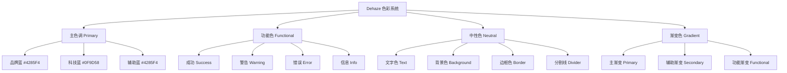
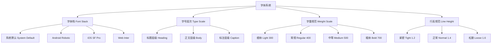
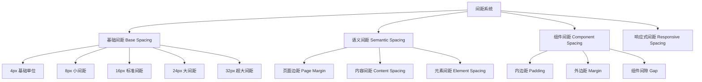
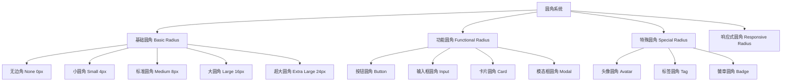
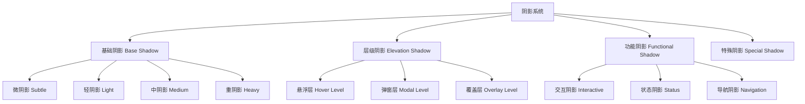

# Dehaze Flutter 设计系统

**文档版本**: v1.0
**创建日期**: 2025-11-22
**适用平台**: iOS、Android、Web、Desktop

## 📋 目录

1. [核心设计原则](#1-核心设计原则)
2. [色彩系统](#2-色彩系统)
3. [字体系统](#3-字体系统)
4. [间距系统](#4-间距系统)
5. [圆角系统](#5-圆角系统)
6. [阴影系统](#6-阴影系统)

---

## 1. 核心设计原则

### 设计哲学

Dehaze Flutter 应用设计系统基于四大核心原则，确保在所有平台和设备上提供一致、专业的用户体验。

#### 平台无关性
- **跨平台一致性**：确保在iOS、Android、Web等不同平台上保持视觉和交互的一致性
- **响应式适配**：根据不同屏幕尺寸和设备特性提供最优的展示效果
- **无障碍设计**：遵循WCAG 2.1 AA标准，确保所有用户都能便捷使用

#### 简洁高效
- **信息层级清晰**：通过视觉层次突出重要信息，降低用户认知负担
- **操作流程简化**：减少不必要的步骤，提高任务完成效率
- **加载性能优化**：合理的动画和过渡效果，避免用户等待焦虑

#### 专业可靠
- **技术专业性**：体现图像处理领域的技术权威性
- **数据准确性**：清晰展示处理参数和结果信息
- **系统稳定性**：通过视觉反馈传达系统的可靠状态

#### 友好易用
- **新手友好**：提供清晰的引导和提示信息
- **专家高效**：为专业用户提供快捷操作和高级功能
- **容错设计**：合理的错误提示和恢复机制

---

## 2. 色彩系统

### 色彩架构图

### 主色调规范

| 色彩 | 用途 | 十六进制 | RGB | 应用场景 |
|------|------|----------|-----|----------|
| 品牌蓝 Primary | 主要交互元素 | #4285F4 | 66, 133, 244 | 按钮、链接、重要图标 |
| 科技蓝 Secondary | 辅助交互元素 | #0F9D58 | 15, 157, 88 | 成功状态、完成标识 |
| 辅助蓝 Accent | 强调元素 | #34A853 | 52, 168, 83 | 特殊标识、营销元素 |

### 功能色规范

| 类型 | 色彩 | 十六进制 | RGB | 使用说明 |
|------|------|----------|-----|----------|
| 成功 | 绿色 | #34A853 | 52, 168, 83 | 操作成功、完成状态 |
| 警告 | 橙色 | #FF9800 | 255, 152, 0 | 注意事项、潜在问题 |
| 错误 | 红色 | #EA4335 | 234, 67, 53 | 错误信息、删除操作 |
| 信息 | 蓝色 | #4285F4 | 66, 133, 244 | 提示信息、帮助说明 |

### 中性色规范

| 类型 | 变体 | 十六进制 | RGB | 应用场景 |
|------|------|----------|-----|----------|
| 主要文字 | Text Primary | #212121 | 33, 33, 33 | 标题、重要正文 |
| 次要文字 | Text Secondary | #757575 | 117, 117, 117 | 副标题、说明文字 |
| 辅助文字 | Text Disabled | #BDBDBD | 189, 189, 189 | 禁用状态、提示文字 |
| 主背景 | Background Primary | #FFFFFF | 255, 255, 255 | 页面底色、卡片背景 |
| 次背景 | Background Secondary | #F8F9FA | 248, 249, 250 | 区块背景、悬停状态 |
| 主边框 | Border Primary | #E0E0E0 | 224, 224, 224 | 输入框、分割线 |
| 次边框 | Border Secondary | #F5F5F5 | 245, 245, 245 | 细分边框、装饰线 |

### 渐变色系统

| 渐变名称 | 起始色 | 结束色 | 角度 | 应用场景 |
|----------|--------|--------|------|----------|
| 主渐变 | #4285F4 | #34A853 | 135° | 主要按钮、重要标识 |
| 辅助渐变 | #667EEA | #764BA2 | 135° | 次要按钮、装饰元素 |
| 功能渐变 | #F093FB | #F5576C | 135° | 特殊功能、营销标识 |

---

## 3. 字体系统

### 字体层级结构

### 字体栈定义

| 平台 | 字体族 | 备选方案 | 特点说明 |
|------|--------|----------|----------|
| 系统默认 | system-ui | - | 使用系统默认字体，保证最佳显示效果 |
| Android | Roboto | sans-serif | Google设计，适合Android平台 |
| iOS | SF Pro | -apple-system | 苹果设计，适合iOS平台 |
| Web | Inter | system-ui | 现代Web字体，屏幕显示优化 |

### 字号规范表

| 层级 | 名称 | 字号大小 | 字重 | 行高 | 使用场景 |
|------|------|----------|------|------|----------|
| H1 | 大标题 | 32px | Bold 700 | 1.2 | 页面主标题、重要标题 |
| H2 | 中标题 | 24px | Medium 500 | 1.3 | 区块标题、章节标题 |
| H3 | 小标题 | 20px | Medium 500 | 1.3 | 卡片标题、子章节 |
| H4 | 微标题 | 18px | Regular 400 | 1.4 | 列表标题、小节标题 |
| Body Large | 大正文 | 16px | Regular 400 | 1.5 | 重要正文、主要描述 |
| Body | 正文 | 14px | Regular 400 | 1.5 | 普通正文、内容描述 |
| Body Small | 小正文 | 12px | Regular 400 | 1.4 | 辅助信息、次要描述 |
| Caption | 标注 | 10px | Regular 400 | 1.4 | 标签文字、时间戳 |

### 响应式字号策略

| 断点 | 基准字号 | H1 | H2 | H3 | Body |
|-------|----------|----|----|----|------|
| Mobile < 768px | 14px | 28px | 20px | 18px | 14px |
| Tablet 768-1024px | 15px | 30px | 22px | 19px | 15px |
| Desktop > 1024px | 16px | 32px | 24px | 20px | 16px |

---

## 4. 间距系统

### 间距架构图

### 基础间距规范

| 间距等级 | 数值 | 倍数 | 命名 | 应用场景 |
|----------|------|------|------|----------|
| XS | 4px | 0.5x | ultra-small | 图标与文字间距、细分割线 |
| S | 8px | 1x | small | 按钮内边距、标签间距 |
| M | 16px | 2x | medium | 卡片内边距、段落间距 |
| L | 24px | 3x | large | 区块间距、表单组间距 |
| XL | 32px | 4x | extra-large | 页面边距、主区块间距 |
| XXL | 48px | 6x | ultra-large | 页面顶部/底部间距 |

### 语义间距应用

| 间距类型 | 数值 | 应用场景 | 设计意图 |
|----------|------|----------|----------|
| 页面边距 | 24px | 页面内容与屏幕边缘 | 保证内容的呼吸感 |
| 区块间距 | 32px | 主要内容区块之间 | 区分不同的功能区域 |
| 组件间距 | 16px | 相关组件之间 | 保持组件组的整体性 |
| 元素间距 | 8px | 组件内部元素 | 维持内部元素的关联性 |
| 微间距 | 4px | 紧密相关的元素 | 保持元素的紧凑性 |

### 响应式间距策略

| 设备类型 | 页面边距 | 卡片内边距 | 组件间距 | 元素间距 |
|----------|----------|------------|----------|----------|
| Mobile < 375px | 16px | 12px | 16px | 8px |
| Mobile 375-768px | 20px | 16px | 20px | 8px |
| Tablet 768-1024px | 24px | 20px | 24px | 8px |
| Desktop > 1024px | 32px | 24px | 32px | 8px |

---

## 5. 圆角系统

### 圆角规范体系

### 圆角数值规范

| 圆角等级 | 数值 | 命名 | 应用场景 | 视觉效果 |
|----------|------|------|----------|----------|
| None | 0px | none | 分割线、表格边框 | 硬朗、清晰 |
| XS | 2px | extra-small | 标签、徽章 | 微弧度、精致 |
| S | 4px | small | 按钮、输入框 | 轻微柔和 |
| M | 8px | medium | 卡片、面板 | 标准柔和 |
| L | 16px | large | 大卡片、容器 | 明显柔和 |
| XL | 24px | extra-large | 图片容器、模态框 | 完全柔和 |
| Circle | 50% | circle | 头像、图标 | 圆形 |

### 组件圆角应用表

| 组件类型 | 默认圆角 | 变体圆角 | 设计原则 |
|----------|----------|----------|----------|
| 主要按钮 | 8px | 4px(小型) | 保持可点击性的同时提供柔和感 |
| 次要按钮 | 4px | 2px(微型) | 区分主次，降低视觉重量 |
| 输入框 | 8px | 4px(紧凑型) | 与按钮保持一致性 |
| 卡片 | 16px | 24px(大型卡片) | 根据内容重要性调整 |
| 模态框 | 16px | 24px(全屏模态) | 与屏幕保持适当比例 |
| 头像 | 50% | 8px(方形头像) | 根据内容特性选择 |
| 标签 | 4px | 2px(迷你标签) | 保持轻盈感 |
| 徽章 | 2px | 4px(大徽章) | 小尺寸使用小圆角 |

### 响应式圆角策略

| 屏幕尺寸 | 小型组件 | 中型组件 | 大型组件 | 调整原则 |
|----------|----------|----------|----------|----------|
| Mobile < 768px | 4px | 8px | 12px | 适当减小，节省空间 |
| Tablet 768-1024px | 6px | 12px | 18px | 标准圆角 |
| Desktop > 1024px | 8px | 16px | 24px | 完整圆角表现 |

---

## 6. 阴影系统

### 阴影层级架构

### 阴影层级规范表

| 层级 | 名称 | X偏移 | Y偏移 | 模糊度 | 扩散度 | 透明度 | 应用场景 |
|------|------|-------|-------|--------|--------|--------|----------|
| Level 1 | 微阴影 | 0px | 1px | 3px | 0px | 0.12 | 细分割线、轻微凸起 |
| Level 2 | 轻阴影 | 0px | 2px | 8px | 0px | 0.15 | 按钮、小卡片 |
| Level 3 | 中阴影 | 0px | 4px | 12px | 0px | 0.18 | 标准卡片、面板 |
| Level 4 | 重阴影 | 0px | 8px | 24px | 0px | 0.22 | 大卡片、容器 |
| Level 5 | 超重阴影 | 0px | 16px | 48px | 0px | 0.28 | 模态框、抽屉 |

### 功能阴影应用

| 功能类型 | 阴影层级 | 颜色 | 动画效果 | 使用说明 |
|----------|----------|------|----------|----------|
| 悬浮状态 | Level 2 | #000000 | 0.2s ease | 鼠标悬浮时的反馈 |
| 激活状态 | Level 3 | #4285F4 | 0.2s ease | 按钮按下时的内嵌效果 |
| 拖拽状态 | Level 4 | #4285F4 | 0s instant | 拖拽元素时的立体感 |
| 成功状态 | Level 2 | #34A853 | 0.3s ease | 成功操作的视觉反馈 |
| 错误状态 | Level 2 | #EA4335 | 0.3s ease | 错误状态的警示效果 |
| 加载状态 | Level 3 | #4285F4 | 1s infinite | 加载中的呼吸效果 |

### 组件阴影规范

| 组件类型 | 默认阴影 | 悬浮阴影 | 激活阴影 | 设计原则 |
|----------|----------|----------|----------|----------|
| 卡片 | Level 2 | Level 3 | Level 2(内嵌) | 层级分明，交互清晰 |
| 按钮 | 无阴影 | Level 1 | Level 1(内嵌) | 保持轻量化 |
| 输入框 | Level 1 | Level 2 | Level 1 | 聚焦时提升层次 |
| 模态框 | Level 4 | 无变化 | 无变化 | 强烈的层级感 |
| 导航栏 | Level 3 | 无变化 | 无变化 | 与内容区分 |
| 底部栏 | Level 3 | 无变化 | 无变化 | 与内容区分 |
| 下拉菜单 | Level 3 | 无变化 | 无变化 | 保持在内容之上 |

### 响应式阴影策略

| 设备类型 | 移动端 | 平板端 | 桌面端 | 调整原则 |
|----------|--------|--------|--------|----------|
| 小组件 | Level 1 | Level 2 | Level 2 | 移动端减小阴影强度 |
| 中等组件 | Level 2 | Level 3 | Level 3 | 保持适当层次感 |
| 大型组件 | Level 3 | Level 4 | Level 4 | 大屏幕增强立体感 |
| 模态组件 | Level 3 | Level 4 | Level 5 | 根据屏幕尺寸调整 |

---

## 使用指导原则

### 设计一致性

1. **保持统一性**：在同一个产品中严格遵循设计规范
2. **层级清晰**：通过色彩、字体、间距等元素建立清晰的信息层级
3. **响应式设计**：确保在不同设备和屏幕尺寸下都能提供良好的用户体验

### 交互体验

1. **反馈及时**：用户的每个操作都应该得到及时的视觉反馈
2. **状态明确**：清晰展示不同状态（正常、悬浮、激活、禁用等）
3. **动效自然**：使用合理的动画时长和缓动函数

### 可访问性

1. **对比度要求**：确保文字与背景的对比度达到WCAG 2.1 AA标准
2. **触控目标**：移动端触控目标最小尺寸为44px×44px
3. **色彩无障碍**：不仅依赖色彩传达信息，同时使用形状、文字等辅助信息

### 性能优化

1. **合理使用阴影**：避免过多的阴影效果影响性能
2. **字体加载**：优先使用系统字体，减少自定义字体的使用
3. **图片优化**：合理使用图片格式和尺寸，减少加载时间

---

本设计系统文档为Dehaze Flutter应用提供完整的设计指导，确保产品的视觉一致性和用户体验的优质性。所有设计师和开发人员都应该严格遵循这些规范，并在实际应用中不断优化和完善。