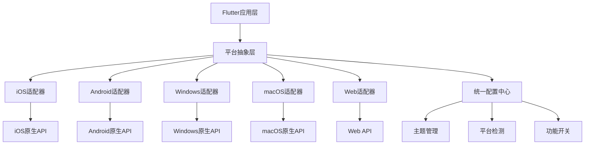
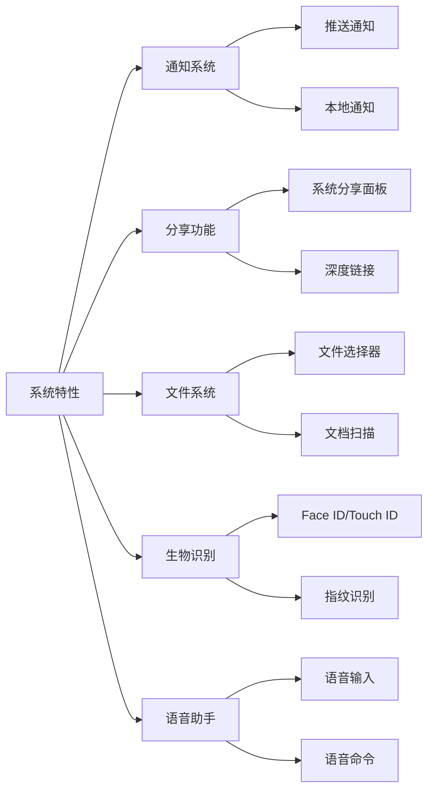
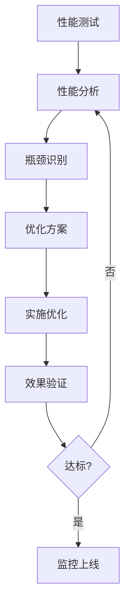

# Flutter平台适配设计文档

## 1. 多平台支持策略

### 1.1 支持平台概览

本系统基于Flutter框架实现真正的跨平台支持，覆盖主流操作系统和设备类型：

- **移动端**：iOS 12+、Android 6.0+
- **桌面端**：Windows 10+、macOS 10.14+
- **Web端**：现代浏览器（Chrome、Firefox、Safari、Edge）

### 1.2 分层适配架构

### 1.3 平台检测机制

系统采用多维度平台检测策略：

- **静态检测**：编译时确定平台特性
- **运行时检测**：动态识别操作系统版本
- **功能检测**：检查特定API和功能可用性
- **设备检测**：识别屏幕尺寸、分辨率等硬件特性

## 2. 平台特定优化

### 2.1 移动端优化策略

#### 触控操作优化

**手势识别体系**：
- 支持单指点击、双指缩放、三指导航
- 自定义手势识别器，提高响应精度
- 触控反馈机制，增强用户交互体验

**响应式布局**：
- 基于屏幕密度的自适应布局
- 支持横竖屏切换和平滑过渡
- 安全区域自动适配（刘海屏、打孔屏）

#### 性能优化

**内存管理**：
- 智能图片缓存策略，根据设备内存动态调整
- 分片加载机制，避免大图片一次性加载
- 内存泄漏监控和自动释放

**渲染优化**：
- GPU加速渲染，减少CPU负担
- 视图复用机制，提高滚动性能
- 预渲染策略，减少页面切换延迟

### 2.2 桌面端优化策略

#### 键盘导航优化

**快捷键系统**：
- 全局快捷键支持，符合各平台习惯
- 上下文相关快捷键，智能显示可用操作
- 自定义快捷键配置，满足个性化需求

**焦点管理**：
- 智能焦点跳转，符合用户预期
- 可见焦点指示器，提升可访问性
- Tab键导航支持，完整的键盘操作

#### 窗口管理

**多窗口支持**：
- 窗口状态持久化，记住用户偏好
- 多显示器适配，智能窗口定位
- 分屏模式支持，提升工作效率

### 2.3 Web端优化策略

#### 浏览器兼容性

**渐进式增强**：
- 核心功能在所有浏览器可用
- 高级功能在支持的浏览器中启用
- 优雅降级，确保基础体验

**性能优化**：
- 代码分割和懒加载
- 资源压缩和CDN加速
- 离线缓存支持（PWA特性）

## 3. 跨平台一致性保证

### 3.1 视觉统一策略

#### 设计系统统一

**组件库标准化**：
- 统一的组件规范和使用指南
- 响应式设计原则
- 无障碍设计标准

**主题系统**：
- 统一的色彩体系和视觉标识
- 平台适配的字体和图标
- 暗黑模式支持，自动跟随系统设置

### 3.2 交互一致保证

#### 行为模式统一

**交互模式定义**：
- 统一的反馈机制和过渡动画
- 一致的状态管理和错误处理
- 标准化的导航模式和信息架构

**用户体验基准**：
- 跨平台的用户流程一致性
- 统一的加载和进度指示
- 一致的成功和错误提示

### 3.3 数据一致性

#### 状态同步

**数据层统一**：
- 统一的数据模型和业务逻辑
- 跨平台的数据同步机制
- 离线数据缓存和同步策略

**配置管理**：
- 统一的用户设置和偏好存储
- 跨平台的配置同步
- 版本兼容性保证

## 4. 平台差异化设计

### 4.1 原生控件适配

#### 平台特征识别

**设计语言适配**：

| 平台 | 设计语言 | 主要特征 | 适配要点 |
|------|----------|----------|----------|
| iOS | Human Interface Guidelines | 扁平化、透明、模糊效果 | 支持毛玻璃效果、动态岛适配 |
| Android | Material Design 3 | 材质感、动态色彩、自适应布局 | 支持Material You主题、动态颜色 |
| Windows | Fluent Design | 光线、深度、材质、缩放 | 支持亚克力效果、窗口动画 |
| macOS | Human Interface Guidelines | 统一性、简洁性、直观性 | 支持侧边栏、触摸栏适配 |
| Web | Responsive Web Design | 响应式、渐进增强 | 支持各种屏幕尺寸和浏览器 |

#### 控件行为适配

**交互行为差异**：
- **滚动行为**：iOS的惯性滚动 vs Android的平滑滚动
- **选择行为**：桌面端的多选 vs 移动端的长按选择
- **导航行为**：Tab导航 vs 抽屉导航 vs 汉堡菜单

### 4.2 系统主题集成

#### 深色模式支持

**自动主题切换**：
- 跟随系统深色/浅色模式设置
- 提供手动切换选项
- 支持定时自动切换（日间/夜间）

**主题定制**：
- 品牌色彩保持一致性
- 适配系统色彩语义
- 支持高对比度和色彩滤镜

#### 系统特性集成

**现代系统集成**：

## 5. 平台测试策略

### 5.1 功能测试框架

#### 测试金字塔

**单元测试**：
- 业务逻辑单元测试覆盖率 > 80%
- 平台特定功能单独测试
- 模拟依赖和边界条件测试

**集成测试**：
- 跨模块交互测试
- API集成测试
- 数据持久化测试

**端到端测试**：
- 完整用户流程测试
- 跨平台一致性验证
- 回归测试自动化

### 5.2 性能测试策略

#### 性能指标定义

**关键性能指标**：

| 指标类型 | iOS目标 | Android目标 | Windows目标 | Web目标 |
|----------|---------|-------------|-------------|---------|
| 应用启动时间 | < 2秒 | < 3秒 | < 2秒 | < 3秒 |
| 页面切换时间 | < 300ms | < 400ms | < 200ms | < 500ms |
| 图片加载时间 | < 1秒 | < 1.5秒 | < 800ms | < 2秒 |
| 内存占用峰值 | < 200MB | < 300MB | < 400MB | < 100MB |
| 电池消耗 | 低功耗 | 中等功耗 | 低功耗 | 不适用 |

#### 性能监控

**实时性能监控**：
- CPU、内存、网络使用监控
- 帧率和渲染性能监控
- 用户操作响应时间监控
- 崩溃率和ANR监控

**性能优化流程**：

### 5.3 兼容性测试

#### 设备覆盖策略

**测试矩阵**：
- **iOS设备**：iPhone 8/SE/12/13/14/15，iPad Air/Pro
- **Android设备**：各品牌主流设备，不同Android版本
- **Windows设备**：不同版本Windows，不同硬件配置
- **macOS设备**：Intel和Apple Silicon芯片设备
- **Web浏览器**：Chrome、Firefox、Safari、Edge最新版本

#### 自动化测试

**持续集成测试**：
- 每次代码提交自动触发测试
- 多平台并行测试执行
- 测试结果自动报告和分析

**测试环境管理**：
- 虚拟机和真机结合测试
- 测试数据和环境隔离
- 测试设备池管理和调度

### 5.4 用户体验测试

#### 可用性测试

**用户场景测试**：
- 新用户首次使用体验
- 老用户日常使用场景
- 特殊用户群体无障碍测试
- 压力测试和边界条件测试

**A/B测试框架**：
- 不同设计方案对比测试
- 功能使用数据分析
- 用户行为路径优化

## 6. 实施路线图

### 6.1 第一阶段：基础适配（1-2个月）

- 完成平台检测机制
- 实现基础组件的跨平台适配
- 建立测试框架和CI/CD流程

### 6.2 第二阶段：深度优化（2-3个月）

- 实现平台特定优化
- 完善性能监控和分析
- 建立用户反馈收集机制

### 6.3 第三阶段：持续改进（长期）

- 基于用户反馈持续优化
- 跟进新平台版本适配
- 扩展支持平台和设备类型

## 7. 总结

Flutter平台适配设计遵循"统一设计、差异实现"的原则，通过分层架构设计、统一的测试策略和持续的性能优化，确保在不同平台上提供一致而优质的用户体验。通过完善的监控和反馈机制，能够及时发现和解决平台特定问题，不断提升应用的质量和用户满意度。