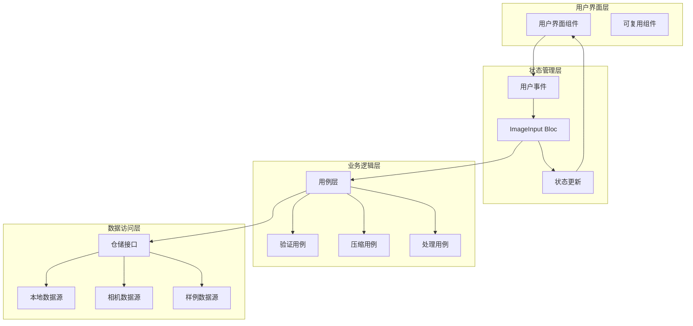

# 图像输入模块设计文档

**文档版本**: v1.0
**最后更新**: 2025-11-22
**关联文档**: [模块概览](./README.md) | [架构设计](../architecture/02-architecture.md) | [设计系统](../design/01-design-system.md)

---

## 📋 模块概述

### 功能定位

图像输入模块是Flutter图像去雾系统的核心入口模块，负责为用户提供多种图像获取方式，并为后续的算法选择和处理环节提供高质量的图像数据。该模块直接影响用户的第一体验，是整个系统用户体验的关键环节。

### 核心价值

- **便捷性**: 提供多种图像输入方式，满足不同用户的使用习惯
- **智能化**: 自动图像验证、格式转换、压缩优化
- **用户友好**: 直观的界面设计，清晰的操作引导
- **高性能**: 优化的图片处理，快速响应用户操作

### 模块边界

| 输入来源 | 处理内容 | 输出结果 | 依赖模块 |
|---------|---------|---------|---------|
| **用户上传** | 文件选择、格式验证、压缩处理 | 标准化图像对象 | 算法选择模块 |
| **相机拍摄** | 相机调用、实时预览、图片保存 | 标准化图像对象 | 算法选择模块 |
| **样例库** | 样例加载、分类浏览、快速选择 | 预处理图像对象 | 算法选择模块 |
| **历史记录** | 历史查询、记录选择、状态恢复 | 历史图像对象 | 算法选择模块 |

---

## 🏗️ 架构设计

### Clean Architecture分层

```
features/image_input/
├── data/                              # 数据层
│   ├── datasources/                   # 数据源
│   │   ├── local_image_datasource.dart    # 本地图片数据源
│   │   ├── camera_datasource.dart         # 相机数据源
│   │   ├── sample_image_datasource.dart   # 样例图片数据源
│   │   └── history_datasource.dart        # 历史记录数据源
│   ├── models/                         # 数据模型
│   │   ├── image_file_model.dart          # 图片文件模型
│   │   ├── upload_result_model.dart       # 上传结果模型
│   │   └── image_source_model.dart        # 图片来源模型
│   └── repositories/                   # 仓储实现
│       └── image_input_repository_impl.dart
├── domain/                            # 领域层
│   ├── entities/                      # 业务实体
│   │   ├── input_image.dart               # 输入图像实体
│   │   ├── image_source.dart              # 图片来源枚举
│   │   └── image_metadata.dart            # 图像元数据
│   ├── repositories/                  # 仓储接口
│   │   └── image_input_repository.dart
│   └── usecases/                       # 用例
│       ├── pick_image_usecase.dart          # 选择图片用例
│       ├── capture_image_usecase.dart       # 拍照用例
│       ├── load_sample_images_usecase.dart  # 加载样例用例
│       ├── load_history_usecase.dart        # 加载历史用例
│       ├── validate_image_usecase.dart      # 验证图片用例
│       └── compress_image_usecase.dart      # 压缩图片用例
└── presentation/                      # 表现层
    ├── pages/                         # 页面组件
    │   ├── image_input_page.dart           # 图像输入主页面
    │   ├── camera_preview_page.dart        # 相机预览页面
    │   ├── image_gallery_page.dart         # 图片库页面
    │   └── sample_library_page.dart        # 样例库页面
    ├── widgets/                       # 可复用组件
    │   ├── upload_card_widget.dart          # 上传卡片组件
    │   ├── camera_widget.dart               # 相机组件
    │   ├── image_preview_widget.dart       # 图片预览组件
    │   ├── source_selector_widget.dart     # 来源选择器
    │   └── recent_images_widget.dart       # 最近图片组件
    └── providers/                      # 状态管理
        ├── image_input_bloc.dart           # 图像输入状态管理
        ├── camera_bloc.dart                # 相机状态管理
        └── upload_progress_bloc.dart       # 上传进度管理
```

### 数据流架构



---

## 🎯 领域模型设计

### 核心实体定义

#### InputImage 输入图像实体

```dart
/// 输入图像实体
class InputImage {
  final String id;                    // 唯一标识
  final String path;                  // 文件路径
  final ImageSource source;           // 图片来源
  final DateTime timestamp;           // 创建时间
  final ImageMetadata metadata;       // 图像元数据
  final String? category;             // 图像分类
  final String? hazeLevel;            // 雾霾程度（AI分析）
  final bool isProcessed;             // 是否已处理
  final ProcessingStatus? status;     // 处理状态

  const InputImage({
    required this.id,
    required this.path,
    required this.source,
    required this.timestamp,
    required this.metadata,
    this.category,
    this.hazeLevel,
    this.isProcessed = false,
    this.status,
  });
}

/// 图片来源枚举
enum ImageSource {
  upload,    // 用户上传
  camera,    // 相机拍摄
  sample,    // 样例图片
  history,   // 历史记录
}

/// 图像元数据
class ImageMetadata {
  final int width;                   // 图像宽度
  final int height;                  // 图像高度
  final int fileSize;                // 文件大小
  final String format;               // 文件格式
  final Duration? duration;          // 拍摄时长（视频）
  final GeoLocation? location;       // 地理位置
  final String? device;              // 拍摄设备
  final Map<String, dynamic> exif;  // EXIF信息

  const ImageMetadata({
    required this.width,
    required this.height,
    required this.fileSize,
    required this.format,
    this.duration,
    this.location,
    this.device,
    this.exif = const {},
  });
}
```

#### ImageValidationResult 图像验证结果

```dart
/// 图像验证结果
class ImageValidationResult {
  final bool isValid;                // 是否有效
  final ValidationMessage? message;   // 验证消息
  final List<ValidationWarning> warnings; // 警告信息
  final Map<String, dynamic> suggestions; // 优化建议

  const ImageValidationResult({
    required this.isValid,
    this.message,
    this.warnings = const [],
    this.suggestions = const {},
  });

  /// 创建成功结果
  factory ImageValidationResult.success() {
    return const ImageValidationResult(isValid: true);
  }

  /// 创建失败结果
  factory ImageValidationResult.failure(ValidationMessage message) {
    return ImageValidationResult(
      isValid: false,
      message: message,
    );
  }
}

/// 验证消息
class ValidationMessage {
  final String code;                 // 错误代码
  final String message;              // 错误消息
  final ValidationLevel level;       // 验证级别
  final String? solution;            // 解决方案

  const ValidationMessage({
    required this.code,
    required this.message,
    required this.level,
    this.solution,
  });
}

enum ValidationLevel { error, warning, info }
```

### 用例设计

#### PickImageUseCase 选择图片用例

```dart
/// 选择图片用例
class PickImageUseCase implements UseCase<Result<InputImage>, PickImageParams> {
  final ImageInputRepository repository;
  final ImageValidator validator;
  final ImageCompressor compressor;
  final PermissionService permissionService;

  PickImageUseCase({
    required this.repository,
    required this.validator,
    required this.compressor,
    required this.permissionService,
  });

  @override
  Future<Result<InputImage>> call(PickImageParams params) async {
    try {
      // 1. 检查权限
      final permissionResult = await permissionService.checkStoragePermission();
      if (!permissionResult.isGranted) {
        return Result.failure(PermissionDeniedException());
      }

      // 2. 调用平台服务选择图片
      final selectedFile = await repository.pickImageFromGallery(
        maxFileSize: params.maxFileSize,
        allowedFormats: params.allowedFormats,
        allowMultiple: params.allowMultiple,
      );

      if (selectedFile == null) {
        return Result.failure(UserCancelledException());
      }

      // 3. 验证图片
      final validationResult = await validator.validateImage(selectedFile);
      if (!validationResult.isValid) {
        return Result.failure(
          ImageValidationException(validationResult.message!),
        );
      }

      // 4. 压缩图片（如果需要）
      File processedFile = selectedFile;
      if (validationResult.warnings.isNotEmpty) {
        processedFile = await compressor.compressImage(
          selectedFile,
          quality: params.compressionQuality,
          maxWidth: params.maxWidth,
          maxHeight: params.maxHeight,
        );
      }

      // 5. 提取图像信息
      final metadata = await repository.extractImageMetadata(processedFile);

      // 6. 保存到本地存储
      final savedPath = await repository.saveImageToCache(processedFile);

      // 7. 创建InputImage实体
      return Result.success(
        InputImage(
          id: const Uuid().v4(),
          path: savedPath,
          source: ImageSource.upload,
          timestamp: DateTime.now(),
          metadata: metadata,
          warnings: validationResult.warnings,
        ),
      );
    } catch (e) {
      return Result.failure(ImagePickException(e.toString()));
    }
  }
}

/// 选择图片参数
class PickImageParams {
  final int maxFileSize;              // 最大文件大小
  final List<String> allowedFormats;  // 允许的格式
  final bool allowMultiple;           // 是否允许多选
  final int compressionQuality;       // 压缩质量
  final int? maxWidth;                // 最大宽度
  final int? maxHeight;               // 最大高度

  const PickImageParams({
    this.maxFileSize = 20 * 1024 * 1024, // 20MB
    this.allowedFormats = const ['jpg', 'jpeg', 'png', 'webp'],
    this.allowMultiple = false,
    this.compressionQuality = 85,
    this.maxWidth,
    this.maxHeight,
  });
}
```

---

## 🎨 界面设计

### 页面布局结构

#### 主页面设计

基于[设计系统](../design/01-design-system.md)的响应式布局原则：

```
┌─────────────────────────────────────────────────────────────┐
│  图像输入                                    [设置] [帮助]    │
├─────────────────────────────────────────────────────────────┤
│                                                             │
│  🎯 选择图像获取方式                                          │
│                                                             │
│  ┌─────────────────────────────────────────────────────────┐ │
│  │  📱 上传图片      📷 拍照        🖼️ 样例库  📚 历史  │ │
│  │  从相册选择      打开相机      浏览样例    查看历史    │ │
│  │  支持多格式      实时预览      智能推荐    快速重试    │ │
│  └─────────────────────────────────────────────────────────┘ │
│                                                             │
│  📋 最近使用 (最多显示6个)                                    │
│                                                             │
│  ┌─────────────────────────────────────────────────────────┐ │
│  │  [图片1] [图片2] [图片3] [图片4] [图片5] [图片6]        │ │
│  │  2.1MB   1.8MB   3.2MB   2.5MB   1.9MB   2.7MB        │ │
│  │  JPG     PNG     JPG     WEBP    JPG     PNG           │ │
│  └─────────────────────────────────────────────────────────┘ │
│                                                             │
│  ⚡ 快速体验                                                  │
│                                                             │
│  ┌─────────────────────────────────────────────────────────┐ │
│  │  💡 使用样例图片快速体验去雾效果                           │ │
│  │  [轻度雾霾] [中度雾霾] [重度雾霾] [夜景去雾]              │ │
│  └─────────────────────────────────────────────────────────┘ │
│                                                             │
└─────────────────────────────────────────────────────────────┘
```

### 响应式适配

| 屏幕尺寸 | 布局特点 | 组件排列 | 交互优化 |
|---------|---------|---------|---------|
| **Mobile** < 768px | 单列垂直布局 | 4个输入方式垂直排列 | 大触摸区域，拇指友好 |
| **Tablet** 768-1024px | 双列网格布局 | 2x2网格排列 | 支持拖拽操作 |
| **Desktop** > 1024px | 多列布局 | 水平排列 + 侧边栏 | 键盘快捷键支持 |

### 组件设计规范

#### 上传卡片组件

```dart
/// 上传卡片组件
class UploadCardWidget extends StatelessWidget {
  final IconData icon;
  final String title;
  final String description;
  final VoidCallback onTap;
  final bool isEnabled;
  final String? badge;

  const UploadCardWidget({
    required this.icon,
    required this.title,
    required this.description,
    required this.onTap,
    this.isEnabled = true,
    this.badge,
  });

  @override
  Widget build(BuildContext context) {
    return GestureDetector(
      onTap: isEnabled ? onTap : null,
      child: Container(
        padding: EdgeInsets.all(24),
        decoration: BoxDecoration(
          color: Theme.of(context).cardColor,
          borderRadius: BorderRadius.circular(16),
          boxShadow: [
            BoxShadow(
              color: Colors.black.withOpacity(0.05),
              blurRadius: 8,
              offset: Offset(0, 4),
            ),
          ],
        ),
        child: Column(
          mainAxisAlignment: MainAxisAlignment.center,
          children: [
            Stack(
              children: [
                Container(
                  width: 64,
                  height: 64,
                  decoration: BoxDecoration(
                    color: isEnabled
                        ? Theme.of(context).primaryColor.withOpacity(0.1)
                        : Colors.grey.withOpacity(0.1),
                    borderRadius: BorderRadius.circular(16),
                  ),
                  child: Icon(
                    icon,
                    size: 32,
                    color: isEnabled
                        ? Theme.of(context).primaryColor
                        : Colors.grey,
                  ),
                ),
                if (badge != null)
                  Positioned(
                    right: -4,
                    top: -4,
                    child: Container(
                      padding: EdgeInsets.symmetric(horizontal: 6, vertical: 2),
                      decoration: BoxDecoration(
                        color: Colors.red,
                        borderRadius: BorderRadius.circular(10),
                      ),
                      child: Text(
                        badge!,
                        style: TextStyle(
                          color: Colors.white,
                          fontSize: 10,
                          fontWeight: FontWeight.bold,
                        ),
                      ),
                    ),
                  ),
            ),
            SizedBox(height: 16),
            Text(
              title,
              style: Theme.of(context).textTheme.titleMedium?.copyWith(
                fontWeight: FontWeight.bold,
                color: isEnabled ? null : Colors.grey,
              ),
              textAlign: TextAlign.center,
            ),
            SizedBox(height: 8),
            Text(
              description,
              style: Theme.of(context).textTheme.bodySmall?.copyWith(
                color: isEnabled ? Colors.grey[600] : Colors.grey,
              ),
              textAlign: TextAlign.center,
              maxLines: 2,
              overflow: TextOverflow.ellipsis,
            ),
          ],
        ),
      ),
    );
  }
}
```

---

## 🔄 状态管理

### Bloc状态设计

```dart
/// 图像输入状态
abstract class ImageInputState extends Equatable {
  const ImageInputState();

  @override
  List<Object?> get props => [];
}

/// 初始状态
class ImageInputInitial extends ImageInputState {}

/// 加载中状态
class ImageInputLoading extends ImageInputState {
  final String message;
  final double progress;

  const ImageInputLoading({
    required this.message,
    this.progress = 0.0,
  });

  @override
  List<Object?> get props => [message, progress];
}

/// 图片选择成功状态
class ImageInputSelected extends ImageInputState {
  final List<InputImage> selectedImages;
  final ImageValidationResult? validationResult;

  const ImageInputSelected({
    required this.selectedImages,
    this.validationResult,
  });

  @override
  List<Object?> get props => [selectedImages, validationResult];
}

/// 样例图片加载状态
class SampleImagesLoaded extends ImageInputState {
  final List<SampleImage> sampleImages;
  final List<String> categories;

  const SampleImagesLoaded({
    required this.sampleImages,
    required this.categories,
  });

  @override
  List<Object?> get props => [sampleImages, categories];
}

/// 历史记录加载状态
class HistoryLoaded extends ImageInputState {
  final List<HistoryRecord> historyRecords;
  final DateTime? lastUpdated;

  const HistoryLoaded({
    required this.historyRecords,
    this.lastUpdated,
  });

  @override
  List<Object?> get props => [historyRecords, lastUpdated];
}

/// 错误状态
class ImageInputError extends ImageInputState {
  final String message;
  final ErrorType errorType;
  final VoidCallback? onRetry;

  const ImageInputError({
    required this.message,
    required this.errorType,
    this.onRetry,
  });

  @override
  List<Object?> get props => [message, errorType, onRetry];
}

/// 错误类型枚举
enum ErrorType {
  permissionDenied,    // 权限被拒绝
  fileSizeExceeded,    // 文件过大
  unsupportedFormat,   // 不支持的格式
  networkError,        // 网络错误
  storageError,        // 存储错误
  unknownError,        // 未知错误
}
```

### 事件设计

```dart
/// 图像输入事件
abstract class ImageInputEvent extends Equatable {
  const ImageInputEvent();

  @override
  List<Object?> get props => [];
}

/// 选择图片事件
class PickImageEvent extends ImageInputEvent {
  final PickImageParams params;

  const PickImageEvent({this.params = const PickImageParams()});

  @override
  List<Object?> get props => [params];
}

/// 拍照事件
class CaptureImageEvent extends ImageInputEvent {}

/// 加载样例图片事件
class LoadSampleImagesEvent extends ImageInputEvent {
  final String? category;

  const LoadSampleImagesEvent({this.category});

  @override
  List<Object?> get props => [category];
}

/// 加载历史记录事件
class LoadHistoryEvent extends ImageInputEvent {
  final int? limit;
  final String? category;

  const LoadHistoryEvent({this.limit, this.category});

  @override
  List<Object?> get props => [limit, category];
}

/// 删除选中图片事件
class RemoveSelectedImageEvent extends ImageInputEvent {
  final String imageId;

  const RemoveSelectedImageEvent({required this.imageId});

  @override
  List<Object?> get props => [imageId];
}

/// 清空选中图片事件
class ClearSelectedImagesEvent extends ImageInputEvent {}
```

---

## 🔧 技术实现

### 核心服务接口

#### ImageInputRepository 仓储接口

```dart
/// 图像输入仓储接口
abstract class ImageInputRepository {
  /// 从相册选择图片
  Future<File?> pickImageFromGallery({
    int maxFileSize = 20 * 1024 * 1024,
    List<String> allowedFormats = const ['jpg', 'jpeg', 'png', 'webp'],
    bool allowMultiple = false,
  });

  /// 从相机拍摄图片
  Future<File?> captureImageFromCamera({
    bool enableFlash = false,
    bool enableGrid = false,
    CameraPosition cameraPosition = CameraPosition.back,
  });

  /// 加载样例图片列表
  Future<List<SampleImage>> loadSampleImages({
    String? category,
    int limit = 20,
    int offset = 0,
  });

  /// 加载历史记录
  Future<List<HistoryRecord>> loadHistory({
    int limit = 20,
    int offset = 0,
    String? category,
  });

  /// 保存图片到缓存
  Future<String> saveImageToCache(File imageFile);

  /// 提取图片元数据
  Future<ImageMetadata> extractImageMetadata(File imageFile);

  /// 验证图片格式和大小
  Future<ImageValidationResult> validateImage(File imageFile);

  /// 压缩图片
  Future<File> compressImage(
    File imageFile, {
    int quality = 85,
    int? maxWidth,
    int? maxHeight,
    bool maintainAspectRatio = true,
  });

  /// 删除缓存图片
  Future<void> deleteCachedImage(String imagePath);

  /// 清理过期缓存
  Future<void> cleanExpiredCache({Duration maxAge = const Duration(days: 7)});
}
```

#### 权限管理服务

```dart
/// 权限管理服务
abstract class PermissionService {
  /// 检查存储权限
  Future<PermissionStatus> checkStoragePermission();

  /// 请求存储权限
  Future<PermissionStatus> requestStoragePermission();

  /// 检查相机权限
  Future<PermissionStatus> checkCameraPermission();

  /// 请求相机权限
  Future<PermissionStatus> requestCameraPermission();

  /// 检查位置权限（可选）
  Future<PermissionStatus> checkLocationPermission();

  /// 请求位置权限（可选）
  Future<PermissionStatus> requestLocationPermission();
}

/// 权限状态枚举
enum PermissionStatus {
  granted,        // 已授权
  denied,         // 被拒绝
  permanentlyDenied, // 永久拒绝
  restricted,     // 受限制
  unknown,        // 未知状态
}
```

### 性能优化策略

#### 图片缓存管理

```dart
/// 图片缓存管理器
class ImageCacheManager {
  static const String _cacheKey = 'image_input_cache';
  static const int _maxCacheSize = 100 * 1024 * 1024; // 100MB
  static const int _maxCacheItems = 1000;

  final LRUCache<String, CachedImage> _cache;
  final DatabaseHelper _databaseHelper;

  ImageCacheManager(this._databaseHelper)
      : _cache = LRUCache(_maxCacheItems);

  /// 获取缓存图片
  Future<File?> getCachedImage(String key) async {
    final cachedImage = _cache.get(key);
    if (cachedImage != null && !cachedImage.isExpired) {
      return cachedImage.file;
    }

    // 从数据库查找
    final dbRecord = await _databaseHelper.getCachedImage(key);
    if (dbRecord != null && !dbRecord.isExpired) {
      final file = File(dbRecord.path);
      if (await file.exists()) {
        _cache.put(key, dbRecord);
        return file;
      }
    }

    return null;
  }

  /// 缓存图片
  Future<void> cacheImage(String key, File imageFile) async {
    // 检查缓存大小限制
    await _ensureCacheSizeLimit();

    final cachedImage = CachedImage(
      key: key,
      file: imageFile,
      createdAt: DateTime.now(),
      expiresAt: DateTime.now().add(Duration(days: 7)),
    );

    // 添加到内存缓存
    _cache.put(key, cachedImage);

    // 保存到数据库
    await _databaseHelper.saveCachedImage(cachedImage);
  }

  /// 确保缓存大小限制
  Future<void> _ensureCacheSizeLimit() async {
    final totalSize = await _getTotalCacheSize();
    if (totalSize > _maxCacheSize) {
      await _cleanOldestCache(totalSize - _maxCacheSize);
    }
  }
}
```

#### 图片压缩优化

```dart
/// 图片压缩器
class ImageCompressor {
  final ImageCompressorConfig config;

  ImageCompressor({required this.config});

  /// 智能压缩图片
  Future<File> compressImage(
    File sourceFile, {
    int? quality,
    int? maxWidth,
    int? maxHeight,
    bool maintainAspectRatio = true,
  }) async {
    final originalBytes = await sourceFile.readAsBytes();
    final originalSize = originalBytes.length;

    // 如果图片已经很小，直接返回
    if (originalSize < config.maxSmallFileSize) {
      return sourceFile;
    }

    // 解码图片
    final codec = await ui.instantiateImageCodec(originalBytes);
    final frame = await codec.getNextFrame();
    final image = frame.image;

    // 计算目标尺寸
    final targetSize = _calculateTargetSize(
      image.width,
      image.height,
      maxWidth,
      maxHeight,
      maintainAspectRatio,
    );

    // 调整图片尺寸
    final resizedImage = await _resizeImage(image, targetSize);

    // 编码为JPEG
    final compressedBytes = await _encodeImageToJpeg(
      resizedImage,
      quality ?? _calculateOptimalQuality(originalSize),
    );

    // 保存压缩后的文件
    final compressedFile = await _saveCompressedFile(
      sourceFile,
      compressedBytes,
    );

    // 清理资源
    image.dispose();
    resizedImage.dispose();

    return compressedFile;
  }

  /// 计算最优压缩质量
  int _calculateOptimalQuality(int originalSize) {
    if (originalSize < 1024 * 1024) {
      return 95; // 小文件保持高质量
    } else if (originalSize < 5 * 1024 * 1024) {
      return 85; // 中等文件使用标准质量
    } else {
      return 75; // 大文件使用较低质量
    }
  }
}
```

---

## 📱 用户体验优化

### 交互反馈设计

#### 加载状态反馈

```dart
/// 自定义加载指示器
class ImageUploadLoadingWidget extends StatelessWidget {
  final String message;
  final double progress;
  final VoidCallback? onCancel;

  const ImageUploadLoadingWidget({
    required this.message,
    required this.progress,
    this.onCancel,
  });

  @override
  Widget build(BuildContext context) {
    return Container(
      padding: EdgeInsets.all(24),
      decoration: BoxDecoration(
        color: Colors.white,
        borderRadius: BorderRadius.circular(16),
        boxShadow: [
          BoxShadow(
            color: Colors.black.withOpacity(0.1),
            blurRadius: 20,
            offset: Offset(0, 10),
          ),
        ],
      ),
      child: Column(
        mainAxisSize: MainAxisSize.min,
        children: [
          // 自定义动画图标
          TweenAnimationBuilder<double>(
            duration: Duration(seconds: 1),
            tween: Tween(begin: 0, end: 1),
            builder: (context, value, child) {
              return Transform.rotate(
                angle: value * 2 * pi,
                child: Icon(
                  Icons.cloud_upload,
                  size: 48,
                  color: Theme.of(context).primaryColor,
                ),
              );
            },
          ),
          SizedBox(height: 16),
          Text(
            message,
            style: Theme.of(context).textTheme.titleMedium,
            textAlign: TextAlign.center,
          ),
          SizedBox(height: 16),
          // 进度条
          LinearProgressIndicator(
            value: progress,
            backgroundColor: Colors.grey[300],
            valueColor: AlwaysStoppedAnimation<Color>(
              Theme.of(context).primaryColor,
            ),
          ),
          SizedBox(height: 8),
          Text(
            '${(progress * 100).toInt()}%',
            style: Theme.of(context).textTheme.bodySmall,
          ),
          if (onCancel != null) ...[
            SizedBox(height: 16),
            TextButton(
              onPressed: onCancel,
              child: Text('取消'),
            ),
          ],
        ],
      ),
    );
  }
}
```

#### 错误处理和重试机制

```dart
/// 错误处理组件
class ImageInputErrorWidget extends StatelessWidget {
  final String message;
  final ErrorType errorType;
  final VoidCallback? onRetry;
  final VoidCallback? onContactSupport;

  const ImageInputErrorWidget({
    required this.message,
    required this.errorType,
    this.onRetry,
    this.onContactSupport,
  });

  @override
  Widget build(BuildContext context) {
    return Container(
      padding: EdgeInsets.all(24),
      decoration: BoxDecoration(
        color: Colors.red[50],
        borderRadius: BorderRadius.circular(16),
        border: Border.all(color: Colors.red[200]!),
      ),
      child: Column(
        mainAxisSize: MainAxisSize.min,
        children: [
          Icon(
            _getErrorIcon(errorType),
            size: 48,
            color: Colors.red[400],
          ),
          SizedBox(height: 16),
          Text(
            '操作失败',
            style: Theme.of(context).textTheme.titleMedium?.copyWith(
              color: Colors.red[700],
              fontWeight: FontWeight.bold,
            ),
          ),
          SizedBox(height: 8),
          Text(
            message,
            style: Theme.of(context).textTheme.bodyMedium?.copyWith(
              color: Colors.red[600],
            ),
            textAlign: TextAlign.center,
          ),
          SizedBox(height: 16),
          if (onRetry != null)
            ElevatedButton.icon(
              onPressed: onRetry,
              icon: Icon(Icons.refresh),
              label: Text('重试'),
              style: ElevatedButton.styleFrom(
                backgroundColor: Colors.red[400],
                foregroundColor: Colors.white,
              ),
            ),
          if (onContactSupport != null) ...[
            SizedBox(height: 8),
            TextButton(
              onPressed: onContactSupport,
              child: Text('联系技术支持'),
            ),
          ],
        ],
      ),
    );
  }

  IconData _getErrorIcon(ErrorType type) {
    switch (type) {
      case ErrorType.permissionDenied:
        return Icons.lock;
      case ErrorType.fileSizeExceeded:
        return Icons.file_upload_off;
      case ErrorType.unsupportedFormat:
        return Icons.image_not_supported;
      case ErrorType.networkError:
        return Icons.wifi_off;
      case ErrorType.storageError:
        return Icons.storage;
      default:
        return Icons.error_outline;
    }
  }
}
```

### 可访问性支持

#### 语义化标签和无障碍功能

```dart
/// 无障碍支持的图片选择器
class AccessibleImagePicker extends StatelessWidget {
  final String label;
  final String hint;
  final VoidCallback onTap;
  final bool isEnabled;

  const AccessibleImagePicker({
    required this.label,
    required this.hint,
    required this.onTap,
    this.isEnabled = true,
  });

  @override
  Widget build(BuildContext context) {
    return Semantics(
      label: label,
      hint: hint,
      button: true,
      enabled: isEnabled,
      child: GestureDetector(
        onTap: isEnabled ? onTap : null,
        child: Container(
          padding: EdgeInsets.all(16),
          decoration: BoxDecoration(
            color: isEnabled
                ? Theme.of(context).primaryColor.withOpacity(0.1)
                : Colors.grey.withOpacity(0.1),
            borderRadius: BorderRadius.circular(12),
            border: Border.all(
              color: isEnabled
                  ? Theme.of(context).primaryColor.withOpacity(0.3)
                  : Colors.grey.withOpacity(0.3),
            ),
          ),
          child: Column(
            mainAxisSize: MainAxisSize.min,
            children: [
              Icon(
                Icons.add_photo_alternate,
                size: 32,
                color: isEnabled
                    ? Theme.of(context).primaryColor
                    : Colors.grey,
              ),
              SizedBox(height: 8),
              Text(
                label,
                style: Theme.of(context).textTheme.bodyMedium?.copyWith(
                  color: isEnabled ? null : Colors.grey,
                  fontWeight: FontWeight.bold,
                ),
              ),
            ],
          ),
        ),
      ),
    );
  }
}
```

---

## 📊 性能监控

### 关键性能指标

| 指标名称 | 目标值 | 监控方法 | 优化策略 |
|---------|--------|---------|---------|
| **图片选择响应时间** | < 500ms | 性能监控埋点 | 优化图片解码算法 |
| **图片压缩处理时间** | < 2s | 计时器监控 | 并行处理、渐进式压缩 |
| **内存占用峰值** | < 100MB | 内存监控工具 | 及时释放大图片对象 |
| **缓存命中率** | > 80% | 统计分析 | 智能预加载、LRU策略 |
| **用户操作成功率** | > 95% | 事件统计 | 错误重试、降级策略 |

### 监控实现

```dart
/// 性能监控服务
class PerformanceMonitor {
  static const String _tag = 'ImageInput';
  final AnalyticsService _analytics;

  PerformanceMonitor(this._analytics);

  /// 监控图片选择性能
  Future<T> monitorImageSelection<T>(
    String operation,
    Future<T> Function() operationFunc,
  ) async {
    final stopwatch = Stopwatch()..start();

    try {
      final result = await operationFunc();

      _analytics.logEvent(
        name: 'image_selection_success',
        parameters: {
          'operation': operation,
          'duration_ms': stopwatch.elapsedMilliseconds,
          'success': true,
        },
      );

      return result;
    } catch (e) {
      _analytics.logEvent(
        name: 'image_selection_error',
        parameters: {
          'operation': operation,
          'duration_ms': stopwatch.elapsedMilliseconds,
          'success': false,
          'error_type': e.runtimeType.toString(),
        },
      );

      rethrow;
    } finally {
      stopwatch.stop();
    }
  }

  /// 监控内存使用
  void monitorMemoryUsage() {
    final info = ProcessInfo.currentRss;

    _analytics.logEvent(
      name: 'memory_usage',
      parameters: {
        'module': _tag,
        'memory_mb': info / (1024 * 1024),
        'timestamp': DateTime.now().millisecondsSinceEpoch,
      },
    );
  }
}
```

---

## 🧪 测试策略

### 单元测试

```dart
/// 图片验证器测试
void main() {
  group('ImageValidator Tests', () {
    late ImageValidator validator;
    late MockFileService mockFileService;

    setUp(() {
      mockFileService = MockFileService();
      validator = ImageValidator(mockFileService);
    });

    test('should validate JPEG file within size limit', () async {
      // Arrange
      final testFile = File('test.jpg');
      when(mockFileService.getSize(testFile))
          .thenAnswer((_) async => 1024 * 1024); // 1MB
      when(mockFileService.getExtension(testFile))
          .thenReturn('jpg');

      // Act
      final result = await validator.validateImage(testFile);

      // Assert
      expect(result.isValid, true);
      expect(result.message, null);
    });

    test('should reject file exceeding size limit', () async {
      // Arrange
      final testFile = File('large.jpg');
      when(mockFileService.getSize(testFile))
          .thenAnswer((_) async => 25 * 1024 * 1024); // 25MB
      when(mockFileService.getExtension(testFile))
          .thenReturn('jpg');

      // Act
      final result = await validator.validateImage(testFile);

      // Assert
      expect(result.isValid, false);
      expect(result.message?.code, 'FILE_SIZE_EXCEEDED');
    });

    test('should reject unsupported file format', () async {
      // Arrange
      final testFile = File('test.bmp');
      when(mockFileService.getSize(testFile))
          .thenAnswer((_) async => 1024 * 1024); // 1MB
      when(mockFileService.getExtension(testFile))
          .thenReturn('bmp');

      // Act
      final result = await validator.validateImage(testFile);

      // Assert
      expect(result.isValid, false);
      expect(result.message?.code, 'UNSUPPORTED_FORMAT');
    });
  });
}
```

### 集成测试

```dart
/// 图像输入模块集成测试
void main() {
  group('ImageInput Integration Tests', () {
    late App app;
    late WidgetTester tester;

    setUp(() async {
      app = App();
      await tester.pumpWidget(app);
    });

    testWidgets('should complete image selection flow', (tester) async {
      // 1. 导航到图像输入页面
      await tester.tap(find.text('图像输入'));
      await tester.pumpAndSettle();

      // 2. 点击上传按钮
      await tester.tap(find.byIcon(Icons.cloud_upload));
      await tester.pumpAndSettle();

      // 3. 验证相册选择器是否打开
      expect(find.text('选择图片'), findsOneWidget);

      // 4. 模拟选择图片
      // 这里需要使用mock数据或测试图片

      // 5. 验证图片是否显示在页面上
      expect(find.byType(Image), findsOneWidget);

      // 6. 验证继续按钮是否可用
      expect(find.text('继续'), findsOneWidget);
    });
  });
}
```

---

## 📈 未来扩展

### 功能扩展计划

#### AI智能分析
- **场景识别**: 自动识别图像场景类型（风景、人像、建筑等）
- **雾霾检测**: 智能评估雾霾程度和分布
- **质量评估**: 分析图像质量并提供优化建议
- **智能推荐**: 基于图像特征推荐最适合的处理算法

#### 多媒体支持
- **视频处理**: 支持视频去雾处理
- **Live Photo**: 支持动态照片处理
- **RAW格式**: 支持专业相机RAW格式
- **全景图**: 支持全景图像处理

#### 云端集成
- **云存储**: 集成主流云存储服务
- **云端处理**: 大文件云端处理
- **同步功能**: 多设备间数据同步
- **协作分享**: 团队协作和分享功能

### 技术升级路线

1. **性能优化** (Q1 2025)
   - 实现WebAssembly图片处理
   - 优化内存管理算法
   - 支持并发处理

2. **AI能力增强** (Q2 2025)
   - 集成端侧AI模型
   - 实现实时图像分析
   - 支持智能参数调节

3. **平台扩展** (Q3 2025)
   - 支持Web平台优化
   - 增强桌面端体验
   - 适配折叠屏设备

---

**文档版本**: v1.0
**最后更新**: 2025-11-22
**下次更新**: 根据开发进度和用户反馈持续更新
**维护团队**: Flutter开发团队