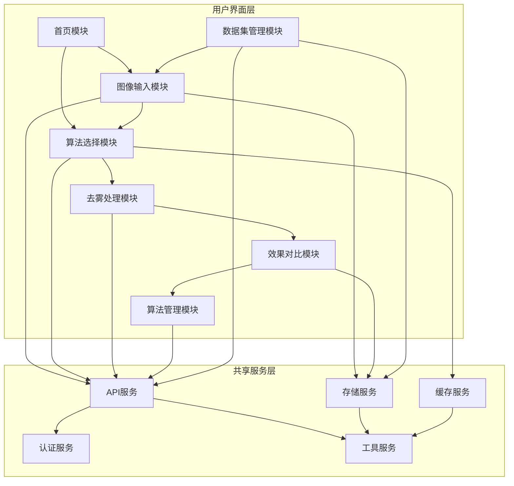
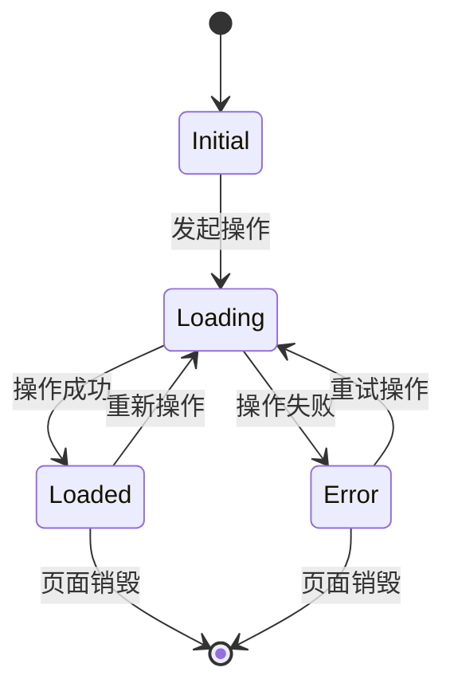
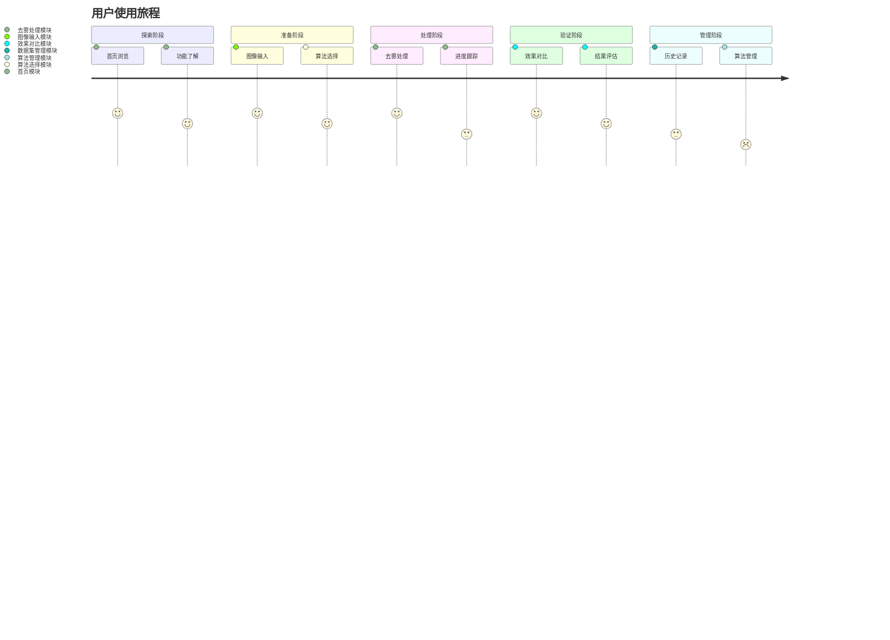

# Flutter图像去雾系统 - 模块设计概览

**文档版本**: v1.0
**最后更新**: 2025-11-22
**关联文档**: [架构概览](../architecture/00-overview.md) | [设计系统](../design/01-design-system.md)

---

## 📋 文档结构

本模块设计文档基于Clean Architecture原则，将Flutter图像去雾系统按功能模块进行详细设计：

```
dehaze_flutter/docs/module/
├── README.md                          # 模块概览（本文档）
├── 01-home-module.md                  # 首页模块设计
├── 02-image-input-module.md           # 图像输入模块设计
├── 03-algorithm-select-module.md      # 算法选择模块设计
├── 04-dehaze-processing-module.md     # 去雾处理模块设计
├── 05-effect-comparison-module.md     # 效果对比模块设计
├── 06-algorithm-management-module.md  # 算法管理模块设计
└── 07-dataset-management-module.md    # 数据集管理模块设计
```

---

## 🎯 模块化设计原则

### 核心设计理念

基于[架构设计文档](../architecture/02-architecture.md)中的分层架构原则，采用以下模块化设计理念：

#### 1. 单一职责原则
- 每个模块只负责一个特定的业务领域
- 模块内部组件职责明确，边界清晰
- 避免跨模块的直接依赖

#### 2. 高内聚低耦合
- 模块内部组件紧密协作，功能完整
- 模块之间通过接口进行松耦合通信
- 依赖倒置，高层模块不依赖低层模块

#### 3. 可测试性
- 每个模块都可以独立进行单元测试
- 通过依赖注入支持模块的模拟测试
- 集成测试验证模块间的协作

#### 4. 可维护性
- 模块结构清晰，易于理解和修改
- 新功能可以通过添加新模块或扩展现有模块实现
- 模块的重构不影响其他模块

### 模块分层结构

```
┌─────────────────────────────────────────────────────────────┐
│                   表现层 (Presentation)                      │
│  ┌─────────────┐ ┌─────────────┐ ┌─────────────┐ ┌─────────┐ │
│  │   首页模块   │ │ 图像输入模块 │ │ 算法选择模块 │ │ ...    │ │
│  │    Home     │ │Image Input  │ │Algorithm    │ │         │ │
│  │   Module    │ │   Module    │ │  Select     │ │         │ │
│  └─────────────┘ └─────────────┘ └─────────────┘ └─────────┘ │
└─────────────────────────────────────────────────────────────┘
                                ↓
┌─────────────────────────────────────────────────────────────┐
│                   业务逻辑层 (Business)                       │
│  ┌─────────────┐ ┌─────────────┐ ┌─────────────┐ ┌─────────┐ │
│  │   用例层     │ │   用例层     │ │   用例层     │ │  ...    │ │
│  │  Use Cases  │ │  Use Cases  │ │  Use Cases  │ │         │ │
│  └─────────────┘ └─────────────┘ └─────────────┘ └─────────┘ │
└─────────────────────────────────────────────────────────────┘
                                ↓
┌─────────────────────────────────────────────────────────────┐
│                   数据访问层 (Data)                           │
│  ┌─────────────┐ ┌─────────────┐ ┌─────────────┐ ┌─────────┐ │
│  │  仓储层      │ │  仓储层      │ │  仓储层      │ │  ...    │ │
│  │Repository   │ │Repository   │ │Repository   │ │         │ │
│  └─────────────┘ └─────────────┘ └─────────────┘ └─────────┘ │
└─────────────────────────────────────────────────────────────┘
                                ↓
┌─────────────────────────────────────────────────────────────┐
│                   基础设施层 (Infrastructure)                  │
│              ┌─────────────┐ ┌─────────────┐ ┌─────────┐      │
│              │  网络服务     │ │  本地存储     │ │ 核心工具  │      │
│              │ Network     │ │   Storage    │ │  Core    │      │
│              └─────────────┘ └─────────────┘ └─────────┘      │
└─────────────────────────────────────────────────────────────┘
```

---

## 📊 模块功能矩阵

### 核心业务模块

| 模块名称 | 功能描述 | 优先级 | 复杂度 | 用户价值 |
|---------|---------|--------|--------|----------|
| **首页模块** | 产品介绍、功能引导、快速入口 | P0 | 低 | 新用户引导 |
| **图像输入模块** | 多种图像输入方式、预处理 | P0 | 中 | 核心入口 |
| **算法选择模块** | 智能推荐、算法浏览、参数配置 | P0 | 高 | 智能化体验 |
| **去雾处理模块** | 图像处理、进度跟踪、结果管理 | P0 | 高 | 核心功能 |
| **效果对比模块** | 多种对比模式、指标评估 | P0 | 中 | 效果验证 |

### 扩展功能模块

| 模块名称 | 功能描述 | 优先级 | 复杂度 | 用户价值 |
|---------|---------|--------|--------|----------|
| **算法管理模块** | 算法CRUD、参数管理、版本控制 | P1 | 中 | 管理功能 |
| **数据集管理模块** | 数据浏览、分类、批量处理 | P1 | 中 | 专业需求 |
| **用户中心模块** | 个人信息、历史记录、偏好设置 | P2 | 低 | 个性化 |
| **系统设置模块** | 应用配置、主题切换、语言设置 | P2 | 低 | 用户体验 |

### 模块依赖关系图



---

## 🏗️ 模块架构模式

### Clean Architecture实现

每个模块都遵循Clean Architecture的分层结构：

```
features/[module_name]/
├── data/                            # 数据层
│   ├── datasources/                 # 数据源实现
│   │   ├── remote_datasource.dart
│   │   └── local_datasource.dart
│   ├── models/                      # 数据模型
│   │   ├── [entity]_model.dart
│   │   └── response_model.dart
│   └── repositories/                # 仓储实现
│       └── [module]_repository_impl.dart
├── domain/                          # 领域层
│   ├── entities/                    # 业务实体
│   │   └── [entity].dart
│   ├── repositories/                # 仓储接口
│   │   └── [module]_repository.dart
│   └── usecases/                    # 用例实现
│       ├── get_[entity]_usecase.dart
│       ├── create_[entity]_usecase.dart
│       └── delete_[entity]_usecase.dart
└── presentation/                    # 表现层
    ├── pages/                       # 页面组件
    │   └── [module]_page.dart
    ├── widgets/                     # 可复用组件
    │   ├── [module]_card.dart
    │   └── [module]_list.dart
    └── providers/                   # 状态管理
        └── [module]_provider.dart
```

### 状态管理模式

每个模块使用Riverpod进行状态管理：



---

## 📱 用户体验设计

### 用户旅程与模块对应

基于[demo产品需求](../../../demo/index.html)和[用户旅程设计](../architecture/01-user-journey.md)：



### 响应式适配策略

根据[设计系统](../design/01-design-system.md)的响应式规范：

| 设备类型 | 屏幕宽度 | 模块适配策略 | 导航方式 |
|---------|----------|-------------|----------|
| **Mobile** | < 768px | 单列布局，功能分页 | 底部标签栏 |
| **Tablet** | 768-1024px | 双列布局，侧边导航 | 侧边栏 + 底部栏 |
| **Desktop** | > 1024px | 多列布局，完整功能 | 侧边栏导航 |

---

## 🔧 技术实现标准

### 统一开发规范

#### 代码组织规范
- **命名约定**: 遵循Dart官方命名规范
- **文件结构**: 按功能模块组织，保持一致性
- **注释标准**: 使用dartdoc格式编写文档注释
- **导入顺序**: dart库、flutter库、第三方库、本地库

#### 状态管理规范
- **Riverpod模式**: 统一使用Riverpod进行状态管理
- **Provider命名**: 使用具体功能+Provider格式（如imagesProvider）
- **状态命名**: 使用具体状态描述格式（如ImagesLoadedState）
- **错误处理**: 统一的错误状态和错误信息处理

#### API集成规范
- **仓储模式**: 使用Repository模式抽象数据访问
- **网络请求**: 使用Dio + Retrofit进行HTTP调用
- **错误处理**: 统一的异常处理和用户友好的错误提示
- **缓存策略**: 实现多级缓存机制

### 性能优化标准

#### 内存管理
- 图片懒加载和缓存控制
- 组件生命周期管理
- 及时释放不用的资源
- 内存泄漏检测和预防

#### 渲染性能
- 避免不必要的widget重建
- 使用const构造函数
- 合理使用ListView和GridView
- 图片压缩和尺寸优化

---

## 📚 开发指导

### 模块开发流程

1. **需求分析**
   - 明确模块功能边界
   - 定义用户故事和验收标准
   - 设计用户界面和交互流程

2. **架构设计**
   - 定义领域实体和业务规则
   - 设计数据模型和API接口
   - 规划状态管理和数据流

3. **编码实现**
   - 按照Clean Architecture分层实现
   - 编写单元测试和集成测试
   - 遵循代码规范和最佳实践

4. **测试验证**
   - 功能测试和UI测试
   - 性能测试和压力测试
   - 用户体验测试和反馈收集

### 模块间通信

#### 事件总线机制
```dart
// 全局事件总线
class AppEventBus {
  static final _instance = AppEventBus._internal();
  factory AppEventBus() => _instance;
  AppEventBus._internal();

  final _controller = StreamController<AppEvent>.broadcast();

  Stream<AppEvent> get eventStream => _controller.stream;
  void emit(AppEvent event) => _controller.add(event);
}
```

#### 路由导航规范
```dart
// 路由名称常量
class AppRoutes {
  static const String home = '/';
  static const String imageInput = '/image-input';
  static const String algorithmSelect = '/algorithm-select';
  static const String processing = '/processing';
  static const String comparison = '/comparison';
}

// 路由导航方法
class NavigationService {
  static void navigateToImageInput() {
    Get.toNamed(AppRoutes.imageInput);
  }
}
```

---

## 📖 相关文档

### 架构文档系列
- [总体架构概览](../architecture/00-overview.md): 系统整体架构设计
- [用户旅程设计](../architecture/01-user-journey.md): 详细的用户交互流程
- [UI组件设计](../architecture/02-ui-components.md): 组件设计和交互规范
- [状态管理架构](../architecture/03-state-management.md): Riverpod状态管理详细设计
- [API集成设计](../architecture/04-api-integration.md): 后端服务集成方案
- [跨平台适配](../architecture/05-cross-platform.md): 多平台适配详细方案

### 设计文档系列
- [设计系统](../design/01-design-system.md): 色彩、字体、间距等设计规范
- [技术架构](../architecture/02-architecture.md): 详细的技术架构设计
- [业务组件](../design/05-business-components.md): 核心业务组件设计
- [响应式设计](../design/06-responsive-design.md): 响应式设计详细规范

### 需求文档系列
- [产品概述和总体架构](../../../demo/docs/01-产品概述和总体架构.md): 完整的产品需求分析
- [UI/UX设计规范](../../../demo/docs/08-UI-UX设计规范.md): 完整的设计规范

---

**文档版本**: v1.0
**最后更新**: 2025-11-22
**维护团队**: Flutter开发团队
**审核状态**: 已审核