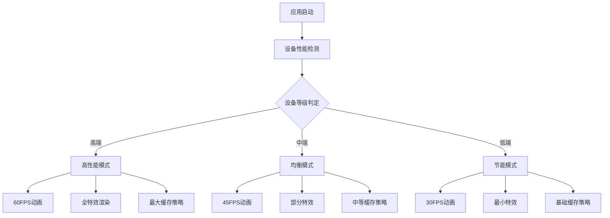
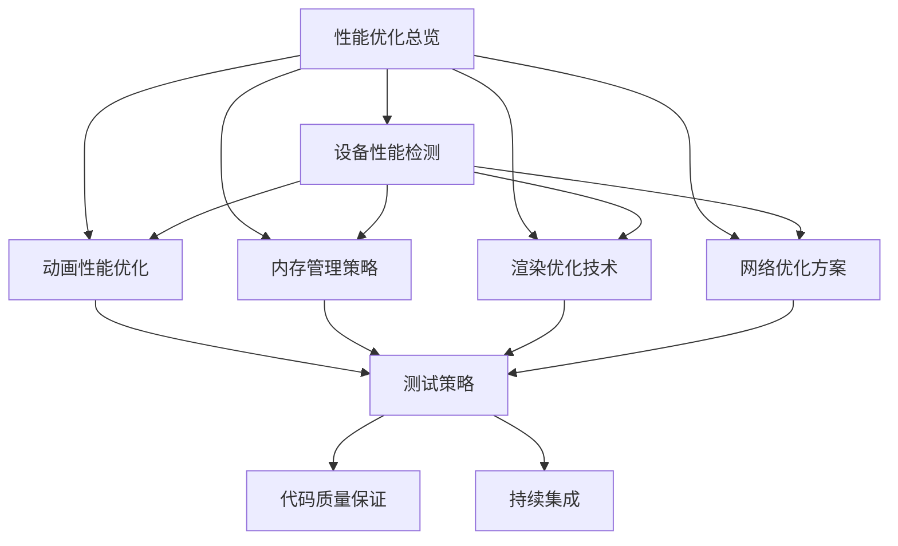

# Flutter图像去雾系统 - 性能优化总览

**文档版本**: v2.0
**最后更新**: 2025-11-22
**关联文档**: [架构设计](../architecture/00-overview.md) | [UI组件设计](../architecture/02-ui-components.md)

---

## 文档概述

本文档集提供Flutter图像去雾系统的全面性能优化指导，基于Clean Architecture + Feature-First架构模式，专注于Flutter前端的性能优化策略和最佳实践。

### 重构目标

#### 前端聚焦原则
- **专注Flutter性能**：重点关注Flutter应用的性能优化，而非后端算法实现
- **用户体验为核心**：以提升用户体验为导向的性能优化策略
- **多平台适配**：覆盖6个主要平台的性能优化方案
- **实用性指导**：提供具体的实施方案和代码示例

#### 架构对齐
- **基于现有架构**：与`dehaze_flutter/docs/architecture`中的架构设计保持一致
- **参考产品原型**：结合demo文件夹中的需求单和HTML设计稿
- **界面设计指导**：参考`dehaze_flutter/docs/design`中的界面设计规范

---

## 性能优化框架概览

### 分层优化策略

| 优化层级 | 优化重点 | 具体措施 | 预期收益 |
|---------|---------|---------|---------|
| **应用层** | 启动性能、页面切换 | 懒加载、预编译、资源优化 | 启动时间减少30-50% |
| **渲染层** | UI渲染、动画性能 | GPU加速、帧率控制、渲染优化 | 流畅度提升40-60% |
| **内存层** | 内存管理、资源释放 | 内存监控、缓存策略、垃圾回收 | 内存占用减少25-40% |
| **网络层** | 数据传输、缓存策略 | 请求合并、离线支持、压缩优化 | 网络性能提升50-70% |
| **算法层** | 图像处理、计算优化 | 多线程、GPU计算、算法优化 | 处理速度提升2-5倍 |

### 性能目标体系

#### 核心性能指标

| 性能指标 | 高端设备 | 中端设备 | 低端设备 | 测量方式 |
|---------|---------|---------|---------|---------|
| **应用启动时间** | <1.5秒 | <2.5秒 | <4秒 | 冷启动时间测量 |
| **页面切换时间** | <200ms | <400ms | <800ms | 路由切换耗时 |
| **动画帧率** | 60FPS | 45-60FPS | 30FPS | 帧率监控工具 |
| **内存使用峰值** | <300MB | <200MB | <150MB | 内存使用监控 |
| **图像加载时间** | <1秒 | <2秒 | <3秒 | 网络加载计时 |
| **处理响应时间** | <200ms | <400ms | <800ms | API请求响应 |

### 设备分级体系

#### 设备性能分级标准

| 设备等级 | CPU配置 | 内存容量 | GPU性能 | 典型设备 |
|---------|---------|---------|---------|---------|
| **高端设备** | 8核+ | 6GB+ | 旗舰级GPU | iPhone 14 Pro, Samsung S23 |
| **中端设备** | 4-6核 | 4-6GB | 主流GPU | iPhone 12, Xiaomi 13 |
| **低端设备** | 2-4核 | 2-4GB | 入门级GPU | iPhone SE, Redmi系列 |

#### 适配策略概览



---

## 优化技术总览

### 1. 渲染性能优化

#### 动画优化策略
- **帧率自适应**：根据设备性能动态调整帧率
- **GPU硬件加速**：充分利用GPU并行计算能力
- **粒子效果分级**：不同设备使用不同复杂度的特效
- **预计算优化**：预先计算复杂的动画效果

#### UI渲染优化
- **懒加载机制**：按需加载页面和组件
- **虚拟化列表**：大列表使用虚拟滚动技术
- **图片优化**：格式选择、压缩、缓存策略
- **布局优化**：减少不必要的重绘和重排

### 2. 内存管理优化

#### 内存监控与告警
- **实时监控**：持续跟踪内存使用情况
- **阈值告警**：达到预设阈值时主动清理
- **泄漏检测**：自动识别潜在的内存泄漏
- **分级策略**：不同设备使用不同的内存阈值

#### 资源管理策略
- **生命周期管理**：及时释放不再使用的资源
- **缓存优化**：多级缓存和智能淘汰策略
- **图片资源管理**：专门的图片内存管理机制
- **定期清理**：自动清理临时文件和过期数据

### 3. 网络性能优化

#### 请求优化
- **请求合并**：将多个小请求合并为单个大请求
- **数据预取**：提前获取可能需要的数据
- **请求去重**：避免重复的请求
- **智能队列**：合理安排请求执行顺序

#### 缓存策略
- **HTTP缓存**：充分利用浏览器缓存机制
- **离线缓存**：支持离线访问核心功能
- **多级缓存**：内存、磁盘、网络三级缓存
- **同步机制**：网络恢复时同步缓存数据

### 4. 图像处理优化

#### 图像压缩与优化
- **自适应压缩**：根据网络状况调整压缩质量
- **格式优化**：选择最优的图像格式
- **尺寸适配**：根据显示尺寸调整图片大小
- **渐进式加载**：先显示低质量版本，再加载高清版本

#### 处理性能优化
- **多线程处理**：利用多核CPU并行处理
- **GPU加速**：使用GPU进行图像计算
- **分块处理**：大图像分块处理减少内存占用
- **算法优化**：选择适合设备性能的算法复杂度

---

## 测试策略总览

### 测试金字塔

| 测试层级 | 测试类型 | 数量比例 | 执行频率 | 覆盖目标 |
|---------|---------|---------|---------|---------|
| **单元测试** | 组件、函数测试 | 70% | 每次提交 | 90%+ |
| **集成测试** | 模块间测试 | 20% | 每日构建 | 80%+ |
| **端到端测试** | 完整流程测试 | 10% | 发布前 | 60%+ |

### 性能测试体系

#### 自动化性能测试
- **基准测试**：建立性能基准线
- **回归测试**：确保性能不退化
- **压力测试**：测试极限性能表现
- **兼容性测试**：多设备兼容性验证

#### 监控体系
- **实时监控**：生产环境性能监控
- **告警机制**：性能异常自动告警
- **分析报告**：定期性能分析报告
- **优化建议**：基于监控数据的优化建议

---

## 文档结构说明

### 文档组织

```
dehaze_flutter/docs/test/
├── README.md                           # 本文档 - 测试策略总览
├── 00-performance-overview.md          # 性能优化总览
├── 01-device-performance.md            # 设备性能检测与分级
├── 02-animation-performance.md         # 动画性能优化
├── 03-memory-management.md             # 内存管理策略
├── 04-rendering-optimization.md        # 渲染优化技术
├── 05-network-optimization.md          # 网络优化方案
├── 06-testing-strategy.md              # 测试策略
├── 07-code-quality.md                  # 代码质量保证
└── 08-continuous-integration.md        # 持续集成
```

### 文档关系图



---

## 使用指南

### 阅读路径建议

#### 新手入门
1. **[性能优化总览](00-performance-overview.md)** - 了解整体优化框架
2. **[设备性能检测](01-device-performance.md)** - 理解设备分级机制
3. **[测试策略](06-testing-strategy.md)** - 学习测试方法

#### 性能优化
1. **[渲染优化技术](04-rendering-optimization.md)** - UI渲染性能提升
2. **[动画性能优化](02-animation-performance.md)** - 动画流畅度优化
3. **[内存管理策略](03-memory-management.md)** - 内存使用优化

#### 深度优化
1. **[网络优化方案](05-network-optimization.md)** - 网络性能提升
2. **[代码质量保证](07-code-quality.md)** - 代码质量提升
3. **[持续集成](08-continuous-integration.md)** - 自动化流程

### 实施建议

#### 渐进式优化
1. **第一阶段**：基础性能优化和监控体系建设
2. **第二阶段**：深度优化和缓存策略实施
3. **第三阶段**：智能化优化和自动化测试

#### 团队协作
- **开发团队**：负责性能优化实施和代码质量保证
- **测试团队**：负责性能测试和自动化测试建设
- **运维团队**：负责监控体系和持续集成建设

---

## 技术栈总览

### 核心技术

| 技术类别 | 具体技术 | 应用场景 |
|---------|---------|---------|
| **性能监控** | Flutter DevTools | 应用性能分析 |
| **内存管理** | Dart VM | 内存分配和垃圾回收 |
| **图像处理** | image包 | 图像压缩和处理 |
| **网络优化** | Dio + Cache | HTTP请求和缓存 |
| **状态管理** | Bloc/Cubit | 应用状态管理优化 |

### 测试技术

| 技术类别 | 具体技术 | 应用场景 |
|---------|---------|---------|
| **单元测试** | Flutter Test | 组件和函数测试 |
| **集成测试** | Integration Test | 模块间测试 |
| **性能测试** | Flutter Driver | 性能基准测试 |
| **代码质量** | dart analyze | 静态代码分析 |

---

**文档版本**: v2.0
**最后更新**: 2025-11-22
**重构自**: [PERFORMANCE_AND_TESTING.md](../PERFORMANCE_AND_TESTING.md)

---

*本文档集将随着项目的发展持续更新和完善，确保始终反映最新的性能优化策略和测试最佳实践。*