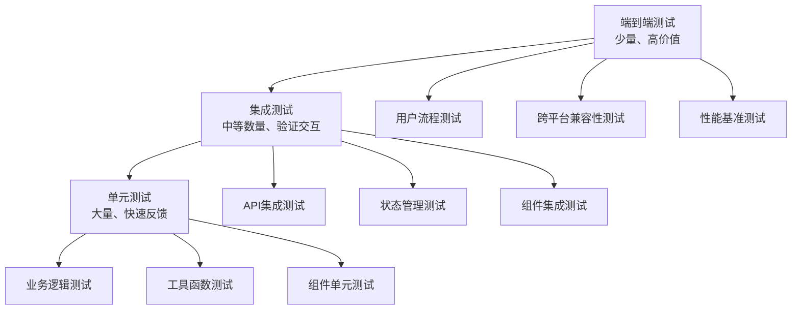

# Flutter图像去雾系统 - 测试策略

**文档版本**: v2.0
**最后更新**: 2025-11-22
**关联文档**: [性能优化总览](00-performance-overview.md) | [代码质量保证](07-code-quality.md)

---

## 概述

测试策略是Flutter图像去雾系统质量保证的核心环节，通过科学的测试金字塔、全面的测试覆盖和自动化测试流程，确保系统在各种场景下都能稳定可靠地运行。本策略覆盖单元测试、集成测试、端到端测试和性能测试等各个层级。

### 测试目标

#### 质量目标
- **代码覆盖率**：整体≥80%，核心业务逻辑≥90%
- **测试通过率**：100%通过，无失败测试
- **缺陷密度**：<1个缺陷/KLOC
- **回归测试效率**：全量回归<2小时

#### 测试分级目标

| 测试层级 | 覆盖目标 | 执行频率 | 自动化程度 | 失败容忍度 |
|---------|---------|---------|-----------|-----------|
| **单元测试** | 代码行覆盖率≥90% | 每次提交 | 100% | 0% |
| **集成测试** | 模块覆盖率≥80% | 每日构建 | 100% | 0% |
| **端到端测试** | 用户路径覆盖率≥70% | 发布前 | 95% | 5% |
| **性能测试** | 关键场景覆盖率≥80% | 每周 | 90% | 10% |

---

## 测试金字塔架构

### 测试分层体系



### 测试比例分配

| 测试类型 | 数量比例 | 维护成本 | 执行速度 | 问题定位难度 |
|---------|---------|---------|---------|-------------|
| **单元测试** | 70% | 低 | 毫秒级 | 简单 |
| **集成测试** | 20% | 中 | 秒级 | 中等 |
| **端到端测试** | 10% | 高 | 分钟级 | 复杂 |

---

## 单元测试策略

### 测试范围定义

#### 单元测试覆盖范围

| 测试模块 | 测试重点 | 覆盖率目标 | 测试复杂度 |
|---------|---------|-----------|-----------|
| **业务逻辑** | UseCase、业务规则 | 95% | 高 |
| **数据模型** | Entity、数据验证 | 90% | 中 |
| **工具函数** | 通用工具、算法 | 95% | 低 |
| **状态管理** | Bloc/Cubit逻辑 | 90% | 高 |
| **网络请求** | API调用、数据转换 | 85% | 中 |
| **本地存储** | 数据库操作、缓存 | 80% | 中 |

### UseCase测试

#### 图像处理用例测试

```dart
// test/features/image_processing/domain/usecases/process_image_test.dart
import 'package:flutter_test/flutter_test.dart';
import 'package:mocktail/mocktail.dart';

class MockImageRepository extends Mock implements ImageRepository {}
class MockAlgorithmService extends Mock implements AlgorithmService {}

void main() {
  late ProcessImageUseCase useCase;
  late MockImageRepository mockRepository;
  late MockAlgorithmService mockAlgorithmService;

  setUp(() {
    mockRepository = MockImageRepository();
    mockAlgorithmService = MockAlgorithmService();
    useCase = ProcessImageUseCase(
      repository: mockRepository,
      algorithmService: mockAlgorithmService,
    );
  });

  group('ProcessImageUseCase', () {
    final testImage = InputImage(
      id: 'test-id',
      path: '/test/image.jpg',
      source: ImageSource.gallery,
      timestamp: DateTime.now(),
      width: 1920,
      height: 1080,
      fileSize: 1024000,
    );

    final testAlgorithm = Algorithm(
      id: 'dcp',
      name: '暗通道先验',
      type: AlgorithmType.traditional,
      description: 'Dark Channel Prior algorithm',
      parameters: {'strength': 0.8},
    );

    test('should process image successfully', () async {
      // Arrange
      when(() => mockAlgorithmService.processImage(any(), any()))
          .thenAnswer((_) async => ProcessedImage(
            id: 'result-id',
            originalImageId: testImage.id,
            algorithmId: testAlgorithm.id,
            outputPath: '/result/output.jpg',
            processTime: Duration(seconds: 5),
            quality: 0.95,
          ));

      when(() => mockRepository.saveProcessingResult(any()))
          .thenAnswer((_) async => true);

      // Act
      final params = ProcessImageParams(
        image: testImage,
        algorithm: testAlgorithm,
        parameters: testAlgorithm.parameters,
      );

      final result = await useCase(params);

      // Assert
      expect(result.isRight, true);
      final processedImage = result.getOrElse(() => throw 'Should not happen');
      expect(processedImage.originalImageId, testImage.id);
      expect(processedImage.algorithmId, testAlgorithm.id);

      verify(() => mockAlgorithmService.processImage(testImage, testAlgorithm)).called(1);
      verify(() => mockRepository.saveProcessingResult(any())).called(1);
    });

    test('should handle algorithm service error', () async {
      // Arrange
      when(() => mockAlgorithmService.processImage(any(), any()))
          .thenThrow(AlgorithmException('Algorithm failed'));

      // Act
      final params = ProcessImageParams(
        image: testImage,
        algorithm: testAlgorithm,
        parameters: testAlgorithm.parameters,
      );

      final result = await useCase(params);

      // Assert
      expect(result.isLeft, true);
      final error = result.fold((l) => l, (r) => throw 'Should not happen');
      expect(error, isA<ProcessingFailure>());
    });

    test('should handle invalid parameters', () async {
      // Act
      final params = ProcessImageParams(
        image: testImage,
        algorithm: testAlgorithm,
        parameters: {'invalid_param': 'value'},
      );

      final result = await useCase(params);

      // Assert
      expect(result.isLeft, true);
      final error = result.fold((l) => l, (r) => throw 'Should not happen');
      expect(error, isA<InvalidParametersError>());
    });
  });
}
```

### 状态管理测试

#### Bloc/Cubit测试

```dart
// test/features/image_input/presentation/cubits/image_input_cubit_test.dart
import 'package:flutter_test/flutter_test.dart';
import 'package:mocktail/mocktail.dart';

class MockImageRepository extends Mock implements ImageRepository {}
class MockFilePicker extends Mock implements FilePicker {}

void main() {
  late ImageInputCubit cubit;
  late MockImageRepository mockRepository;
  late MockFilePicker mockFilePicker;

  setUp(() {
    mockRepository = MockImageRepository();
    mockFilePicker = MockFilePicker();
    cubit = ImageInputCubit(mockRepository, mockFilePicker);
  });

  tearDown(() {
    cubit.close();
  });

  group('ImageInputCubit', () {
    test('initial state should be ImageInputInitial', () {
      expect(cubit.state, ImageInputInitial());
    });

    test('should pick images from gallery successfully', () async {
      // Arrange
      final mockFiles = [File('/test/image1.jpg'), File('/test/image2.jpg')];
      when(() => mockFilePicker.pickImages())
          .thenAnswer((_) async => mockFiles);

      final mockImages = mockFiles.map((file) => InputImage(
        id: 'id-${file.path}',
        path: file.path,
        source: ImageSource.gallery,
        timestamp: DateTime.now(),
        width: 1920,
        height: 1080,
        fileSize: 1024000,
      )).toList();

      when(() => mockRepository.validateImages(mockFiles))
          .thenAnswer((_) async => Right(mockImages));

      // Act
      await cubit.pickImagesFromGallery();

      // Assert
      expect(cubit.state, isA<ImageInputSuccess>());
      final successState = cubit.state as ImageInputSuccess;
      expect(successState.images.length, 2);
      expect(successState.images.first.source, ImageSource.gallery);

      verify(() => mockFilePicker.pickImages()).called(1);
      verify(() => mockRepository.validateImages(mockFiles)).called(1);
    });

    test('should handle file picker error', () async {
      // Arrange
      when(() => mockFilePicker.pickImages())
          .thenThrow(FilePickerException('User cancelled'));

      // Act
      await cubit.pickImagesFromGallery();

      // Assert
      expect(cubit.state, isA<ImageInputError>());
      final errorState = cubit.state as ImageInputError;
      expect(errorState.message, contains('User cancelled'));
    });

    test('should handle image validation failure', () async {
      // Arrange
      final mockFiles = [File('/test/invalid.jpg')];
      when(() => mockFilePicker.pickImages())
          .thenAnswer((_) async => mockFiles);

      when(() => mockRepository.validateImages(mockFiles))
          .thenAnswer((_) async => Left(ValidationError('Invalid image format')));

      // Act
      await cubit.pickImagesFromGallery();

      // Assert
      expect(cubit.state, isA<ImageInputError>());
      final errorState = cubit.state as ImageInputError;
      expect(errorState.message, 'Invalid image format');
    });

    test('should emit loading state during processing', () async {
      // Arrange
      when(() => mockFilePicker.pickImages())
          .thenAnswer((_) async => [File('/test/image.jpg')]);

      when(() => mockRepository.validateImages(any()))
          .thenAnswer((_) async {
        await Future.delayed(Duration(milliseconds: 100));
        return Right([InputImage(
          id: 'test-id',
          path: '/test/image.jpg',
          source: ImageSource.gallery,
          timestamp: DateTime.now(),
          width: 1920,
          height: 1080,
          fileSize: 1024000,
        )]);
      });

      // Act & Assert
      expectLater(cubit.stream, emitsInOrder([
        isA<ImageInputLoading>(),
        isA<ImageInputSuccess>(),
      ]));

      await cubit.pickImagesFromGallery();
    });
  });
}
```

---

## 集成测试策略

### 组件集成测试

#### 图像处理组件测试

```dart
// test/integration/image_processing_integration_test.dart
import 'package:flutter/material.dart';
import 'package:flutter_test/flutter_test.dart';
import 'package:network_image_mock/network_image_mock.dart';

void main() {
  group('Image Processing Integration Tests', () {
    testWidgets('complete image processing workflow', (tester) async {
      // Mock network images
      mockNetworkImagesFor(() async {
        // Build the app
        await tester.pumpWidget(MyApp());

        // 1. Navigate to image input
        await tester.tap(find.text('输入'));
        await tester.pumpAndSettle();

        // 2. Select sample image
        await tester.tap(find.text('样例图片'));
        await tester.pumpAndSettle();

        await tester.tap(find.byType(ImageCard).first);
        await tester.pumpAndSettle();

        // 3. Select algorithm
        await tester.tap(find.text('算法'));
        await tester.pumpAndSettle();

        await tester.tap(find.text('暗通道先验'));
        await tester.pumpAndSettle();

        // 4. Configure parameters
        await tester.tap(find.byKey(Key('algorithm_params')));
        await tester.pumpAndSettle();

        await tester.enterText(
          find.byKey(Key('strength_slider')),
          '0.8',
        );
        await tester.pumpAndSettle();

        // 5. Start processing
        await tester.tap(find.text('开始去雾'));
        await tester.pumpAndSettle();

        // 6. Verify processing started
        expect(find.byType(CircularProgressIndicator), findsOneWidget);
        expect(find.text('处理中...'), findsOneWidget);

        // 7. Wait for processing completion
        await tester.pumpAndSettle(Duration(seconds: 10));

        // 8. Verify results
        expect(find.text('处理完成'), findsOneWidget);
        expect(find.byType(ComparisonWidget), findsOneWidget);
        expect(find.byKey(Key('download_button')), findsOneWidget);
      });
    });

    testWidgets('image processing with network error', (tester) async {
      // Mock network failure
      HttpOverrides.global = MockHttpOverrides();

      await tester.pumpWidget(MyApp());

      // Navigate to processing
      await tester.tap(find.text('输入'));
      await tester.pumpAndSettle();

      // Try to upload image with network error
      await tester.tap(find.byKey(Key('upload_button')));
      await tester.pumpAndSettle();

      // Verify error handling
      expect(find.text('网络连接失败'), findsOneWidget);
      expect(find.byKey(Key('retry_button')), findsOneWidget);
    });
  });
}
```

### API集成测试

#### 后端服务集成测试

```dart
// test/integration/api_integration_test.dart
import 'package:flutter_test/flutter_test.dart';
import 'package:http/http.dart' as http;
import 'package:mock_server/mock_server.dart';

void main() {
  group('API Integration Tests', () {
    late MockServer mockServer;

    setUp(() async {
      mockServer = MockServer();
      await mockServer.start();
    });

    tearDown(() async {
      await mockServer.stop();
    });

    test('should upload image successfully', () async {
      // Mock successful upload response
      mockServer.post('/api/images/upload', (req, res) {
        res.statusCode = 200;
        res.json({
          'success': true,
          'data': {
            'id': 'uploaded-image-id',
            'url': 'https://example.com/image.jpg',
            'size': 1024000,
          }
        });
      });

      final client = ApiClient(baseUrl: mockServer.url);
      final imageFile = File('test/fixtures/test_image.jpg');

      final result = await client.uploadImage(imageFile);

      expect(result.isSuccess, true);
      expect(result.data!.id, 'uploaded-image-id');
      expect(result.data!.url, contains('image.jpg'));
    });

    test('should handle upload failure', () async {
      // Mock upload error response
      mockServer.post('/api/images/upload', (req, res) {
        res.statusCode = 400;
        res.json({
          'success': false,
          'error': 'Invalid image format',
        });
      });

      final client = ApiClient(baseUrl: mockServer.url);
      final imageFile = File('test/fixtures/invalid_image.txt');

      final result = await client.uploadImage(imageFile);

      expect(result.isFailure, true);
      expect(result.error!.message, 'Invalid image format');
    });

    test('should retry failed requests', () async {
      int requestCount = 0;

      mockServer.post('/api/images/upload', (req, res) {
        requestCount++;
        if (requestCount < 3) {
          res.statusCode = 500;
          res.json({'error': 'Server error'});
        } else {
          res.statusCode = 200;
          res.json({'success': true, 'data': {'id': 'retry-success'}});
        }
      });

      final client = ApiClient(
        baseUrl: mockServer.url,
        retryConfig: RetryConfig(maxRetries: 3),
      );
      final imageFile = File('test/fixtures/test_image.jpg');

      final result = await client.uploadImage(imageFile);

      expect(result.isSuccess, true);
      expect(requestCount, 3); // Should have retried 3 times
    });
  });
}
```

---

## 端到端测试策略

### 用户场景测试

#### 完整用户流程测试

```dart
// integration_test/app_e2e_test.dart
import 'package:flutter/material.dart';
import 'package:flutter_test/flutter_test.dart';
import 'package:integration_test/integration_test.dart';

void main() {
  IntegrationTestWidgetsFlutterBinding.ensureInitialized();

  group('End-to-End User Scenarios', () {
    testWidgets('new user onboarding workflow', (tester) async {
      // Start the app
      app.main();
      await tester.pumpAndSettle(Duration(seconds: 3));

      // 1. Welcome screen
      expect(find.text('欢迎使用图像去雾系统'), findsOneWidget);
      await tester.tap(find.text('开始使用'));
      await tester.pumpAndSettle();

      // 2. Permission request
      expect(find.text('权限申请'), findsOneWidget);
      await tester.tap(find.text('授权相机'));
      await tester.pumpAndSettle();

      await tester.tap(find.text('授权存储'));
      await tester.pumpAndSettle();

      await tester.tap(find.text('继续'));
      await tester.pumpAndSettle();

      // 3. Main interface
      expect(find.text('图像去雾'), findsOneWidget);
      expect(find.byType(BottomNavigationBar), findsOneWidget);

      // 4. First image processing
      await tester.tap(find.text('输入'));
      await tester.pumpAndSettle();

      await tester.tap(find.text('拍照'));
      await tester.pumpAndSettle();

      // Mock camera capture (in real test, this would use camera testing)
      await tester.tap(find.byKey(Key('capture_button')));
      await tester.pumpAndSettle(Duration(seconds: 2));

      // 5. Algorithm selection
      await tester.tap(find.text('算法'));
      await tester.pumpAndSettle();

      await tester.tap(find.text('暗通道先验'));
      await tester.pumpAndSettle();

      // 6. Processing
      await tester.tap(find.text('开始去雾'));
      await tester.pumpAndSettle(Duration(seconds: 10));

      // 7. Results
      expect(find.text('处理完成'), findsOneWidget);
      expect(find.byType(ComparisonWidget), findsOneWidget);

      // 8. Save result
      await tester.tap(find.text('保存结果'));
      await tester.pumpAndSettle();

      expect(find.text('保存成功'), findsOneWidget);
    });

    testWidgets('offline mode functionality', (tester) async {
      // Start app without network
      app.main();
      await tester.pumpAndSettle();

      // Enable airplane mode (network simulation)
      await tester.binding.setSurfaceSize(Size(1080, 1920));

      // Navigate to app
      await tester.pumpAndSettle();

      // Test offline capabilities
      await tester.tap(find.text('输入'));
      await tester.pumpAndSettle();

      // Should show offline indicator
      expect(find.byIcon(Icons.cloud_off), findsOneWidget);

      // Use sample images (should work offline)
      await tester.tap(find.text('样例图片'));
      await tester.pumpAndSettle();

      await tester.tap(find.byType(ImageCard).first);
      await tester.pumpAndSettle();

      // Processing should work with cached algorithms
      await tester.tap(find.text('算法'));
      await tester.pumpAndSettle();

      await tester.tap(find.text('暗通道先验'));
      await tester.pumpAndSettle();

      await tester.tap(find.text('开始去雾'));
      await tester.pumpAndSettle(Duration(seconds: 5));

      // Should complete processing offline
      expect(find.text('处理完成'), findsOneWidget);
    });
  });
}
```

### 跨平台兼容性测试

#### 多平台端到端测试

```dart
// integration_test/platform_compatibility_test.dart
import 'package:flutter/foundation.dart';
import 'package:flutter_test/flutter_test.dart';
import 'package:integration_test/integration_test.dart';

void main() {
  IntegrationTestWidgetsFlutterBinding.ensureInitialized();

  group('Platform Compatibility Tests', () {
    testWidgets('responsive layout on different screen sizes', (tester) async {
      // Test mobile phone size
      await tester.binding.setSurfaceSize(Size(375, 812)); // iPhone X
      app.main();
      await tester.pumpAndSettle();

      // Verify mobile layout
      expect(find.byType(BottomNavigationBar), findsOneWidget);
      expect(find.byType(NavigationRail), findsNothing);

      // Test tablet size
      await tester.binding.setSurfaceSize(Size(768, 1024)); // iPad
      await tester.pumpAndSettle();

      // Verify tablet layout
      expect(find.byType(NavigationRail), findsOneWidget);
      expect(find.byType(BottomNavigationBar), findsNothing);

      // Test desktop size
      await tester.binding.setSurfaceSize(Size(1200, 800)); // Desktop
      await tester.pumpAndSettle();

      // Verify desktop layout
      expect(find.byType(NavigationRail), findsOneWidget);
      expect(find.byType(Sidebar), findsOneWidget);
    });

    testWidgets('platform-specific features', (tester) async {
      app.main();
      await tester.pumpAndSettle();

      if (defaultTargetPlatform == TargetPlatform.android) {
        // Test Android-specific features
        expect(find.byIcon(Icons.share), findsOneWidget);

        // Test file picker integration
        await tester.tap(find.text('输入'));
        await tester.pumpAndSettle();

        await tester.tap(find.text('相册'));
        await tester.pumpAndSettle();

        // Should show Android file picker
        expect(find.byType(AndroidFilePicker), findsOneWidget);
      } else if (defaultTargetPlatform == TargetPlatform.iOS) {
        // Test iOS-specific features
        expect(find.byIcon(Icons.ios_share), findsOneWidget);

        // Test iOS photo picker
        await tester.tap(find.text('输入'));
        await tester.pumpAndSettle();

        await tester.tap(find.text('相册'));
        await tester.pumpAndSettle();

        // Should show iOS photo picker
        expect(find.byType(iOSPhotoPicker), findsOneWidget);
      }
    });
  });
}
```

---

## 性能测试策略

### 应用性能测试

#### 启动性能测试

```dart
// test/performance/app_startup_test.dart
import 'package:flutter/foundation.dart';
import 'package:flutter_test/flutter_test.dart';
import 'package:integration_test/integration_test.dart';

void main() {
  IntegrationTestWidgetsFlutterBinding.ensureInitialized();

  group('Application Performance Tests', () {
    testWidgets('app startup performance', (tester) async {
      final stopwatch = Stopwatch()..start();

      // Start app and measure startup time
      app.main();
      await tester.pumpAndSettle();
      stopwatch.stop();

      final startupTime = stopwatch.elapsedMilliseconds;

      // Verify startup time requirements
      if (defaultTargetPlatform == TargetPlatform.iOS) {
        expect(startupTime, lessThan(1500)); // iOS: <1.5s
      } else if (defaultTargetPlatform == TargetPlatform.android) {
        expect(startupTime, lessThan(2000)); // Android: <2s
      } else {
        expect(startupTime, lessThan(1000)); // Desktop: <1s
      }

      print('App startup time: ${startupTime}ms');

      // Verify initial UI is ready
      expect(find.text('图像去雾'), findsOneWidget);
      expect(find.byType(HomePage), findsOneWidget);
    });

    testWidgets('memory usage during processing', (tester) async {
      app.main();
      await tester.pumpAndSettle();

      final memoryMonitor = MemoryMonitor();

      // Baseline memory
      await memoryMonitor.recordMemoryUsage('baseline');

      // Navigate to image processing
      await tester.tap(find.text('输入'));
      await tester.pumpAndSettle();

      await tester.tap(find.text('样例图片'));
      await tester.pumpAndSettle();

      await tester.tap(find.byType(ImageCard).first);
      await tester.pumpAndSettle();

      await tester.tap(find.text('算法'));
      await tester.pumpAndSettle();

      await tester.tap(find.text('暗通道先验'));
      await tester.pumpAndSettle();

      // Start processing
      await tester.tap(find.text('开始去雾'));
      await tester.pumpAndSettle();

      // Record memory during processing
      await memoryMonitor.recordMemoryUsage('processing_start');

      // Wait for processing
      await tester.pumpAndSettle(Duration(seconds: 10));

      // Record memory after processing
      await memoryMonitor.recordMemoryUsage('processing_complete');

      final memoryReport = memoryMonitor.generateReport();

      // Verify memory usage is within limits
      expect(memoryReport.peakUsageMB, lessThan(300)); // <300MB peak

      // Verify memory is properly cleaned up
      expect(memoryReport.leakageMB, lessThan(10)); // <10MB leakage

      print('Memory report: ${memoryReport.toString()}');
    });

    testWidgets('animation frame rate performance', (tester) async {
      app.main();
      await tester.pumpAndSettle();

      final frameRateMonitor = FrameRateMonitor();

      // Trigger animations
      await tester.tap(find.text('输入'));
      await tester.pumpAndSettle();

      frameRateMonitor.startMonitoring();

      // Perform various UI interactions that trigger animations
      await tester.tap(find.byType(ImageCard).first);
      await tester.pumpAndSettle();

      await tester.tap(find.text('算法'));
      await tester.pumpAndSettle();

      // Scroll through algorithm list
      await tester.fling(find.byType(ListView), Offset(0, -500), 1000);
      await tester.pumpAndSettle();

      frameRateMonitor.stopMonitoring();

      final frameRateReport = frameRateMonitor.getReport();

      // Verify frame rate requirements
      expect(frameRateReport.averageFPS, greaterThan(30)); // >30FPS average
      expect(frameRateReport.droppedFrames, lessThan(10)); // <10 dropped frames

      print('Frame rate report: ${frameRateReport.toString()}');
    });
  });
}
```

---

## 测试自动化

### CI/CD集成

#### 自动化测试流水线

```yaml
# .github/workflows/test.yml
name: Flutter Tests

on:
  push:
    branches: [main, develop]
  pull_request:
    branches: [main]

jobs:
  unit-tests:
    runs-on: ubuntu-latest
    steps:
      - uses: actions/checkout@v3

      - uses: subosito/flutter-action@v2
        with:
          flutter-version: '3.16.0'

      - name: Install dependencies
        run: flutter pub get

      - name: Run unit tests
        run: flutter test --coverage --reporter=expanded

      - name: Upload coverage
        uses: codecov/codecov-action@v3
        with:
          files: coverage/lcov.info

  integration-tests:
    runs-on: ubuntu-latest
    needs: unit-tests
    steps:
      - uses: actions/checkout@v3

      - uses: subosito/flutter-action@v2
        with:
          flutter-version: '3.16.0'

      - name: Install dependencies
        run: flutter pub get

      - name: Run integration tests
        run: flutter test integration_test/

  e2e-tests:
    runs-on: macos-latest
    needs: integration-tests
    steps:
      - uses: actions/checkout@v3

      - uses: subosito/flutter-action@v2
        with:
          flutter-version: '3.16.0'

      - name: Install dependencies
        run: flutter pub get

      - name: Setup iOS simulator
        run: |
          xcrun simctl create "iPhone 14" "iPhone 14"
          xcrun simctl boot "iPhone 14"

      - name: Run E2E tests
        run: flutter test integration_test/ -d "iPhone 14"

  performance-tests:
    runs-on: ubuntu-latest
    needs: unit-tests
    steps:
      - uses: actions/checkout@v3

      - uses: subosito/flutter-action@v2
        with:
          flutter-version: '3.16.0'

      - name: Install dependencies
        run: flutter pub get

      - name: Run performance tests
        run: flutter test test/performance/ --reporter=expanded

      - name: Upload performance reports
        uses: actions/upload-artifact@v3
        with:
          name: performance-reports
          path: test/performance/reports/
```

---

## 测试数据管理

### 测试数据策略

#### 测试数据生成

```dart
// test/utils/test_data_generator.dart
import 'dart:math';
import 'package:image/image.dart';

class TestDataGenerator {
  static final Random _random = Random();

  static InputImage generateTestImage({
    int width = 1920,
    int height = 1080,
    ImageSource source = ImageSource.gallery,
  }) {
    final timestamp = DateTime.now();
    final id = 'test-image-${timestamp.millisecondsSinceEpoch}';
    final path = '/test/images/$id.jpg';
    final fileSize = width * height * 3; // RGB estimate

    return InputImage(
      id: id,
      path: path,
      source: source,
      timestamp: timestamp,
      width: width,
      height: height,
      fileSize: fileSize,
    );
  }

  static List<InputImage> generateTestImageList({int count = 10}) {
    return List.generate(count, (index) => generateTestImage(
      width: 800 + _random.nextInt(1200),
      height: 600 + _random.nextInt(800),
      source: ImageSource.values[_random.nextInt(ImageSource.values.length)],
    ));
  }

  static Algorithm generateTestAlgorithm({
    String? id,
    String? name,
    AlgorithmType? type,
  }) {
    final algorithms = [
      ('dcp', '暗通道先验', AlgorithmType.traditional),
      ('retinex', 'Retinex理论', AlgorithmType.traditional),
      ('ffanet', 'FFA-Net', AlgorithmType.deepLearning),
      ('aodnet', 'AOD-Net', AlgorithmType.deepLearning),
    ];

    final selected = algorithms[_random.nextInt(algorithms.length)];

    return Algorithm(
      id: id ?? selected.$1,
      name: name ?? selected.$2,
      type: type ?? selected.$3,
      description: 'Test algorithm for ${selected.$2}',
      parameters: {
        'strength': _random.nextDouble(),
        'iterations': _random.nextInt(10) + 1,
      },
    );
  }

  static ProcessingTask generateTestProcessingTask() {
    final image = generateTestImage();
    final algorithm = generateTestAlgorithm();

    return ProcessingTask(
      id: 'task-${DateTime.now().millisecondsSinceEpoch}',
      inputImage: image,
      algorithm: algorithm,
      parameters: algorithm.parameters,
      status: ProcessingStatus.values[_random.nextInt(ProcessingStatus.values.length)],
      progress: _random.nextDouble(),
      createdAt: DateTime.now().subtract(Duration(minutes: _random.nextInt(60))),
    );
  }

  static Uint8List generateTestImageData({
    int width = 1920,
    int height = 1080,
  }) {
    final image = Image(width, height);

    // Generate random image data
    for (int y = 0; y < height; y++) {
      for (int x = 0; x < width; x++) {
        final r = _random.nextInt(256);
        final g = _random.nextInt(256);
        final b = _random.nextInt(256);
        image.setPixel(x, y, ColorRgb8(r, g, b));
      }
    }

    return encodeJpg(image);
  }
}
```

---

**文档版本**: v2.0
**最后更新**: 2025-11-22
**上一篇**: [网络优化方案](05-network-optimization.md)
**下一篇**: [代码质量保证](07-code-quality.md)

---

*科学的测试策略是保证Flutter应用质量的关键，通过建立完整的测试金字塔和自动化流程，能够有效发现和预防缺陷，确保应用的稳定性和可靠性。*