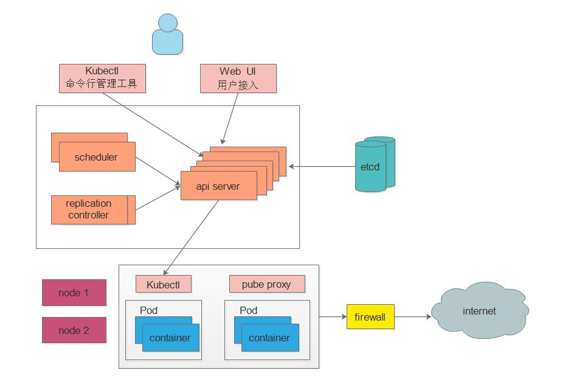

# Kubernetes 练习

## 简介

### 什么是Kubernetes

Kubernetes是一个用于管理云平台种多个主机上的容器化应用，它提供了应用部署、规划、更新、维护的一种机制。

传统的应用部署方式是通过插件或脚本来安装应用，这样做的缺点是应用的运行、配置、管理、所有的生存周期将于当前操作系统绑定，这样做并不利于应用的升级更新和回滚。

新的方式是通过部署容器的方式实现，每个容器之间互相隔离，每个容器都有自己的文件系统，容器之间的进程不会相互影响，能够区分计算资源。相对于虚拟机，容器能够快速部署，是由于容器与底层设施、及其文件系统是解耦的，所以它能够在不同版本操作系统之间进行迁移。

### kubernetes的功能

1. 自动装箱，基于容器对应用运行环境的资源配置要求自动部署应用容器
2. 自我修复，当容器失败时，会对容器进行重启。当所部署的结点有问题时，会对容器进行重新部署和重新调度
3. 水平扩展，通过简单的命令或者基于资源使用情况，对应用容器进行规模扩大或者规模裁剪
4. 服务发现
5. 滚动更新
6. 版本回退
7. 密钥和配置管理
8. 存储编排
9. 批处理

### K8S集群架构

K8s 集群主要有两个节点组成，他们分别是：Master 和 Node。

Master 节点运行着四个组件：etcd、API Server、Controller Manager、Scheduler，除了第一个etcd，后面三个主要负责对集群中的资源进行管理和调度，他们构成了 K8s 的总控中心；

Node 节点往往不止一个，每个 Node 运行着 Kubelet、Proxy、Docker Daemon，他们负责对管理本节点的 Pod 的生命周期和服务代理；

- 控制节点：

  * ApiServer : 资源操作的唯一入口，接收用户输入的命令，提供认证、授权、API注册和发现等机制
  * Scheduler : 负责集群资源调度，按照预定的调度策略将Pod调度到相应的node节点上
  * ControllerManager : 负责维护集群的状态，比如程序部署安排、故障检测、自动扩展、滚动更新等
  * Etcd ：负责存储集群中各种资源对象的信息(默认的数据库，自己可以配置修改的，比如配 [mysql ](https://www.songbingjia.com/mysql/))

- 工作节点Node :

  * Kubelet : 负责维护Pod、容器的生命周期，即通过控制docker，来创建、更新、销毁容器

  * KubeProxy : 负责提供集群内部的服务发现和负载均衡

  * Docker : 负责节点上容器的各种操作



### 大致工作原理

kubectl 和web UI接入master节点后，scheduler调度器将任务交给api server， 通过api server 把任务写入 etcd 存储服务器,然后交给node节点执行。控制器（replication controller）是维护我们的副本的数目的或者叫做我们的期望值的，一旦它的副本数不满足我们的期望值，控制器就会将它改写成 我们的期望值(创建或删除Pod数)

以安装nginx服务说明K8S组件调用关系： 首先要明确，一旦kubernetes环境启动之后，master和node都会将自身的信息存储到etcd数据库中

1. 一个nginx服务的安装请求会首先被发送到master节点的api server组件
2. apiServer组件会调用scheduler组件来决定到底应该把这个服务安装到哪个node节点上 在此时，Scheduler调度器会从etcd中读取各个node节点的信息，然后按照一定的算法进行选择，并将结果告知apiServer，分发给那个node
3. apiServer调用controller-manager(控制器)去调度Node节点安装nginx服务
4. kubelet接收到指令后，会通知docker，然后由docker来启动一个nginx的pod pod是kubernetes的最小操作单元，容器必须跑在pod中，此时nginx服务就已经跑起来了。
5. 一个nginx服务就运行了，如果需要访问nginx，就需要通过kube-proxy来对pod产生访问的代理

## 概念

### Node

Node 节点是相对于 Master 来说的工作主机，它既可以是物理的，也就可以是虚拟的，每个 Node 上管理着 Pod 生命周期的 Kubelet 同时也被 Master 管理，在 Node 上面运行的服务进程主要有：Kubelet、Kube-proxy 和 docker daemon。

Node 的主要信息有：地址、运行状态、条件、系统容量等

有个看起来不太令人相信的事情是：Node 并不是由 K8s 创建的，Node 节点其实是由物理机、虚拟机或者是云服务商提供的资源，我们在 K8s 创建的其实是 Node 对象，创建完成在之后再进行一系列的检查，比如服务是否正常启动、是否可以创建 Pod 等，如果检查不通过则会被标记为不可用；

* Node Controller：是管理 Node 对象的，主要负责集群范围内的 Node 信息同步和单个 Node 的生命周期的管理。
* Node 注册：每当 Kubelet 的`--register-node`的参数不更改，保持默认值（也就是 true），Kubelet 会向 apiserver 自动进行注册。
* 管理员的工作：Node 对象也可以进行手动创建和修改，其实操作起来也很简单，只需要把 Kubelet 的`--register-node`的参数设置为 false 就可以了。

### Pod

#### 概述

Pod是kubernetes中可以创建和管理的最小单元，是资源对象模型中由用户创建或者部署的最小资源对象模型，也是在k8s上运行容器化应用的资源对象，其他的资源对象都是用来支撑或者扩展pod对象功能的，比如控制器Controller对象是用来管理控制pod对象的，service和ingress资源对象是用来暴露pod引用对象的，persistentVolume资源对象是用来为pod提供存储的，k8s不会直接处理容器，而是pod处理，pod由一个或多个container组成。

每一个pod都有一个特殊的被称为根容器的Pause容器，这个容器对应的镜像属于kubernetes平台的一部分，除了pause容器，每个pod还包含一个或者多个紧密相关的用户业务容器。

每个pod都是应用的一个实例，有专用的ip。

一个pod可以有多个容器，彼此间共享网络和存储资源，每一个pod中有一个pause容器保存所有容器的状态，通过管理pause容器，达到管理pod中所有容器的效果。

同一个pod中的容器总会被调度到相同的node结点，不同结点间的pod通信基于虚拟二层网络技术。

容器的主程序要一直在前台运行，而不是后台运行，如果我们创建的Docker镜像启动命令是后台执行程序，则kubelet创建包含这个容器的pod之后运行完这个命令就会认定pod已结束，销毁了pod。pod可以由一个或者多个容器组合而成

#### 特性

##### 资源共享

一个Pod里的多个容器可以共享存储和网络，可以看作一个逻辑的主机，共享namespace，cgroups或者其他隔离的资源。

多个容器共享同一个网络的命名空间，由此在一个Pod里的多个容器共享Pod的IP和端口命名空间，所以一个Pod内多个容器之间可以通过localhost进行通信，不同的容器不要有端口冲突，不同的Pod有不同的IP，不同Pod内的多个容器之间的通信，不可以使用IPC。

一个Pod里的多个容器可以共享存储卷，这个存储卷会被定义为Pod的一部分，并且可以挂载到该Pod里的所有容器的文件系统上。

##### 生命周期短暂

Pod属于声明周期短暂的组件，当Pod所在结点发生故障，该节点的Pod会被调度到其他结点，被重新调度之后的Pod是一个全新的Pod

##### 平坦的网络

K8s集群中的所有Pod都在同一个共享的网络地址空间中，也就是说每个Pod都可以通过其他Pod的IP地址实现访问。

#### 分类

##### 普通Pod

普通Pod一旦被创建，就会被放入到etcd中存储，随后会被kubernetes Master调度到某个具体的结点上绑定，然后该Pod对应结点上的kubelet进程实例化成一组相关的Docker容器并启动起来。在默认情况下，当Pod内某个容器停止时，kubernetes会自动检测到这个问题并且重新启动这个Pod内的容器。如果Pod所在的结点宕机，则会将这个Node上的所有Pod重新调度到其他节点上。

##### 静态Pod

静态Pod是由kubelet进行管理的仅存在于特定Node上的Pod，他们不能通过API server进行管理

#### Container

说到 Container，我想大家第一时间想到的可能是 Docker。实际上，k8s 中有 4 类容器：标准容器、sidecar 容器、init 容器、ephemeral 容器 4 种类型的 containers。


实际上 Docker 最具革命性的创新，是应用程序的封装方式，即容器镜像的格式定义。可以说，Docker 的核心价值是容器镜像。容器镜像是真正改变世界的技术，这个观点至今仍然未变。Kubernetes 上跑的容器，离不开 Docker 镜像的使用。


根据上图，我们可以看出，Pod 算是一个容器组，因为一个 Pod 可以包含一个容器，也可以包含多个容器。

总的来说，每个运行的容器都是可重复的；包含依赖环境在内的标准，这意味着无论我们在哪里运行它，都会得到相同的行为。

容器将应用程序从底层的主机设施中解耦。这使得在不同的云或 OS 环境中部署更加容易。

#### Service

每个 Pod 都会被分配一个唯一的 IP，唯一的 IP 就如同数据库里的主键，访问起来特别方便，不过缺点就是这个 IP 会随着 Pod 的销毁而消失，如果有 Pod 组成一个集群来提供服务又该如何访问？这就是 Service 的作用了；

一个service 可以看作一组提供相同服务的Pod的对外访问接口 Service 作用于哪些Pod 是通过标签选择器来定义的 一个 Service 在 Kubernetes 中是一个 REST 对象，和 Pod 类似。 像所有的 REST 对象一样， Service 定义可以基于 POST 方式，请求 apiserver 创建新的实例。K8s 支持两种对外提供服务的 Service 的 type 的定义：

1. NodePort：在定义 Service 时指定`spec.type=NodePort`并指定`spec.ports.nodePort`的值，系统就会在 K8s 集群中的每个 Node 上打开 一个主机上的真实端口号，这个端口号可以帮助访问 Node 的客户端访问到内部的 Service；
2. LoadBalancer：如果云服务商支持外接负载均衡器，则可以通过`spec.type=LoadBalancer`定义 Service，并指定负载均衡器的 IP 地址。


#### Volume

Volume 是 Pod 中能够被多个容器访问的共享目录，Volume 就如同硬盘，容器的终止和重启不会其数据产生任何影响，Volume 有很多种类型。

K8S 支持很多类型的 volume 数据卷挂载，简单一点理解：数据卷 volume 是 Pod 内部的磁盘资源。

1. EmptyDir

在 Pod 分配到 Node 时创建的，同一个 Pod 中所有的容器都可以读写 EmptyDir 中相同的文件，这个类型主要是存放一些临时数据；

1. hostPath

在 Pod 上挂载宿主机上的文件或者目录，hostPath 通常用于需要永久保存的容器应用程序生成的日志文件以及范围 Docker 的文件系统；

1. secret

K8s 提供了 Secret 资源供我们来保存、设置一些敏感信息，比如 API endpoint 地址，各种用户密码或 token 之类的信息。在没有使用 K8s 的时候，这些信息可能是通过配置文件或者环境变量在部署的时候设置的。

不过，Secret 其实并不安全，稍微用 kubectl 查看过 Secret 的人都知道，我们可以非常方便的看到 Secret 的原文，只要有相关的权限即可，尽管它的内容是 base64 编码的，这基本上等同于明文。

所以说，K8s 原生的 Secret 是非常简单的，不是特别适合在大型公司里直接使用，对 RBAC 的挑战也比较大，很多不该看到明文信息的人可能都能看到。

不过大家也不用太过担心，社区中已经有比较多的成熟方案来解决它。shyiko/kubesec、bitnami-labs/sealed-secrets、Vault by HashiCorp、mozilla/sops、Kubernetes External Secrets、Kamus 等。

#### controller

##### 复制控制器

复制控制器（Replication Controller，RC）用于确保预期的Pod副本数量，即用来确保容器应用的副本数始终保持在用户定义的副本数，即如果有容器异常退出，会自动创建新的Pod 来替代。而如果异常多出来的容器也会自动回收。例如，在中断性维护（如内核升级）之后，你的 Pod 会在节点上重新创建。因此，即使你的应用程序只需要一个 Pod，你也应该使用 ReplicationController 创建 Pod。ReplicationController 类似于进程管理器，但是 ReplicationController 不是监控单个节点上的单个进程，而是监控跨多个节点的多个 Pod。在新版本的Kubernetes 中建议使用ReplicaSet来取代 ReplicationController。

##### 副本集

ReplicaSet（副本集）。在传统的集群工作模式中为了保证高可用性，集群里的应用至少要部署两个以上，这样，万一一个挂了另外的应用还能继续工作，扩容和缩容的时候通常需要手动在 Nginx 上配置集群 IP 地址，过程比较繁琐，麻烦不说，更重要的是还很容易出错。那么，ReplicaSet 就是 K8s 里的集群，ReplicaSet 可以认为是一组 pod 组成的集群，ReplicaSet 是一种逻辑上的集群。

##### Deployment

它是 Kubernetes 中最常用的一个对象，为 ReplicaSet 和 Pod 的创建提供了一种声明式的定义方法，主要用于部署应用，Deployment 对象不仅可以创建 ReplicaSet 和 Pod，还可以滚动升级和回滚应用、平滑的扩容和缩容，还可以是  Deployment 的开关。

#### Label

Label 定义了像 Pod、Service、Node 等对象的可识别属性，主要用于对他们进行管理和选择，比如用于对Pod进行分类，同一类POD会拥有相同的标签。或者附加到某个资源上，可用于关联对象、查询和筛选。Label 用的是键值对（Key/Value）的形式附加到这些对象上的，Label 既可以在创建对象的时候附加到对象上，如附加到Node、Pod、Serivce、RC，也可以在对象创建之后通过 API 进行管理；一个资源对象可以定义任意数量的Label，同一个Label也可以被添加到任意数量的资源对象上。

```json
"labels":{
    "key1":"value1",
    "key2":"value2"
}
```

在为对象定义好 Label 之后，其他对象就可以使用 Label Selector 来定义其作用的对象；

Label Selector 有两种:一个是 Equality-based(基于等式)一个是 Set-based(基于集合)。

1. Euqality-baesd 使用等式类的表达式来进行选择:

```
//选择所有包含Label中Key="name"且value="redis-slave"的对象
name=redis-slave;
      
//选择所有包含Label中key="env"且value不等于"production"的对象
env!=production:
```

1. Set-based 使用集合操作:

```cobol
//选择所有包含Label中Key="name"且value="redis-slave"或"redis-master"的对象
name in(redis-slave,redis-master):

//选择所有包含Label中Key="name"且value="php-frontend"的对象
name not in (php-frontend):
```

### Ingress

- Ingress是授权入站连接到达集群服务的规则集合。
- 在K8S集群里，工作在应用层，对外暴露接口。
- 可以调动不同业务域，不同URL访问路径的业务流量

你可以给Ingress配置提供外部可访问的URL、负载均衡、SSL、基于名称的虚拟主机等。用户通过POST Ingress资源到API server的方式来请求ingress。 Ingress controller负责实现Ingress，通常使用负载平衡器，它还可以配置边界路由和其他前端，这有助于以HA方式处理流量。

### NameSpace 

命名空间，用来隔离pod 的运行环境。随着项目怎多，人员增加，集群规模的扩大，我们需要一种能够隔离K8S内各种"资源"，每一类不相关的资源集合都应该有自己的"名称"。 Kubernetes可以使用Namespace（命名空间）创建多个虚拟集群。 Namespace为名称提供了一个范围。资源的名称在在同一个名称空间中具有唯一性。 不同名称空间内部的同种资源，名称可以相同，相同名称空间内的同种资源，名称不能相同。K8S里默认存在的名称空间有 default、kube-system、kube-public。查询k8s里特定"资源" 要带上相应的名称空间。

## K8S集群搭建

### 部署k8s的两种方式

目前生产部署Kubernetes集群主要有两种方式：

#### kubeadm

Kubeadm是一个K8s部署工具，提供kubeadm init和kubeadm join，用于快速部署Kubernetes集群。

#### 二进制包

从github下载发行版的二进制包，手动部署每个组件，组成Kubernetes集群。

> 本实验采用kubeadm的方式搭建集群。

### 环境准备

#### 服务器要求

建议最小硬件配置：2核CPU、2G内存、20G硬盘
服务器最好可以访问外网，会有从网上拉取镜像需求，如果服务器不能上网，需要提前下载对应镜像并导入节点

#### 软件环境

* 操作系统：centos7.9_x64(mini)

* Docker：20-ce

* K8s：1.23

* 服务器规划：（本实验采用虚拟机）

  * pei-liunx-100：192.168.210.100
  * pei-liunx-101：192.168.210.101
  * pei-liunx-102：192.168.210.102
  * pei-liunx-103：192.168.210.103


### 初始化配置

#### 环境准备

下面的操作需要在所有的节点上执行。

##### 关闭防火墙

```bash
systemctl stop firewalld
systemctl disable firewalld
```

##### 关闭selinux

```bash
# 永久
sed -i 's/enforcing/disabled/' /etc/selinux/config 
# 临时
setenforce 0  
```

##### 关闭swap

```bash
# 临时
swapoff -a  
# 永久
sed -ri 's/.*swap.*/#&/' /etc/fstab    
```


##### 根据规划设置主机名

```bash
hostnamectl set-hostname Pei-Liunx-100
hostnamectl set-hostname Pei-Liunx-101
hostnamectl set-hostname Pei-Liunx-102
hostnamectl set-hostname Pei-Liunx-103
```

##### 在master添加hosts

```bash
cat >> /etc/hosts << EOF
192.168.210.100 Pei-Liunx-100
192.168.210.101 Pei-Liunx-101
192.168.210.102 Pei-Liunx-102
192.168.210.103 Pei-Liunx-103
EOF
```

##### 将桥接的IPv4流量传递到iptables的链

```bash
cat > /etc/sysctl.d/k8s.conf << EOF
net.bridge.bridge-nf-call-ip6tables = 1
net.bridge.bridge-nf-call-iptables = 1
EOF
sysctl --system  # 生效
```

##### 时间同步

```bash
yum install ntpdate -y
ntpdate time.windows.com
```

注意：虚拟机不管关机还是挂起，每次重新操作都需要更新时间进行同步。 


#### 安装

> 【所有节点上安装 Docker、kubeadm、kubelet】

安装docker:

```bash
wget https://mirrors.aliyun.com/docker-ce/linux/centos/docker-ce.repo -O /etc/yum.repos.d/docker-ce.repo
yum -y install docker-ce
systemctl enable docker && systemctl start docker
```


配置镜像下载加速器：

````bash
vim /etc/docker/daemon.json
```
{
  "registry-mirrors":[
                      "https://o65lma2s.mirror.aliyuncs.com",
                      "http://hub-mirror.c.163.com"
                     ],
  "insecure-registries" :  ["192.168.210.100:5000"]
}

```
systemctl restart docker
#查看docker信息，进行确认
docker info                                                        

#添加阿里云软件源：
cat > /etc/yum.repos.d/kubernetes.repo << EOF
[kubernetes]
name=Kubernetes
baseurl=https://mirrors.aliyun.com/kubernetes/yum/repos/kubernetes-el7-x86_64
enabled=1
gpgcheck=0
repo_gpgcheck=0
gpgkey=https://mirrors.aliyun.com/kubernetes/yum/doc/yum-key.gpg https://mirrors.aliyun.com/kubernetes/yum/doc/rpm-package-key.gpg
EOF

#安装kubeadm、kubelet、kubectl：
yum install -y kubelet-1.23.0 kubeadm-1.23.0 kubectl-1.23.0
systemctl enable kubelet
````

### 部署k8s-master

> 该操作需要在master执行

#### kubeadm部署

> （需要等上一会）

```bash
kubeadm init \
  --apiserver-advertise-address=192.168.210.100 \
  --image-repository registry.aliyuncs.com/google_containers \
  --kubernetes-version v1.23.0 \
  --service-cidr=10.96.0.0/12 \
  --pod-network-cidr=10.244.0.0/16 \
  --ignore-preflight-errors=all
```

* --apiserver-advertise-address 集群通告地址
* --image-repository 由于默认拉取镜像地址k8s.gcr.io国内无法访问，这里指定阿里云镜像仓库地址
* --kubernetes-version K8s版本，与上面安装的一致
* --service-cidr 集群内部虚拟网络，Pod统一访问入口
* --pod-network-cidr Pod网络，与下面部署的CNI网络组件yaml中保持一致

初始化之后，会输出一个join命令，先复制出来，node节点加入master会使用。


#### 拷贝k8s认证文件

```bash
mkdir -p $HOME/.kube
sudo cp -i /etc/kubernetes/admin.conf $HOME/.kube/config
sudo chown $(id -u):$(id -g) $HOME/.kube/config
```

```bash
# 查看工作节点
kubectl get nodes
```


注：由于网络插件还没有部署，还没有准备就绪 NotReady，继续操作。 

### 配置k8s的node节点

> 【node节点操作】

#### 向集群添加新节点

执行在kubeadm init输出的kubeadm join命令

默认token有效期为24小时，当过期之后，该token就不可用了。这时就需要重新创建token，可以直接使用命令快捷生成：

```bash
kubeadm token create --print-join-command
```

### 部署容器网络 

> （master执行）

Calico是一个纯三层的数据中心网络方案，是目前Kubernetes主流的网络方案。

下载YAML：

```bash
wget https://docs.projectcalico.org/v3.14/manifests/calico.yaml
```

下载完后还需要修改里面定义Pod网络（CALICO_IPV4POOL_CIDR），与前面kubeadm init的 --pod-network-cidr指定的一样。

修改完后文件后，进行部署：

```bash
kubectl apply -f calico.yaml
kubectl get pods -n kube-system 
#执行结束要等上一会才全部running
```


等Calico Pod都Running后，节点也会准备就绪。

注：以后所有yaml文件都只在Master节点执行。

安装目录：/etc/kubernetes/

组件配置文件目录：/etc/kubernetes/manifests/

### 部署Dashboard

Dashboard是官方提供的一个UI，可用于基本管理K8s资源。

YAML下载地址：

```bash
wget https://raw.githubusercontent.com/kubernetes/dashboard/v2.4.0/aio/deploy/recommended.yaml
```

 默认Dashboard只能集群内部访问，修改Service为NodePort类型，暴露到外部：


````bash
vi recommended.yaml
```
kind: Service
apiVersion: v1
metadata:
  labels:
    k8s-app: kubernetes-dashboard
  name: kubernetes-dashboard
  namespace: kubernetes-dashboard
spec:
  ports:
    - port: 443
      targetPort: 8443
      nodePort: 30001
  selector:
    k8s-app: kubernetes-dashboard
  type: NodePort
```

kubectl apply -f recommended.yaml
kubectl get pods -n kubernetes-dashboard
````


访问地址：https://NodeIP:30001 

创建service account并绑定默认cluster-admin管理员集群角色：

#### 创建用户

```bash
kubectl create serviceaccount dashboard-admin -n kube-system
```

#### 用户授权

```bash
kubectl create \
clusterrolebinding dashboard-admin \
--clusterrole=cluster-admin \
--serviceaccount=kube-system:dashboard-admin
```

#### 获取用户Token

```bash
kubectl describe secrets \
-n kube-system $(kubectl -n kube-system get secret | awk '/dashboard-admin/{print $1}')
```


使用输出的token登录Dashboard。 


## YAML文件详解

### 概述

kubernetes集群中对资源管理和资源对象编排部署都可以通过声明yaml文件来解决，也就是可以把需要对资源对象操作编辑到yaml格式文件中，我们把这种文件叫做资源清单文件，通过`kubectl`命令直接使用资源清单文件就可以实现对大量的资源对象进行编排部署。

### 书写格式

```yaml
# 对象类型
name: Tom
# 数组类型1
people
- Tom
- Jack
# 数组类型2
people: [Tom, Jack]
# 数值以字面量形式表示
# 布尔值用true或false表示
# null用~表示
# 时间ISO8601格式
# 日期采用符合iso
```

### 资源清单描述方法


## 命令行工具 kubectl

### 概述

kubectl是集群的命令行工具，通过kubectl能够对集群本身进行管理，并能够在集群上进行容器化应用的安装部署。

### 语法

```sh
kubectl [command] [type] [name] [flags]
```

* command 指定要对资源进行的操作，如create, get, describe, delete
* type 指定资源类型，资源类型是大小写敏感的
* name 指定资源名称，名称也是大小写敏感的，如果省略名称，就会显示所有资源
* flag 指定可选的参数

### command命令使用分类

#### 基础命令

#### 部署命令

#### 集群管理命令

#### 故障和调试命令

#### 其他命令

