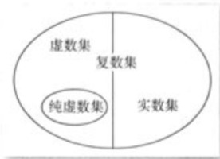
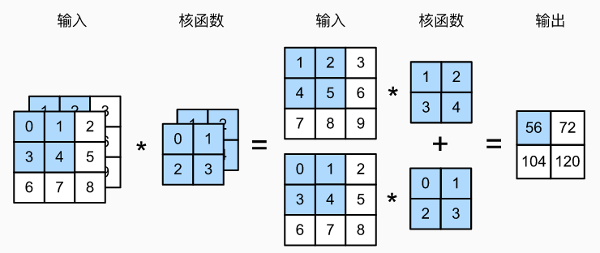
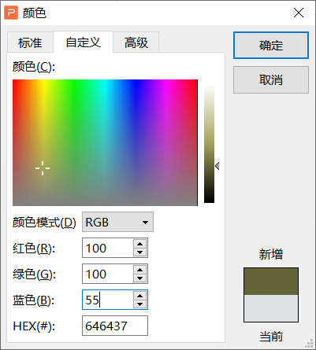

# QCNN-H 基于四元数卷积网络的单幅图像去雾

影响因子19.12 SCI 1区论文

## 当前去雾方法存在的问题：

1.  输出图像质量低。可见度差、模糊、对比度低、颜色失真、

    **几何伪影**

2.  泛化能力差。现有的很多方法都是在合成的数据集上进行训练的，比如RESIDE、ITS、OTS等。在真实环境下表现不好。最近有一个基于真实雾霾的数据集，但是数据量太少。因此训练出来的网络泛化能力不好。（我们可以通过一些巧妙的设计来削弱数据量少这个不利影响，但是不能完全消除）

3.  计算资源要求过高。以往的方法着重于关注模型的视觉效果（和一些定量指标）而对时间复杂度关注较少，模型设计的越来越复杂，网络的深度广度也越来越高。这限制了模型在硬件条件有限的场景中使用。

4.  处理浓雾和不均匀雾效果不佳。大多数模型假定图像中的雾气是均匀分布的，但是在真实世界中，不同地方雾气浓度可能并不相同

## 基于四元数的神经网络

超复数(<a href="zotero://open-pdf/library/items/IKU3IW98?page=2">“hypercomplex numbers”</a> (<a href="zotero://select/library/items/6ELGGPS7">Frants 等, 2023</a>))如复数、四元数、八元数。

近年来，基于超复数的神经网络在图像、视频、语音等领域效果优于其他神经网络。

而四元数是对复数的扩展，它包含一个实部和三个虚部。

### 复数的概念

我们想要明白这篇论文提出的最重要的点——四元数，那么必须要先复习复数的概念和意义。

> 我们通常所说的复数是这样的数，如𝑧 = 𝑎 + 𝑏i，其中𝑎, 𝑏 ∈ ℝ 的数叫做复数，其中𝑎 称为复数𝑧 的实部，𝑏 称为复数𝑧 的虚部。
>
> 这是我们在高中课本中所学的知识。因此我们对实数集进行扩展，把虚数集+实数集统称为复数集，如下图所示

我们可以把实数放在数轴上，那么实数和数轴上的点一一对应。对应的复数，我们可以用平面直角坐标系来表示，复数的实部在x轴上，虚部在y轴上。那么复数就具有了这样的几何意义。也就是说复数可以表示一个二维的空间。

我们接着对复数进行扩展，实部一个就够了，一个虚部？不够！联想到数字图像是由RGB三个分量来表示的。我们将这三个分量用三个虚部来表示，再加上一个实部，实部表示像素的灰度强度。就构成了四元数。根据复数的几何意义，四元数就可以表示一个四维的空间。我们可以用它来拟合神经网络中思维的特征向量。

### 四元数

基于四元数的神经网络相比较与现有的基于实数的神经网络有什么优点？

**基于实数的神经网络的缺点**：

1.  现有的卷积神经网络在处理彩色图像时，是忽略了不同颜色通道（RGB）之间的相互关系，简单的对卷积结果求和来处理的，这样可能会失去关键的结构信息和颜色信息，会对图像的颜色处理这一块产生不利影响。
2.  在卷积过程中给学习到的卷积核过高的自由度，也会降低模型的泛化能力、增加过拟合的风险。

> 
>
> 现有卷积神经网络中对不同的（颜色）通道进行卷积，随后对卷积的结果进行求和。输出单通道的特征图。其中不同通道的卷积核是不一定相同的，是模型在迭代过程中学习到的，因此不同通道的卷积核可能有较大的差异，也就是说卷积核“自由度”过高。

**基于四元数的神经网的优点：**

1.  为图像中的颜色信息提供了更好的结构化表示方法，更好的保留了颜色信息
2.  能在不同的颜色维度上对输入的特征图进行缩放和旋转
3.  能够在较少的网络参数下取得更好的性能（计算资源的节省）
4.  内存节省四倍 （内存资源的节省）
5.  具有更好的泛化能力和更低的过拟合能力

> 那么RGB这三个颜色通道之间有什么样的相互关系呢？
>
> 作者没有明说，但是我们猜测，一张图像的某个地方它所描绘的事物，是有一定的特征的，这些特征一部分是用颜色来表示的。比如黑色对应的RGB数值为(0,0,0)。因此接近黑色区域的RGB三个通道的数值一定都是接近于0的。三个颜色通道之间的数值就不会出现太大的差异。红色对应的RGB数值为(255,0,0)，如果像素点偏红，那么R通道的值就远大于GB两个通道的值。以此类推，RGB 三个通道之间根据颜色的不同是有一定关联的。
>
> 但是我们如果简单的将RGB三个数值相加，则就会丢失一部分颜色信息，比如红色(255,0,0)相加值还是为255，这样就和下图所示的颜色(100,100,55)难以区分。虽然卷积神经网络中并不是这样简单相加各个颜色通道的值，但是在这个过程中，也会损失一部分颜色信息。这些颜色信息有时对图像的某些特征非常重要。
>
> 并且我们将RGB这三个颜色分量分开表示，保留了他们之间的相互关系，在之后的卷积操作中，就能够减少网络可学习的参数、减少网络学习需要的步骤。（是因为我们在数据结构上就显式的制定了通道之间的关系，这些关系就不再作为模型应学习的内容，因此省略了表示通道之间关系的参数，省略了为了学习到通道之间关系而增加的学习步骤）
>
> 现有的卷积神经网络他没有在基本的数据结构上对RGB颜色通道进行区分，我们如果去除了图像中的颜色信息，那么就只剩下图像的灰度信息。
>
> 

作者同时指出，“四元数”这个数学工具在卷积神经网络中不仅仅具有上述的一系列优点，而且还具有改善网络内部结构、转换数据、和学习颜色通道之间关系的能力。并且最重要的是这种基于四元数的神经网络在图像去雾中还没有的到很好的探索，拥有进一步研究的潜力。因此我们可以基于四元数这个工具，再结合其他被验证有效方法，在去雾领域做出更好的效果。

## 研究的主要贡献（快速概览）

1.  提出了四元数神经网络（Quaternion Neural Network)(QCNN-H)用于单幅图像去雾，并且证明了该网络在合成数据集和真实数据集上性能更强、计算复杂度更低、模型训练参数更少。
2.  提出了基于四元数的编码器-解码器架构，基于四元数的归一化层、多级特征融合结构。
3.  提出了基于四元数的卷积层，????四元数实部使用单个实体数据，
4.  提出了基于四元数的损失函数，能够在像素级别上计算模型损失

## 相关工作

### 四元数概念再览

QCNN主要优点是通过定义一个四元图像数（<a href="zotero://open-pdf/library/items/IKU3IW98?page=3">“quaternion image”</a>）

$$
\hat{q}=q_0+i q_1+j q_2+k q_3

$$

来描绘RGB三个通道之间内在的联系。四元数和复数之间有相似的地方，也有不同的地方。这里q0, q1, q2, q3都是实数，q0是实部，q1, q2, q3是虚部。而i, j, k是虚数单位，在四元数中我们把它称作基本四元数单元，它满足虚数的性质并且有i2=j2=k2=ijk=-1。而四元数之间的加减乘除也和普通的实数之间不同。（相关公式略）

## 实验方法

### 四元数——一个新的图像表示方法

一张图像由多个像素点组成。一个像素点具有空间位置信息(n, m)，（也就是图像的第n行，第m列上的那个像素点）而一个像素点又由红绿蓝(r, g, b)三个颜色通道分量组成。那么我们定义特定空间位置上的像素点的四元数表示形式为

略

我们用N、M来表示图像的高度和宽度，那么一个N行M列的四元数矩阵就可以表示一张图像。

这个矩阵也可以写成这种形式

略

为了减少训练参数，作者将四元数上对灰度和颜色表示混合在一起，称为**混合灰度颜色表示法**。如下所示

略

> 颜色特征和灰度特征：
>
> 对于我们人类来讲，图像不同区域的颜色也是我们对图像内容做出判断的一个重要特征。比如说路口红绿灯，如果没有颜色这个特征我们就很难判断当前我们是否可以过马路。对于计算机，这个特征也是同样重要的，因此论文作者提出了刻画了RGB颜色通道之间的关系的四元数这种图像表示方法。
>
> 但是颜色特征并不全是我们判断的依据，假设一副完全去掉了颜色的图片，我们也能从图片获取许多有用的信息，去掉颜色的照片称为黑白图片，也叫做灰度图。所对应的特征我们称为灰度特征。
>
> 本文的亮点就是着重考虑到了彩色图像的颜色特征，但是并没有放弃图像的其他非颜色特征——也就是灰度特征。因此我们要对图像的颜色特征和灰度特征之间有所权衡，也就是要在他们之间设置一个权重参数，以确定这个像素点的颜色信息和灰度信息在特征提取中所占的比重。那么在设计四元数表示法时就要考虑到这两点。
>
> 在图像的四元数表示法中，数的实部我们表示灰度特征，数的虚部我们表示颜色特征。an、bn 这两个常数就表示了当前像素点灰度强度和颜色信息之间的平衡。

### QCNN-H——四元数卷积神经网络

\*\*基于实数卷积神经网络：\*\*略

\*\*纯四元数卷积网络：\*\*将普通卷积层改造成了适用于四元数输入的四元数卷积层，这样就保留了不同颜色通道之间的相关性。将图像封装成四元数。输入 x = 0 + Ri+ Gj + Bk ，其中实部部分设置为0

**四元数卷积层：**

综合了图像的灰度信息和颜色信息，其中灰度信息放在四元数的实部中，颜色信息放在四元数的虚部中

四元数的卷积操作被定义为四元数输入（q）和四元数卷积核（W）的哈密顿积。这是通过对四元数输入（特征）图的分量上的实部进行卷积实现的。

如下公式所示：

略

### 网络权重初始化

正确的初始化神经网络的权重会降低梯度爆炸或者梯度消失的风险，并且加快训练速度。而针对基于四元数的神经网络权重初始化需要额外考虑四元数不同分量之间的相关性。因此作者考虑到使用极坐标的形式来随机初始化四元数权重w。

那么随机初始化的权重w的数学公式化表达如下

略

用单位长度的四元数做基准。

u中的每一个分量都从\[0,1]均匀分布的区间范围内随机采样，然后对u进行归一化处理保证u是一个单位的长度。

θ从 \[−π, π] 均匀分布的区间范围内随机采样。

φ遵循概率论中的χ2分布，nin 和nout 分别指的是输入和输出特征图的数量。

### 激活函数

激活函数是基于ReLU激活函数针对四元数进行改造后的，如下所示

略

在神经网络的训练中，我们需要将激活函数分别作用于四元数输入图的每一个分量。

### 损失函数

根据损失函数的数学定义，任何对于四元数每个分量都可微的函数都可以用来设计基于四元数神经网络的损失函数。

作者这里设计了这样损失函数

略

α，β，γ∈\[ 0 . . 1 ]为正权重，L1为按分量计算的l1损失函数，L2为四元数距离损失函数，Lpercept为感知损失，其中α = 0.48，β = 0.48，γ = 0.04由实验确定。

### 基于分量的l1损失函数

公式略

它衡量去雾图像与真实图像之间的图像保真度。

### 四元数距离损失

利用四元数图像表示上的优势，用于衡量预测值和真实值在不同颜色分量之间的距离。基于l2 -范数定义两个四元数q和p之间的距离为‖q − p‖2，因此四元数距离损失就定义为整幅图像在像素级别上的L2范数平均

公式略

### 感知损失

作者除了衡量预测值和真实值之间像素级别的损失之外，还采用了感知损失衡量在整个特征空间上的感知相似性。

公式略

## 实例标准化

由于存在[分布偏移](https://zh-v2.d2l.ai/chapter_multilayer-perceptrons/environment.html#id11)的现象，比如协变量偏移，会导致训练速度偏慢等问题。因此我们需要对权重初始化方法进行增强。常见的有 批标准化 技术，但是最近有研究指出实例标准化比批标准化在图像去雾领域性能更优越。

实例标准化定义如下

略

是可训练的参数，初始值分别为为1和0，j，k是像素点在特征图中的空间位置，代表了特征图中的长和宽。t为0-B，B是一个小批量中图像的个数，∈是一个很小的值，用于确保稳定性。

在四元数情况下，均值和方差就定义为如下形式

略

## 平滑扩张卷积 Smoothed Dilated Convolution

膨胀卷积在没有显著计算开销的情况下增加了特征图感受野，但产生了网格伪影。平滑扩张卷积的使用解决了这个问题。

略 // todo

QSD(四元数平滑扩张卷积模块）每一个QSD都是由两个四元数卷积块组成。四元数卷积块由共享可分离卷积层，四元数卷积层，实例标准化层组成。七个QSD对应的扩张率为2, 2, 2, 4, 4, 4, 1。不同扩张率的卷积块会提取不同类别的特征，能够编码出对去雾有用的高层信息。

## 四元数卷积网络

该网络有三个卷积层，合起来称作编码器，三个反卷积层，合起来称作解码器。网络中间还添加了多个使特征图分辨率减半的平滑扩张卷积块，这里我们可以看到有残差网络的思想。因为其中有数据流分支，并没有经过平滑扩张卷积块，而直接输入到了下一层网络。这些平滑扩张卷积块之前讲到过可以增加特征图的感受野，进而特征图可以发掘到上一层更大范围的特征，方便提取高层次特征。

> 编码器就是把图像的输入转化为计算机容易理解的数据，解码器再将这些数据转换回人类容易理解的图像。

作者将宽高为M、N的图像分成了灰度图、红绿蓝三通道图，这些图像依次经过三个卷积层和对应的激活函数。前两个卷积层并没有对图像的大小做出任何改变，产出宽高分别为M、N的特征图。第三个卷积层会将输入降采样到原始宽高的一半，也就是M/2、N/2。紧接着上一层输出的特征图再依次经过七个平滑扩张卷积层。

值得注意的是，第二第三个卷积层的输出结果并不仅仅应用到了平滑扩张卷积层中，这些输出结果还直接和第七个平滑扩张卷积层的结果直接相连。一并输入到了反卷积层中。最后输出去雾后的四元数图像，我们可以直接分离成三颜色部分和灰度部分。

> 作者并没有说明反卷积层是什么结构，它是如何一步步将特征图还原成图像的？

所有的中间卷积层的通道数都是16个四元数特征图、作者在每个卷积核、反卷积层之后都再一次应用到了四元数实例标准化层。

# 实验结果

模型训练在户外训练数据集和室内数据集上。运用大气散射模型生成了大量的有雾合成图片

使用Adam优化器，训练12个回合

初始学习率设置为0.01，每经过五个回合衰减（增加？）0.1

训练后的模型在三个数据集SOTS、I-HAZE、O-HAZE上与当前现有方法进行比较。

训练设备 CPU i7-8700 GPU 1080ti 图片分辨率 640\*480

### 现有方法比较——比较对象

1.  基于先验知识的去雾方法：DCP、NL、IDE
2.  有监督和弱监督的神经网络方法：DehazeNet \[36], AOD-Net \[37], GCANet \[39], WaveletUnet \[33], EPDN \[40], RefineDNet \[43], ZID

这些有监督或弱监督的方法都是需要数据集的，这些方法本文作者采用了论文中提供的模型

### 定量评价

指标：量化去雾图像的自然度

SSIM、PSNR、VI、RI值越高表示视觉效果越好

能见度指数（Visibility In⁃ dex，VI）和真实度指数（Realness Index，RI），专门用于 去雾图像的质量评价 . 其中，VI 利用图像与其清晰参考 之间的相似性来评估图像质量，RI 利用去雾后的图像 与清晰参考图在特征空间的相似性来评估去去雾图像 的真实性 .” <span class="citation" data-citation="%7B%22citationItems%22%3A%5B%7B%22uris%22%3A%5B%22http%3A%2F%2Fzotero.org%2Fusers%2F10046823%2Fitems%2FSW4N67ZU%22%5D%2C%22itemData%22%3A%7B%22id%22%3A%22http%3A%2F%2Fzotero.org%2Fusers%2F10046823%2Fitems%2FSW4N67ZU%22%2C%22type%22%3A%22article-journal%22%2C%22abstract%22%3A%22%E6%88%B7%E5%A4%96%E8%A7%86%E8%A7%89%E7%B3%BB%E7%BB%9F%E6%9E%81%E6%98%93%E5%8F%97%E5%88%B0%E9%9B%BE%E9%9C%BE%E7%AD%89%E6%81%B6%E5%8A%A3%E5%A4%A9%E6%B0%94%E5%BD%B1%E5%93%8D%EF%BC%8C%E9%87%87%E9%9B%86%E5%88%B0%E7%9A%84%E5%9B%BE%E5%83%8F%2F%E8%A7%86%E9%A2%91%E8%B4%A8%E9%87%8F%E4%B8%A5%E9%87%8D%E4%B8%8B%E9%99%8D%EF%BC%8C%E8%BF%99%E4%B8%8D%E4%BB%85%E5%BD%B1%E5%93%8D%E4%BA%BA%E7%9C%BC%E7%9A%84%E4%B8%BB%E8%A7%82%E6%84%9F%E5%8F%97%EF%BC%8C%E4%B9%9F%E7%BB%99%E5%90%8E%E7%BB%AD%E7%9A%84%E6%99%BA%E8%83%BD%E5%8C%96%E5%88%86%E6%9E%90%E5%B8%A6%E6%9D%A5%E4%B8%A5%E5%B3%BB%E6%8C%91%E6%88%98.%E8%BF%91%E5%B9%B4%E6%9D%A5%EF%BC%8C%E5%AD%A6%E8%80%85%E4%BB%AC%E5%B0%86%E6%B7%B1%E5%BA%A6%E5%AD%A6%E4%B9%A0%E5%BA%94%E7%94%A8%E4%BA%8E%E5%9B%BE%E5%83%8F%E5%8E%BB%E9%9B%BE%E9%A2%86%E5%9F%9F%EF%BC%8C%E5%8F%96%E5%BE%97%E4%BA%86%E8%AF%B8%E5%A4%9A%E7%9A%84%E7%A0%94%E7%A9%B6%E6%88%90%E6%9E%9C.%E4%BD%86%E6%98%AF%E9%9B%BE%E9%9C%BE%E5%9B%BE%E5%83%8F%E5%9C%BA%E6%99%AF%E5%A4%8D%E6%9D%82%E5%A4%9A%E5%8F%98%E3%80%81%E9%99%8D%E8%B4%A8%E5%9B%A0%E7%B4%A0%E4%BC%97%E5%A4%9A%EF%BC%8C%E8%BF%99%E5%AF%B9%E5%8E%BB%E9%9B%BE%E7%AE%97%E6%B3%95%E7%9A%84%E6%B3%9B%E5%8C%96%E8%83%BD%E5%8A%9B%E6%8F%90%E5%87%BA%E4%BA%86%E5%BE%88%E9%AB%98%E7%9A%84%E8%A6%81%E6%B1%82.%E6%9C%AC%E6%96%87%E4%B8%BB%E8%A6%81%E6%80%BB%E7%BB%93%E4%BA%86%E8%BF%91%E5%B9%B4%E6%9D%A5%E5%9F%BA%E4%BA%8E%E6%B7%B1%E5%BA%A6%E5%AD%A6%E4%B9%A0%E7%9A%84%E5%8D%95%E5%B9%85%E5%9B%BE%E5%83%8F%E5%8E%BB%E9%9B%BE%E6%8A%80%E6%9C%AF%E7%A0%94%E7%A9%B6%E8%BF%9B%E5%B1%95.%E4%BB%8E%E5%85%88%E9%AA%8C%E7%9F%A5%E8%AF%86%E5%92%8C%E7%89%A9%E7%90%86%E6%A8%A1%E5%9E%8B%E3%80%81%E6%98%A0%E5%B0%84%E5%85%B3%E7%B3%BB%E5%BB%BA%E6%A8%A1%E3%80%81%E6%95%B0%E6%8D%AE%E6%A0%B7%E6%9C%AC%E3%80%81%E7%9F%A5%E8%AF%86%E8%BF%81%E7%A7%BB%E5%AD%A6%E4%B9%A0%E7%AD%89%E8%A7%92%E5%BA%A6%E5%87%BA%E5%8F%91%EF%BC%8C%E4%BB%8B%E7%BB%8D%E4%BA%86%E7%8E%B0%E6%9C%89%E7%AE%97%E6%B3%95%E7%9A%84%E7%A0%94%E7%A9%B6%E6%80%9D%E8%B7%AF%E3%80%81%E5%85%B7%E4%BD%93%E7%89%B9%E7%82%B9%E3%80%81%E4%BC%98%E5%8A%BF%E4%B8%8E%E4%B8%8D%E8%B6%B3.%E5%B0%A4%E5%85%B6%E4%BE%A7%E9%87%8D%E4%BA%8E%E8%BF%91%E4%B8%A4%E5%B9%B4%E6%9D%A5%E6%96%B0%E5%87%BA%E7%8E%B0%E7%9A%84%E8%AE%AD%E7%BB%83%E7%AD%96%E7%95%A5%E5%92%8C%E7%BD%91%E7%BB%9C%E7%BB%93%E6%9E%84%EF%BC%8C%E5%A6%82%E5%85%83%E5%AD%A6%E4%B9%A0%E3%80%81%E5%B0%8F%E6%A0%B7%E6%9C%AC%E5%AD%A6%E4%B9%A0%E3%80%81%E5%9F%9F%E8%87%AA%E9%80%82%E5%BA%94%E3%80%81Transformer%E7%AD%89.%E5%8F%A6%E5%A4%96%EF%BC%8C%E6%9C%AC%E6%96%87%E5%9C%A8%E5%85%AC%E5%85%B1%E6%95%B0%E6%8D%AE%E9%9B%86%E4%B8%8A%E5%AF%B9%E6%AF%94%E4%BA%86%E5%90%84%E7%A7%8D%E4%BB%A3%E8%A1%A8%E6%80%A7%E5%8E%BB%E9%9B%BE%E7%AE%97%E6%B3%95%E7%9A%84%E4%B8%BB%E5%AE%A2%E8%A7%82%E6%80%A7%E8%83%BD%E3%80%81%E6%A8%A1%E5%9E%8B%E5%A4%8D%E6%9D%82%E5%BA%A6%E7%AD%89%EF%BC%8C%E5%B0%A4%E5%85%B6%E6%98%AF%E5%88%86%E6%9E%90%E4%BA%86%E5%8E%BB%E9%9B%BE%E5%90%8E%E7%9A%84%E5%9B%BE%E5%83%8F%E5%AF%B9%E4%BA%8E%E5%90%8E%E7%BB%AD%E7%9B%AE%E6%A0%87%E6%A3%80%E6%B5%8B%E4%BB%BB%E5%8A%A1%E7%9A%84%E5%BD%B1%E5%93%8D%EF%BC%8C%E6%9B%B4%E5%85%A8%E9%9D%A2%E5%9C%B0%E8%AF%84%E4%BB%B7%E4%BA%86%E7%8E%B0%E6%9C%89%E7%AE%97%E6%B3%95%E6%80%A7%E8%83%BD%E7%9A%84%E4%BC%98%E5%8A%A3%EF%BC%8C%E5%B9%B6%E6%8E%A2%E8%AE%A8%E4%BA%86%E6%9C%AA%E6%9D%A5%E5%8F%AF%E8%83%BD%E7%9A%84%E7%A0%94%E7%A9%B6%E6%96%B9%E5%90%91.%22%2C%22container-title%22%3A%22%E7%94%B5%E5%AD%90%E5%AD%A6%E6%8A%A5%22%2C%22ISSN%22%3A%220372-2112%22%2C%22issue%22%3A%221%22%2C%22language%22%3A%22zh_CN%22%2C%22note%22%3A%22%3C%E5%8C%97%E5%A4%A7%E6%A0%B8%E5%BF%83%2C%20EI%2C%20CSCD%3E%22%2C%22page%22%3A%22231-245%22%2C%22source%22%3A%22CNKI%22%2C%22title%22%3A%22%E5%9F%BA%E4%BA%8E%E6%B7%B1%E5%BA%A6%E5%AD%A6%E4%B9%A0%E7%9A%84%E5%8D%95%E5%B9%85%E5%9B%BE%E5%83%8F%E5%8E%BB%E9%9B%BE%E7%A0%94%E7%A9%B6%E8%BF%9B%E5%B1%95%22%2C%22URL%22%3A%22https%3A%2F%2Fkns.cnki.net%2FKCMS%2Fdetail%2Fdetail.aspx%3Fdbcode%3DCJFD%26dbname%3DCJFDAUTO%26filename%3DDZXU202301025%26v%3D%22%2C%22volume%22%3A%2251%22%2C%22author%22%3A%5B%7B%22literal%22%3A%22%E8%B4%BE%E7%AB%A5%E7%91%B6%22%7D%2C%7B%22literal%22%3A%22%E5%8D%93%E5%8A%9B%22%7D%2C%7B%22literal%22%3A%22%E6%9D%8E%E5%98%89%E9%94%8B%22%7D%2C%7B%22literal%22%3A%22%E5%BC%A0%E8%8F%81%22%7D%5D%2C%22issued%22%3A%7B%22date-parts%22%3A%5B%5B%222023%22%5D%5D%7D%7D%7D%5D%2C%22properties%22%3A%7B%7D%7D" ztype="zcitation">(<a href="zotero://select/library/items/SW4N67ZU">贾童瑶 等, 2023</a>)

NIQE

NIQE［70］基于 空间域自然场景统计（NSS）模型，将失真图像的质量表示为模型统计量与失真图像统计量之间的简单距离度量，值越低表示视觉效果越好

QCNN在没有专门针对SOTS、I-HAZE、O-HAZE训练集训练的情况下，指标仍然领先于其他去雾方法。尤其是在NIQE和RI指标上，并且消耗的时间少于其他方法。

基于先验知识的去雾方法在客观指标SSIM、PSNR上表现较差。但是在感知指标VI、RI、NIQE 上表现较好。

QCNN - H在OTS和ITS数据集上表现一致，表明我们的方法具有很好的健壮性和泛化能力。

### 真实世界任务

本文作者还针对存在雾霾的情况下目标检测和目标分类问题，对比QCNN-H和现有去雾技术对目标检测和目标识别的影响。本文选择SCNet目标检测模型作为基准。评估了经过去雾的图像目标检测效果。

作者采用RTTS数据集

### 消融实验

在SOTS数据集上进行消融实验

1.  基于实数的神经网络
2.  基于四元数的神经网络，但采用批归一化的方法
3.  基于四元数的神经网络，但采用传统像素级的l2损失函数（而不是为四元数专门设计的四元数距离损失函数）
4.  完全采用本文所有创新点的四元数神经网络

1和4之间有一定的差距，说明我们在卷积操作中分离出颜色通道是有用的，RGB 三个颜色通道之间的关系对图像去雾有一定的效果

# 总结

# 思考

首先，四元数用于神经网络，属于改动了神经网络中较为底层的东西，在其上面每一个网络层，乃至激活函数、损失函数等都需要改动，工作量很大。不仅在理论层面是一个创新，在代码实现层面现有的pytorch框架也没有太多相关的支持，相对于对网络层进行排列组合这种创新，难度要大很多，工作量也很多。后续的实验都不好开展。

Referred in <a href="./学术论文笔记汇总-RYZ5DF37.md" class="internal-link" zhref="zotero://note/u/RYZ5DF37/?ignore=1&#x26;line=-1" ztype="znotelink" class="internal-link">Workspace Note</a>
