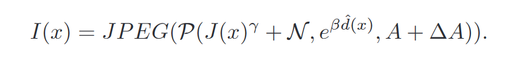

# RIDCP：通过高质量的码本先验提高真实图像去雾性能

## 摘要

本文从合成更真实的有雾图像和在网络中引入更健壮的先验知识这两个角度出发，提出了一种真实图像去雾方法。

1.  重新思考真实雾天图像质量退化原理，提出了考虑不同退化类型的气象学通道。
2.  提出了基于高质量码本先验的真实图像去雾网络(RIDCP)。首先大规模高质量数据集上预训练一个VQGAN网络得到离散的码本，封装高质量的先验知识(HQPs)。使用先验知识替换雾霾带来的负面影响后，具有新型归一化特征对齐模块的解码器就能够有效利用高质量特征产生干净的结果。通过一个可控的匹配操作重新计算特征与高质量先验匹配时的距离。这样有利于找到更好的对应物。用户可以根据喜好调整去雾强度。

## 介绍

作者进一步根据VQGAN的特点和统计结果设计了独特的实数域自适应策略，提出了可控的高质量先验匹配操作，在推理阶段对输入特征和高质量先验之间的距离添加设计好的权重来取代最近邻匹配。权重是由一个可控参数和高质量先验活动的统计分布间隙决定。通过调节这个可控参数，我们就能够改变高质量先验活动的分布。通过最小化概率分布的库尔贝克-莱布勒散度来获得最优的参数值，这个值也可以直观的反应为图像增强的程度。

*   首次在真实图像去雾中使用高质量的码本先验，提出了可控的高质量先验匹配操作，来克服合成域和真实域之间的差距，并产生可调节的结果
*   重新制定了真实雾天图像退化模型，提出了气象学退化通道来模拟现实中拍摄的雾天图像

## 真实图像去雾的数据准备

要解决现实世界中的低级视觉任务，我们就重新设计数据生成流程。作者在合成用于训练去雾网络数据集时考虑可图像退化的各种因素，这些因素可以缓解合成数据和真实数据之间的差距。

雾霾图像的形成可以转换为如下数学公式：

*   γ∈\[ 1.5、3.0]为亮度调整因子，N为高斯噪声分布。这两个分量可以模拟出雾霾天气中频繁出现的恶劣光照条件。
*   作为退化模型中的关键参数，我们采用深度估计算法来估计深度图d (x)，并使用β∈\[ 0.3、1.5]来控制雾霾密度。
*   为了获得多样化的雾天图像，作者考虑了大气光的颜色偏差，通过一个三通道矢量 ΔA∈\[-0.025, 0.025]来实现。A的范围在\[0.25，1.0]范围内。
*   我们观察到去雾算法放大了JPEG伪影，应在去雾的同时去除此类伪影。JPEG ( · )表示对结果进行JPEG压缩。

## 方法

整体训练分为两个阶段

Referred in <a href="./学术论文笔记汇总-RYZ5DF37.md" rel="noopener noreferrer nofollow" zhref="zotero://note/u/RYZ5DF37/?ignore=1&#x26;line=-1" ztype="znotelink" class="internal-link">Workspace Note</a>
