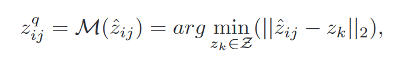

# RIDCP：通过高质量的码本先验提高真实图像去雾性能

## 摘要

本文从合成更真实的有雾图像和在网络中引入更健壮的先验知识这两个角度出发，提出了一种真实图像去雾方法。

1.  重新思考真实雾天图像质量退化原理，提出了考虑不同退化类型的气象学通道。
2.  提出了基于高质量码本先验的真实图像去雾网络(RIDCP)。首先大规模高质量数据集上预训练一个VQGAN网络得到离散的码本，封装高质量的先验知识(HQPs)。使用先验知识替换雾霾带来的负面影响后，具有新型归一化特征对齐模块的解码器就能够有效利用高质量特征产生干净的结果。通过一个可控的匹配操作重新计算特征与高质量先验匹配时的距离。这样有利于找到更好的对应物。用户可以根据喜好调整去雾强度。

## 介绍

作者进一步根据VQGAN的特点和统计结果设计了独特的实数域自适应策略，提出了可控的高质量先验匹配操作，在推理阶段对输入特征和高质量先验之间的距离添加设计好的权重来取代最近邻匹配。权重是由一个可控参数和高质量先验活动的统计分布间隙决定。通过调节这个可控参数，我们就能够改变高质量先验活动的分布。通过最小化概率分布的库尔贝克-莱布勒散度来获得最优的参数值，这个值也可以直观的反应为图像增强的程度。

*   首次在真实图像去雾中使用高质量的码本先验，提出了可控的高质量先验匹配操作，来克服合成域和真实域之间的差距，并产生可调节的结果
*   重新制定了真实雾天图像退化模型，提出了气象学退化通道来模拟现实中拍摄的雾天图像

## 相关工作

早期人们根据经验总结提出了大气散射模型，该模型能够估计图像中雾霾的生成状况。这时候人们就尝试估计大气散射模型中的参数来进行单幅图像去雾，但是这些基于经验观测得到的模型很难在不同场景中表现的很好。最明显的例子就是DCP，它在天空区域就是无法工作的。

随着深度学习的发展，利用数据驱动训练模型来去除雾霾的方法得到了广泛关注，许多研究开始采用卷积神经网络来估计大气散射模型中的参数，为了避免参数估计过程中的累积误差，人们就提出了端到端的网络，不再分”两步走“，由有雾图像直接估计生成无雾图像。这些方法在合成数据集上取得了优异的性能，但是在真实数据集上的表现却有待提高。

最近一些工作开始关注真实图像的去雾。其中一种路线就是利用生成对抗网络生成一种符合真实雾霾规律的雾霾图像，D4 就能够估计有雾图像的场景深度，生成不同雾霾浓度的有雾图像用做去雾模型的训练。但是生成对抗网络生成的结果容易产生伪影，这对下一步训练模型是有害的。另一种路线是通过损失函数或者网络架构引入有关去雾的先验知识。然而直接使用手工塑造的先验知识无法避免一些缺陷。本方法就利用数据生成流水线和潜在的高质量先验来可恶真实图像去雾方法现有的缺陷。

## 真实图像去雾的数据准备

要解决现实世界中的低级视觉任务，我们就重新设计数据生成流程。作者在合成用于训练去雾网络数据集时考虑可图像退化的各种因素，这些因素可以缓解合成数据和真实数据之间的差距。

雾霾图像的形成可以转换为如下数学公式：

*   γ∈\[ 1.5、3.0]为亮度调整因子，N为高斯噪声分布。这两个分量可以模拟出雾霾天气中频繁出现的恶劣光照条件。
*   作为退化模型中的关键参数，我们采用深度估计算法来估计深度图d (x)，并使用β∈\[ 0.3、1.5]来控制雾霾密度。
*   为了获得多样化的雾天图像，作者考虑了大气光的颜色偏差，通过一个三通道矢量 ΔA∈\[-0.025, 0.025]来实现。A的范围在\[0.25，1.0]范围内。
*   我们观察到去雾算法放大了JPEG伪影，应在去雾的同时去除此类伪影。JPEG ( · )表示对结果进行JPEG压缩。

## 方法

核心思想是采用离散码本，将高质量先验引入到去雾网络中。整体训练分为两个阶段。

第一阶段，在一些高质量数据上预训练一个VQGAN，道德带有高质量先验的潜在离散码本和对一个的解码器。

第二个阶段，基于预训练的VQGAN的RIDCP在合成流水线中生成的雾天图像中进行训练。为了帮助网络找到更精确的代码，我们在高质量图像上提出了一种基于代码激活分布的可控调整特征匹配策略

### 高质量码本

VQGAN：给定一个高质量的图像块作为VQGAN的编码器的输入，对应输出潜在特征，然后将潜在特征中的每个像素匹配到码本中最近的高质量先验上。从而的到了一个离散的数据表示。

为了了解码本中的高质量先验的潜力。作者对预训练后的VQGAN重建的图像结果进行了观察。实验证明该模型能够去除薄雾并且恢复图像颜色。作者认为以匹配的方式使用高质量先验能够替换退化的特征，从而帮助其跳转到高质量的域中。但是该去雾能力难以匹配到正确的代码，由于矢量量化阶段信息缺失，会产生一些失真纹理。下一步工作是训练一个能够帮助先验匹配的编码器E和一个能够利用HQPs重建特征的解码器G。
