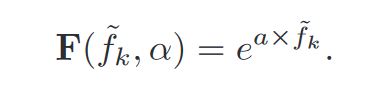

---
tag:
    - 有代码
    - 待阅
    - ⭐⭐⭐
    - CVPR2023
title: 'RIDCP: Revitalizing Real Image Dehazing via High-Quality Codebook Priors'
category:
    - 图像去雾
version: 5461
libraryID: 1
itemKey: TQVA27NJ

---
# RIDCP：通过高质量的码本先验提高真实图像去雾性能

## 摘要

本文从合成更真实的有雾图像和在网络中引入更健壮的先验知识这两个角度出发，提出了一种真实图像去雾方法。

1.  重新思考真实雾天图像质量退化原理，提出了考虑不同退化类型的气象学通道。
2.  提出了基于高质量码本先验的真实图像去雾网络(RIDCP)。首先大规模高质量数据集上预训练一个VQGAN网络得到离散的码本，封装高质量的先验知识(HQPs)。使用先验知识替换雾霾带来的负面影响后，具有新型归一化特征对齐模块的解码器就能够有效利用高质量特征产生干净的结果。通过一个可控的匹配操作重新计算特征与高质量先验匹配时的距离。这样有利于找到更好的对应物。用户可以根据喜好调整去雾强度。

## 介绍

作者进一步根据VQGAN的特点和统计结果设计了独特的实数域自适应策略，提出了可控的高质量先验匹配操作，在推理阶段对输入特征和高质量先验之间的距离添加设计好的权重来取代最近邻匹配。权重是由一个可控参数和高质量先验活动的统计分布间隙决定。通过调节这个可控参数，我们就能够改变高质量先验活动的分布。通过最小化概率分布的库尔贝克-莱布勒散度来获得最优的参数值，这个值也可以直观的反应为图像增强的程度。

*   首次在真实图像去雾中使用高质量的码本先验，提出了可控的高质量先验匹配操作，来克服合成域和真实域之间的差距，并产生可调节的结果
*   重新制定了真实雾天图像退化模型，提出了气象学退化通道来模拟现实中拍摄的雾天图像

## 相关工作

早期人们根据经验总结提出了大气散射模型，该模型能够估计图像中雾霾的生成状况。这时候人们就尝试估计大气散射模型中的参数来进行单幅图像去雾，但是这些基于经验观测得到的模型很难在不同场景中表现的很好。最明显的例子就是DCP，它在天空区域就是无法工作的。

随着深度学习的发展，利用数据驱动训练模型来去除雾霾的方法得到了广泛关注，许多研究开始采用卷积神经网络来估计大气散射模型中的参数，为了避免参数估计过程中的累积误差，人们就提出了端到端的网络，不再分”两步走“，由有雾图像直接估计生成无雾图像。这些方法在合成数据集上取得了优异的性能，但是在真实数据集上的表现却有待提高。

最近一些工作开始关注真实图像的去雾。其中一种路线就是利用生成对抗网络生成一种符合真实雾霾规律的雾霾图像，D4 就能够估计有雾图像的场景深度，生成不同雾霾浓度的有雾图像用做去雾模型的训练。但是生成对抗网络生成的结果容易产生伪影，这对下一步训练模型是有害的。另一种路线是通过损失函数或者网络架构引入有关去雾的先验知识。然而直接使用手工塑造的先验知识无法避免一些缺陷。本方法就利用数据生成流水线和潜在的高质量先验来可恶真实图像去雾方法现有的缺陷。

## 真实图像去雾的数据准备

要解决现实世界中的低级视觉任务，我们就重新设计数据生成流程。作者在合成用于训练去雾网络数据集时考虑可图像退化的各种因素，这些因素可以缓解合成数据和真实数据之间的差距。

雾霾图像的形成可以转换为如下数学公式：

*   γ∈\[ 1.5、3.0]为亮度调整因子，N为高斯噪声分布。这两个分量可以模拟出雾霾天气中频繁出现的恶劣光照条件。
*   作为退化模型中的关键参数，我们采用深度估计算法来估计深度图d (x)，并使用β∈\[ 0.3、1.5]来控制雾霾密度。
*   为了获得多样化的雾天图像，作者考虑了大气光的颜色偏差，通过一个三通道矢量 ΔA∈\[-0.025, 0.025]来实现。A的范围在\[0.25，1.0]范围内。
*   我们观察到去雾算法放大了JPEG伪影，应在去雾的同时去除此类伪影。JPEG ( · )表示对结果进行JPEG压缩。

## 方法

核心思想是采用离散码本，将高质量先验引入到去雾网络中。整体训练分为两个阶段。

第一阶段，在一些高质量数据上预训练一个VQGAN，道德带有高质量先验的潜在离散码本和对一个的解码器。

第二个阶段，基于预训练的VQGAN的RIDCP在合成流水线中生成的雾天图像中进行训练。为了帮助网络找到更精确的代码，我们在高质量图像上提出了一种基于代码激活分布的可控调整特征匹配策略

### 高质量码本

VQGAN：给定一个高质量的图像块作为VQGAN的编码器的输入，对应输出潜在特征，然后将潜在特征中的每个像素匹配到码本中最近的高质量先验上。从而的到了一个离散的数据表示。

为了了解码本中的高质量先验的潜力。作者对预训练后的VQGAN重建的图像结果进行了观察。实验证明该模型能够去除薄雾并且恢复图像颜色。作者认为以匹配的方式使用高质量先验能够替换退化的特征，从而帮助其跳转到高质量的域中。但是该去雾能力难以匹配到正确的代码，由于矢量量化阶段信息缺失，会产生一些失真纹理。下一步工作是训练一个能够帮助先验匹配的编码器E和一个能够利用HQPs重建特征的解码器G。

### 基于特征匹配的图像去雾

随后我们将图像去雾分解为两个子任务。一是将编码器输出的离散特征匹配到码本中的正确编码；二是去除纹理失真。

#### 用于匹配高质量先验的编码器

借鉴SwinIR在图像复原领域的强大的特征提取能力来设计编码器。其中浅层特征是由残差层和四倍下采样特征组成。随后为用作特征提取的4个残差Swin Transformer块RSTB。

> 
>
> 
>
> 其中残差Swin Transformer块（RSTB）如图所示，内部由Swin Transformer Layer（STL）组成。而Neighborhood Attention Transformer已经在图像分类和下游视觉任务(包括目标检测和语义分割)中被证明有效。注意到STL和NAT block之间只有一个区别，那就是NAT block将MSA (Multi-head Self Attention) 替换为了NA（Neighborhood Attention）那么我们直接将STL替换为NAT block，能否提高模型性能？

#### 解码器

提出了归一化特征对齐(Normalized Feature Alignment，NFA)来帮助解码器解码离散特征。首先由于离散的向量带来的信息损失会降低结果的精准度。本文解决方案就是在高质量先验匹配之前通过特征拟合来消除信息损失。具体的做法就是在特征的第i层使用可变形卷积将来自解码器Gvq的特征和解码器G的特征对齐。

### 可控的高质量先验匹配操作

因为合成数据和真实数据之间的领域差距，在个别真实图像中会存在颜色饱和度较低的现象，因为这样的差距，模型就难以找到离散变量对应的码本，也就是对应的高质量先验。从而难以生成生动的结果。为了验证遮挡合成数据和真实数据之间存在的领域差距，作者做出了如下实验：随机拍摄200张高质量图像作为预训练的VQGAN的输入，计算码本中每个编码的激活频率，随后将有雾图像送到去雾网络中计算激活频率，实验结果证明具有明显的分布偏移

这证明了缩小合成数据域和真实数据域差距的域自适应和域迁移仍有必要的用处，而高质量先验在去雾网络中还未被充分利用。

### 通过重新计算距离来实现可以控制的匹配

当遇到真实的有雾图像时，去雾的一个关键环节就是匹配到更适合的高质量先验。影响高质量先验匹配情况的因素有两个，一个是编码器输出的离散向量，另一个是匹配操作。

在没有参考图像的情况下很难重新训练编码器获得更加拟合先验的编码器，因此我们可以从匹配操作的精确度入手。通过在匹配阶段分配不同的权重来重新计算距离。

其中F函数是根据频率差生成的权重函数，通过参数α。

1.  较高的fk意味着较低的激活，因此F和fk单调，从而两者趋势一致
2.  F( 0 , α)≡1，使得在清晰和模糊数据上具有相同频率的HQPs不被调整。
3.  调节程度可由α单调控制

因此F这里我们选择使用指数函数：

### 推荐的值α

最终的目标是找到一个合适的α使得网络适应真实的域，我们可以使用

计算得到<a href="zotero://open-pdf/library/items/CZG79VXE?page=5">“α =21.25”</a> (<a href="zotero://select/library/items/BJNHXL93">Wu 等, 2023, p. 22286</a>)

## 扩展：VQ-VAE——首个提出码本机制的生成模型

[轻松理解 VQ-VAE：首个提出 codebook 机制的生成模型 - 知乎 (zhihu.com)](https://zhuanlan.zhihu.com/p/633744455)

VQ-VAE利用码本机制将图像编码成离散向量。为什么要这样做？首先要了解自编码器（Autoencoder，AE），自编码器是一类能够把图片压缩成较短向量的生成模型，模型包含一个解码器和编码器。在训练时，输入图像会被编码为一个较短的向量，在被解码为另一幅长得差不多的图像，网络学习的目标就是让重建出来的图像和原图像尽可能相似。解码器可以把向量解码成图像，换一个角度来说，解码器就是一个图像生成模型，但是自编码器中，编码器编码出来的向量空间是不完整的，也就是说，解码器值认识经过编码器编码出来的向量，而不认识其他向量。如果把自己随机生成的向量输入给解码器，解码器不能生成有意义的图片，因此自编码器不能够随机生成图片，只能起到图像压缩的作用。

但是只要自编码器的编码空间比较规整，符合某个简单的数学分布。那我们就可以从这个分布中随机采样。再让解码器根据这个向量来完成随机图片生成，VAE就是改进版的AE（自编码器）。VAE采用一些巧妙的方法约束编码向量，是的编码向量满足标准的正太分布，这样训练出来的编码器-解码器对中的解码器不仅能够认识编码器编码的向量，还可以认识来自其他标准正态分布的向量。训练完成之后，我们就可以扔掉编码器，用来自标准正太分布的随机向量和解码器完成随机图像的生成了。但是VAE编码出来的是连续向量，生成的图片都不太好看，VQ-VAE认为，VAE之所以生成的图片质量不高，是因为图片被编码成了连续向量，但是把图片编码成离散向量会更加自然。

但是神经网络会默认输入满足一个连续的分布，而不善于处理离散的向量。为了解决这一问题，学者们借鉴了自然语言处理中对单词的处理方法。也就是增加一个词嵌入层，把每个输入的单词映射到一个独一无二的连续向量上。那么这个嵌入层就叫做码本（cookbook）

VQ-VAE的整个工作流程如下：

1.  训练VQ-VAE的编码器和解码器，使得VQ-VAE能够把图像编码成离散向量，也能够把离散的向量解码为图像
2.  训练PixelCNN，让他学习如何生成离散向量
3.  随机采样时，先用PixelCNN采样出离散向量，然后再用VQ-VAE把离散向量解码成最终图像。

### VQ-VAE 设计细节

#### 输出离散编码

编码器解码器架构中编码器会将编码输入图片为张量，我们如果想要获得编码器输出的离散编码，则需要通过一个概率分布计算来获得离散编码，但是紧接着在输入解码器前，又需要将离散编码转回张量。

而VQ-VAE使用了最近邻算法来关联编码器的输出和解码器的输入。首先计算向量和嵌入空间k个向量每个向量的距离，再对距离数组取argmin，求出最近的下标，最后用下标去嵌入空间里取向量。

#### 优化编码器和解码器

编码器和解码器整体优化目标就是原图像和目标图像的重建误差

#### 优化嵌入空间

略

VQ-VAE是一个把图像编码成离散向量的图像压缩模型，为了让神经网络理解离散编码，VQ-VAE借鉴了NLP思想，让每个离散编码值对应一个嵌入，（也就是离散变量对应的唯一连续变量值之间的对应关系层）所有嵌入都存放在一个嵌入空间，称为码本。VQ-VAE编码器输出是若干个假嵌入，也就是说，这个编码器输出的离散变量和连续变量值之间的对应关系，并不是真实图像应该具有的离散变量和连续变量值之间的对应关系，这个关系是编码器本次输入得到的。换言之，假嵌入是编码器本次输入得到的结果。而在嵌入空间内这些假嵌入会被替换为嵌入空间内的真嵌入。输入进编码器中。这些真嵌入也可以称作是编码器通过大量训练得到的高质量码本。

VQ-VAE的优化目标分为两部分，重建误差和嵌入空间误差，重建误差为输入图片和重建图片之间的均方误差。为了让梯度反向传播，也就是从解码器传回编码器，作者使用了一种巧妙的停止梯度算子，让正向传播和反向传播按照不同的方式计算，嵌入空间的误差为真嵌入和编码器输出的假嵌入之间的均方误差。为了让嵌入和编码器用不同的速度优化，作者使用了停止梯度算子，把嵌入的更新和编码器的更新分开计算。

训练完成后，为了实现随机图像的生成，需要对VQ-VAE的离散分布进行采样，再把采样出来的离散变量对应的嵌入输入进解码器。而离散变量的获取是一个关键。VQ-VAE使用了Pixel来采样离散分布。但是这个离散分布并不只能使用PixelCNN，当然也可以采用diffusion扩散模型，Transformer等。采用diffusion扩散模型的典型例子就是Stable Diffusion，采用Transformer的例子就是VQGAN。

## VQGAN

VQGAN特点是使用码本来离散编码模型的获取的特征，并且使用Transformer作为编码的生成工具。而VQ-GAN通过引入对抗监督进行离散向量的学习，也就是采用PatchGAN的判别器。进一步提高了最终生成结果的质量。

### 为什么要采用离散向量编码特征

在VQVAE中的VQ（vector quatization，向量离散化），编码出来的每一维的特征都是离散的数值。这样做是符合自然界的一些模态的。因为自然界中的事物直接的差别是很大的。不是连续的变化的。一张输入的RGB三通道图片，通过编码器后会得到中间特征，普通的编码器会将这些特征直接送到解码器中重建，而自编码器VQVAE会将特征进一步离散化编码。具体的做法就是预先生成一个离散数值的码本，在中间特征中每一个编码位置中寻找距离离散码本最近的值，生成具有相同维度的变量。进一步离散编码的过程表示为：

这样一来就可以将离散化的特征使用解码器进行解码。

在训练过程中，模型会逐步训练将输入图像训练的和高质量图像尽可能接近。整个训练需要同时进行三个子模块，分别是编码器、解码器、码本。其中自监督损失可定义为：

其中为重建损失（reconstruction loss），而 sg⁡[·] 为梯度终止操作（stop-gradient operation）。之所以要在E(x)和 zq 之间加入sg⁡[·]操作，是因为我们在这两个特征间进行了离散化转换，如果直接进行L2损失计算的话，会导致神经网络梯度不能回传。因此分别将两个特征的梯度终止，将zq的梯度直接复制到z^上，这两项损失分别训练了编码器和码本。

对于判别器来说，损失函数大致可以表示为

在VQGAN中，Transformer主要是用作编码生成器使用用来生成高分辨率图像。迁移到VQGAN中，可以理解为先预测一个码本中的一个值，在一步步的通过预测好的值推断下一个值。

具体的训练过程是先输入图片，经过编码器得到中间特征变量，在经过码本离散编码得到离散变量。之后为了训练Transformer，将离散变量平展，得到降低了维度的变量。随机将其中一部分的编码值替换为随机生成的相同维度的向量。也就是在特征中加入噪声。用来提高Transformer的泛化能力。

[v2-0ff3d5ed6cdce24603c2e58091e3341c\_b.webp (854×484) (zhimg.com)](https://pic1.zhimg.com/v2-0ff3d5ed6cdce24603c2e58091e3341c_b.webp)

VQGAN模型是需要经过两步训练的，第一步是通过自监督学习训练解码器编码器和码本。第二部在已经训练好的编码器和码本之上，将码本中的部分编码随机替换，然后使用Transformer重建这部分编码来提高模型的泛化能力。

## Stable Diffusion
