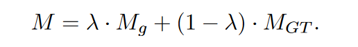
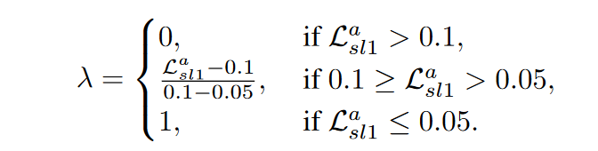
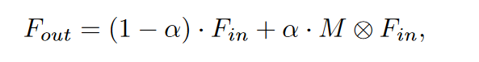
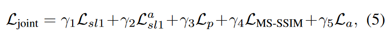

---
tag:
    - 有代码
    - SCANet
    - 待阅
    - ⭐⭐⭐
    - CVPR2023
title: 'SCANet: Self-Paced Semi-Curricular Attention Network for Non-Homogeneous Image Dehazing'
category:
    - 图像去雾
version: 4772
libraryID: 1
itemKey: ZD3RHTQW

---
# SCANet：用于非均匀图像去雾的自组织半课程注意力网络

## 摘要

非均匀雾霾会造成图像中的场景模糊、颜色失真、对比度降低以及其他模糊纹理细节的退化，但是现有的方法大都是去除均匀雾霾，难以有效处理非均匀的雾霾，主要难点在于如何准确感知雾霾在图像背景中的分布情况，并且高质量的重建雾霾密集区域的纹理细节。本文提出了一种自组织的半自注意力网络，用于非均匀图像去雾，聚焦于图像中被雾霾遮挡的区域。本文网络主要有注意力生成网络和场景重建网络组成，利用图像的亮度差异对注意力图进行限制。并且引入了自组织的半课程学习策略减少训练早期的学习歧义。

## 介绍

*   提出了一种能够学习非均匀雾霾和图像背景之间复杂交互特征的注意力网络，采用了一种注意力生成和场景重建的模式，专注于非均匀雾霾
*   为了增强亮度差异大的区域去雾效果，引入了自组织半课程学习的注意力图生成策略，该方法加快了模型参数收敛。减少了训练早期多目标预测引起的学习歧义

## 模型结构

### 注意力生成网络

该网络模块由多个双注意力基本单元组成，用于生成注意力特征图，特征图依次进行通道注意力(channel attention，CA)和多尺度像素注意力(Multiscale pixel attention，MSPA)处理，得到输出特征图。

通道注意力包含两个3 \* 3的卷积层，一个全局平均池化层，两个1 \* 1 卷积层和一个Sigmoid函数，通道注意力中每个通道的权重豆浆和输入特征图相乘。

多尺度像素注意力包含两个3 \* 3卷积层，3个不同扩张比率的扩张卷积层（扩张比分别为3 5 7），两个1 \* 1卷积层和一个sigmoid函数。为了提高对雾霾空间分布的感知，作者并行使用了三个扩张卷积来获取多个感受野的特征信息。最后，使用7 \* 7的卷积层和sigmoid函数还获得注意力图

### 场景重建网络

是一个编码器解码器网络，用于重建无雾图像。首先该网络采用两个步长为2的3 \* 3 卷积层来提取4倍下采样后的特征。然后使用多个残差块和两个可变形卷积来学习低分辨率中的模糊特征。可变形卷积可以通过使用偏移量来调整内核形状来专注于感兴趣的特征。最后，使用步幅为2的两个转置卷积层将特征恢复到原始分辨率。通过一个尾部块的处理产生无雾图像。该尾部块包含一个反射填充、一个7 \* 7的卷积层和一个tanh函数。

## 自组织半课程注意力

在非均匀雾霾图像的去雾过程中，注意力机制可以使网络更加灵活的关注雾霾特征，用来重建高质量的无雾图像。但是注意力图的生成过程往往是无监督的，这会导致低重要性的区域被赋予过高的权重，从而影响去雾结果。根据作者的观察，非均匀的雾霾能够显著增加雾霾遮挡区域的亮度，除天空区域。理论上讲，更多关注亮度变化明显的区域的图像去雾，可以避免过度去雾造成的问题。因此作者将图像变换到YCbCr颜色空间，计算基于Y通道的亮度偏差作为注意力图的真值。

注意到多目标预测任务（这里的多目标指的是获得去雾后的图像和注意力图）往往会增加学习的模糊性，为了让模型更好收敛，作者采用自组织半课程学习册罗，由易到难。在训练时，将注意力生成网络生成的注意力图和真实无雾图像进行融合生成最终的注意力图。这里我们对融合的比例做出一些调整。

该参数可以通过注意力图的损失函数进行动态调整

在得到注意力图M后，我们通过一个可学习的参数α对特征图进行自适应加权。

## 损失函数

主要由平滑L1损失(包括Lsl1和La sl1)、多尺度结构相似性( MS-SSIM )损失LMS - SSIM、感知损失Lp和对抗损失La组成

作者在取值1，0.3，0.01，0.5和0.0005时性能最好
