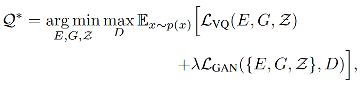

---
tag:
    - 'Computer Science - Computer Vision and Pattern Recognition'
    - VQGAN
title: 'Taming Transformers for High-Resolution Image Synthesis'
category:
    - 图像增强
version: 5804
libraryID: 1
itemKey: NYSYEZU2

---
# VQ-GAN

Comment: Changelog can be found in the supplementary

## 介绍

为了使用Transformer进行图像合成，需要将图像的每个部分用序列的形式表示出来。表示的形式不能是单个像素这样具体的值，而是图像之间更加抽象更加通用的特征，那么我们就可以使用一种离散的编码字典来表示，使任何的图像都可以由编码字典中的某些项来表示。进而我们用码本中的下标来表示。

首先由编码器和解码器组成的卷积网络，他们共同学习如何用离散的编码来表示图像。

离散的编码——也就是码本，数学表示为

通过离散化的特征输入解码器获得处理后的图像zq通过编码器和后续的逐元素离散的函数来逼近和他最接近的码本元素。

其中第二步操作可以这样表示

zk表示的是码本中的某个编码，zij表示的是编码器输出的特征经过离散后的值。

经过网络重建后的输出和初始的输入之间的关系就为

先经过编码器E，在经过离散化q，最后经过解码器G输出重建图像。

而离散操作，是无法通过梯度进行反向传播的，因为该操作不可微分。因此梯度在反向传播期间只是简单的从解码器复制到了编码器。这样模型就可以通过损失函数进行端到端的训练。

模型整体损失函数如下

其中图像的重建损失为（原图像和经过神经网络重建后图像的差）sg\[·]表示停止梯度stop-gradient。

后两个是编码器输出E(x)和离散向量zq之间产生的离散化损失。

## 通过模型学习来建立一个码本

使用Transformer将图像表示为潜在空间的分布问题，这就需要我们将图像语义压缩并通过学习来建立一个语义丰富的码本。

VQGAN在提高压缩率的同时仍然能够保持很好的感知质量。

具体来说是通过一个判别器和感知损失来实现的。

将图像重建损失替换为感知损失，引入基于图块（Transformer）的判别器D来区分真实图像和重建图像。

寻找最优的语义压缩模型的方法就是

其中的权重为

Lrec为感知重建损失

∇GL \[·]为解码器最后一层输入的梯度。

<a href="zotero://open-pdf/library/items/Z57D2RNH?page=4">“δ = 10−6”</a> 为了数值稳定。

为了聚合上下文信息。单个注意力层应用在最低分辨率上，减少了code编码展开时的序列长度。

## 使用Transformer来学习图像的组成

在有了编码器和解码器之后，我们可以用码本中编码的下标来来表示图像。一个图像离散后的编码是通过

和码本中一连串的下标

这种下表是通过将码本中的每一个编码code替换为其在码本中的索引（下标）得到的。

我们通过这些下标很容易就能找到码本中对应的编码code。然后将其恢复为编码code并解码为图像。

这些下标其实也是用连续的内存空间存储的，他们在计算机上使用数组去存储的。

Transformer用于下标的分布情况？什么鬼在已知一些下标的时候，并且这些指标的位置都\<i，那么我们可以据此来预测下标si的分布情况。

也就是transformer会学习去根据已知的下标，去预测下一个下标可能的分布情况。

那么他预测的效果如何，通过这样方式来评判他预测效果。也就是直接最大化对数的估计可能性来确定Transformer的估计损失

在许多图像生成任务中，用户需要给出一些额外的信息来控制如何生成图像。这个信息可以是描述这副图像的一个标签，也可以是另一幅图像。这些任务的目标是在给定了信息c后学习下标序列s存在的可能性。

如果这个信息c具有空间范围。我们可以学习另一个VQGAN，用之前获得的码本来重新获得一个索引表示。由于Transformer自回归的结构，我们可以将r就看作s，并且计算r存在的概率。

> 也就是说，我们在得到码本之后，之后进行图像重建获得的离散化特征就直接可以看作和码本内编码同等类型的东西。然后从码本中寻找匹配项。

## 生成高分辨率图像
