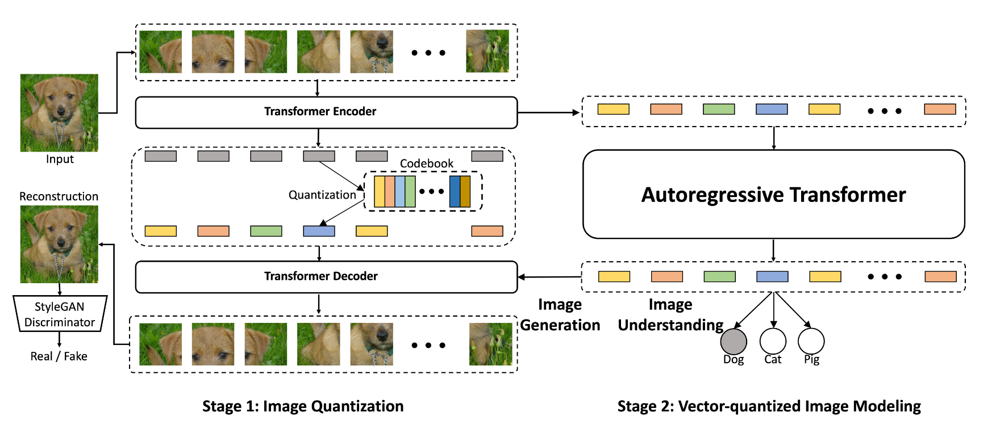
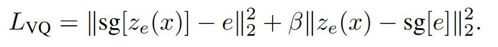
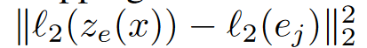
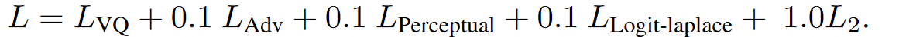
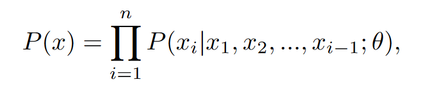
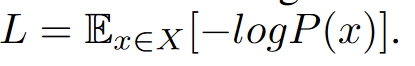

---
tag:
    - Vit-VQGAN
title: 'VECTOR-QUANTIZED IMAGE MODELING WITH IM- PROVED VQGAN'
category:
    - 图像增强
version: 5918
libraryID: 1
itemKey: 9ZXTUB4P

---
# ViT-VQGAN

## 摘要

通过向量离散化的图像建模方法，包含预训练的Transformer来预测图像token。这些离散的图像token使用基于Vision Transformer的ViT-VQGAN来进行编码。本文工作主要是对VQGAN在架构到码本学习上提出了多种改进。

## 介绍

上述的向量离散化的图像建模方法（Vector-quantized Image Modeling，VIM），需要两个阶段的处理：

1.  图像量化。给定一幅分辨率为256 × 256的图像，我们基于VisionTransformer的VQGAN将其编码为32 × 32的离散隐码，其中码本大小为8192。
2.  向量离散化的图像建模。通过一个Transformer模型，自回归预测上述的32 × 32总共1024张的的离散隐码（也叫做Transformer的token）。在没有图像监督的情况下，或者无条件生成图像的情况。通过仅有解码器的Transformer来预测下一个图像token（离散隐码）。

在使用VIM提高图像生成和理解的关键就是设计一个在计算效率和图像重建质量上都不错的图像离散化方法（图像量化器）。我们设计了这几个指标来对图像量化器的效果进行评价。

## 本文方法

### ViT - VQGAN

ViT - VQGAN的编码器首先将8 × 8个互不重叠的图像块映射成图像令牌，然后用Transformer块将一幅256 × 256分辨率的图像编码成32 × 32 = 1024个令牌序列。解码器执行逆运算，将每个潜变量图像令牌映射回8 × 8的图像块，并将其重新组合成一个256 × 256的图像(见图1)。

在Transformer块的输出端，我们应用了一个两层的前馈网络，中间有一个tanh激活层。在ViT - VQGAN编码器或解码器的输出端不施加任何激活。我们发现这种简单的方法可以得到高质量的重建结果，并且没有任何明显的网格伪影。

### 码本学习

VQVAEs 通常由于码本初始化较差而导致码本使用率较低。因此训练过程中码本中有不少编码未被使用。因此码本中有效的编码数量较少，导致第一阶段图像量化器训练得到的图像重建效果变差，而第二阶段图像合成得到的多样性变差。

因此VQGAN依赖top k 和top p采样使用码本编码大小为1024，来获得最佳的效果。本文提出了两个改进能够在增加码本编码数量为8192时还能够显著提高码本中编码的利用率。在图像合成过程中，我们在没有top - k和top - p启发式的情况下进行了温度为1.0的简单采样。（不懂）

向量离散化的训练目标定义如下：

**将编码因式分解** 我们引入了一个从编码器输出到低维隐变量空间的线性投影，用于码本索引查找(例如,从768维向量减少到每码32维或8维向量)，并发现它可以立即提高码本的使用率。因子分解可以看作是解耦的编码查找和编码嵌入：我们在一个低维的查找空间上查找输入编码的最接近的变量，然后将匹配的隐码投影到高维的嵌入空间。我们的实验表明，将查找空间的维度从256维降低到32维，可以持续地提高重建质量。

**L2正则化的编码** 编码后的隐变量ze ( x )和码本隐变量e进行了L2归一化。码本编码由正态分布初始化。通过将所有隐变量映射到球面上，L2-normalized潜在变量演化为ze ( x )和e之间两个向量的余弦相似度，进一步提高了训练稳定性和重建质量。

## ViT-VQGAN训练损失

在VGG网络的基础上使用了logit-laplace损失、l2损失、感知损失。在StyleGAN判别器上使用了GAN损失。通过超参数看来配置这几项损失所占权重。以优化图像重建质量、码本使用、FID和Inception Score。

logit - Laplace损失可以看作是归一化的L1损失，它假设像素级别的噪声是拉普拉斯分布，而L2损失假设噪声是高斯分布。

我们发现logit - Laplace损失对码本使用有贡献，而L2损失和知觉损失对FID有显著贡献。

最终确定损失函数为

对于基于VGG的感知损失，VGG网络是通过有监督的分类损失预训练得到的，因此这种监督带来的影响可能会对第二阶段产生作用，因此感知损失旨在预测无条件和有条件的图像合成时使用。在这时会使用经过感知损失训练的ViT-VQGAN量化器。

## 向量量化图像建模

通过ViT-VQGAN图像被编码成离散的潜在编码下标。第二阶段我们使用仅有解码器的Transformer对图像数据的分布进行自回归建模：

θ是可以调节的权重，训练的目标是最小化L的负对数似然

这里所采用的Transformer结构如下：

首先在每个位置将离散的图像token的下标和一个可以相加且可以学习的2D位置嵌入层一起嵌入到一个可以学习的嵌入空间中。两个嵌入维度都和模型的维度相同。然后将Transformer块的堆栈应用于整个序列中具有因果注意力的输入。在所有残差、激活和注意力输出中使用0.1的Dropout比率。在所有Transformer块的最后一层，我们应用了一个额外的层归一化。

## 图像合成

通过一个预训练的生成式Transformer模型，从输出的softmax分布中逐个采样来实现无条件的图像合成。然后将图像token输入到解码器中。

基于分类的条件生成会在图像token前放置分类id

## 无监督学习
