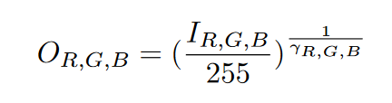
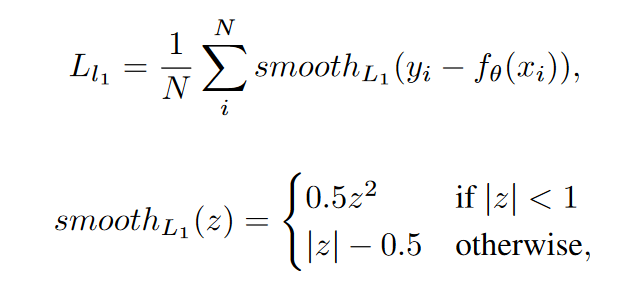
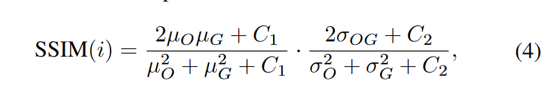
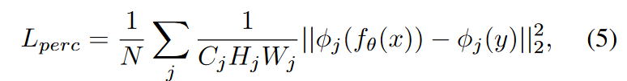
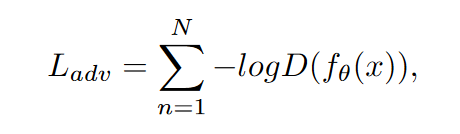
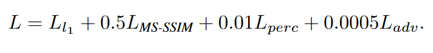

# 使用以数据为中心的Vision Transformer的非均匀去雾方法

## 摘要

非均匀的雾霾不符合均匀雾霾建模所需的假设，究其原因，是因为非均匀雾霾并不完全由图像场景深度决定。因此通常的去雾方法在去除非均匀雾霾上效果不佳。但是使用传统端到端方法训练需要大量非均匀雾天图像和其对应的清晰图像。但是目前数据集数据量有限，在其上面训练深度神经网络很容易遇到过拟合的问题。当然我们可以将所有可用的同类型数据集组合在一起形成一个更大的数据集，但是由于每个数据集之间有一些细微的差异，例如颜色差异、物体复杂性、拍摄所用的相机差别等。有论文证明直接组合多个数据集反而会降低去雾的结果指标。因此有必要设计一种数据预处理技术，来减少数据集之间的分布差距。这边论文提出了一种新的网络结构和一种新的数据预处理方法。具体的方法是，作者在增强的数据集上面应用RGB通道变换，并且将Transformer用于双分支网络中的骨干。第一个分支采用预训练的Swin Transformer作为编码器。而且拥有改进后的解码器和跳跃连接，能够提取雾天图像的多级特征。第二个分支使用RCAN建立，我们希望该分支能够提取不同于第一个分支的特征，因此没有采用下采样和上采样操作。最后，将两个分支结果进行融合输出去雾图像。

## 方法介绍

### 数据工程

比较了NH-HAZE20和21数据集后，作者发现两者之间有明显的颜色差异，这种差异会对训练造成干扰。因此作者目标就是尽量减少这个差异。并且将增强后的数据分布转移到目标数据分布。受到伽马校正的启发，本文对RGB三个通道分别进行校正。

γ 是伽马因子。

实现方法：

1.  计算数据集每个通道的平均像素强度
2.  对NH-Haze20、21的每个通道的所有像素施加具有唯一伽马值的变换。得到和NH-Haze23对应通道相似的均值和方差。

作者在雾天图像和清晰图像上都使用了这种预处理方法，通过这种方法，作者减小了不同数据集之间的与雾霾无关的差异，来避免训练中这些差异造成的干扰。

### 模型结构

如图所示，双分支模型框架已经成功应用于各种计算机视觉任务中。在作者的模型里，第一个分支初始化载入了预训练的权重来提取输入的相关特征。第二个分支是对第一个分支补充。

Swin Transformer的数据处理流程如下：

1.  首先通过块分割模块将原始图片输入分割成互不重叠的多个小块。

2.  通过线性嵌入层，会将图像块和其特征转换为原始RGB像素值的串联，称为token

    > 这个操作会造成特征图空间维度的长度急剧增加。随后的Swin Tranformer Block和解码器会逐渐降低特征图的空间维度，恢复到原本图像的水平维度大小

3.  每个阶段由一个线性嵌入曾和多个Swin Transformer Block组成

Swin Tranformer Block本身采用带MSA模块的循环移位实现高效的移位窗口划分？？能够降低特征图的空间维度，获得水平维度增加的特征图，这些模块构成了编码器部分。

对于解码器部分，通过跳跃连接、注意力块、上采样层逐渐恢复到和原图水平维度、空间维度一致的特征图。

最后的部分作者采用了具有残差通道注意力的数据拟合分支。由反射填充层，7 \* 7卷积层，TanH激活函数组成，融合了两个分支的输出，产生去雾图像

### 损失函数

**平滑L1损失**

\*\*MS-SSIM损失。\*\*基于人眼获取图像结构信息的假设。能够在图像质量感知标准上提供参考。

**感知损失**

采用预训练的VGG16来衡量感知损失。

**对抗损失**

由于基于像素的损失函数在小数据集上无法提供足够的监督，为了弥补上述损失的缺点，添加了对抗损失

**总损失**

## 实验结果

> 创新方向
>
> 1.  数据预处理方法
> 2.  模型结构
> 3.  损失函数等训练方法
