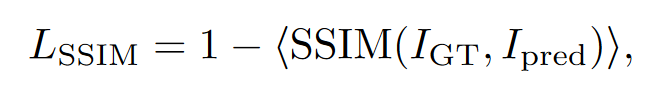

# 利用反投影金字塔网络对多种雾霾场景下的单幅图像进行去雾

Comment: 16 pages, 8 figures, to be published in Computer Vision ECCV 2020 Workshops

## 摘要

1.  提出了一种新型的生成对抗网络架构，即反向投影金字塔网络（BPPNet）
2.  架构基于UNet，融合了多个层次的复杂性学习，通过金字塔卷积保留了空间上下文和多个尺度的结构信息，共同作用域生成器，并且通过反向投影进行学习
3.  最少使用20张有雾和无雾的图像对，才不会出现过拟合现象

## 主要贡献

1.  引入金字塔卷积用于去雾，可以获得在多种尺度下的空间结构信息。
2.  将UNet用于图像去雾，这种网络架构能够使网络中的生成器在不损失局部和全局的结构信息的情况下学习雾的复杂特征，在网络过深的情况下也不易导致空间特征损失。
3.  端到端模型
4.  在IHaze、OHaze、DenseHaze、NH-Haze数据集上进行了大量实验

## 方法

整体模型基于生成对抗网络，生成器的作用是根据有雾图像生成无雾图像，判别器的作用是判断生成的无雾图像和真实无雾图像之间的差别。

### 生成器

生成器由两种模块串联而成，一是UNet块、二是金字塔卷积块

#### UNet块

**模型概述：**输入的图像为RGB格式，作者在这里将其转换成了YCrCb图像格式，然后转换为3通道的张量，作为UNet块的初始输入。

整个UNet块由4个UNet单元串联而成，上一个UNet的输出作为下一个UNet的输入。整个处理过程不改变输入的通道数。此外最终的输出会将每个UNet单元的输出在通道维度上叠起来，形成具有12个通道的张量，输出到下一个模块。

**模型分析：**

1.  为什么选择4个UNet串联？而不是一个、两个、五个、十个或者更多？

    单个UNet能够在一定程度上去雾，但是无法提取复杂的特征、生成具有精准细节的输出，解决问题的方法就是增加编码器的层数，但是随着层数的增加，输出的高度和宽度都会减小。因此采取串联和跳跃链接的方式，有助于学习复杂雾霾特征。

    然而UNet单元不能无限制的叠加，作者通过实验发现，输入图像在通过更多UNet单元处理后，后续生成的输出质量会越来越差，图像直方图会越来越窄，表明再增加更多的UNet单元将无法创造更多的价值。

    选择4个UNet表示了作者在去雾速度和精度上的权衡

2.  模型的特征提取情况分析。

    ？？？作者通过将模型中间输出可视化发现，前面UNet能够在较小尺度上反应出雾霾结构，靠后的UNet在较大尺度上反应出雾霾结构。每个UNet单元的输出，都？？？？？？？

**残留问题：**作者为何将输入转换为YCrCb图像格式？

如果使用RGB代替YCbCr进行训练，SSIM会有所下降。然而并不是所有数据集都是这样的。具体来说，对于Dense - Haze，YCbCr转换的结果略差于基于RGB的训练。因此，作者在Dense - Haze数据集使用RGB上进行训练。

#### 金字塔卷积块

UNet 块提供了全局和局部的结构信息，但其输出缺少针对不同大小雾霾的全局和局部结构信息。原因是不同尺度的结构信息并没有直接用于生成结构。为了克服这个问题，作者使用了金字塔卷积。

金字塔卷积是一个形象化的表达，他表示我们使用了许多不同大小的卷积核，我们可以将这些卷积核从上到下按照其大小排列，就可以画成类似金字塔的形状，因此称为金字塔卷积。

作者在该网络中采用了8个不同大小的卷积核，将UNet块的输出分别输入到这8个卷积核中，会将其通道数改变为16，改变然后将这些卷积核生成的8个输出再次叠在一块生成最终的128通道特征图。最后使用3\*3卷积层补零。

之所以使用8个不同大小的卷积核，是因为不同大小能够利用不同的空间尺度的结构信息，生成不同的输出。

奇数大小的核：假设中间特征图中的像素围绕输出像素对称，因为使用偶数大小的核会在图层上引入失真，这表明了利用输出像素周围特征的对称性的重要性

零填充：来保证边缘处的特征不丢失

### 判别器

### 损失函数

这里使用了MSE ( L2损失)、对抗损失Ladv、内容损失Lcon和结构相似性损失LSSIM的组合

LG表示生成器损失，LD表示判别器损失

## 实验结果

### 数据集

### 训练细节

optimizer: adam

lr: 0.001，损失趋于稳定时缓慢降低学习率到0.00001，判别器学习率维持不变（效果不好）

输入图像：根据数据集的不同随机裁剪为正方形图像，尺寸如下，然后使用Bicubic interpolation方法调整为512\*512，每次迭代（epoch）都是一次新的裁剪

*   NTIRE 和Dense-Haze 1024\*1024
*   I-Haze 1024\*1024
*   O-Haze 2048\*2048

### 训练结果

度量指标SSIM、RSNR。（在RGB空间中进行度量）
