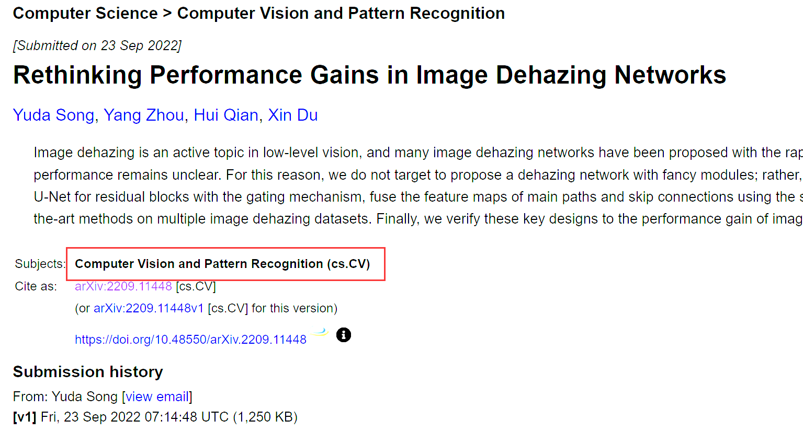
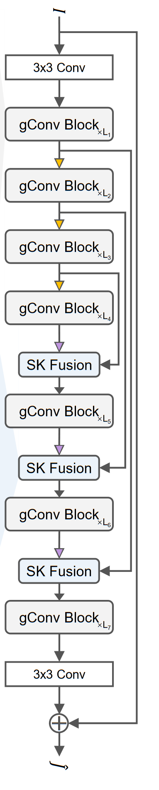
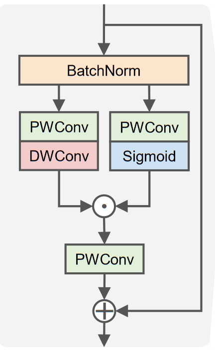
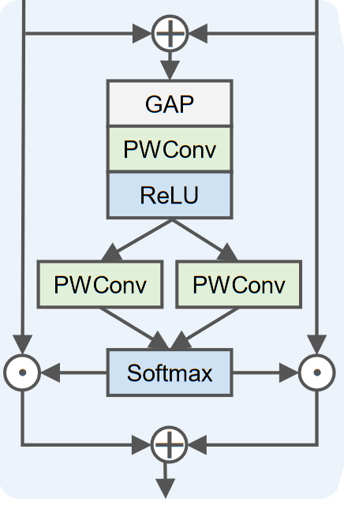

---
tag:
    - 有代码
    - gUnet
    - 已阅
title: 'Rethinking Performance Gains in Image Dehazing Networks'
category:
    - 图像去雾
version: 6014
libraryID: 1
itemKey: CLKBCLZ7

---
# 反思图像去雾网络中的性能增益（CVPR2022）

## 摘要

对图像去雾领域中流行的UNet进行小幅度的改动，以期望获得一个更紧凑的去雾网络模型。

具体来讲，就是通过门控机制将U - Net中的卷积块替换为残差块，使用选择性的卷积核融合主要特征图和具有跳跃连接特点的特征图，将这个模型叫做gUNet。

## 介绍

本文更注重于探索以往去雾网络的设计，从之前的网络中发现了两个具有显著效果的网络设计。第一种是GCANet和GridDehazeNet，它们都引入了提取多尺度信息，不再单独预测A和t ( x )，而是直接预测无雾图像或预测无雾图像与有雾图像之间的残差。第二种是FFA - Net，提出了引入像素注意力模块和通道注意力模块的深度网络。然而，这些修改只带来了有限的性能，却使网络变得更加复杂和难以部署。因此作者结合以往模型的优点，尝试设计出更好的模型。

具体来说，作者使用具有局部残差和全局残差的经典U - Net作为模型的基本架构来提取图像的多尺度信息。然后使用深度可分离卷积层来聚合空间信息并高效地转换特征。进一步将全局信息的提取分配给基于SK的模块，该模块动态地融合来自不同路径输入的特征图。最后，在卷积块中引入门控单元，这些门控单元作为像素注意力模块和非线性激活函数。作者提出了两个关键模块，即带有门控机制的残差块gConv块和带有通道注意力机制的融合模块SK Fusion层。作者将这样构建好的模型命名为gUNet，g表示gate，因为它是一个简单的带有门控的U - Net变体。

## 相关工作

*   DehazeNet、MSCNN，基于深度学习的图像去雾方法前驱，网络架构较浅，全局大气光仍然通过传统方法估计
*   DCPDN 使用两个子网络分别估计传输图和全局大气光。
*   AODNet 仅预测单一输出，仅使用极轻量级的骨干网络就能获得良好的去雾性能。
*   GridDehazeNet 提出了一种具有大量跳跃连接的网格状网络架构。更重要的是，它在性能相比之前更好的前提下提出了端到端图像去雾方法。
*   在此之后，图像去雾网络倾向于估计无雾图像或无雾图像与有雾图像之间的残差。目前，大多数基于深度学习的方法倾向于设计复杂的网络架构来提高网络的表达能力，有的引入注意力机制，有的引入多尺度特征。
*   最近，一些基于ViT（Vision Transformer）的去雾网络被提出，如DehazeFormer。然而，ViT远比CNN复杂，导致其部署存在相当大的阻碍。

与以往方法不同，本文作者并没有设计一个复杂的网络架构，而是根据前人的方法，仔细考虑性能和效果的平衡，提出了变化最小的U - Net变体，以方便部署。而且提出的方法也优于以前的方法，即使它看起来相当简单。

## gUNet

gUNet可以看作由7个阶段的UNet变体。它的每一个阶段都由一些gConv模块组成。gUNet没有采用U - Net中利用卷积层后级联的策略来融合跳跃连接和主路径。而是提出使用SK Fusion模块对来自不同路径的特征图进行动态融合。给定有雾图像和无雾图像，gUNet用来预测两者之间的差别（全局残差），然后通过L1损失逐步减小有雾图像和无雾图像的差别。

### 设计思路

首先是多尺度信息的提取，使用经典的U - Net作为基础架构，它产生不同大小的特征图，从而提取多尺度特征。然后，在卷积块中加入局部残差，在网络中加入全局残差。为了在不显著增加参数量和计算成本的情况下使网络更深，我们使用深度可分离卷积来聚合信息和高效地转换特征。

现在网络设计的关键是如何利用注意力机制来提高网络的表达能力。

在大气光散射模型中全局大气光<a href="zotero://open-pdf/library/items/TCA2V49B?page=2">“global atmospheric light”</a>A是共享的全局变量，而介质投射图<a href="zotero://open-pdf/library/items/TCA2V49B?page=2">“medium transmission map”</a> t(x)依赖于位置的局部变量。作者认为这两个变量与图像去雾强相关，去雾模型提取的大都是和这些相关的特征。

*   通道注意力：在FFA - Net中，通道注意力模块是唯一能够有效提取全局信息的模块。是因为该模块有效地提取了编码全局大气光A所需的信息，这也是FFA - Net发挥作用的原因之一。尽管通道注意力模块的计算开销较小，但其引入的参数量和延迟是不可忽略的。作者认为估计全局大气光A应该是一个简单的任务，因为有许多去雾方法分配大部分的计算资源来估计t (x)，但是使用轻量级的模块来估计A。因此作者仅将估计A的任务分配给基于SK融合模块，该模块动态融合来自不同路径的特征图。
*   像素注意力：该模块旨在使网络更加关注信息丰富的特征。而GLU中的门机制起到了类似的作用。为此作者在卷积块中引入门控机制，并使其充当像素注意力模块和非线性激活函数。

### gConv块

gConv主要基于gMLP和GLU，对于输入，首先经过批归一化处理，这种归一化方法使用在训练集上跟踪的统计量的指数移动平均值。它可以与相邻的线性层合并，更符合轻量级网络的要求。此外，批归一化没有层归一化的缺点，它打破了DehazeFormer中提到的空间相关性。产生的输出分别经过

1.  逐像素卷积和sigmoid激活函数
2.  逐像素卷积和深度卷积

然后用1作为2的门控信号，再送入另一个逐像素卷积，将其输出和gConv最开始的输入进行通道叠加。作为整个gConv层的输出。

这里作者仅仅依靠门机制来实现非线性的输出。相比之下，NAFNet使用了GLU 的双线性变体，作者使用了GLU 的原始版本。（这一点貌似没说明什么）

### SK融合层

SK融合模块接受两个输入，一个输入来自其主路径，另一个输入来自于先前gConv块跳跃连接的输出。两个输入先经过通道叠加输入的全局池化层中，随后输入到多层感知机MLP中，经过softmax激活函数分裂为两个输出，分别与最初的输入相乘，最后结果进行通道叠加算出SK融合模块最终的输出。

## 模型训练

### 训练优化措施

SyncBN。在Batch Norm的标准实现中，归一化是在每个GPU上单独进行的，这导致归一化批大小小于数据并行训练中的小批量。因此，我们使用Sync BN，它是Batch Norm的一种实现，可以使规范化的批次大小达到小批量。我们发现，在归一化批大小为16及更大时可以达到最好的性能，因此我们只在归一化批大小小于16时启用Sync BN。Sync BN由于在多个GPU之间共享均值和方差，引入了额外的开销。

Frozen BN（固定批归一化）是一个常数仿射变换，因为它使用了先前训练时计算的数量统计信息。一旦跟踪到的数量统计信息稳定，那么归一化层带来的优化收益就会消失，但是可以保持模型训练和测试阶段的结果一致性。由于FrozenBN的学习率较低，我们只在训练的最后几轮（epoch）启用FrozenBN，这个阶段就无需担心梯度爆炸问题。结果发现，在总训练轮数或归一化批次规模较小时，FrozenBN能显著提高模型性能。

混合精度训练。这种训练方法能够在训练过程中对部分层进行低精度训练，在不降低模型性能的前提下减少计算成本和内存占用。即使在一些高级视觉任务上，混合精度训练也能略微提高模型的准确度。我们启用混合精度训练来减少训练时间和增加mini批量大小。

慢启动。慢启动经常用于优化高级视觉任务。由于我们的初始学习率比较大，并且启用了混合精度训练，我们发现模型在训练过程中可能会产生NaN。为了降低崩溃的风险，我们应用了慢启动策略。

### 实现细节

\*\*模型规模：\*\*作者提出了4个 gUNet 变体(Tiny、 Small、 Basic、Deep)。从前往后模型规模逐渐增大，为了较简便的实现这种扩展性。作者将每级gConv块数设为{ M，M，M，2M，M，M }，通道数设为{ N，2N，4N，8N，4N，2N，N }，其中M为基块数，N为基通道数。所有变体的DWConv的宽度和卷积核大小k设置为相同，即N = 24和k = 5。gUNet的4个变体仅在网络深度上有所区别，我们将它们的基块编号M设置为{ 2，4，8，16 }。

\*\*设备：\*\*4卡 3090

\*\*图像预处理：\*\*随机裁剪为256\*256

\*\*训练轮数：\*\*考虑到不同的数据集具有不同的样本数，因此每轮训练样本数取一个中间值16384，总训练轮数设置为1000。刚开始的50轮训练为慢启动阶段，最后200轮训练为FrozenBN阶段。

\*\*mini批次数：\*\*受限于GPU内存，对于gUNet 的4个变体(Tiny、 Small、 Basic、Deep)，mini - batch大小分别设置为{ 128，128，64，32 }。对于gUNet - D，它的归一化批大小<16，因此启用了SyncBN。

\*\*学习率：\*\*基于线性缩放规则，对于gUNet 的4个变体(Tiny、 Small、 Basic、Deep)，设定初始学习率分别为{ 16，16，8，4 } × 10 -4。随后采用余弦退火策略，学习率从初始学习率逐渐降低到{ 16，16，8，4 } × 10 -6。

\*\*优化器：\*\*使用Adam W优化器( β1 = 0.9 , β2 = 0.999)

### 数据集

*   RESIDE-IN

    *   训练：ITS，13990个图像对
    *   测试：SOTS-indoor，500个图像对

*   RESIDE-OUT

    *   训练：OTS，313950个图像对
    *   测试：SOTS-outdoor，500个图像对

*   Haze4K 共计4000个图像对，其中3 000个用于训练，剩余1 000个用于测试。

*   RS-Haze 共计54000张图像对，其中51300张用于训练，其余2700张用于测试。
