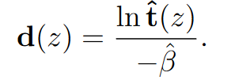
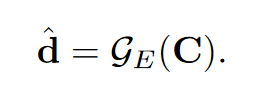
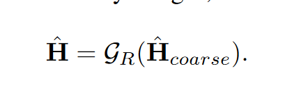
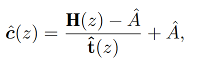
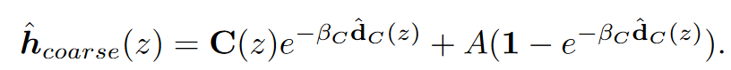

---
tag:
    - 有代码
    - ⭐⭐⭐
    - D4
    - CVPR2022
    - 非成对样本
    - 无监督
title: 'Self-augmented Unpaired Image Dehazing via Density and Depth Decomposition'
category:
    - 图像去雾
version: 6058
libraryID: 1
itemKey: IMI5ACAD

---
# 基于密度和深度分解的自增强未配对图像去雾

## 摘要

为了克服在合成数据集上训练去雾模型过拟合的问题，最近许多方法试图在未配对的数据上训练来尝试提高模型的泛化能力，但是大多忽略了真实世界雾霾的物理特性，也就是说雾霾的密度和场景深度。本文提出了一种自增强的去雾框架，通过将透射率图分解为密度和深度进行去雾，用于产生和去除雾霾。与仅仅估计透射率图或者估计无雾图像不同，该框架侧重于探索雾天和无雾图像中包含的散射系数和深度信息。在估计的场景深度下，作者的方法能够重新渲染不同不同厚度的雾霾图像。整个训练过程只需要未配对的有雾和无雾图像，但是能够成功从有雾图像中恢复出散射系数、深度图和无雾图像。

## 主要贡献

提出了非成对去雾框架，显式建模雾天场景的散射系数和深度图。缓解了现有非成对去雾方法中存在的不确定性问题。

空间动态雾霾厚度反应场景深度，作者的模型准备学习从雾霾图像中预测深度信息。在只有未配对的有雾和无雾图像下，训练模型从无雾图像中预测深度信息。

在估计场景深度的情况下，该模型可以改变散射系数生成不同厚度的雾天图像。

## 相关工作

CycleGAN是一个非成对图像转换框架，使用GAN损失强制图像在两个域之间进行转换，循环重构损失很好地保持了内容的一致性。对于图像去雾，基于CycleGAN通常包含一个去雾网络和添雾网络。分别从其对应的图像中预测无雾图像和有雾图像。

### 整体框架

D4框架主要有三个网络构成，去雾网络、深度估计网络、精练网络。

*   去雾网络：用于从雾天图像中估计透射图和散射系数。

雾天图像得到的深度图可以用估计的透射率t和散射系数β得到。

*   深度估计网络：用于从干净图像C中估计深度d

训练过程中不使用来自现有深度估计器中的预训练权重，或者使用真实深度图进行监督。而是使用来自上述去雾网络的伪监督进行训练。

*   精炼网络：首先通过结合无雾图像、估计的场景深度和散射系数得到一个粗略的伪有雾图像，然后精炼网络作为图像到图像的转换网络，将粗略的伪有雾图像转换到遵循真实有雾图像分布的有雾图像。可以看作是执行一个有条件的有雾图像生成，在给定了深度和散射信息后，能够生成更加逼真的雾天图像。

    

## 训练过程

训练过程中包含两个分支

1.  无雾-添雾分支，通过将有雾图像送入到去雾网络，我们可以得到估计的透射图、估计的散射系数、场景深度。同时去雾的结果也可以在这个过程中计算得到。

    

    %E7%84%B6%E5%90%8E%E5%88%A9%E7%94%A8%E5%8E%BB%E9%9B%BE%E7%9A%84%E5%9B%BE%E5%83%8F%EF%BC%8C%E6%B7%B1%E5%BA%A6%E4%BC%B0%E8%AE%A1%E7%BD%91%E7%BB%9C%E9%A2%84%E6%B5%8B%E5%9C%BA%E6%99%AF%E6%B7%B1%E5%BA%A6%EF%BC%8C%E9%9A%8F%E5%90%8E%E5%86%8D%E7%94%A8%E5%85%88%E5%89%8D%E4%BC%B0%E8%AE%A1%E7%9A%84%E6%95%A3%E5%B0%84%E7%B3%BB%E6%95%B0%E5%92%8C%E6%B7%B1%E5%BA%A6%E8%BF%9B%E8%A1%8C%E5%8E%BB%E9%9B%BE%E3%80%82%E5%B0%B1%E6%8E%A8%E5%AF%BC%E5%87%BA%E4%BA%86%E5%B8%A6%E6%9C%89%E9%9B%BE%E9%9C%BE%E5%BD%A2%E6%88%90%E8%BF%87%E7%A8%8B%E7%9A%84%E7%B2%97%E6%9C%89%E9%9B%BE%E5%9B%BE%E5%83%8F%E3%80%82!%5B%5D()在该方程中，我们使用最亮的像素作为大气光来产生雾霾，然后将粗糙雾霾图像经过精炼网络处理获取最终的有雾图像

2.  有雾-去雾分支，首先采样一个干净的图像，使用深度估计网络来估计其深度图。然后从预先定义的均匀分布中随机采样散射系数。就得到了具有可变雾气密度的粗糙有雾图像。

    

    该粗糙有雾图像由精炼网络合成，并且由去雾网络进一步处理来预测透射率和散射系数。最后，我们可以使用相同的计算公式来重建无雾图像。由于这个散射系数是从预定义的范围内采样的。因此整个去雾过程就可以看作是一个数据增强操作。可以用于接下来去雾网络的训练。

## 训练目标

在提出的D4框架中，将三个子网络一起训练来执行整个去雾-添雾过程的循环。整个循环过程中的一致性损失和对抗训练损失分别用于约束内容一致性和数据分布。作者在这里提出了新的伪散射系数监督损失和伪深度监督损失，用于从未配对的有雾和无雾图像中学习雾霾的物理特性（密度和深度等）
