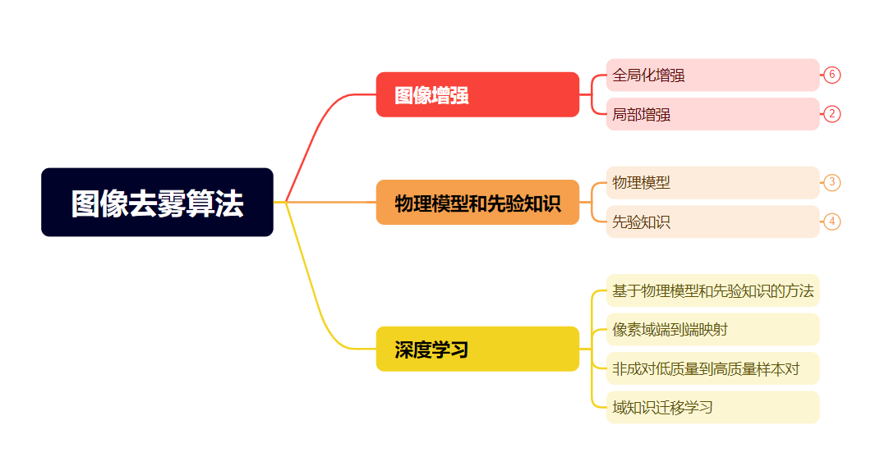
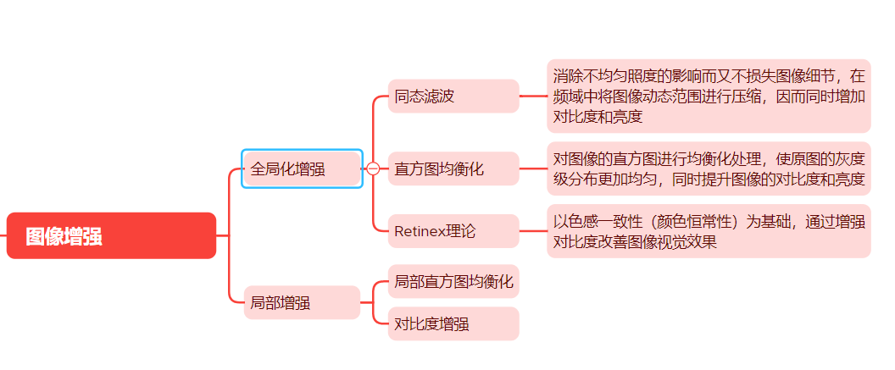
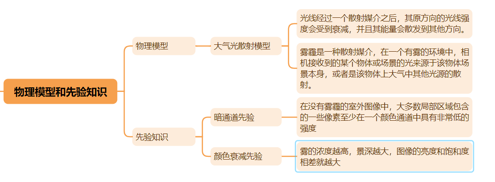
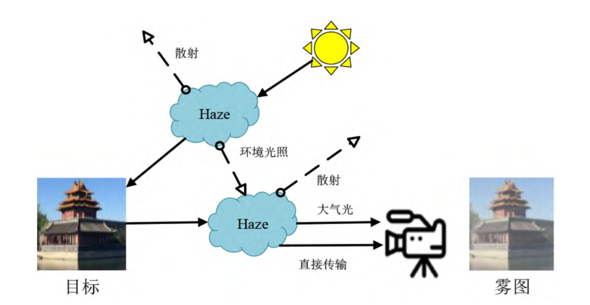
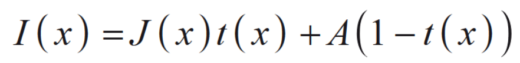
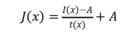
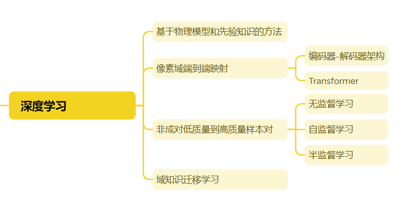
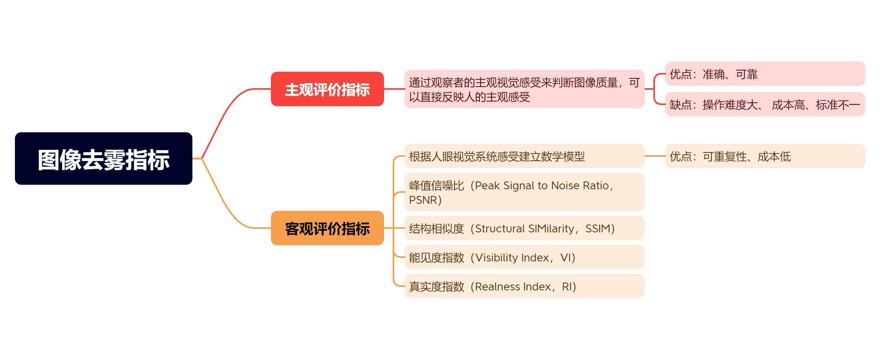

# 图像去雾文献综述

## 摘要

雾霾等恶劣天气会影响人们生活健康，在这样恶劣的天气条件下，图像视频传感设备如相机、无人机等往往难以采集到高质量的图像信息，在雾霾天气采集的图像会出现色彩失真、背景模糊、对比度降低、难以辨别物体对象和其他视觉质量的退化。采集到的图像和视频质量会严重下降，这不仅影响人眼的主观感受，也给后续的计算机视觉各类任务的执行与分析带来严峻挑战。针对这一领域，学者们相继提出了多种处理方法，包括基于图像增强的去雾算法、基于物理模型的去雾算法、基于深度学习的去雾算法。近年来，随着深度学习在各种领域大放异彩，学者们也尝试着将深度学习应用于图像去雾领域，取得了诸多的研究成果。但是雾霾图像场景复杂多变、降质因素众多，这对去雾算法的泛化能力提出了很高的要求。本文主要总结了图像去雾领域的研究进展，重点关注于近年来基于深度学习的图像去雾技术研究进展。从先验知识和物理模型、映射关系建模、数据样本、知识迁移学习等角度出发，介绍了现有算法的研究思路、具体特点、优势与不足。尤其侧重于近两年来新出现的数据预处理方法、训练策略、网络结构、损失函数，如课程学习、小样本学习、域自适应、Transformer等，随后介绍了用于深度神经网络训练使用的去雾数据集，模型去雾效果的评价指标，全面地评价了现有算法性能的优劣，并探讨了未来可能的研究创新方向。

## 关键词

单幅图像去雾；图像预处理；深度学习；卷积神经网络；文献综述；

## 介绍

雾霾是一种常见的图像降质因素，是导致图像模糊的最主要原因之一。雾是由大量悬浮在近地面空气中的微小水滴组成的气溶胶系统，而霾是由空气中的灰尘、硫酸、硝酸等颗粒物组成。雾霾的存在会降低空气的透明度，使能见度恶化。在有雾的天气下，当物体的反射光到达图像采集设备之前，这些微粒会吸收、散射景物反射的光线，使得采集到的图像质量退化，即使是专业的监控和遥感成像系统所拍摄的图像也无法满足相应的工作需求。随着雾霾加重，图像的质量会急剧恶化，导致无法识别图像中的物体和背景，进而影响各类视觉任务的执行与处理。如计算机视觉中的语义分割、目标检测等任务的效果。如何设计出简单而有效的方法处理被雾霾污染的图像，恢复出图像原本的细节信息和结构纹理，使得图像中的特征易于识别与提取，以降低雾霾对其成像质量的影响，为下游高级视觉任务提供高质量的图像输入，成为了国内外研究者关注的热点问题。综上所述，对包含雾或霾影响的图像进行相应的处理十分必要。

图像去雾算法通过对图像进行相应处理，恢复原本的细节信息和纹理结构，提升图像的清晰度，减弱雾气对图像的影响。因此，本课题的研究结论可以作为许多高级计算机视觉任务的前置处理方法，具有广阔的应用前景。现有的图像视频系统能够从去雾的图像中获取更加准确的信息，提高各种设备系统工作在不同天气条件下的健壮性。故设计有效的图像去雾算法不仅对于提升智能图像视频系统的性能具有重要意义，还对保护人民的生命财产安全起到了关键作用。

## 国内外研究现状

目前图像去雾领域中，根据输入图像个数的不同可以分为单幅或多幅图像去雾算法。多幅图像去雾算法数据获取困难，因此实际应用较少。更多的是针对单幅图像去雾的研究，研究方法主要分为三种。基于图像增强的去雾算法、基于物理模型的去雾算法、基于深度学习的去雾算法。

## 基于图像增强的去雾算法

基于图像增强的去雾算法通过增强图像细节，强化图像边缘，使图像中感兴趣区域的特征得到突出强调，抑制其他区域的特征，改善图像中整体或局部的细节信息，从而达到去雾效果。具体分为有基于直方图均衡化、基于小波变换以及基于 Retinex 理论等算法。

直方图均衡化即对图像的直方图进行均衡化处理，即均匀化图像灰度分布，同时提升图像的对比度和亮度，使图像的感官效果更佳。但是传统的直方图均衡化算法可能会导致对比度增强不自然，某些情况下还会导致图像的局部区域增强过度而出现颜色失真。

小波变换通过将原始信号分解为具有不同频率特征和方向特征的子信号，通过局部特征对图像进行局部化处理使得图像在多个尺度增强进而放大有用信息达到增强图像的目的。小波变换用于去雾是把有雾图像进行小波变换，分别得到低频特征和高频特征，雾主要影响的是低频特征，因此对低频特征进行抑制处理，减少雾的影响，并对高频特征进行增强处理，突出边缘轮廓及图像细节，最后通过小波逆变换得到复原后的图像。

Retinex 理论以色感一致性（颜色恒常性）为基础，认为人眼感知到的物体的颜色和亮度只与光和物体的相互作用有关，无论被观察物体受到何种颜色的光的照射，人类对该物体颜色的感知几乎保持不变。在该理论下，Retinex 模型认为人在雾霾条件下观测物体时，会自动忽略部分雾霾，观察物体的原本面貌。Retinex去雾模型将有雾图像表示为景物反射分量与亮度的乘积，故只需消除亮度分量就能还原清晰的图像。不同于传统方法，Retinex 可以兼顾动态范围压缩、 边缘增强和颜色恒常三个方面，因此可以对各种不同类型的图像进行自适应的增强。随着研究的深入，单尺度 Retinex 算法改进成多尺度加权平均的 Retinex 算法，再发展成为带色彩恢复多尺度 Retinex 算法。

基于图像增强的方法不用考虑雾天退化模型和图像降质原因，把雾当作噪声处理，通过提高有雾图像的对比度，并对颜色进行校正实现去雾的目的，可以达到一定的除雾效果，但是处理后图像的细节特征仍然不够突出，其根本原因在于图像的最大动态范围未能被充分利用， 对比度没有得到进一步的增强。

## 基于物理模型的去雾算法

早期人们根据经验总结提出了大气光散射模型（Atmospheric Scattering Model，ASM），该模型能够估计图像中雾霾的生成状况。大气光散射现象如图所示。

光线经过一个散射媒介之后，其原方向的光线强度会受到衰减，并且其能量会散发到其他方向。因此，在一个有雾的环境中，相机或者人眼接收到的某个物体（或场景）的光来源于两个部分：

1.  来自于该物体（或场景）本身，这个部分的光强受到散射媒介的影响会有衰弱；
2.  来自大气中其他光源散射至相机或人眼的光强

而在雾霾天气下的大气散射作用主要由场景光衰减部分和大气光部分组成。大气光散射模型可以归纳为以下数学公式：

其中，x指的是像素点的空间坐标，I(x) 是有雾图像，J(x) 是物体（或场景）的反射光，A 是全局大气光值，t(x) 为大气透射率，且 t ( x ) = e-βd (x)，β 为大气散射系数，d 为图像中物体到成像设备之间的距离，也就是场景深度。我们可以吧J(x)看作去雾后的图像，那么求解 J (x)，我么可以将公式改写为

而求解透射率t(x) 和大气光值A是一个欠适定的问题，往往需要利用各种先验知识来先估计透射图t(x)，并以此求出其他未知量。因此之后学者们根据观察提出了各种先验知识来辅助去雾。基于物理模型的去雾算法常依赖于大气散射模型，通过得到其中的映射关系，根据有雾图像的形成过程来进行逆运算，恢复出清晰图像。此外，大气散射模型是后续众多去雾算法研究的基石，这些算法主要关注于模型中参数的求解，随后推算出无雾图像。

之后人们对雾霾进行了大量的观测，提出了不少先验知识辅助图像去雾。其中，由KaimingHe在2009年提出的基于暗通道先验（Dark channel prior，DCP）的去雾算法广为人知。暗通道先验基于这样的前提：在户外没有雾霾的图像中，大多数局部区域包含的一些像素至少在一个颜色通道中的亮度值接近于零，这样的颜色通道称为暗通道，而这种发现就成为暗通道先验。基于这个先验知识，可以直接评估出雾霾的厚度，并恢复出高质量的图像。暗通道的获取较简单，将图像分解到 R、G、B 三通道，然后对每一个像素在三通道中比较求取最小值，最后对此最小值分量再次求取其局部小区域的最小值，即得暗通道图。但是该算法的理论前提存在一定的局限性，现实生活中并不是所有场景都能够满足这个条件。当算法在面对类似大面积雪地或天空的图像时，每个颜色通道的强度都相对较高，算法会认为此处雾霾厚度很高，从而过度对该区域进行处理造成失真的效果。

Tan等人[4]通过统计发现无雾图像相对于有雾图像必定具有较高的对比度，从而利用最大化复原图像的局部对比度来达到去雾的目的，该方法的缺点在于复原后的图像颜色常常过于饱和。此外，Fattal 等人[5]在假设光的传播和场景目标表面遮光部分是局部不相关的前提下，估计出场景的辐照度，并由此推导出传播图像。由于该方法基于数理统计，并且要求具有足够的颜色信息，所以当处理浓雾天气下颜色暗淡的图像，该方法无法得到可信的传播图像，从而复原后的图像失真较大。

2015 年，Zhu 提出了基于颜色衰减先验的去雾算法。该算法建立在对大量有雾图像的统计分析之上。该算法认为，雾的浓度越高，景深越大，图像的亮度和饱和度相差就越大。利用这一先验并建立模型，我们就得到与有雾图像雾霾浓度及其对应的场景深度信息之间的关系，并利用场景深度信息恢复出无雾的清晰图像。但是在某些场景中，雾霾的浓度和场景深度没有太大的关联，属于非均匀雾霾。在这种情况下，该算法的去雾效果就不够理想。总之，雾霾现象较为复杂，在现实场景中往往表现出不同的特点，人们在某个场景下得出的结论可能不适合另一个场景。因此我们需要一种更加通用的方法。

## 基于深度学习的去雾方法

2012 年以来，以卷积神经网络（Convolutional Neural Network，CNN）为代表的深度学习在机器视觉、自然语言处理和语音处理等领域取得了突破性的进展，并逐步被应用在图像去雾领域。大量的研究结果表明，与传统的图像去雾算法相比，基于深度学习的图像去雾算法以大数据为依托，充分利用深度学习强大的特征学习和上下文信息提取能力，从中自动学习蕴含的丰富知识，可以从大数据中自动学习到雾霾图像到清晰图像之间的复杂映射关系，获得了性能上的大幅提升 . 基于深度学习的图像去雾也因此成为图像去雾领域的主流研究方向，取得了重要的进展。

在深度学习去雾方法中，人们也对传统图像去雾算法有或多或少的借鉴。主要是基于物理模型和先验知识，同时利用深度学习的手段，有些会辅以图像增强的预处理操作。许多研究开始采用卷积神经网络来估计大气散射模型中的参数，但是先估计参数，再进行去雾容易产生累积误差。为了避免参数估计过程中的累积误差，人们就提出了端到端的网络，不再分”两步走“，由有雾图像直接估计生成无雾图像。但是，由于在训练过程中往往需要大量无雾图像和有雾图像的样本对进行监督训练，而在实际应用中成对样本往往难以获得，有雾图像往往通过物理模型，主要是大气散射模型对清晰无雾图像处理降质后得到，大气散射模型本身也并不能完美的描述所有雾霾的形成过程，因此这种人为处理得到的图像无法很好代替真实有雾图像，因此训练出来的模型泛化能力差，用于处理真实图像时，往往会失效。因此，这些方法最后在合成数据集上能取得优异的性能，但是在真实数据集上的表现却有待提高。

为此人们开始尝试从两个角度展开研究，一是避开数据本身的不足，引入一部分非成对样本进行半监督学习，或者直接使用非成对样本开展无监督、自监督学习的图像去雾研究，降低对成对样本的依赖。二是将知识蒸馏、元学习、域自适应等机器学习领域的最新研究成果应用于图像去雾中，提升网络的泛化能力，提高实际图像的去雾效果。

因此我们可以大致的将基于深度学习的去雾方法再次划分。可以分为四类。

### 基于物理模型和先验知识的图像去雾

DehazeNet 是基于深度学习的图像去雾方法前驱，网络架构较浅，全局大气光仍然通过传统方法估计，网络包含特征提取层、多尺度映射层、局部极值层以及非线性回归层，通过学习大气光散射模型中的介质透射率 t(x) 进行去雾。计算时，假设所得到的大气光值 A 为一个固定值，与实际大气光值之间会有差异，因而模型求解得到的去雾图像也相应地会产生偏差。为了解决这一问题，Li等人提出了AODNet，将介质透射率 t(x) 和大气光值 A 统一到一个变量 K(x) 中，网络本身需要求解一个 K(x)来实现图像增强。该网络仅包含 5 个卷积层，计算复杂度低，去雾效果有了进一步的提升。

### 基于像素域端到端映射的图像去雾

这一类去雾算法一是借鉴图像分割领域常用的编码器到解码器结构对图像中的信息进行挖掘，结合注意力机制、特征融合等策略，提升特征的表达能力。从而帮助图像去雾。二是从自然语言领域的Transformer获得灵感，进而构建了适用于图像领域的Vision Transformer用于图像去雾，也取得了不错的性能。

#### 编码器-解码器架构

编码器用于对输入图像进行特征提取，而解码器则利用编码器得到的特征重构目标图像。图像不同层级之间提取的特征种类、特征图的感受野，特征的细腻程度往往不同，为了充分利用图像各层级之间的特征，该类网络常常再编码器和解码器之间添加跳跃连接。在网络内部，通常会结合注意力机制、特征融合等策略来提升特征的表达能力。与普通的CNN网络不同，编码器解码器架构能够更好的进行特征提取和表达，有效提升网络利用率，在图像去雾领域得到了广泛应用。

生成对抗网络（Generative Adversarial Network， GAN）是 2014 年 Goodfellow 等人提出的一种网络结构，包含生成器和判别器，生成器用于获得真实数据样本的特征分布，并且据此生成新的数据样本。判别器是一个二分类器，用于判别输入的是真实数据还是生成的样本。生成对抗网络主要是用于解决图像分类和识别任务中的数据集样本扩充、图像风格迁移和图像增强等问题。在图像去雾领域中，生成器主要用来获取有雾图像的雾霾特征，除去雾霾并生成干净无雾的图像。判别器则将生成的无雾图像和真实无雾图像进行比较，判断生成图像的质量并指导生成器迭代优化。两者通过循环交替达到纳什均衡，从而训练出最优的网络模型。很多去雾方法都是根据生成对抗网络的原理来指导模型训练。

近些年来有很多学者在这方面做了不少工作。Qu提出将图像去雾问题简化为图像到图像的转换问题，在不依赖于大气散射模型的情况下生成无雾图像。EPDN 由多分辨率生成器模块、增强器模块和多尺度判别器模块组成。多分辨率生成器对雾霾图像在两个尺度上进行特征提取；增强模块用于恢复去雾图像的颜色和细节信息；多尺度判别器用于对生成的去雾结果进行鉴别。虽然算法在主客观结果上都有了一定提升，但是对真实雾霾图像进行处理时，会存在过增强现象。Liu 等人提出了 GridDehazeNet 网络结构，通过独特的网格式结构，并利用网络注意力机制进行多尺度特征融合，充分融合底层和高层特征，网络取得了较好的映射能力。Dong 等人提出了一种基于 U-Net 架构的具有密集特征融合的多尺度特征增强（Multi-Scale Boosted Dehazing Network，MSBDN），通过一个增强解码器来逐步恢复无雾霾图像 . 为了解决在 U-Net 架构中保留空间信息的问题，他们设计了一个使用反投影反馈方案的密集特征融合模块。结果表明，密集特征融合模块可以同时弥补高分辨率特征中缺失的空间信息， 并利用非相邻特征。但是算法的模型复杂、参数量大，而且在下采样过程中容易丢失细节信息。Qin 等人去除了上下采样操作，提出了一种端到端特征融合注意网络（Feature Fusion Attention Network， FFA-Net）来直接恢复无雾霾图像 . 该方法的主要思想是自适应地学习特征权重，给重要特征赋予更多的权重 . 在每一个残差块后加入特征注意力，并且对各个组的特征进行加权自适应选择，提升网络的映射能力.Yang等人\[ 39 ]提出了一个非成对的去雾框架D4。它可以估计有雾图像的场景深度，并生成不同厚度的有雾数据，以利于去雾模型的训练。然而，直接使用手工设计的先验并不能避免基于先验的方法的固有缺陷。RIDCP通过提出一种新的数据生成管道和利用潜在的高质量先验来克服这一类去雾方法的弱点。

在图像复原领域，有学者将生成对抗网络进行扩展，提出了扩散模型，在图像去雾、去噪、去雨等任务表现出色。其工作原理主要是通过前向扩散过程和反向采样过程实现的。具体来说，扩散模型在前向扩散过程中对图像逐步施加噪声，直至图像被破坏变成完全的高斯噪声，这种噪声通常是可逆的，同时图像中还保留有图像原本的特征。然后，在反向采样过程中，模型学习如何从高斯噪声还原出真实图像。但是这类模型往往有这样几个缺点。一是依赖对数据集的规划，二是要求图像退化参数已知。

考虑到清晰/退化图像对的光谱之间的巨大差异，一些方法在频率域寻求解决方案。SELECTIVE FREQUENCY NETWORK FOR IMAGE RESTORATION利用多分支和内容感知模块将特征动态和局部地分解成独立的频率带，然后通过通道注意力权重来强调有用的特征。为了处理大尺度退化模糊，作者紧接着提出了一个非常简单的解耦和调制模块，通过全局和基于窗口的平均池化来扩大感受野。

#### Transformer架构

Transformer最初是针对自然语言处理任务提出的，通过多头自注意力机制和前馈层的堆叠，捕获单词之间的非局部交互。“Doso⁃vitski 等人提出了用于图像领域的Vision Transformer 模型（Vision Transformer，ViT），展示了其在图像处理领域应用的潜力。DeHamer将CNN和Transformer结合用于图像去雾，可以聚合Transformer中的长期注意力和CNN特征中的局部注意力。Dehazeformer提出了一种基于反射填充和裁剪的偏移窗口划分方案。允许掩码多头自注意力丢弃部分掩码，并且实现恒定的窗口大小。但是Transformer应用到图像去雾领域仍有一些局限性。一是Transformer的计算复杂度和特征图的分辨率呈现平方关系，因此不适合逐像素的去雾任务。虽然有些工作在小空间窗口上应用自注意力来缓解这个问题，但是会让Transformer的感受野受到限制。二是视觉领域的Transformer基本单元应该具有更灵活的尺度，但是当前的Transformer一般啊是通过固定卷积核来生成固定尺度的token。TaylorFomer在跨空间维度上对整个特征应用自注意力，通过对Softmax进行泰勒展开计算自注意力权重，随后引入了多尺度注意力细化模块对TaylorFormer进行细化。

### 基于非成对低质量到高质量样本对的图像去雾

#### 无监督学习

Zhu提出的循环一致对抗网络（Cycle-consistent Adversarial Networks，CycleGAN）是一种比较具有代表性的基于非成对样本的网络结构，该网络是面向图像风格迁移任务设计的。整体架构包含了两个生成器和两个判别器。一个生成器负责将 X 域图像映射到 Y 域，另一个生成器负责将 Y 域图像映射到 X 域；判别器用于判断输入图像是否属于 X 域。假设存在一对非成对样本{xi ,yi} ,xi ∈ X,yi ∈ Y，以正向训练为例，xi 用于训练 Dx，标签为真，G(xi )用于训练 Dy，标签为假，此时判别器 Dy 可以监督生成器 G 的训练； 通过优化输入 xi 与 F(G(xi ))之间进行 L1 范式损失，可以 同时监督生成器 G 和 F 的训练 . 这个损失称为循环一致性损失；反向训练时同理 . 通过正反向交替训练可以达到训练生成器 G 和 F 的目的。

#### 自监督学习

### 基于域知识迁移学习的图像去雾

## 数据集

### RESIDE

发布时间：2019

网址：[RESIDE: V0 (google.com)](https://sites.google.com/view/reside-dehaze-datasets/reside-v0)

论文地址：<https://arxiv.org/abs/1712.04143>

该数据集使用由合成和真实世界有雾图像组成的新的大规模基准数据，称为真实单图像去雾 REalistic Single Image DEhazing (RESIDE)，用于训练、评估和比较单幅图像去雾算法。 RESIDE的一个显着特征在于其评估标准的多样性，从传统的完整参考指标到更实用的无参考指标，再到所需的人类主观评估和任务驱动评估。RESIDE 根据不同的数据源和图像内容，分为五个子集，每个子集有不同的目的（训练或评估）或来源（室内或室外）。

各子集图片示例：

*   ITS (Indoor Training Set) 室内训练集
*   OTS (Outdoor Training Set) 室外训练集
*   SOTS (Synthetic Objective Testing Set) 合成目标测试集
*   RTTS (Real-world Task-Driven Testing Set)
*   HSTS (Hybrid Subjective Testing Set)
*   Unannotated Real-world Hazy Images（不包含在上述子集中）

### RESIDE-Standard（RESIDE-IN）

网址：[RESIDE-Standard (google.com)](https://sites.google.com/view/reside-dehaze-datasets/reside-standard)

训练集包含13,990个合成有雾图像，使用来自现有室内深度数据集NYU2和米德尔伯里立体数据库的1,399个清晰图像生成。其中每个清晰无雾图像合成10个有雾图像，13,000个用于训练和990个用于验证。 图片每个通道大气光A在\[0.7，1.0]之间，均匀地随机选择β在\[0.6,1.8]。 因此，它包含成对的清晰和有雾的图像，其中清晰无雾图像对应多个有雾图像，这些有雾图像是在不同的参数A和β下生成的。

测试集由综合目标测试集（SOTS）和混合主观测试集（HSTS）组成，旨在表现出多种评估观点。 SOTS从NYU2中选择500个室内图像（与训练图像不重叠），并按照与训练数据相同的过程来合成模糊图像。HSTS采用与SOTS相同的方式生成10个合成的户外有雾图像，以及10个真实世界的有雾图像，收集现实世界的室外场景 ，结合进行真人主观评审。

### RESIDE-β（RESIDE-OUT）

网址：[RESIDE-β (google.com)](https://sites.google.com/view/reside-dehaze-datasets/reside-%CE%B2)

作者使用2061张来自北京实时天气的真实室外图，使用在Learning depth from single monocular images using deep convolutional neural fifields中提到的算法，对每幅图进行深度估计，最终用β在\[0.04、0.06、0.08、0.08、0.1、0.15、0.95、0.95、1]中合成了72,135张户外有雾图像。这套新的图像被称为户外训练集（OTS），由成对的干净无雾的户外图像和生成的有雾图像组成。

### RESIDE-4K

训练集包含3000张ITS图像对和3000张OTS图像对。

测试集将室内和室外的图像对混合在一起，形成一个由1000张图像对组成的测试集。

### D-HAZY

D-HAZY，建立在Middelbury 和NYU深度数据集上，这些数据集提供各种场景的图像及其相应的深度图。包含1400多对图像的数据集，其中包括同一场景的地面真实参考图像和模糊图像。

### DENSE-HAZE

发布时间：2019

以浓密均匀的朦胧场景为特征，包含33对真实的朦胧图像和各种室外场景的相应无霾图像。通过引入由专业雾霾机器生成的真实雾霾来记录雾霾场景。

### HAZE-4K

### I-HAZE

发布时间：2018

### O-HAZE

发布时间：2018

### RS-HAZE

### NH-HAZE

发布时间：2020

这是一个非均匀的真实数据集，具有成对的真实雾霾和相应的无雾图像。这是第一个非均匀图像去雾数据集，包含55个室外场景。在场景中引入了非均匀雾，使用专业雾霾制造器模拟有雾场景。

## 评价指标

## 思考和展望

目前图像去雾领域存在的困难主要有以下几点。

1.  网络的训练需要大量的无雾-有雾图像对作为支撑，但是实际中这样的数据集获取困难。目前的做法是通过一些物理模型如大气散射模型，将高质量无雾图像处理得到低质量的有雾图像，形成合成数据集。但是这一类模型往往无法很好地模拟真实图像降质的过程。
2.  网络的泛化能力差，主要表现在一个数据集上训练的模型应用到另一个数据集上效果往往不佳。这是因为样本分布不一致，根本原因在于雾霾变化多样，在某些场景中得到的雾霾特征往往不适用于另一个场景。

为了解决以上两大难题，我们可以从这些角度出发。

## 创新方向

### 数据预处理

针对网络的训练需要大量数据作为支撑，但是目前数据集数据量有限，我们就需要考虑数据预处理。

1.  **组合多个数据集并降低差异**，

    由于每个数据集之间有一些细微的差异，例如颜色差异、物体复杂性、拍摄所用的相机差别等。直接组合会降低去雾结果指标，因此我们设计一种数据预处理技术，来减少数据集之间的分布差距。

    (<a href="zotero://select/library/items/KA6CRQKY">Liu 等, 2023</a>)

    提出了一种新的预处理技术，对数据集之间明显的颜色差异进行校正，

    并且将增强后的数据分布转移到目标数据分布。显著的降低了数据集之间的差异，增加了数据量，从而提高了去雾效果。

2.  **缓解合成数据集和真实数据集之间的差距。**

    (<a href="zotero://select/library/items/BJNHXL93">Wu 等, 2023</a>)

    重新设计了合成数据集的生成过程，

    考虑到了图像退化的各种因素。由此得到的数据集缓解合成数据和真实数据之间的差距。

3.  应用图像增强的方法，如直方图均衡化、对比度提升初步处理数据。

### 模型结构

引入多分支及分类。针对雾霾变化多样，在某些场景中得到的雾霾特征往往不适用于另一个场景这一特点。我们可以针对不同的雾霾具体使用不同的网络进行去雾。对当前去雾数据集分析可以得知，均匀雾霾、非均匀雾霾有一定的区别。非均匀雾霾并不完全由图像场景深度决定，不同区域的雾霾浓度往往不一。因此通常的去雾方法在去除非均匀雾霾上效果不佳。我们可以根据不同种类的雾霾，引入不同的编码器，提取不同类别雾霾之间特异的特征，形成一种多分支结构。随后再接上普通编码器，提取雾霾大类之间的相同特征。随后送去解码器输出去雾图像。

引入高质量先验。 从去雾网络发展历程可以得知，高质量先验知识对去雾网络的设计有很大的帮助，以往的网络模型都是人工通过经验总结得到的先验知识，然后据此设计网络，如暗通道先验和颜色衰减先验，由于先验知识本身具有一定的局限性，从而导致设计出来的网络泛化能力不佳。因此(<a href="zotero://select/library/items/BJNHXL93">Wu 等, 2023</a>)通过预训练一个网络来得到高质量的先验知识，然后将高质量先验与网络进行融合训练，再通过解码器输出无雾图像。

引入选择机制。 图像中并不是所有区域都是同等重要的，比如天空、雪地等区域去雾重要性不高，而其他雾霾浓度高，距离近的区域则相比于雾霾少距离远的物体去雾重要性更强。(<a href="zotero://select/library/items/4SHMI7H5">Cui 等, 2023</a>)提出了双域选择机制，双域主要表现在空间选择模块和频率选择模块。空间选择模块通过深度卷积层来确定每个通道中图像退化区域的大致位置。然后利用频率选择模块对高频信号或硬区域进行放大，去除特征中的低频成分。通过这种机制，模型会更专注于雾霾更重的关键区域。

学习雾霾和图像背景之间交互的特征。(<a href="zotero://select/library/items/8GJPSKZ7">Guo 等, 2023</a>)通过注意力生成和场景重建网络专注于学习非均匀雾霾和场景之间的复杂交互特征。

提取多尺度特征。使用不同大小的卷积核、多尺度、并行地提取特征。

### 损失函数

采用多个损失函数结合来辅助模型训练，如感知损失、对抗损失、结构相似性损失

### 正则化方法

对比正则化方法

### 训练策略

1.  对比学习。2023年的CVPR中

    (<a href="zotero://select/library/items/YMAP3M6X">Zheng 等, 2023</a>)

    提出了这一观点，在训练的过程中不断和其他模型训练得到的去雾图像做对比，一开始和效果较差的比较并进行自我矫正，逐步和效果好的比较直到接近真实无雾图像。在学习的过程中会逐步结合各种去雾方法的优点、不断地调整来达到更好的结果。因此我们可以精挑细选近些年去雾效果较好的、去雾方法差别较大的作为比较对象进行对比学习。

2.  课程学习。

    (<a href="zotero://select/library/items/8GJPSKZ7">Guo 等, 2023</a>)

    在其论文中

    为了增强亮度差异大的区域去雾效果，引入了自组织半课程学习的注意力图生成策略，该方法加快了模型参数收敛。减少了训练早期多目标预测引起的学习歧义。

    (Zheng 等, 2023)也在其论文中采用了课程学习策略，其主要思想是根据学习的难度不同动态的调整学习参数。

3.  采用

    YCbCr颜色空间。

    (<a href="zotero://select/library/items/8GJPSKZ7">Guo 等, 2023</a>)

    、(Singh 等, 2020)在其论文中提出采用

    YCbCr 颜色空间，因为其相比于 RGB 多了一个能够表示图像的亮度的量，而雾霾浓度大的区域往往亮度更强。有助于模型学习到有关雾霾亮度的特征。（沛：大多数情况，也不是所有情况都行，有时候雾霾可能不太符合这种先验）

### 轻量化

随着深度学习的发展，模型逐渐往复杂化、巨大化发展，所需的计算量更是水涨船高，这对去雾系统的实时应用不利，因此，有必要对模型进行效果和运行速度的权衡，节约计算开销。

1.  采用四元数网络。

    (<a href="zotero://select/library/items/6ELGGPS7">Frants 等, 2023</a>)

    在其设计的网络QCNN-H中指出采用四元数的卷积神经网络

    更好的保留了颜色信息，同时减小了网络参数、节约了内存资源

## 常用模块

## 论文题目

基于高质量先验的多分支对比学习去雾网络
