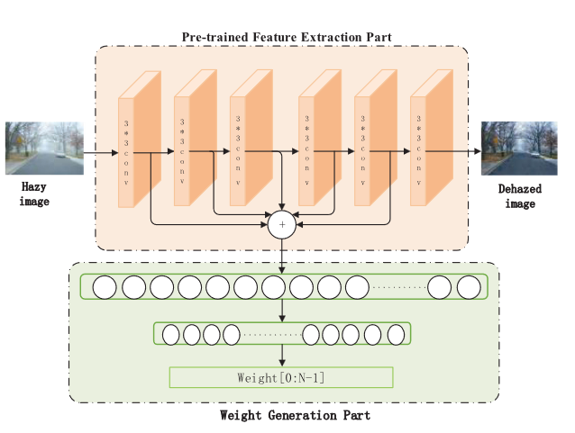

---
tag:
    - 有代码
    - MADN
    - 已阅
    - 元学习
title: 'Effective Meta-Attention Dehazing Networks for Vision-Based Outdoor Industrial Systems'
category:
    - 图像去雾
version: 4770
libraryID: 1
itemKey: Y7IZ2N2X

---
# 有效的基于视觉的户外工业系统的元注意力去雾网络

影响因子11.65 SCI 1区论文

本文提出了一种新的元注意力去雾网络( <a href="zotero://open-pdf/library/items/4B7ZQZWT?page=1">“meta-attention dehazing network”</a>, MADN )，用于在不使用物理散射模型的情况下从有雾图像中直接恢复清晰图像。

结合并行运算和增强模块，元网络(meta network)通过元注意力模块(<a href="zotero://open-pdf/library/items/4B7ZQZWT?page=1">“meta-attention module”</a>)根据当前输入的雾天图像自动选择最合适的去雾网络结构。

此外，作者还提出了一种新颖的由元网络计算的特征损失，利用从预训练元网络中提取的多尺度特征来量化估计结果与真实值之间的视觉差异。可以加速去雾网络的收敛，以满足实际工业系统的应用需求。

首先，首次将元网络用于图像去雾。证实了元网络模型可以有效提高网络的泛化能力。

第二，利用元注意力实现了网络结构的自适应调整，有效提高了网络利用效率，有利于其工业应用。

第三，特征损失的成功证实了根据元网络设计的损失函数的有效性。

# 元网络

整体MADN方案如算法1所示。它由元注意力、并行运算和增强模块组成，如图1所示。

并行运算模块和增强模块中的每个操作都由元注意力模块根据当前输入进行加权。双重残差连接为网络结构提供了更多的可能性。

## 元注意力模块

本文通过元网络实现元操作注意力机制和元尺度注意力机制，以提高去雾网络的泛化能力。

元注意力模块包含两个部分，预训练的特征提取部分( FEP )、权重生成部分。

**预训练的特征提取部分**

其中FEP由预训练的全卷积神经去雾网络实现，该网络由6层3 × 3卷积组成。每一层的输出特征图F\~i\~( i = 1,2,3,4,5,6)是基于输入的雾天图像，在元网络的前馈传播中得到的。X在输出特征图F\~i\~( i = 1,2,3,4,5,6)的通道维度上是串联的

**权重生成部分**

权重生成部分由两层全连接网络实现，用于通过特征图X获取并行运算网络的操作注意力权重和增强网络的尺度注意力权重。注意力权重的输出表示为WA∈RN，其中N为注意力权重的个数。

## 并行运算模块

并行运算模块由6个并行运算层组成，每层包含4个并行卷积运算，分别由1 × 1、3 × 3、5 × 5、7 × 7组成。并行计算网络的详细信息如图3所示。并行运算网络和双残差连接的设计分别为运算选择和网络结构选择提供了可能。

操作选择通过对并行结构中每个操作的结果进行加权来完成，其中权重由元注意力模块生成。令fol∈RH × W × C为第l层第oth ( o = 1 , 2 , 3 , 4)操作的输出，FAl∈RH × W × C | O | ( l = 1,2,3,4,5,6)表示第l层的最终输出。所选择的操作fal可以通过将fol与相应的注意力权重WA相乘得到。最后，将FAl在通道维度上进行拼接得到FAl。

在去雾过程中，有三个前端卷积层和一个Resnet层(由2个3 × 3卷积层组成)用于图像特征提取，三个后端反卷积层使用并行运算模块进行特征整合。这里将手工特征提取和网络特征提取相结合作为输入，为去雾提供更多的细节和信息。

## 增强模块

增强模块通过提供不同的感受野来改善图像细节并去除图像去雾中的伪影，有助于重建不同尺度的图像\[ 6 ]。由于来自不同尺度的特征图可能不具有相同的重要性，因此提出了一种使用元网络的尺度注意力机制。

增强模块的网络架构如图4所示，由两个增强器组成。增强器1和增强器2分别需要在5个尺度( 1 / 32、1 / 16、1 / 8、1 / 4、1)和( 1 / 16,1 / 8,1 / 4,1 / 2,1)上实现特征图的融合。具体来说，在下采样层之前，设计了两个3 × 3的卷积层用于图像特征提取。接着，使用一层1 × 1卷积进行降维，同时对通道进行自适应加权。特征融合后，将特征图上采样到原始尺度。最后通过一层3 × 3卷积得到去雾图像。与常用的增强模块相比，本文利用元网络已有的学习经验，在每个尺度的特征图中加入权重信息，增强了去雾网络的鲁棒性，减少了去雾图像中的人为性。

## 目标函数

预训练模型FEP的损失函数

利用元注意力模块中预训练的FEP学习去雾过程中的特征提取。Lm通过定量测量去雾图像F6与地面真值Jtrain之间的差异来优化FEP。定义Lm为

MADN的损失函数

为了进一步提高算法性能，通过联合微调元注意力模块中的并行运算网络、增强网络和权重生成部分来训练整个MADN，目标函数如下

为了进一步提高算法性能，通过联合微调元注意力模块中的并行运算网络、增强网络和权重生成部分来训练整个MADN，目标函数如下：去雾图像( Jtrain )和真实图像( Jtrain )受到L1的约束，L1比LMSE对异常值更不敏感。此外，通过感知损失( Lper )和特征损失( Lfea )对去雾网络进行联合优化。在本研究中，Lper和Lfea被用来量化去雾图像与真实图像之间的视觉差异。Lper使用ImageNet上预训练的VGG16作为损失网络，提取前4个阶段(即Conv1 - 2、Conv2 - 2、Conv3 - 3和Conv4 - 3)最后一层的特征。对于Lfea，利用预训练的FEP，选择前5个卷积提取的特征。利用MSE计算特征之间的差异，公式如下：

其中Φ k和Fm分别表示VGG16和预训练FEP的特征图。C、H和W指定了特征图的维度。

## 训练相关

首先，使用室内合成数据集，以随机裁剪大小为400 × 400的区域作为输入图像，预训练元注意力网络80个历元的FEP。整个网络用大小为256 × 256的随机裁剪区域的输入图像训练了20个历元。

对于加速训练，在整个训练过程中，采用批大小为1的Adam优化器，学习率设置为0.001。指数衰减率β 1和β 2分别设置为默认值0.9和0.999。将( 5 )式表示的损失函数中的超参数设定为λ 1 = 1，λ2 = 0.04，λ3 = 0.04。
