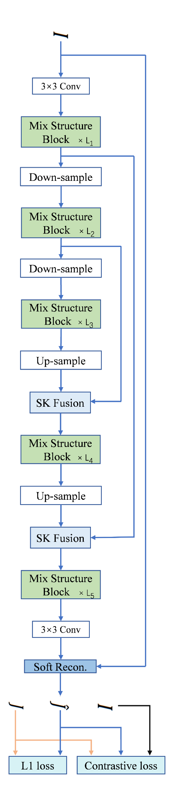
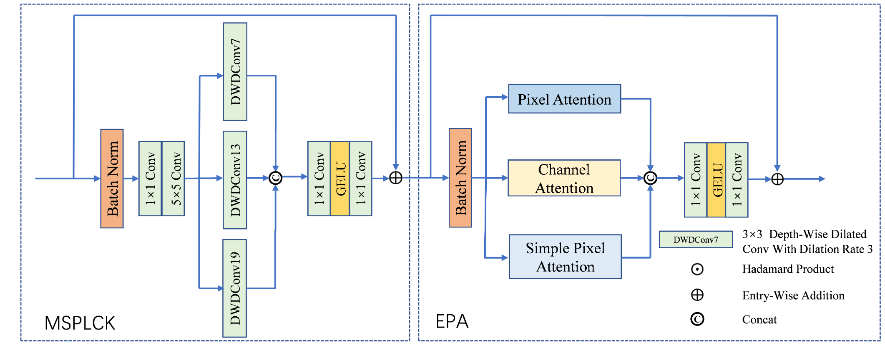
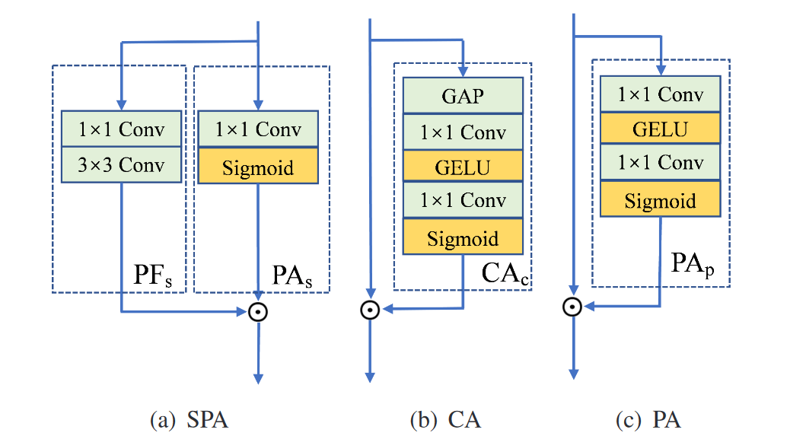

---
tag:
    - 有代码
    - 已阅
    - MixDehazeNet
title: 'MixDehazeNet : Mix Structure Block For Image Dehazing Network'
category:
    - 图像去雾
version: 6014
libraryID: 1
itemKey: H36M9286

---
# 混合去雾网络：图像去雾网络的混合网络结构

## 摘要

\*\*问题分析：\*\*之前的研究验证了大卷积核和注意力机制在去雾方面的有效性。然而，它存在两个缺陷：当引入大卷积核时，图像的多尺度特性容易被忽略；注意力模块的标准串联没有充分考虑雾霾分布的不均匀性。

\*\*解决方案：\*\*本文提出了一种新颖的混合结构图像去雾网络( Mix Structure Image Dehazing Network，MixDehazeNet )框架，解决了上述两个问题。具体来说，它主要包括两个部分：

1.  多尺度并行大卷积核模块，与单个大核相比，具有多尺度的并行大核在去雾阶段更能够考虑到局部纹理。
2.  增强的并行注意力模块。其中注意力的并行连接在去雾不均匀的雾霾分布方面表现更好。

## 介绍

尽管目前的方法取得了显著的性能，但仍存在两个局限性：

1.  尽管基于CNN和基于Transformer的方法都可以利用大的有效感受野来提高性能，但在去雾过程中往往忽略了图像的多尺度特性。每幅图像中的雾霾浓度分布是非均匀的，不同尺寸的卷积核才能有效地捕获不同尺度的雾霾分布区域。
2.  以往去雾网络中使用的注意力机制并不完全适用于图像去雾。通道注意力能够更好地编码全局共享变量A，而像素注意力能够更好地编码依赖于位置信息的局部变量 t (x)。但是现有的方法要么只是设计了像素注意力模块，要么只设计了通道注意力模块

为了解决这些问题，作者提出了一种名为MixDehazeNet的混合结构去雾网络。该网络以UNet为骨干，其中包含混合结构块，而混合结构块结合了多尺度并行大卷积核模块和增强的并行注意力模块。

混合结构块(Mix Structure block)是一种类似于Transformer的块，用多尺度并行大卷积核模块代替Transformer中的多头自注意力，用增强的并行注意力模块代替Transformer中的前馈网络。

1.  多尺度并行大卷积核模块（Multi-Scale Parallel Large Convolution Kernel module，MSPLCK）同时具有多尺度特性和大感受野。大卷积关注全局特征，捕捉有明显雾霾的区域；小卷积关注细节特征，恢复纹理细节。
2.  增强的并行注意力模块(Enhanced Parallel Attention module, EPA)，该模块能够将通道注意力和像素注意力结合起来，通道注意力提取原始特征中共享的全局信息，像素注意力并行提取原始特征中与位置相关的局部信息，两者强强结合使其能够有效地处理分布不均匀的雾霾。该模块包括3个注意力机制(简单像素注意力、通道注意力和像素注意力)，通过多层感知进行融合。
3.  采用对比损失，提高模型性能。ResNet - 152作为对比学习的主干，因为作者发现它比VGG19更有效地提高了模型的性能。

## 相关工作

基于Transformer的模型参数量大，延迟高，难以训练。因此，我们重点研究了基于CNN的方法，使用大型空洞卷积来获得Transformer所具有的大感受野和长距离建模能力。

MixDehazeNet整体网络架构（I是有雾图像，J是对应的无雾图像。J^是模型预测出的无雾图像）

混合结构块的网络结构

### 多尺度并行大卷积核模块MSPLCK

三个不同大小的空洞卷积可以提取多尺度特征。中大型的空洞卷积和Transformer中的自注意力机制相比起同样的作用，具有较大的感受野和建模距离，可以捕捉大片雾霾区域。小形空洞卷积可以捕捉小范围的雾霾，恢复图像的纹理细节。将这三个空洞卷积的输出在通道维度上相加，也就是叠起来，随后输入到下一个区域。这个区域作者叫它多层感知机，采用两个逐点卷积和GELU作为激活函数。随后将多层感知机的输出和模块一开始的输入相加。得到该模块的结果。作者认为多层感知机不仅可以结合前面的3种不同类型的特征，还可以起到拟合去雾特征的作用。

### 增强的并行注意力模块

我们注意到这个注意力模块结合了三种注意力

*   像素注意力（图c）可以有效地提取与位置相关的信息特征，例如图像中不同的雾霾分布。
*   简单的像素注意力模块（图a）由两个分支组成：PFs和PAs。PFs（Pixel features）是特征提取的一个分支。PAs（Pixel gates)是一个像素门控分支，它是像素特征提取分支的一个门控信号。其中Sigmoid函数是提取全局像素门控特征。
*   通道注意力可以有效地提取全局信息，并改变特征的通道维度。通道注意力有一个CAc分支，可以对整个通道进行特征提取。其中包含全局平均池化（global average pooling，GAP）加上一个像素门控分支。而CAc是整个通道注意力中的全局通道门控信号。

随后作者解释了设计增强的并行注意力模块的原因。

在大气光散射模型中全局大气光<a href="zotero://open-pdf/library/items/TCA2V49B?page=2">“global atmospheric light”</a>A是共享的全局变量，而介质投射图<a href="zotero://open-pdf/library/items/TCA2V49B?page=2">“medium transmission map”</a> t(x)依赖于位置的局部变量。作者认为这两个变量与图像去雾强相关，去雾模型提取的大都是和这些相关的特征。

通道注意力能够更好地提取共享的全局信息来大气光A进行编码。通过同时从原始特征中提取依赖于位置的和全局共享的信息，可以实现注意力机制的全局优化。

然而，当两种不同的注意力机制串联使用时，通道注意力提取全局信息会对输入图的原始特征进行修改，然后像素注意力再提取通道注意力修改过特征中的位置依赖信息，这种情况下并没有达到全局最优的条件。

作者希望增强的注意力模块能够同时提取原始特征中的共享全局变量和位置依赖的局部变量，因此并行设计了3个不同的注意力模块。随后在对原始特征A和 t (x) 进行并行编码的基础上，将3个单独的注意力结果进行拼接得到组合特征F，然后通过多层感知机对组合特征F进行融合，作者认为这样并行模块可以更好地去雾。

### 总结

混合结构块其中的多尺度并行大卷积核模块

1.  获取单个Transformer多头自注意力模块所不具备的图像多尺度特征。
2.  可以同时捕获大面积雾霾和恢复纹理细节

混合结构块其中的增强的并行注意力模块

1.  可以高效地处理单个Transformer前馈模块不具备的雾霾分布不均匀问题。
2.  并行地提取原始特征的共享全局信息和位置依赖的局部信息。

### 损失函数

L1损失

## 训练细节

### 数据集

**室内去雾模型**

*   训练：RESIDE-IN的子集ITS，13990个图像对，500轮
*   测试：SOTS-indoor，500个图像对

**室外去雾模型**

*   训练：RESIDE-OUT的子集OTS，313950个图像对，40轮
*   测试：SOTS-outdoor，500个图像对

**室内外综合去雾模型**

*   训练：RESIDE-6K中用于训练的OTS（3000个图像对）ITS（3000个图像对），1000轮
*   测试：RESIDE-6K中用于测试的室内外混合图像，1000个图像对

### 实现细节

*   \*\*设备：\*\*4卡互联的RTX3090

*   \*\*图像预处理：\*\*随机裁剪为256 × 256的图像块。

*   \*\*初始参数：\*\*提取自预训练的Resnet-152模型中的第11、35、143、152层的隐藏特征，以及其对应的系数

*   \*\*超参数：β = \*\*0.1

*   \*\*优化器：\*\*adamW，其中指数衰减率β1和β2分别为0.9，0.999

*   \*\*学习率：\*\*初始为2 × 10

    -4

    ，通过余弦退火策略逐渐降低到2 × 10

    -6
