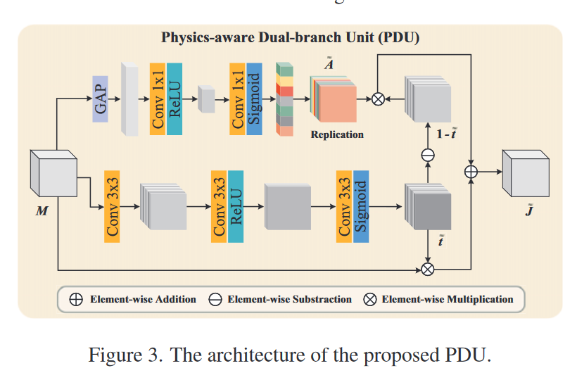
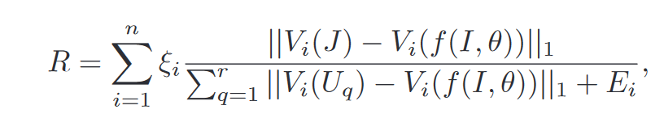
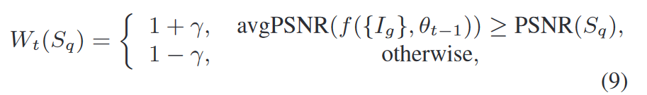
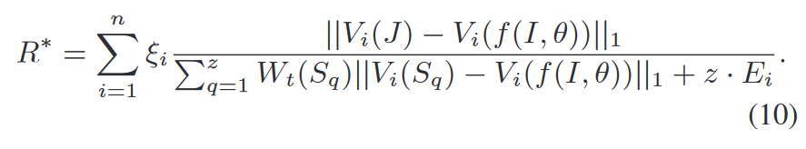

# 物理感知单幅图像去雾的课程对比度正则化

## 摘要

在对比正则化过程中，一个输入会对应多个合理输出，我们需要从多个输出中选出最合适的那一个。也就是说对比正则化具有不适定性。图像去雾问题可以表述为估计以输入图像为条件的分布的问题。然而，负样本和正样本（也就是有雾图像和无雾图像之间）在解空间上相距较远，导致解空间缺乏约束。并且深度学习去雾模型在去雾过程中的物理机制方面研究不足。本文提出了一种新的课程对比正则化，其目标是构建一个共识的对比空间，而不是一个非共识的对比空间。同时本文也为其他现有方法在有雾图像和生成的无雾图像之间提供了更好的下限约束，使其能够更好的对图像进行复原。更进一步的，由于嵌入解空间的有雾图像和负样本图像具有不同的相似性，对应解的多个变量就具有不同的学习难度。为了解决这个问题，作者定制了一个课程学习策略，以确定不同无雾图像的重要性。此外，为了提高特征空间的可解释性，我们根据大气散射模型构建了物理感知的双分支单元。利用该单元以及课程对比正则化，作者建立了自己的去雾网络，命名为C2PNet。

## 介绍

作者将基于深度学习的图像去雾方法大致分成了两类，一类是与物理无关的方法，一类是物理感知方法。前者通过降低L1/L2损失的方式来拉近真实值和预测值之间 的差别，并且还使用了各种正则化方法作为额外约束来处理预测图像的不适定性。对比正则化引入了一个概念，将清晰图像作为正样本图像，清晰图像对应不同程度的雾霾图像作为负样本图像。先前的正则化方法都忽略了将负样本图像信息作为输出的下限。对比正则化进一步使用了对比学习的方法来保证解空间的封闭性，让解空间尽量在正样本附近。此外，由于使用了不同的退化模式作为线索，当我们利用更多的负样本时，能够获得更好的结果。但是问题是，正样本和负样本内容是有区别的，他们之间的距离可能过于遥远，这使得整个解空间仍然不够紧凑。为了解决这个问题，作者使用共识对比空间中的负样本作为下界约束，这些约束能很容易被其他现有的方法通过有雾图像输入和其生成的无雾图像组装起来。

这种情况下的负样本比非共识空间的负样本更接近正样本。因为这些负样本更多地与雾霾相关，而不是一些其他的东西。但是当正负样本之间过于接近时，负样本远离正样本的推力可能大于靠近正样本的拉力，这两种力量相互抵消。这样会让进一步学习变得困难，尤其是在训练的早期。

紧接着作者探讨不同难度的负样本对共识空间的影响。使用FFANet的效果作为比较基线。定义负样本有三个难度等级，简单、困难、超难。越接近正样本难度越大。作者采用有雾图像输入作为简单负样本，与原始无雾图像比较PSNR<30的图像为困难负样本，>30则为超难负样本。进行对比学习，发现使用困难负样本取得了最好的成绩，而使用超难负样本却比基线还要差。这就揭示了接近正样本的负样本有提升去雾模型效果的潜力，当并不是越接近越好，越接近正样本，进一步的学习会愈发困难。而综合了不同难度的负样本集，能够获得最好的效果。这说明不同难度的负样本都能对训练做出贡献，那我们就需要在训练过程中明智地将这些共识空间中的负样本安排到对比正则化中。

针对那些物理感知去雾方法，他们大多是利用原始空间中的大气散射模型，没有充分挖掘到有用的特征信息。

我们定义正样本为输入，则所有可能的输出（负样本）和正样本一起构成了整个模型的解空间。

*   解决第一个问题，提出在图像去雾的共识空间中使用有雾图像和其对应恢复图像作为负样本的课程对比正则化方法。
*   共识性负样本的难度会影响到正则化的有效性，接着提出了一种课程学习策略来安排这些负样本用来缓解学习中产生的误解。也就是将负样本分为三类，对共识空间中对应的负样本给予不同的权重，同时在训练过程中随着锚点在共识空间中向着正样本移动，负样本的难度也在动态的调整，这样提出的正则化可以促进去雾模型在更紧凑的解空间中稳定优化。
*   解决第二个问题，作者提出了物理感知的双分支单元( dual-branch unit，PDU )该单元分别在两条支路上预测将大气光和透射图对应的特征。充分考虑了这两者不尽相同的物理特性。因此能够根据物理模型更精确的合成潜在的清晰无雾图像的特征。

## 相关工作

### 单幅图像去雾

### 对比学习

对比学习的思想是在正负样本之间设立一个锚点，利用对比损失将锚点拉近正样本，同时将锚点推离负样本。而CR在图像去雾领域引入了负样本的概念，通过将负样本作为解空间的下界，CR就能够同时利用正负样本进行训练。但是大部分负样本是非共识的，与正样本之间的距离较远，导致解空间缺乏约束。

### 课程学习

## 本文方法

### 物理感知双分支单元

在大气光散射模型中，传输图和大气光两个变量都是未知的，因此去雾是一个高度不确定的问题。基于原始空间的方法直接估计两个未知因子，容易导致累积误差。相比之下，直接在特征空间中进行物理先验可以帮助预测，与雾霾生成过程一致，而不依赖于T和A的真值。

### 课程对比正则化

我们给定一个锚点作为去雾网络输出的结果，正样本是真实的无雾图像，而负样本包含输入的有雾样本和多个和正样本不一致的有雾图像。该正则化的目标就是最小化锚点于正样本之间的L1距离，同时最大化锚点于负样本之间的距离。

Ei = || Vi(I) − Vi( f(I, θ) ) ||1  ，f (·,θ) 表示带有参数θ的去雾网络，Vi(·)表示从预训练的VGG19中的第i隐藏层提取的。非合意负样本{ Uq }为r，{ ξi }为超参数集合。

这里的负样本不能太过偏离正样本，也就是说，不能是非共识负样本。这样的样本不能够提供令人满意的解空间下界。会导致解空间约束不足，影响图像复原的质量。

我们需要定义不同负样本训练的难度以及如何根据不同难度的负样本进行训练规划。为了解决这两个问题，作者将课程学习的策略引入到对比正则化。将负样本的训练难度划分为三个等级。有雾图像作为简单负样本，其他负样本的难度在训练中确定。在每轮训练之前测量网络的平均PSNR水平，当随后某轮训练后，负样本的PSNR高于一定值时，设为超难负样本，否则定义为困难负样本。

为了合理规划训练流程，得到更好的效果。作者规定简单负样本的权重固定且最大，这是因为更难的样本虽然能带来更为紧凑的解空间，但是也会产生学习上的歧义。在实践中简单样本的权重为一个非负数z，其他负样本的权重定义如下：

Sq是非简单难度负样本，t表示训练第t轮的时候。Wt(Sq)表示该非简单负样本的权重。{ Ig }表示有雾输入数据集，q = 1，2，· · ·，z为非简单难度负样本的下标，γ为超参数。当前非简单样本的PSNR小于上轮网络输出样本的平均PSNR值时，该样本的权重就为1 + γ， 否则为1 - γ。也就是说困难和超难负样本的权重分别设置为1 + γ和1 - γ。

这样的策略在确定学习难度上具有很大的灵活性，随着训练的轮数递进，超难负样本的训练难度会逐渐降低，变为困难负样本，这是因为随着锚点质量的提高，更难的负样本带来的歧义会逐渐减少。这种情况下的负样本才能更好的约束解空间的下界。

最后得出对比正则化公式最终结果

那么最终正则化L就是由L1正则化加上课程学习正则化构成

Referred in <a href="./学术论文笔记汇总-RYZ5DF37.md" class="internal-link" zhref="zotero://note/u/RYZ5DF37/?ignore=1&#x26;line=-1" ztype="znotelink" class="internal-link">Workspace Note</a>
