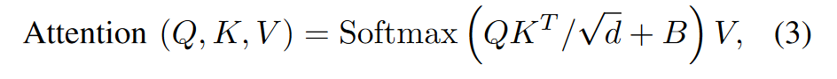
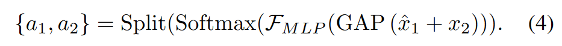
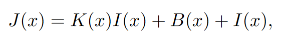

# 用于单幅图像去雾的视觉Transformer方法

## 相关工作

作者发现，Vision Transformer中的层归一化和GELU激活函数会降低图像去雾性能，层归一化会分别对图像块对应的token进行归一化处理，导致图像块之间的相关性丢失，因此作者去掉了多层感知器之前的归一化层，用Rescale归一化来代替层归一化。Rescale归一化对整个特征图进行归一化处理，重新引入归一化后丢失的特征图的均值和方差。GELU在高级视觉任务中表现较好，但是ReLu激活函数在图像去雾方向表现好于GELU，作者认为GELU引入的非线性特性在解码时不易逆转。图像去雾不仅要求网络编码有高表达能力特征，还要求这些特征要容易恢复为图像域信号。

Swin Transformer使用带循环移位的窗口划分来高效的聚合局部特征，但是作者发现这种方法在图像去雾中不是最优的。循环移位应该使用掩码多头自注意力来防止不合理的空间聚集，让边缘区域的窗口更小。作者认为在一个小窗口内聚合信息会带来不稳定性，从而影响网络的训练。因此，作者提出了一种基于反射填充和裁剪的偏移窗口划分方案。允许掩码多头自注意力丢弃部分掩码，并且实现恒定的窗口大小。掩码多头自注意力的聚合权重始终为正数，表现为低通滤波器。由于这种聚合权重时动态、正数、归一化的。因此作者认为静态可学习的无约束的聚合权重可以作为补充。而卷积就满足这一准则。

进一步作者提出了基于先验的软重构模块和基于SKNet的多尺度特征图融合模块来代替级联融合，这种做法由于全局残差学习。然后利用提出的模块构建了多个UNet Transformer。

提出了DehazeFormer，修改了归一化层、激活函数、空间信息聚合方案。

## 方法

### 整体架构

DehazeFormer网络架构基于流行的Swin Transformer。介绍一下：

给定一个输入特征图，使用线性层将特征图投影到Query、key、Value上，并且使用窗口划分类将token分组。Swin Transformer在窗口内使用掩码多头自注意力，并且相邻块窗口的划分也不相同。

B为相对位置偏差项，在注意力输出的投影后面紧接着跟随了一个线性层Softmax

SK fusion层被设计为使用通道注意力融合多个分支。给定两个特征图，我们首先使用一个线性层将第一个特征图进行投影，再和第二个特征图相加。然后使用全局平均池化、MLP、softmax函数和分割操作获得融合权重，如下公式

现有的图像去雾网络的工作一般是预测重构后的无雾图像，或者是有雾和无雾图像之间的残差。作者认为在没有强约束的条件下向网络中加入先验知识是有益的。因为网络预测的重构图像或者残差只是一个近似。

J(x)是预测的无雾图像，I(X)是输入的有雾图像。（大气散射模型）我们用网络架构对K、B进行了一定的约束，也就是在网络中给定了先验知识，这种弱约束条件的先验允许网络退化到预测全局残差。

### Rescale 层归一化

归一化层能够稳定网络训练，但是Transfomer中常用的层归一化可能并不适合图像去雾。在层归一化中，内部的均值和标准差沿着通道维度计算，但是这两个数值和图像的亮度、对比度有关，因此经过层归一化后图像块之间的相对亮度和对比度都有所舍弃，因此我们要沿着宽高和通道轴计算，这种归一化方法才是卷积神经网络中常用的。

### 带反射填充的偏移窗口划分

Swin Transformer使用带掩码的多头自注意力的循环移位来实现移位窗口划分的高效计算。由于掩膜的存在，图像边缘处窗口尺寸小于设定的图像尺寸，对于高层视觉任务，图像中主要对象往往处于图片中心位置，图片边缘位置的像素对结果贡献不大。而对图像去雾来说，图片边缘和图片中心同等重要，如果窗口太小，会导致窗口中的令牌数量较少。从而使网络的训练产生偏差。因此作者认为，保持图像边缘窗口大小与设定的窗口大小相同，有助于提高网络的性能。

为了避免引入不合理的块间交互，作者提出使用反射填充来高效的实现划分移位窗口的计算。与循环移位相比，它引入了额外的计算代价，但是网络再训练时倾向于处理比图像块大得多的图像，当图像尺寸变大时，边缘区域所占的百分比就会变小。

### WMHSA和并行卷积
