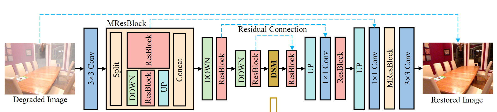
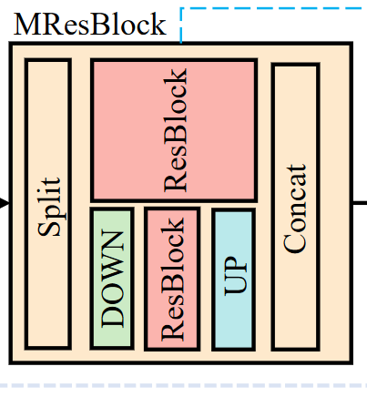
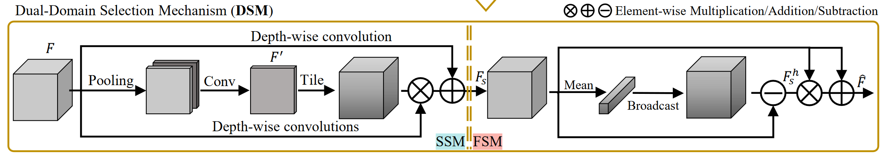

# 用于图像复原的焦点网络

## 摘要

注意到图像中不同区域雾霾浓度不同，本文着重于那些更加重要的区域。引入了双域选择机制，用来加强对关键信息的恢复，如边缘信号和硬区域。此外本文对高分辨率特征图进行拆分，将多尺度感受野插入到网络中，提高了网络效率和效果。最后通过将这些设计集成到U型骨干网络中，我们构建了FocalNet

## 简介

在这项研究中，我们不追求大的感受野或探索对Transformer架构的修改，而是通过更多地关注用于图像重建的信息，例如边缘信息或难以恢复的区域的信息，来开发一个高效且有效的基于CNN的框架。在这个方向上，现有的方法大致可以分为两类：辅助训练和基于注意力的方法。前者主要利用辅助技术或数据，如语义分割、深度估计和光流估计，来定位退化或边缘信息。尽管如此，这些算法总是需要额外的复杂分支和精心设计的训练策略来生成监督信息。本文的另一条思路是设计注意力机制来关注某些信息区域或控制信息传输。这些方法大多停留在空间域而忽略了光谱信息的利用，而光谱信息也可以为重建提供有用的信息。

为了使模型更专注于关键区域，充分利用空间域和光谱域中清晰/退化图像对之间的差异，我们提出了一种新的双域选择机制( DSM )。具体来说，我们的机制包括两个部分：空间选择模块( SSM )和频率选择模块( FSM )。空间选择模块将特征作为输入，通过一些深度卷积层来确定每个通道中图像退化区域的大致位置。然后利用和频率选择模块对高频信号或硬区域进行放大，去除特征中的低频成分。我们将双域选择机制合并到一个U型CNN主干网中。为了节省计算开销，我们只在网络最中间插入双域选择机制，只包括了最低分辨率特征。此外，我们将高分辨率特征在通道维度上拆分为两部分。一部分降采样到更低的分辨率，不仅可以降低复杂度，还可以为不同大小的图像退化区域提供多尺度感受野来提高性能。

*   提出了双域选择机制，放大重要区域特征来辅助恢复清晰图像
*   开发了高效的焦点网络，为图像恢复提供了多尺度学习

## 方法

### 整体架构

整体网络采用流行的编码器解码器架构，分为三段。作为子网络的第一段处理高分辨率特征，MRes块就是第一段的主要组成部分。另外两段主要由多个残差块组成，

图像经过一个3 \* 3卷积层生成浅层特征，然后经过三段对称的编码器和解码器，也就是MRes块，转换为复原后的干净特征。随后编码器逐步减小空间尺寸并扩大通道数，解码器则进行相反的操作。从深层特征中恢复干净的特征。在整个过程中，编码器和解码器通过残差连接输入特征以辅助恢复，随后经过一个1 \* 1 卷积调整通道维度。最后经过3 \* 3卷积和图像级的残差连接生成干净的图像。

除了MResBlock中上采样采用双线性插值外，其他的上采样和下采样操作都是通过转置transpose和跨步stride卷积实现的。

论文提出的DSM放在了整个网络最中间的位置，用来进行最重要区域的图像重建。此外，我们应用多输入和多输出策略，以减轻训练难度，

### MResBlock

### DSM

### 损失函数

Referred in <a href="./学术论文笔记汇总-RYZ5DF37.md" class="internal-link" zhref="zotero://note/u/RYZ5DF37/?ignore=1&#x26;line=-1" ztype="znotelink" class="internal-link">Workspace Note</a>
