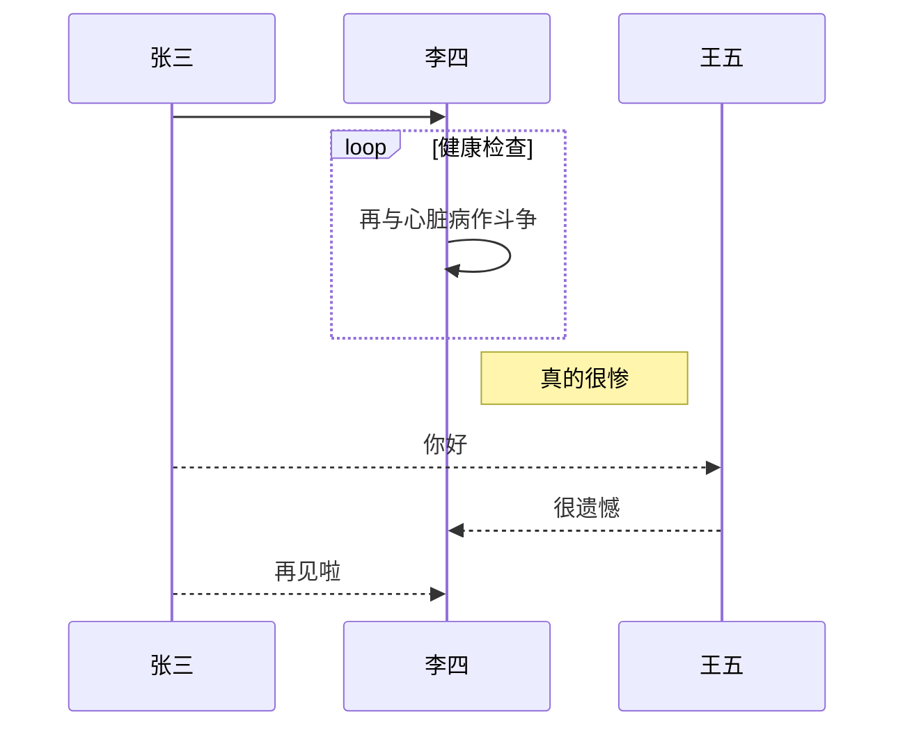
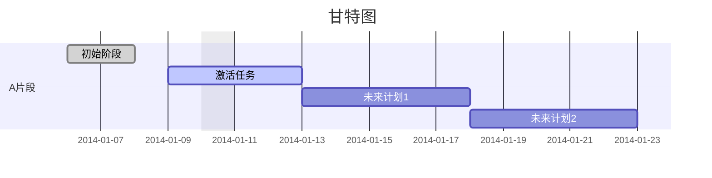
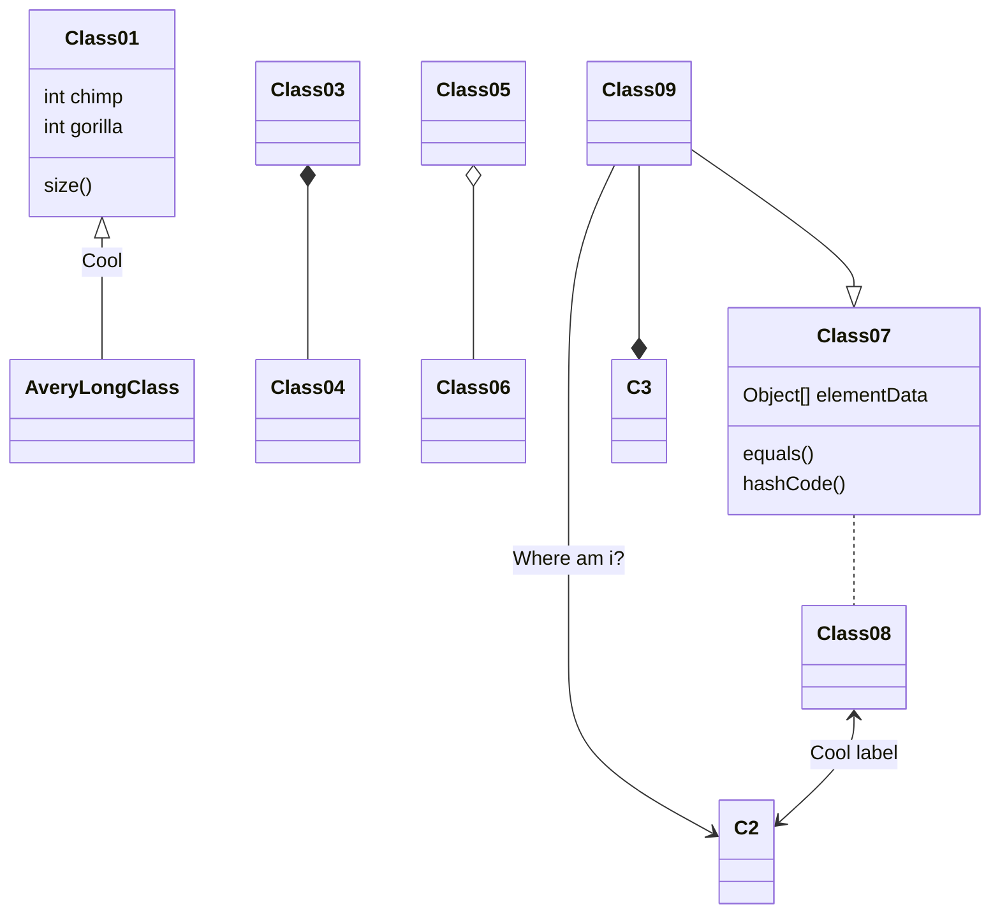

```mermaid
sequenceDiagram
    participant 张三
    participant 李四
    张三->>李四: 
    loop 健康检查
        李四->>李四: 再与心脏病作斗争
    end
    Note right of 李四: 真的很惨
    张三-->>王五: 你好
    王五-->>李四: 很遗憾
    张三-->>李四: 再见啦 
    
```

```mermaid
gantt
dateFormat  YYYY-MM-DD
title 甘特图
excludes weekdays 2014-01-10

section A片段
初始阶段            :done,    des1, 2014-01-06,2014-01-08
激活任务               :active,  des2, 2014-01-09, 3d
未来计划1              :         des3, after des2, 5d
未来计划2               :         des4, after des3, 5d
```

```mermaid
classDiagram
Class01 <|-- AveryLongClass : Cool
Class03 *-- Class04
Class05 o-- Class06
Class07 .. Class08
Class09 --> C2 : Where am i?
Class09 --* C3
Class09 --|> Class07
Class07 : equals()
Class07 : hashCode() 
Class07 : Object[] elementData
Class01 : size()
Class01 : int chimp
Class01 : int gorilla
Class08 <--> C2: Cool label
```

